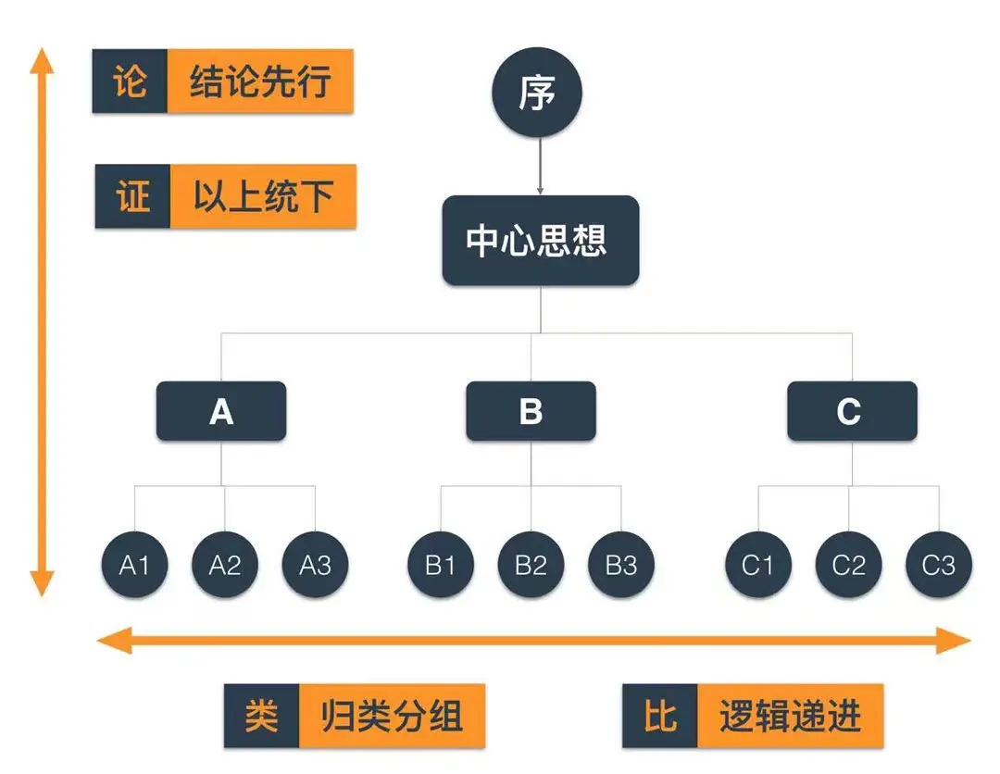

# 沟通是双向的，不是单向表达
1. 沟通不顺畅可能双方都有问题：
  1. 表达方： 表达清晰
    1. 不熟悉对方，不清楚对方的水平，概念或理论超出对方的认知
      1. 深入浅出，通俗易懂  （降低对对方的要求）
        1. 类比
        2. 举例子
    2. 表达混乱，没有条理，技巧不够，晦涩难懂
      1. 选择合适的模型或按照一定的条理
        1. 下面会提到
  2. 接收方：理解到位
    1. 背景知识或背景内容缺失
      1. 引导表达方进行类比
      2. 引导表达方解释自己不知道的概念或理论
      3. 事后弥补相关知识
    2. 理解力不够
      1. 先记下，后花时间理解或请教
      2. 学习一些逻辑学基础
  3. 场（环境）：
    1. 线上 （网络延迟或不稳定，看不到对方的动作表情等）
      1. 能当面的尽量当面，特别是复杂问题，预计沟通时间比较长时
      2. 如无法避免线上，则尽量选择较好的沟通环境
2. 沟通的流程：
  1. 表达
  2. 理解
  3. 确认 （容易缺失）
    1. 接收方再描述一下，表达方再理解确认

# 保持同频（用对方能听的懂的术语）：
1. 了解对方：岗位，知识水平
2. 如果不同频，先调频 （可能需要提前准备）
   1. 先定义术语
   2. 类比
   
# 要有条理： 【表达的有条理，对方也更容易接受】  需符合MECE（不重不漏）
1. 主次
2. 时间
3. 空间
4. 内外
5. 分类
6. 简单到复杂
7. 短期和长期
# 一些建议：

## 当遇到比较复杂的时候，举例子
1. 举例子是可以用代号，
   1. 可以字母表示类比（一般取英文首字母）：如： U代表user，T代表time，I代表item
2. 同类多个的可以字母+序号：如 U1、U2、U3 代表不同的用户 
3. 要有顺序（条理， 如果自己都觉得有点乱，可以先停下来，思考一会儿再组织语言；事后总结，事后思考这个场景我该怎么说会更好被人接受）
4. 类比：如果对方对这个领域不太熟悉（没什么基础知识），看一下是不是有可以类比的东西，最好是生活中大家熟知的例子，再类比中说明就会更好理解：

## 常用模型：
 1. 5W2H （百度百科【5W2H】  沟通&思考，理解需求   如何理解需求）
 2. SCQA 模型（结构化表达）   例子纯属虚构：  （https://zhuanlan.zhihu.com/p/344986734）
   1. Situation（背景）：描述事情发生的背景或情境，为后续内容做铺垫，使受众能够快速进入场景。
     1. 随着公司业务的快速发展，外部竞争日趋激烈，流量成本日益增加，流量变现瓶颈凸显，各业务对精细化运营日益迫切，对画像标签的实时性要求越来越高
   2. Complication（冲突）：指出在这个背景下出现的问题、矛盾或挑战，引发受众的兴趣和关注
     1. 但是我们目前的技术基建无法满足业务对数据的实时性要求
   3. Question（疑问）：基于冲突提出问题，引导受众思考，明确沟通的核心问题。
     1. 如何满足业务对画像标签数据的实时性要求？
   4. Answer（回答）：针对问题给出解决方案或答案，即表达的核心观点或内容。
     1. 临时解决方案
     2. 长期方案： 
       1. 调研实时架构
       2. 引入实时数据链路基建
       3. 完善实时链路监控
 3. 金字塔原理 （沟通&思考）https://xmind.cn/blog/minto-pyramid-principle/
   1. 结论先行
   2. MECE（无重复、无遗漏：  https://zhuanlan.zhihu.com/p/144052435） 强推
   3. 归类分组（相同相似的归为一组）
   4. 逻辑递进（每组中的思想按照逻辑顺序进行排列，如时间顺序、空间顺序、重要性顺序等）
