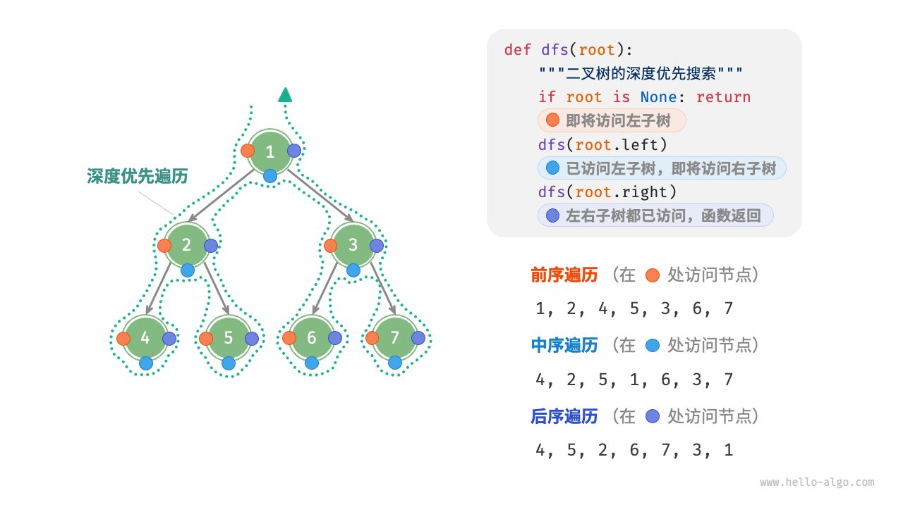
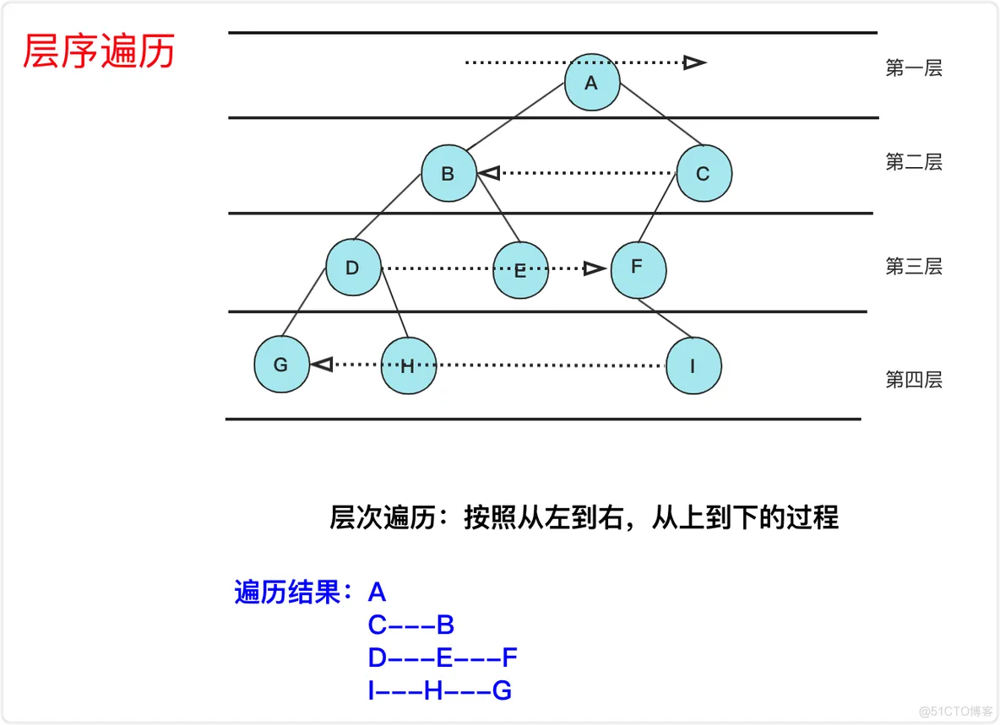

# 安装 node.js
官网选取 nvm先安装node.js  

# 安装claude code
curl -fsSL https://claude.ai/install.sh -o install.sh
- 安装失败
cat install.sh 看到 <!DOCTYPE html> 或者类似的 HTML 内容，而不是 #!/bin/bash。既然直接 curl 下不到正确的脚本


- Claude Code 本质上就是个 npm 包

npm install -g @anthropic-ai/claude-code


# 配置模型key
可以先用国内的模型
- 用户目录配置对应的settings.json

# AIClient-2-API代理
https://github.com/justlovemaki/AIClient-2-API 

一个强大的代理，可以统一各种仅客户端大型模型 API（如 Gemini CLI、Antigravity、Codex、Grok、Kiro 等）的请求，模拟请求，并将其封装到本地兼容的 OpenAI 接口中

## 下载镜像
``` 
# 通过国内鏡像站下载 docker 镜像
docker pull docker.1ms.run/justlikemaki/aiclient-2-api:latest

# 重命名镜像，避免后续要输入很长的镜像名 
docker tag docker.1ms.run/justlikemaki/aiclient-2-api:latest justlikemaki/aiclient-2-api:latest

# 创建配置文件日录，避免服务重启后配置丢失 
mkdir -p ~/.aiclient2api

# 启动 AICljent-2-API 服务 
docker run -d \ # 以 daemo 模式运行 
-p 127.0.0.1:3000:3000 \ # apissl 
--restart=always \ # docker 重启后自动运行服务 
-v "SHOME/.aiclient2api:/app/configs" \ # 配置日录映射 
--name aiclient2api \ # 服务命名 
justlikemaki/aiclient-2-api
``` 
## 启动容器
``` 
docker run -d -p 127.0.0.1:3000:3000 --restart=always -v "$HOME/.aiclient2api:/app/configs" --name aiclient2api justlikemaki/aiclient-2-api
``` 

## webUi登录

Docker 服务运行后，访问 http://127.0.0.1:3000 默认密码为 “admin123"，可以在web 界面里修改（"配置管理"->"高级配置"->"后台登录密码"）


## 配置kiro提供商（转发kiro的）
### 查看  clientId 和 clientSecret
在进行后续操作前，确保你已经登陆过 kiro ide 或 kiro cli，确认以下文件是否存在，不存在需要先登陆kiro ide 或 kiro cli.
``` 
$ ls -l ~/.aws/sso/cache
``` 
- kiro-auth-token.json 文件
- 7xxxx.json 是文件名为40位 hash 值的json文件，里面有 clientId 和 clientSecret 字段。


### 提供商池管理
在 http://127.0.0.1:3000 web界面里 

- 进入"提供商池管理"->"Claude Kiro OAuth"->"生成授权"->"导入AWS账号"->"JSON粘贴"

粘贴上面的 kiro-auth-token.json 文件里的内容，然后再将7xxxx.json 文件里的 clientId 和 clientSecret 字段添加到ison里，最终的json应该是这样的
``` json
{
  "accessToken": "auth里的xxx",
  "refreshToken": "auth里的xxx",
  "expiresAt": "2026-04-02T11:21:10.783Z",
  "clientIdHash": "hash的json文件名7xxxx",
  "authMethod": "IdC",
  "provider": "Enterprise",
  "region": "us-east-1",
  "clientId": "7xxxx的clientId",
  "clientSecret": "7xxxx的clientSecret",
}
``` 
### 验证成功
``` 
$ curl http://127.0.0.1:3000/claude-kiro-oauth/v1/messages \
-H "Content-Type:application/json" \
-H "X-API-Key:123456" \
-d '{
"model": "claude-opus-4-6",
"max_tokens": 1000,
"messages": [{"role": "user", "content": "Hello!"}]
}'
``` 
- 使用对应模型 claude-opus-4-6  claude-sonnet-4-5 
- X-API-Key 是配置的 api key，默认为"123456"，可在http://27.0.0.1:3000的“配置管理"->"基础设置"- >'API密钥“进行修改，修改后记得点击最底下的“保存配置"


## 400 403问题
- kiro 的 token 现在是1小时过期 强制刷新或者重新导入，主要问题是 kiro 的 token 过期时间缩短了，一直在用的话，这些工具都会在过期前自动续期电脑休眠后就很容易过期了，工具继续走 续期逻辑肯定失败了



# Claude Code Switch ccs 
- https://github.com/kaitranntt/ccs


## 安装
```
npm install -g @kaitranntt/ccs
ccs config 启动管理界面
```


## 一定不要自己安装开源 CLiiProxy
- 安装了开源会提示api key 无效

根因：你通过 Homebrew 安装了开源版 CLIProxyAPI，并且它被注册为 launchd 服务（homebrew.mxcl.cliproxyapi）自动启动。
这个开源版读取的是cliproxyapi.conf（里面的 api-keys 是占位符），而不是 CCS 生成的 ~/.ccs/cliproxy/config.yaml。

- CCS 配置了 backend: original  应该使用/opt/homebrew/opt/cliproxyapi/bin/cliproxyapi 
  - 默认读取  默认读取 cliproxyapi.conf配置  其中的api-keys 是 your-api-key-1 等占位符，
- CCS 配置了 backend: plus，应该使用 ~/.ccs/cliproxy/bin/plus/cli-proxy-api-plus 这个 Plus 版本，但因为 Homebrew 服务抢先占了 8317 端口，CCS 的 Plus 版本没法启动
  - 读取  ~/.ccs/cliproxy/config.yaml  其中的api-keys 是ccs-internal-managed

- 建议：为了防止下次重启电脑后 Homebrew 服务又自动启动，建议彻底禁用它：
```
  brew services stop cliproxyapi
  brew untap <tap-name>  # 或者
  brew uninstall cliproxyapi
  或者如果你还需要保留开源版，至少确保它不会自动启动：
  brew services stop cliproxyapi
  确认不再自动启动
  launchctl list | grep clip
  这样每次开机后只需要 ccs cliproxy start 就能正确启动 Plus 版本了。
```

## 起用CLIProxyAPIPlus
- 代理方面只有CLIProxyAPIPlus可以代理kiro，CLIProxyAPI（https://help.router-for.me/cn/）不行
- ./.ccs/config.yaml配置 把 backend: origin改为 backend: plus


## 配置kiro
-  如果PLus没安装的话 css会去下载安装 
-  有ide直接 通过ide导入 


- 对应的.claude/settings.json
``` json
{
  "env": {
    "ANTHROPIC_AUTH_TOKEN": "123456",
    "ANTHROPIC_BASE_URL": "http://127.0.0.1:3000/claude-kiro-oauth",
    "API_TIMEOUT_MS": "3000000",
    "CLAUDE_CODE_NEW_INIT": "1",
    "CLAUDE_CODE_DISABLE_NONESSENTIAL_TRAFFIC": "1"
  },
  "model": "claude-opus-4-6",
  
  // 更换了 操作的时候会自动更换
  "env": {
    "ANTHROPIC_BASE_URL": "http://127.0.0.1:8317/api/provider/kiro",
    "ANTHROPIC_AUTH_TOKEN": "ccs-internal-managed",
    "ANTHROPIC_MODEL": "kiro-claude-opus-4-6",
    "ANTHROPIC_DEFAULT_OPUS_MODEL": "kiro-claude-opus-4-6",
    "ANTHROPIC_DEFAULT_SONNET_MODEL": "kiro-claude-sonnet-4-6",
    "ANTHROPIC_DEFAULT_HAIKU_MODEL": "kiro-claude-haiku-4-5"
  },
}
``` 
## 启动cc
ccs kiro 启动claude code

## 解除权限授权
claude code默认运行命令，需要在终端不断进行授权，使用
```
ccs kiro --dangerously-skip-permissions
```
默认就不需要再进行授权，可以让AI把这个命令做成一个alias别名，方便启动