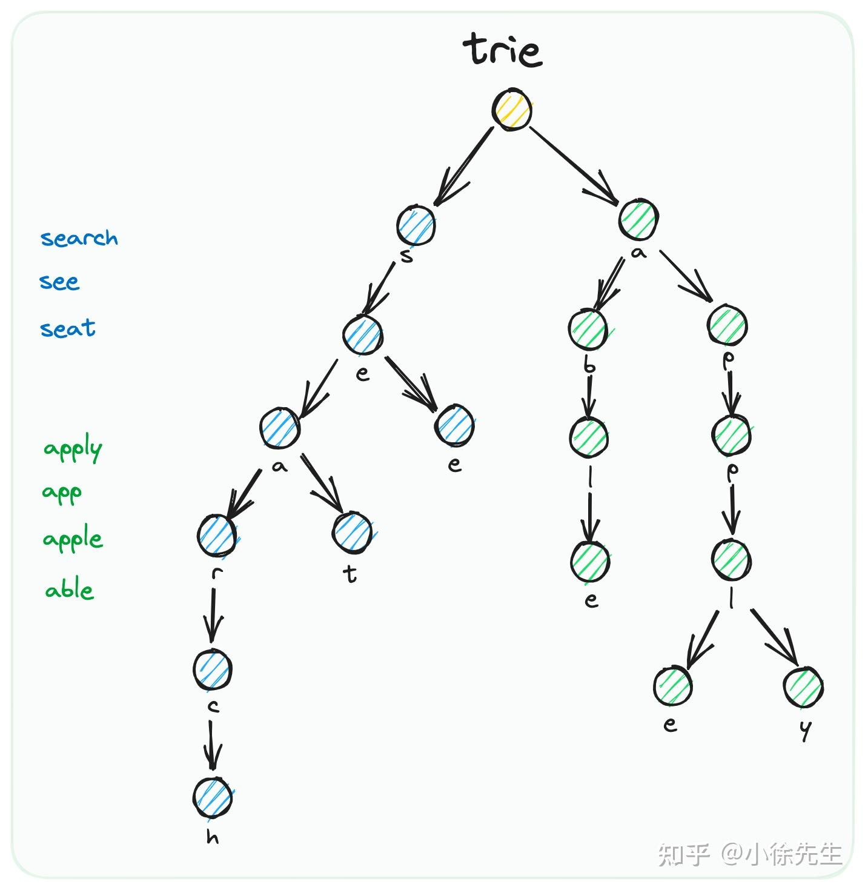
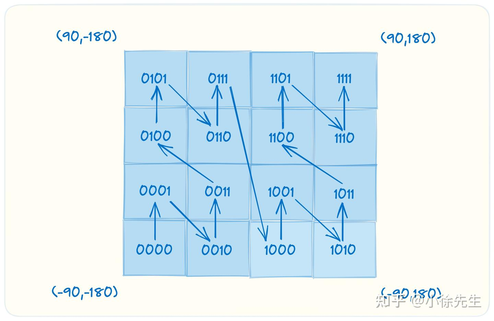
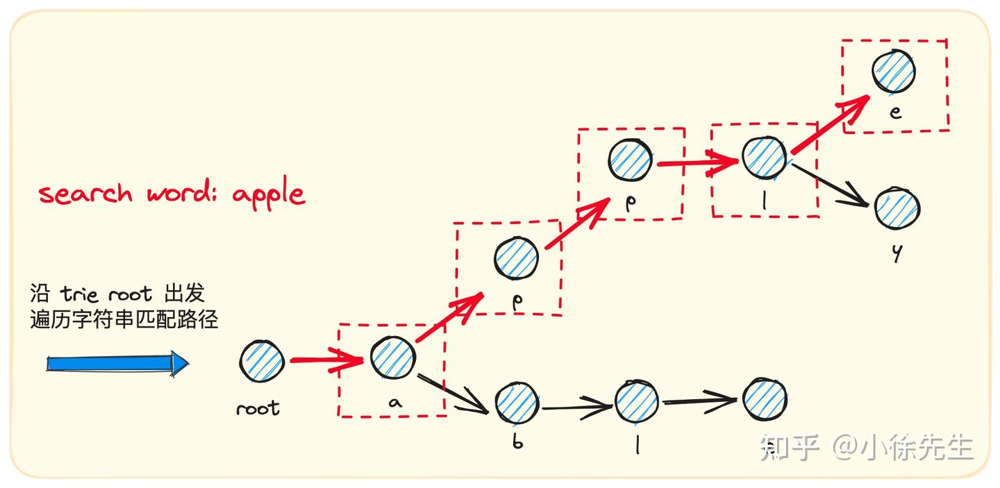

1. rtk RTK是AI编程的Token节流神器。一个Rust二进制，零依赖，60-90%Token节省
https://mp.weixin.qq.com/s/5T-i2Vbpgm-5QVzcItju0w
``` markdown
brew install rtk
rtk init -g 

{
  "hooks": {
    "PreToolUse": [
      {
        "matcher": "Bash",
        "hooks": [
          {
            "type": "command",
            "command": "rtk hook claude"
          }
        ]
      }
    ]
  }
}
``` 

2. AIClient-2-API代理

3.  init配置 权限配置
   - 起别名的情况
``` json
{
  "env": {
    "CLAUDE_CODE_NEW_INIT": 1 //新版本init支持
  },
  "permissions": {
    "allow": [],
    "deny": [],
    "defaultMode": "bypassPermissions" // 指定模型
  },
  "model": "claude-opus-4-6",
  "skipDangerousModePermissionPrompt": true, // 跳过权限
  "language": "chinese" // 语言配置
}
```



- 命令行启动时跳过权限 起别名
- init   
   1. 规范CLAUDE.md @符号引用外部文件 （比如代码规范） 
   2. skills hooks对应目录

4. lsp （一般idea自带）
5. marketing  下载对应plugin 配置下mcp浏览器 卸载移除
6. /btw 问题
7. /clear 清理上下文
8. shift+tab 计划模式 子代理直接阅读项目代码

 对应的会话hash 可以重新打开继承上下文

9. mcp 

10. 技能安装和移除
