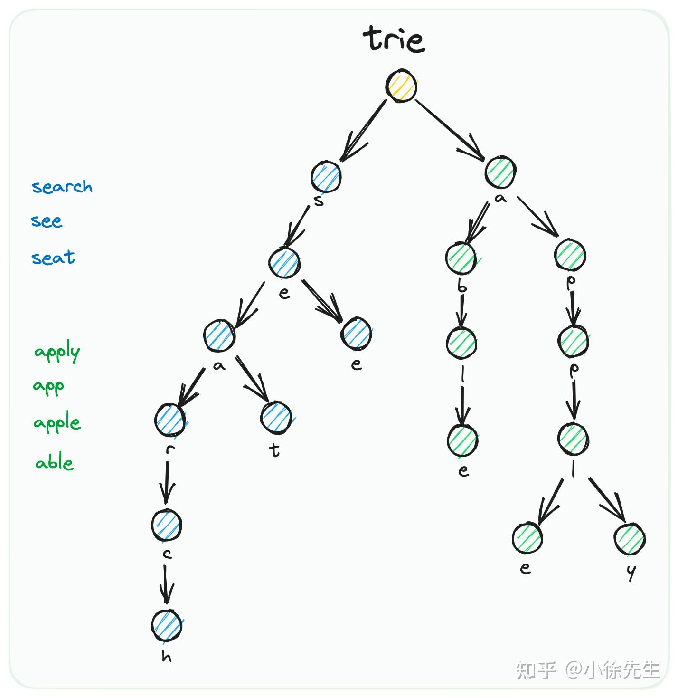
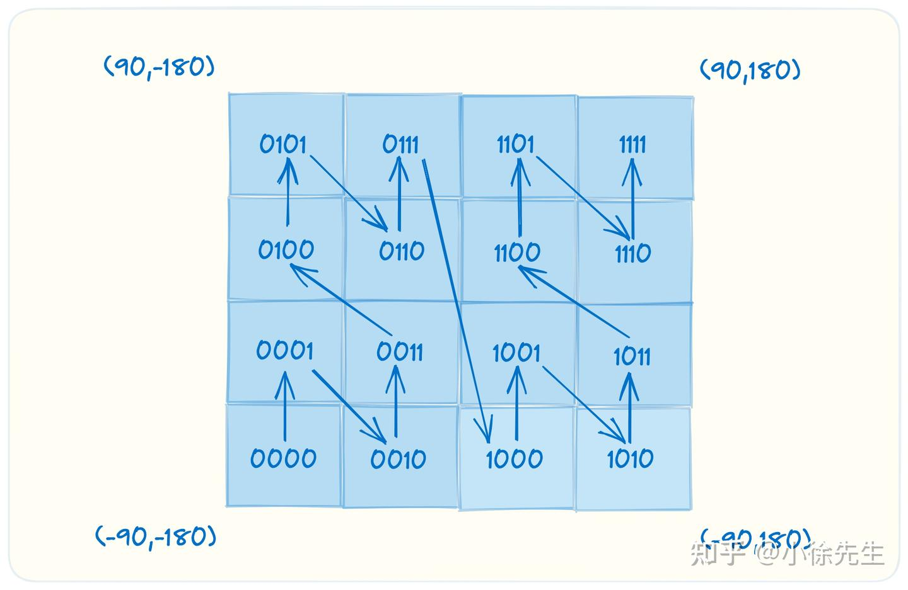
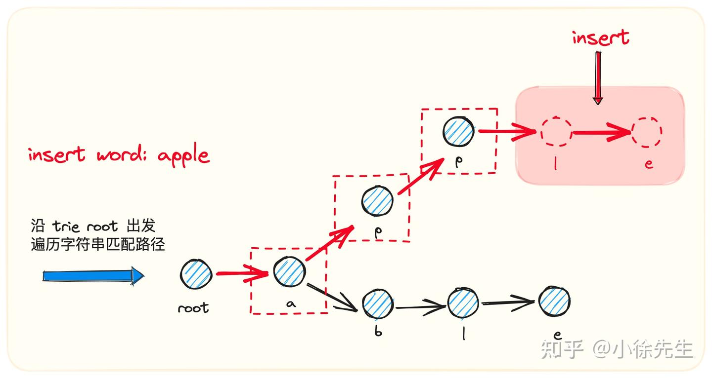
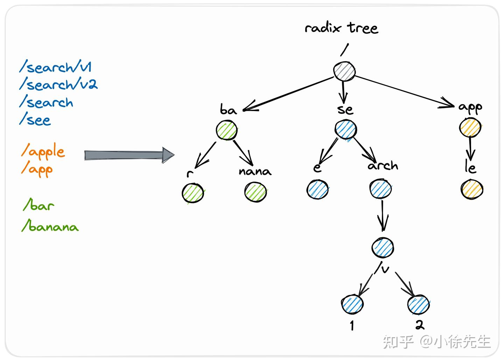
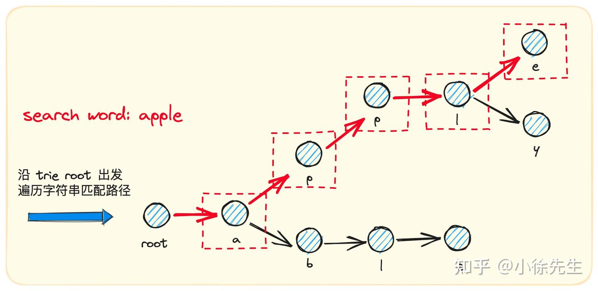

# rtk 
[RTK是AI编程的Token节流神器。一个Rust二进制，零依赖，60-90%Token节省](https://mp.weixin.qq.com/s/5T-i2Vbpgm-5QVzcItju0w)

``` markdown
brew install rtk
rtk init -g 

// 对应的settings.json配置
{
  "hooks": {
    "PreToolUse": [
      {
        "matcher": "Bash",
        "hooks": [
          {
            "type": "command",
            "command": "rtk hook claude"
          }
        ]
      }
    ]
  }
}
``` 

# AIClient-2-API代理 或者 Claude Code Switch（ccs） 

# 小技巧
- 起别名的情况 命令行启动 
``` json
{
  "env": {
    "CLAUDE_CODE_NEW_INIT": 1 //新版本init支持
  },
  "permissions": {
    "allow": [],
    "deny": [],
    "defaultMode": "bypassPermissions" // 指定模型
  },
  "model": "claude-opus-4-6",
  "skipDangerousModePermissionPrompt": true, // 跳过权限
  "language": "chinese" // 语言配置
}
```


1. 规范CLAUDE.md @符号引用外部文件 （比如代码规范） 
```
@RTK.md // 使用rtk
@chinese-response.md // 中文交互
@code-style.md // 代码开发规范
@code-review.md // 代码审核规范
```

2. /init 命令初始化项目级别的CLAUDE.md   


3. 起别名 命令行启动时跳过权限 使用代理梯子

4. /btw 子查询
5. /clear 清理上下文
6. shift+tab 计划模式 子代理直接阅读项目代码
9. 退出 2次 Ctrl+C
```
Resume this session with:
claude --resume 02accccd-0ddc-463f-843d-3b68d7aa44d1
```
 对应的会话hash 可以重新打开继承上下文

# skill
  

# marketing市场 
下载对应plugin 配置下mcp浏览器 卸载移除等操作
- anthropics/skills 
``` bash
npx openskills install anthropics/skills // 加载Anthropic Marketplace  GitHub 仓库 本地文件路径 私人 Git 仓库
npx openskills sync // 更新 list搜索 read加载 update更新 remove移除 

npx openskills install anthropics/skills
npx openskills read skill-creator
```

## plugin
- settings.json
``` json
{
  "enabledPlugins": {
    "skill-creator@claude-plugins-official": true,
    "context7@claude-plugins-official": true,
    "playwright@claude-plugins-official": true,
    "feature-dev@claude-plugins-official": true,
    "claude-md-management@claude-plugins-official": true
  }
}
```
- 使用代理时问题： 不是 Kiro "不支持"哪个具体插件，而是所有插件加在一起导致请求体太大（170KB），超出了 Kiro generateAssistantResponse API 的限制。每个插件都会往 system prompt 里注入大量文本（工具定义、使用说明、skill 描述等），累加起来就超限了

- claude-md-management  维护和改进 CLAUDE.md 文件，审计质量、捕获会话学习内容、保持项目记忆更新  
- skill-creator   创建新 skill、改进现有 skill、运行评估测试和性能基准分析  

1. feature-dev

1. context7 — 文档查询
为 AI 编码助手提供最新的库/框架文档
核心功能：
  - 从官方文档源实时拉取库的 API 文档和使用示例
  - 解决 AI 模型训练数据过时的问题（比如模型可能只知道某个库的旧版本 API）
  - 通过 MCP 协议集成到 Claude Code、Cursor 等工具中
典型使用场景：当你在用一个更新频繁的库（如 Next.js、LangChain 等），Context7 能确保 AI
  参考的是当前版本的文档，而不是训练截止日期之前的旧文档。

1. hookify
帮你自动生成和管理 hooks 配置。
   - 根据你的自然语言描述（比如"每次编辑 Go 文件后自动 gofmt"），自动生成对应的 hook 配置写入 settings.json
   - 简化 hook 的创建流程，不需要手动编写 matcher、command、timeout 等字段
   你当前的 settings.local.json 里已经有两个手动配置的 PostToolUse hook（gofmt 和 proto 代码生成）。如果启用 hookify 插件，以后添加类似的 hook 可以用对话方式完成，不用手动编辑 JSON

1. gopls-lsp
编辑器的 gopls 服务于你（人类），Claude Code 的 gopls-lsp 服务于 Claude 自己。它的主要价值是让 Claude 能主动获取诊断信息（编译错误、类型问题等），而不需要你手动复制粘贴错误。
但实际上：
   - Claude 修改代码后，你可以直接把编辑器里的报错贴过来，效果一样
   - Claude 本身通过读文件和 grep 已经能理解代码结构
   - go build / go vet 的输出比 LSP 诊断更直接可靠
  如果你想精简插件列表，gopls-lsp 是可以优先去掉的那个。它提供的增量价值不大，尤其是你已经有编辑器 + 能跑编译命令的情况下。

1. code-simplifier 
代码简化 agent，在保持功能不变的前提下提升代码清晰度、一致性和可维护性          
从它的 agent 定义可以看出，这个 skill 明显是为 JS/TS 生态设计的——提到的规则都是 ES modules、arrow functions、React Props 类型、ternary operators 这些前端概念。

Go 本身已经有强制简洁的机制：
   - gofmt 统一格式
   - go vet 静态检查
   - 语言设计本身就推崇简单直白
而且你的 CLAUDE.md 里已经有完善的 Go 代码审核规则（函数长度、嵌套层级、命名规范等），Claude 在写代码时已经会遵守这些。需要简化代码时直接让 Claude 做就行，不需要额外的 skill。建议去掉。如果你以后做前端项目可以再启用。

6. frontend-design  前端美化外观

7. pr-review-toolkit
 PR 审查工具集，专注于注释、测试、错误处理、类型设计、代码质量和代码简化。 以及设置了CLAUDE.md 里已经有完善的 Go 代码审核规则


8. playwright和chrome-devtools-mcp
- Playwright = "像用户一样操作浏览器" Microsoft 的浏览器自动化和端到端测试 MCP 服务器，支持网页交互、截图、表单填写等
- Chrome DevTools = "像前端工程师一样用 F12 调试"  内存泄漏分析、LCP 优化这些能力是给前端性能调优用的
  - chrome-devtools-mcp — 注入内容非常多（多个 skill） 几句是这个有问题 mcp上下文太多了就是这个导致超过170kb


#  mcp 
mcp配置 playwright


chrome-devtools-mcp@claude-plugins-official — 注入内容非常多（多个 skill） 几句是这个有问题 mcp上下文太多了就是这个导致超过170kb

