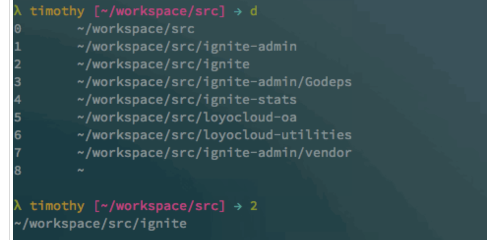

# 是什么
MCP (Model Context Protocol) 是 Anthropic 开发的开放统一协议，让 AI 模型能够安全地<font color="red">访问外部工具和数据源</font>。 AI 不直接访问数据库， 而是通过标准化的工具描述（Tool Schema）声明能力，由 MCP Server 负责实际执行，结果再返回给 AI 处理。

AI 模型本身是个"瞎子"——只能生成文本，看不到文件、查不了数据库、调不了 API。要让 AI 连接外部世界，传统做法是为每个数据源写定制适配代码，N 个 AI 应用 × M 个数据源 = N×M 套适配逻辑。

1. 主要特性
   - 工具扩展：为 Claude 添加文件系统、网络访问等能力
   - 数据连接：连接数据库、API 等外部数据源
   - 安全可控：严格的权限控制和数据隔离
   - 易于集成：支持多种编程语言和运行环境
2. 配置方式支持两种配置类型：
   - STDIO：通过标准输入输出与本地进程通信npx/uvx 命令启动
   - HTTP/SSE：通过网络与远程服务器通信URL 地址

- Skill 告诉 Ai怎么做才符合团队规范
- MCP 给Ai访问外部系统的手和眼睛 配合skill一起使用
- CLI 给Ai稳定、可复用、低成本的执行入口 cli对比mcp还省token

# 适用场景
需要动态发现资源 Figma、飞书、知识库
需要结构化输入输出 设计节点、文档块、表格数据 
高频交互 浏览器调试、知识库检索

# 日志查询MCP
- 为什么日志查询适合做 MCP？ 日志查询是非常典型的内部研发高频场景：
  1. 入口固定，但查询条件复杂。
  2. 字段多，很多字段只有排障时才会想起来。
  3. 同一个问题经常要查 Service 日志、Nginx 日志，再按 tracerId 串起来看。
  4. 查询结果出来后，还要靠人继续判断异常点。 如果只做一个 Web 页面或 CLI，它解决的是“人怎么查”。MCP 解决的是另一层问题：让 AI 工具在理解用户意图后，能够通过标准协议调用内部系统能力。

- 比如用户在 Claude Code、Cursor、Kiro 或 Codex 里问：帮我查一下 mp-samrt-admp 最近一小时的 error 日志。
  - AI 客户端不应该凭空回答，也不应该让用户自己去找日志平台。更好的方式是：
    1. 模型判断这个问题需要查日志。
    2. 客户端选择日志 MCP 暴露的工具。
    3. MCP Server 把结构化参数转换成 ClickHouse 查询。
    4. 查询结果返回给模型。
    5. 模型再基于真实日志解释异常。 这就是日志查询 MCP 的价值：把内部可执行能力接到 AI 工作流里

#  交互协议：jsonrpc-2.0
交互协议：jsonrpc-2.0 核心模型 JSON-RPC 2.0 的通信模型很简单：
  - Client 发送 Request。Server 执行 method。
  - 如果请求里有 id，Server 返回 Response，并带回同一个 id。
  - 如果请求里没有 id，这是 Notification，Server 不返回任何响应。
  - 协议本身与传输无关，可以跑在 HTTP、WebSocket、stdio、socket 或进程内消息队列上。 一个最小调用
``` json
{
"jsonrpc": "2.0",
"method": "subtract",
"params": [42, 23],
"id": 1
}
// 响应：
{
"jsonrpc": "2.0",
"result": 19,
"id": 1
}
``` 

# MCP 里有三个角色：Host、Client、Server

MCP Host：用户正在使用的 AI 应用，例如 Claude Code、Cursor、Kiro、Codex。
MCP Client：Host 内部为每个 MCP Server 建立的连接管理组件。
MCP Server：真正提供能力的进程，例如日志查询 MCP、文件系统 MCP、GitHub MCP。 一个 Host 可以连接多个 MCP Server。每个 Server 负责一类能力，Host 把这些能力汇总后提供给模型选择。

# Data Layer 和 Transport Layer

MCP 可以拆成两层理解
1. Data Layer：定义协议语义，内部又可细分为几个子关注点：
   - 消息格式：基于 JSON-RPC 2.0 的请求、响应、通知结构。
   - 生命周期：initialize → initialized → 正常交互 → shutdown 的握手与关闭流程。
   - 能力协商：客户端和服务端在握手阶段声明各自支持的特性（如支持哪些 Primitives）。
   - 协议原语（Primitives）：Tools（模型可调用的动作）、Resources（可读取的结构化数据源）、Prompts（可复用的提示模板）。
2. Transport Layer：定义消息怎么传输，例如 stdio 或 Streamable HTTP。
   - stdio 的优点是简单、低延迟、适合本地内部工具。它不需要额外暴露 HTTP 服务，也不需要先设计服务端鉴权体系。<font color="red">代价是每个使用者本机都要配置并启动这个 MCP。</font>
   - 如果后续要做统一平台化接入，可以考虑 Streamable HTTP MCP，让多个客户端连接同一个远程 MCP Server，再补统一鉴权、审计和限流。如：context7

# 本地与远程
本地 MCP 和远程 MCP从部署形态看，MCP Server 常见有两类<font color="red">：本地 MCP 和远程 MCP。本地 MCP 指 Host 在用户机器上启动一个进程</font>

当前 log-query 就是这种形态。它的 MCP Server 跑在本机，但它访问的 ClickHouse 可以是远程数据库。所以这里要区分两件事：MCP Server 是本地的，数据源不一定是本地的。

本地优势：
1. 快速试点和开发验证。
2. 需要访问本机资源，例如文件、Git 仓库、Docker、浏览器或本地命令。
3. 依赖个人环境，例如 VPN、SSH key、内网代理或本机凭证。
4. 工具能力还比较敏感，暂时不适合暴露成统一服务。

远程 MCP 指 Host 不启动本地命令，而是连接一个 MCP URL，例如：https://log-query.example.com/mcp

远程优势：
1. 团队共享能力，用户不需要本地安装依赖。
2. 需要统一版本，服务端升级一次即可。
3. 需要接入公司账号体系，做统一鉴权。
4. 需要审计、限流、脱敏和可观测性。
5. 需要给多个客户端或产品入口复用同一套能力。

- 两者不是替代关系，而是阶段和场景不同。日志查询这种内部能力，试点阶段用本地 stdio MCP 很合理；当它变成团队长期依赖的公共能力后，更适合演进为远程 MCP。

# MCP 的能力模型
MCP 的能力协商是双向的。Server capabilities 表示 MCP Server 暴露给 Host、Client 和模型消费的能力；Client capabilities 表示 MCP Client 反向提供给 Server 使用的能力。

|类型	| 谁声明	| 谁使用	| 典型内容|
|-----|--------------|-------------|-------|
| Server capabilities |	MCP Server |	Host / Client / 模型	|Tools、Resources、Prompts |
| Client capabilities|	MCP Client	| MCP Server	| Roots、Elicitation、Sampling ｜

常见 AI Coding 客户端对这些能力的支持情况 基本都支持 除了Sampling

# MCP Server 的能力
MCP Server 的核心能力主要通过 Tools、Resources、Prompts 三类原语暴露

|类型	|说明	|适合做什么	|谁主要决定使用|
|-----|--------------|-------------|-------|
|Tools	|server提供的工具	|执行动作，例如查数据库、调接口、创建任务	|模型根据用户问题选择|
|Resources	|Server 提供的资源，客户端获取可以直接注入上下文	|提供上下文数据，例如文件内容、API 文档、schema	应用或用户选择注入|
|Prompts		|提供可复用提示模板，例如排障流程、代码审查模板	|用户触发|

``` json
{
  "result": {
    "protocolVersion": "2025-11-25",
    "capabilities": {
      "resources": {
        "listChanged": true // 表示更新的变化是监听的
      },
      "tools": {
        "listChanged": true
      },
      "prompts": {
        "listChanged": true
      }
    },
    "serverInfo": {
      "name": "log-query",
      "version": "1.0.0"
    }
  },
  "jsonrpc": "2.0",
  "id": 0
}
``` 

## Tools：模型主动调用的动作
  1. description 和 inputSchema 直接影响模型行为。模型选不选这个工具、参数填得对不对，几乎完全取决于工具描述和参数 schema 的质量。描述要写清楚"这个工具做什么、什么时候该用、什么时候不该用"；schema 要给出合理的类型、枚举和默认值。
  2. 工具粒度要适中。太粗（一个万能 SQL 工具）会让模型自由度过高，安全和准确性都难保证；太细（每个字段一个查询工具）会让工具列表膨胀，模型选择困难。按业务对象或操作语义拆分是比较好的粒度，例如 query_service_logs、query_nginx_logs、trace_request 各管一类场景。
  3. 安全边界不能只靠 schema 约束。inputSchema 只是告诉模型"建议传什么"，不能阻止恶意或错误参数。真正的校验必须在 Server 侧做：参数白名单、SQL 注入防护、只读账号、结果行数限制等。
  4. 工具返回的内容会进入模型上下文。返回太多数据会占满上下文窗口，影响后续推理质量。Server 侧应该做分页、截断或摘要，而不是把整张表返回给模型。

## Resources：应用或用户主动注入的上下文
Resources 是"拉"模式——Client 或用户决定什么时候读取，模型不会自动触发。它适合提供相对稳定的结构化信息，让模型在推理前就拥有必要背景。client 在开始的阶段就会去问询server 提供哪些server， 然后在必要的时候把resource 注入到上下文中

``` json
[2026-05-12 15:09:15.460 +08:00] [CLIENT → SERVER] {
  "jsonrpc": "2.0",
  "id": 2,
  "method": "resources/list",
  "params": {}
}

[2026-05-12 15:09:15.460 +08:00] [SERVER → CLIENT] {
  "result": {
    "resources": [
      {
        "uri": "schema://service",
        "name": "service-log-schema",
        "description": "Service 日志表（ods_service_log_collection_all）的完整字段定义",
        "mimeType": "application/json"
      },
      {
        "uri": "schema://nginx",
        "name": "nginx-log-schema",
        "description": "Nginx 日志表（ods_nginx_log_collection_all）的完整字段定义",
        "mimeType": "application/json"
      }
    ]
  },
  "jsonrpc": "2.0",
  "id": 2
}
```
Resource 支持动态参数：如 schema://{table}， 不过需要客户端支持 Resource TemplatesClient 获取到resource 会注入上下文。。所以在设计resource要注意控制

## Prompts：用户触发的可复用提示模板
Prompts 是用户显式选择的预设提示模板，不是模型自动触发的。它适合把固定流程、最佳实践封装成一键可用的模板。
- Prompt 是手动触发
- 适合做成固定的工作流，如排障流程或分析模板
- Prompts 可以带参数。例如一个排障模板可以接受 system 和 env 参数

# MCP Client 的能力

MCP Client 的能力是 Client 反向提供给 Server 使用的能力。能力协商不是只有 Server 告诉 Client “我有哪些工具”，Client 也会在 initialize 阶段告诉 Server “我能配合你做什么”。一个简化后的初始化请求大致是：

``` json
{
  "method": "initialize",
  "params": {
    "protocolVersion": "2025-11-25",
    "capabilities": {
      "roots": {},
      "elicitation": {
        "form": {},
        "url": {}
      }
    },
    "clientInfo": {
      "name": "claude-code",
      "version": "2.1.121"
    }
  }
}
```
这里要注意："roots": {} 不是“没有 roots”，而是“Client 声明支持 roots，但没有额外配置项”。如果某个字段不存在，才表示该 Client 没有声明支持这个能力。

elicitation.url 不是独立于 elicitation 的新能力，而是 elicitation 下面的一种交互形态。form 表示 Client 可以渲染表单让用户填写结构化字段；url 表示 Server 可以请求用户打开一个 URL 完成外部交互，例如 OAuth 授权、跳转到内部审批页或在浏览器里补充信息。



- Client capabilities 有三个关键点。
  
第一，它们不会自动触发。Client 在 initialize 里声明支持 roots，不代表 Server 会自动拿到目录列表。Server 必须显式调用 listRoots() 才会发起 roots/list 请求。Elicitation 和 Sampling 也是同理。

第二，不同 AI Coding 客户端支持的能力不一样。Server 代码不能假设所有客户端都支持 roots、elicitation 或 sampling。调用前要先看 getClientCapabilities()，不支持时要降级，例如改为要求用户在自然语言里补充参数。

第三，声明支持不等于实际可用。比如当前在 Codex App 中调用 debug_client_info 可以看到 Client 声明了 elicitation.form，但 debug_elicitation 的必填枚举字段测试会返回缺少 env 的错误。因此这类能力需要按客户端逐个验证，不能只看 initialize 里的 capabilities 就认为已经完整支持。

第四，Client capabilities 不是安全边界。Roots 更像协作范围提示，不等于文件系统沙箱；Elicitation 不能用来索要密码、API Key 这类敏感凭证；Sampling 可能把日志内容送入 Host 侧模型调用链路，必须先考虑脱敏、权限和审计。

实际工具设计上，elicitation 更适合作为增强体验，而不是主链路依赖。日志查询工具应该优先通过 tool input schema 接收 env、system、time_start、time_end 等参数；参数不完整时，让模型在对话里向用户补问，或者由工具返回明确的缺参提示。只有在目标客户端已验证表单交互稳定时，才考虑用 elicitation 做环境选择、风险确认等辅助流程。

# 实战 log-query mcp项目的使用和对应日志明细
- 目录下的/mcpintro.html
- 具体看代码 本地运行

# 发布到内网

https://git.internal.taqu.cn/mp/mp-ai-coding-resources/-/blob/master/mcp/log-query/docs/npx-and-publish-guide.md