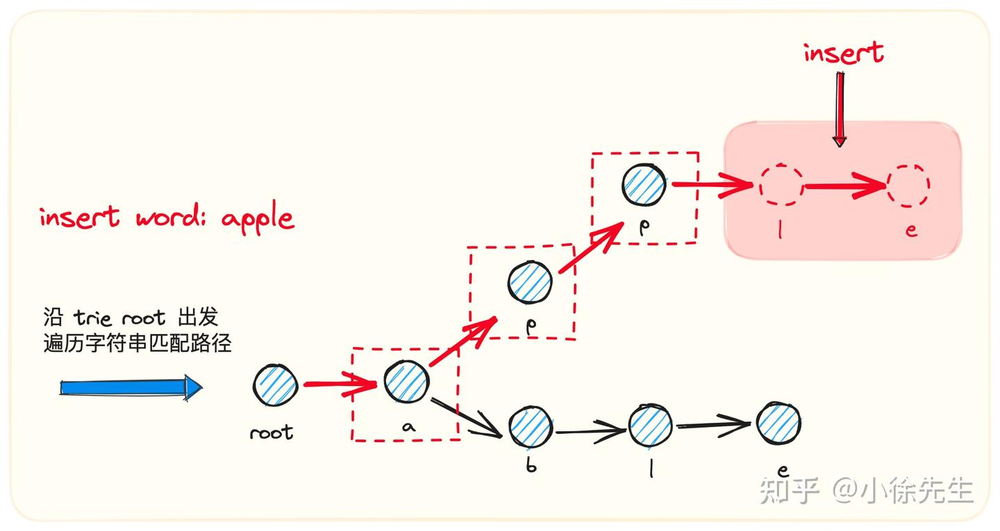
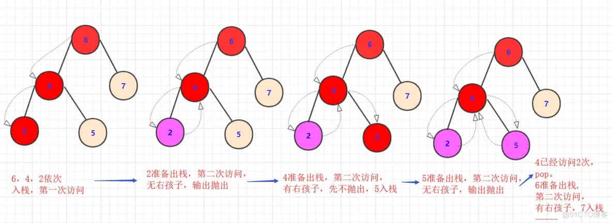
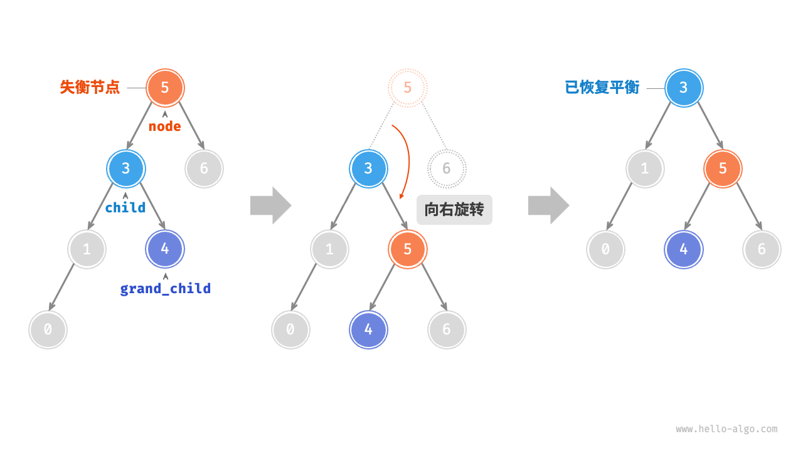

# 树分类


# 名词
1. 根节点： 最上面的那个节点(root)，根节点没有父节点，只有子节点（0个或多个都可以）
2. 层数： 一般认为根节点是第1层(有的也说第0层)，而树的高度就是层数最高(上图层数开始为1)节点的层数
3. 节点关系:
   - 父节点：连接该节点的上一层节点,
   - 孩子节点: 和父节点对应，上下关系。而祖先节点是父节点的父节点(或者祖先）节点。
   - 兄弟节点：拥有同一个父节点的节点们！
4. 节点的度: 就是节点拥有孩子节点的个数(是直接连接的孩子不是子孙).
5. 树的度: 就是所有节点中最大 (节点的度)。同时，如果度大于0的节点是分支节点,度等于0的节点是叶子节点（没有子孙）。


# 二叉树

- m=2 二叉树的每个节点最多只有两个子节点(但不一定非得要有两个节点)。
1. 非空二叉树叶子节点数=度为2的节点数+1。 本来一个节点如果度为1.那么一直延续就一个叶子，但如果出现一个度为2除了延续原来的一个节点，会多出一个节点需要维系。所以到最后会多出一个叶子。
2. 非空第i层最多有2^(i-1)个节点。
3. 高为h的树最多有(2^h)-1个节点(等比求和)。
- <font color="red">二叉树一般用链式存储，这样内存利用更高，但二叉树也可以用数组存储的(经常会遇到)</font>
## 二叉树与度为2的树的区别：
1. 度为2的的树必须有三个节点以上(否则就不叫度为二了，一定要先存在)，二叉树可以为空。
2. 二叉树的度不一定为2,比如斜树。
3. 二叉树有左右节点区分，而度为2的树没有左右节点的区分。

## 特殊的二叉树：
1. 满二叉树：高度为n的满二叉树有(2^n) -1个节点 **（满叶子节点）**
2. 完全二叉树：上面一层全部满，最下一层**从左到右顺序排列**
3. 二叉排序树（二叉搜索树，二叉查找树Binary Search Tree, BST）：树按照一定规则插入排序，<font color="red">从任意节点开始，节点左侧节点值总比节点右侧值要小。</font>
4. 平衡二叉树（Balanced Binary Tree）：树上任意节点左子树和右子树深度差距不超过1  且满足BST
   - <font color="red">[【有道云笔记】自平衡二叉搜索树 红黑树和avl树](ttps://note.youdao.com/s/ZyWa6Vtw)</font>

# 二叉排序树（二叉搜索树）BST


- 通过递归处理 找到最大值 最小值

## 插入
提前通过父节点判定是否为空找到位置，找到合适位置通过父节点的left或者right节点指向新创建的节点才能完成插入的操作。（动图）


## 删除

1. 无孩子的节点：直接删
2. 只有一个孩子的节点：找到可替换的节点

3. 两个孩子的节点
   - 找多对应可以替换的节点：<font color="red">保证该点在这个位置仍满足二叉搜索树的性质(找到值最近的)</font>，那么子树中哪个节点满足这样的关系呢？**左子树中最右侧节点或者右子树中最左侧节点都满足**
这个点替换之后该怎么办呢？很简单啊，<font color="red">二叉树用递归思路解决问题，再次调用删除函数删除替换的节点即可。</font>


## 代码
- 链表结构
``` go
// 定义节点结构体 链表
type Node struct {
    value int // 测试存放整形数据
    left  *Node
    right *Node
}

// 定义二叉排序树结构体
type BinarySortTree struct {
    root *Node
}

// 创建一个新的节点
func NewNode(value int) *Node {
    return &Node{value: value, left: nil, right: nil}
}

// 创建一个空的二叉排序树
func NewBinarySortTree() *BinarySortTree {
    return &BinarySortTree{root: nil}
}

// 清空树
func (bst *BinarySortTree) MakeEmpty() {
    bst.root = nil
}

// 判断树是否为空
func (bst *BinarySortTree) IsEmpty() bool {
    return bst.root == nil
}

// 查找最小值 递归
func (bst *BinarySortTree) FindMin(node *Node) *Node {
    if node == nil {
        return nil
    } else if node.left == nil {
        return node
    } else {
        return bst.FindMin(node.left)
    }
}

// 查找最大值 递归
func (bst *BinarySortTree) FindMax(node *Node) *Node {
    if node == nil {
        return nil
    } else if node.right == nil {
        return node
    } else {
        return bst.FindMax(node.right)
    }
}

// 判断值是否存在 遍历链表
func (bst *BinarySortTree) IsContains(x int) bool {
    current := bst.root
    for current != nil {
        if x < current.value {
            current = current.left
        } else if x > current.value {
            current = current.right
        } else {
            return true
        }
    }
    return false
}

// 插入值
func (bst *BinarySortTree) Insert(x int) *Node {
    if bst.root == nil {
        bst.root = NewNode(x)
        return bst.root
    }

    current := bst.root
    for current != nil {
        if x < current.value {
            if current.left == nil {
                current.left = NewNode(x)
                return current.left
            } else {
                current = current.left
            }
        } else if x > current.value {
            if current.right == nil {
                current.right = NewNode(x)
                return current.right
            } else {
                current = current.right
            }
        } else {
            // 如果值已经存在，直接返回当前节点
            return current
        }
    }
    return nil
}

// 删除值 递归处理含有双节点的
func (bst *BinarySortTree) Remove(x int, node *Node) *Node {
    if node == nil {
        return nil
    }

    if x < node.value {
        node.left = bst.Remove(x, node.left)
    } else if x > node.value {
        node.right = bst.Remove(x, node.right)
    } else if node.left != nil && node.right != nil {
        // 找到右子树的最小值替换当前节点
        node.value = bst.FindMin(node.right).value
        node.right = bst.Remove(node.value, node.right)
    } else {
        if node.left == nil && node.right == nil {
            node = nil
        } else if node.right != nil {
            node = node.right
        } else if node.left != nil {
            node = node.left
        }
        return node
    }
    return node
}

// 中序遍历（用于测试）
func (bst *BinarySortTree) InOrderTraversal(node *Node) {
    if node != nil {
        bst.InOrderTraversal(node.left)
        fmt.Printf("%d ", node.value)
        bst.InOrderTraversal(node.right)
    }
}

func TestBinarySortTree(t *testing.T) {
    // 测试二叉排序树
    bst := NewBinarySortTree()
    bst.Insert(5)
    bst.Insert(3)
    bst.Insert(7)
    bst.Insert(2)
    bst.Insert(4)
    bst.Insert(6)
    bst.Insert(8)

    fmt.Println("初始化：中序遍历:")
    bst.InOrderTraversal(bst.root)
    fmt.Println()

    fmt.Println("4是否在树里?", bst.IsContains(4))
    fmt.Println("9是否在树里?", bst.IsContains(9))

    fmt.Println("Min value:", bst.FindMin(bst.root).value)
    fmt.Println("Max value:", bst.FindMax(bst.root).value)

    bst.Remove(3, bst.root)
    fmt.Println("删除节点3后，中序遍历:")
    bst.InOrderTraversal(bst.root)
    fmt.Println()
}

// 初始化：中序遍历:
// 2 3 4 5 6 7 8
// 4是否在树里? true
// 9是否在树里? false
// Min value: 2
// Max value: 8
// 删除节点3后，中序遍历:
// 2 4 5 6 7 8
```

# 数组存储二叉树
``` go
/* 数组表示下的二叉树类 */
type arrayBinaryTree struct {
    tree []any
}

/* 构造方法 */
func newArrayBinaryTree(arr []any) *arrayBinaryTree {
    return &arrayBinaryTree{
        tree: arr,
    }
}

/* 列表容量 */
func (abt *arrayBinaryTree) size() int {
    return len(abt.tree)
}

/* 获取索引为 i 节点的值 */
func (abt *arrayBinaryTree) val(i int) any {
    // 若索引越界，则返回 null ，代表空位
    if i < 0 || i >= abt.size() {
        return nil
    }
    return abt.tree[i]
}

/* 获取索引为 i 节点的左子节点的索引 */
func (abt *arrayBinaryTree) left(i int) int {
    return 2*i + 1
}

/* 获取索引为 i 节点的右子节点的索引 */
func (abt *arrayBinaryTree) right(i int) int {
    return 2*i + 2
}

/* 获取索引为 i 节点的父节点的索引 */
func (abt *arrayBinaryTree) parent(i int) int {
    return (i - 1) / 2
}

/* 层序遍历 */
func (abt *arrayBinaryTree) levelOrder() []any {
    var res []any
    // 直接遍历数组
    for i := 0; i < abt.size(); i++ {
        if abt.val(i) != nil {
            res = append(res, abt.val(i))
        }
    }
    return res
}

/* 深度优先遍历 */
func (abt *arrayBinaryTree) dfs(i int, order string, res *[]any) {
    // 若为空位，则返回
    if abt.val(i) == nil {
        return
    }
    // 前序遍历
    if order == "pre" {
        *res = append(*res, abt.val(i))
    }
    abt.dfs(abt.left(i), order, res)
    // 中序遍历
    if order == "in" {
        *res = append(*res, abt.val(i))
    }
    abt.dfs(abt.right(i), order, res)
    // 后序遍历
    if order == "post" {
        *res = append(*res, abt.val(i))
    }
}

/* 前序遍历 */
func (abt *arrayBinaryTree) preOrder() []any {
    var res []any
    abt.dfs(0, "pre", &res)
    return res
}

/* 中序遍历 */
func (abt *arrayBinaryTree) inOrder() []any {
    var res []any
    abt.dfs(0, "in", &res)
    return res
}

/* 后序遍历 */
func (abt *arrayBinaryTree) postOrder() []any {
    var res []any
    abt.dfs(0, "post", &res)
    return res
}

func TestArr(t *testing.T) {
    /* 二叉树的数组表示 */
    // 使用 any 类型的切片, 就可以使用 nil 来标记空位
    tree := []any{1, 2, 3, 4, nil, 6, 7, 8, 9, nil, nil, 12, nil, nil, 15}
    bst := newArrayBinaryTree(tree)

    fmt.Println(bst.val(3)) // 4
    fmt.Println(bst.val(4)) // <nil>
    fmt.Println("初始化：层序遍历:")
    arr := bst.levelOrder()
    fmt.Println(arr) // [1 2 3 4 6 7 8 9 12 15]

    fmt.Println("初始化：前序遍历:")
    arr = bst.preOrder()
    fmt.Println(arr) // [1 2 4 8 9 3 6 12 7 15]
}

```
# 遍历
- [一文彻底搞定二叉树的前序、中序、后序遍历(图解递归非递归) ](https://blog.51cto.com/u_14983647/5702596)
- [hello-algo](https://www.hello-algo.com/chapter_tree/binary_tree_traversal/)
## BFS 广度优先遍历（层序遍历）

一个节点有左右节点，**按层处理就是当前层兄弟节点的优先级要大于子节点处理的优先级**，所以就是要将子节点放到后面处理，这就适合队列这个数据结构用来存储。

- 时间复杂度为 O(n）：所有节点被访问一次，使用 O(n）时间，其中n为节点数量。
- 空间复杂度为 O(n）：在最差情况下，即满二叉树时，遍历到最底层之前，队列中最多同时存在 （n＋1)/2个节点，占用O(n) 空间。
``` go
// 层序遍历-使用数组
func (bst *BinarySortTree) LevelOrderTraversal() {
    if bst.root == nil {
        return
    }

    // 使用数组或队列实现层序遍历
    queue := []*Node{bst.root}
    for len(queue) > 0 {
        current := queue[0]
        queue = queue[1:] // 出队
        fmt.Printf("%d ", current.value)

        // 左子节点入队
        if current.left != nil {
            queue = append(queue, current.left)
        }
        // 右子节点入队
        if current.right != nil {
            queue = append(queue, current.right)
        }
    }
}

// 层序遍历-使用队列 int可以使用任何类型any替换
func levelOrder(root *Node) []int {
    // 初始化队列，加入根节点
    queue := list.New()
    queue.PushBack(root)
    // 初始化一个切片，用于保存遍历序列
    nums := make([]int, 0)
    for queue.Len() > 0 {
        // 队列出队
        node := queue.Remove(queue.Front()).(*Node)
        // 保存节点值
        nums = append(nums, node.value)
        if node.left != nil {
            // 左子节点入队
            queue.PushBack(node.left)
        }
        if node.right != nil {
            // 右子节点入队
            queue.PushBack(node.right)
        }
    }
    return nums
}

func TestLevel(t *testing.T) {
    bst := NewBinarySortTree()
    bst.Insert(5)
    bst.Insert(3)
    bst.Insert(7)
    bst.Insert(2)
    bst.Insert(4)
    bst.Insert(6)
    bst.Insert(8)

    fmt.Println("初始化：层序遍历:")
    bst.LevelOrderTraversal() // 5 3 7 2 4 6 8
    fmt.Println()

    fmt.Println("初始化：层序遍历2队列:")
    arr := levelOrder(bst.root)
    fmt.Println(arr) // [5 3 7 2 4 6 8]
}
```
1. 进一步，分层存储(力扣的102二叉树的层序遍历)
a. 相比上面一个多了一层逻辑就是每一层数据放到一块，这个也很容易，最好想到的就是两个队列(容器)一层一层遍历存储，然后交替
b. 不用双队列去枚举结果也很容易，重要的就是先记录队列大小size(当前层节点数量)，然后执行size次数的枚举即可

2. 进一步，之字形遍历 （力扣103 二叉树的锯齿形层序遍历）

按照老样子去进行层序遍历，只不过在遍历时候通过当前层奇偶数来给它判断是从左往右存储到结果中还是从右往左放到结果中。当然，判断奇数偶数也很容易，可以用变量，也可以用结果List的size()都可。

## DFS 深度优先遍历（前序遍历、中序遍历、后序遍历）
- <font color="red">深度优先遍历就像是绕着整棵二叉树的外围“走”一圈，在每个节点都会遇到三个位置，分别对应前序遍历、中序遍历和后序遍历。</font>

- 二叉排序树的中序遍历是一个有序的序列

### 递归方式
<font color="red">我们只需要考虑初始情况、结束边界、中间正常点逻辑。</font>

1. 比如：前序排序
   - 初始情况：从root根节点开始枚举，函数执行传入root根节点作为参数。
   - 结束边界：节点的左(或右)子节点为null那么就停止对应节点的递归执行。
   - 正常点逻辑：先处理当前点(存储或输出)，递归调用枚举左子树(如果不为null),递归调用枚举右子树(如果不为null)。
``` go
/* 前序遍历 */
func (bst *BinarySortTree) PreOrderTraversal(node *Node) {
    if node == nil {
        return
    }
    // 访问优先级：根节点 -> 左子树 -> 右子树
    fmt.Printf("%d ", node.value)
    bst.PreOrderTraversal(node.left)
    bst.PreOrderTraversal(node.right)
}

/* 中序遍历 */
func (bst *BinarySortTree) InOrderTraversal(node *Node) {
    if node != nil {
        // 访问优先级：左子树 -> 根节点 -> 右子树
        bst.InOrderTraversal(node.left)
        fmt.Printf("%d ", node.value)
        bst.InOrderTraversal(node.right)
    }
}

// func inOrder(node *Node) {
//  if node == nil {
//      return
//  }
//  // 访问优先级：左子树 -> 根节点 -> 右子树
//  inOrder(node.left)
//  nums = append(nums, node.value)
//  inOrder(node.right)
// }

/* 后序遍历 */
func (bst *BinarySortTree) PostfixOrderTraversal(node *Node) {
    if node == nil {
        return
    }
    // 访问优先级：左子树 -> 右子树 -> 根节点
    bst.PostfixOrderTraversal(node.left)
    bst.PostfixOrderTraversal(node.right)
    fmt.Printf("%d ", node.value)
}

func TestOrderDigui(t *testing.T) {
    bst := NewBinarySortTree()
    bst.Insert(5)
    bst.Insert(3)
    bst.Insert(7)
    bst.Insert(2)
    bst.Insert(4)
    bst.Insert(6)
    bst.Insert(8)

    fmt.Println("初始化：前序遍历:")
    bst.PreOrderTraversal(bst.root) // 5 3 2 4 7 6 8
    fmt.Println()

    fmt.Println("初始化：中序遍历:")
    bst.InOrderTraversal(bst.root) // 2 3 4 5 6 7 8
    fmt.Println()

    fmt.Println("初始化：后序遍历:")
    bst.PostfixOrderTraversal(bst.root) // 2 4 3 6 8 7 5
    fmt.Println()
}
```
### 栈方式

使用栈模拟递归过程。
1. 前序遍历（Pre-order Traversal）
   - 访问顺序：根节点 -> 左子树 -> 右子树。
   - 实现方式：<font color="red">先将右子节点入栈，再将左子节点入栈。</font>
  
- 根节点，左节点，右节点。<font color="red">但是根左方向一直下去，手动枚举又没有递归回的过程，一直下去我们怎么找到回来时候的右几点呢？</font>
<font color="red">用栈将路过的节点先存储，</font>第一次枚举节点输出储存然后放入栈中，第二次就是被抛出时候枚举其右侧节点。
<font color="red">在前序中先根后左其实是有点覆盖的关系(这个左就是下一个跟)</font>，在其非递归枚举实现上我们访问右节点时候是先抛出父节点不访问，直接访问父节点的右节点
    1.一直访问当前节点并用栈存储，节点指向左节点，直到左孩子为null。
    2.抛出栈顶不访问。如果有右节点，访问其右节点重复步骤1，如有没右节点，继续重复步骤2抛出。

2. 中序遍历（In-order Traversal）
   - 访问顺序：左子树 -> 根节点 -> 右子树。
   - 实现方式：<font color="red">先将左子节点全部入栈，然后依次弹出并访问，再转向右子节点。</font>
    1.枚举当前节点(不存储输出)并用栈存储，节点指向左节点，直到左孩子为null。
    2.抛出栈顶访问。如果有右节点，访问其右节点重复步骤1，如有没右节点，继续重复步骤2抛出。

3. 后序遍历（Post-order Traversal）
  - 访问顺序：左子树 -> 右子树 -> 根节点。
  - 实现方式：记录上一个访问的节点，确保在访问完左右子节点后再访问根节点。
  
- <font color="red">处理完右节点，还要再回到根节点访问。所以从逻辑结构上和前序、中序的非递归实现方式有一些略有不同。</font>
用一个pre节点一直保存上一次抛出访问的点，如果当前被抛出的右孩子是pre或者当前节点右为null，那么就将这个点抛出，否则就将它"回炉重造"一次！
（还有方法：使用一个hashmap存储节点访问次数）


4. 代码实现
``` go
// 前序遍历（非递归）
func (bst *BinarySortTree) PreOrderStack() {
    if bst.root == nil {
        return
    }

    stack := []*Node{bst.root}
    for len(stack) > 0 {
        // 弹出栈顶节点
        current := stack[len(stack)-1]
        stack = stack[:len(stack)-1]
        fmt.Printf("%d ", current.value)

        // 右子节点先入栈，左子节点后入栈
        if current.right != nil {
            stack = append(stack, current.right)
        }
        if current.left != nil {
            stack = append(stack, current.left)
        }
    }
    fmt.Println()
}

// 中序遍历（非递归）
func (bst *BinarySortTree) InOrderStack() {
    if bst.root == nil {
        return
    }

    stack := []*Node{}
    current := bst.root
    for current != nil || len(stack) > 0 {
        // 将左子节点全部入栈
        for current != nil {
            stack = append(stack, current)
            current = current.left
        }

        // 弹出栈顶节点并访问
        current = stack[len(stack)-1]
        stack = stack[:len(stack)-1]
        fmt.Printf("%d ", current.value)

        // 转向右子节点
        current = current.right
    }
    fmt.Println()
}

// 后序遍历（非递归）
func (bst *BinarySortTree) PostfixOrderStack() {
    if bst.root == nil {
        return
    }

    stack := []*Node{bst.root}
    var prev *Node // 记录上一个访问的节点

    for len(stack) > 0 {
        current := stack[len(stack)-1]

        // 如果当前节点是叶子节点，或者已经访问过其子节点
        if (current.left == nil && current.right == nil) || (prev != nil && (prev == current.left || prev == current.right)) {
            fmt.Printf("%d ", current.value)
            stack = stack[:len(stack)-1]
            prev = current
        } else {
            // 右子节点先入栈，左子节点后入栈
            if current.right != nil {
                stack = append(stack, current.right)
            }
            if current.left != nil {
                stack = append(stack, current.left)
            }
        }
    }
    fmt.Println()
}

func TestOrderStack(t *testing.T) {
    bst := NewBinarySortTree()
    bst.Insert(5)
    bst.Insert(3)
    bst.Insert(7)
    bst.Insert(2)
    bst.Insert(4)
    bst.Insert(6)
    bst.Insert(8)

    fmt.Println("初始化：前序遍历-非递归:")
    bst.PreOrderTraversal(bst.root) // 5 3 2 4 7 6 8
    fmt.Println()

    fmt.Println("初始化：中序遍历-非递归:")
    bst.InOrderTraversal(bst.root) // 2 3 4 5 6 7 8
    fmt.Println()

    fmt.Println("初始化：后序遍历-非递归:")
    bst.PostfixOrderTraversal(bst.root) // 2 4 3 6 8 7 5
    fmt.Println()
}
```
5. 给两个序列如何构造一棵二叉树？必定包含中序

# 平衡二叉树（Balanced BST）

<font color="red">满足 BST 条件且保持平衡的树，AVL树不会退化</font>，从 而使得各种操作的时间复杂度保持在 O(1og几）级别。在需要频繁进行增删查改操作的场景中，AVL树能始终保持高效的数据操作性能 O(log n）级别

## 名词
1. 节点高度: 从该节点到它的最远叶节点的距离，空节点高度为 -1 ，叶节点高度为 0
2. 节点的平衡因子（balance factor）: 定义为节点左子树的高度减去右子树的高度，同时规定空节点的平衡因子为0
3. 将平衡因子绝对值 ＞ 1的节点称为“失衡节点”。

## 理想二叉排序树：平衡二叉树（AVL树）
- [hello-algo](https://www.hello-algo.com/chapter_tree/avl_tree/#1_1)
- AVL树:左右两个子树的高度差（平衡因子）的绝对值不超过1 
- 应用场景:组织和存储大型数据，适用于高频查找、低频增删的场景。索引系统
## 树的旋转
- <font color="red">左旋拎右左挂右，右旋拎左右挂左 </font>
- 旋转操作既能保持“二叉搜索树”的性质，也能使树重新变为“平衡二叉树

1. 右旋

2. 左旋

3. 左旋和右旋转配合

- 插入节点：与二叉搜索树一致，在 AVL 树中插入节点后，<font color="red">从该节点到根节点的路径上可能会出现一系列失衡节点。</font>因此，我们需要从这个节点开始，自底向上执行旋转操作，使所有失衡节点恢复平衡。
- 删除节点：在二叉搜索树的删除节点方法的基础上，<font color="red">需要从底至顶执行旋转操作，使所有失衡节点恢复平衡</font>
- 查找节点：本身就是二叉搜索树
``` go

/* AVL 树节点结构体 */
type TreeNode struct {
    Val    any       // 节点值
    Height int       // 节点高度 从该节点到它的最远叶节点的距离
    Left   *TreeNode // 左子节点引用
    Right  *TreeNode // 右子节点引用
}

/* 构造方法 */
func NewTreeNode(v int) *TreeNode {
    return &TreeNode{
        Left:  nil, // 左子节点指针
        Right: nil, // 右子节点指针
        Val:   v,   // 节点值
        // Height: h,   // 节点高度 自动调节
    }
}

type aVLTree struct {
    root *TreeNode
}

func NewaVLTree() *aVLTree {
    return &aVLTree{root: nil}
}

/* 获取节点高度 */
func (t *aVLTree) height(node *TreeNode) int {
    // 空节点高度为 -1 ，叶节点高度为 0
    if node != nil {
        return node.Height
    }
    return -1
}

/* 更新节点高度 */
func (t *aVLTree) updateHeight(node *TreeNode) {
    lh := t.height(node.Left)
    rh := t.height(node.Right)
    // 节点高度等于最高子树高度 + 1
    if lh > rh {
        node.Height = lh + 1
    } else {
        node.Height = rh + 1
    }
}

/* 获取平衡因子 */
func (t *aVLTree) balanceFactor(node *TreeNode) int {
    // 空节点平衡因子为 0
    if node == nil {
        return 0
    }
    // 节点平衡因子 = 左子树高度 - 右子树高度
    return t.height(node.Left) - t.height(node.Right)
}

/* 右旋操作 */
func (t *aVLTree) rightRotate(node *TreeNode) *TreeNode {
    child := node.Left
    grandChild := child.Right
    // 以 child 为原点，将 node 向右旋转
    child.Right = node
    node.Left = grandChild
    // 更新节点高度
    t.updateHeight(node)
    t.updateHeight(child)
    // 返回旋转后子树的根节点
    return child
}

/* 左旋操作 */
func (t *aVLTree) leftRotate(node *TreeNode) *TreeNode {
    child := node.Right
    grandChild := child.Left
    // 以 child 为原点，将 node 向左旋转
    child.Left = node
    node.Right = grandChild
    // 更新节点高度
    t.updateHeight(node)
    t.updateHeight(child)
    // 返回旋转后子树的根节点
    return child
}

/* 执行旋转操作，使该子树重新恢复平衡 */
func (t *aVLTree) rotate(node *TreeNode) *TreeNode {
    // 获取节点 node 的平衡因子
    // Go 推荐短变量，这里 bf 指代 t.balanceFactor
    bf := t.balanceFactor(node)
    // 左偏树
    if bf > 1 {
        if t.balanceFactor(node.Left) >= 0 {
            // 右旋
            return t.rightRotate(node)
        } else {
            // 先左旋后右旋
            node.Left = t.leftRotate(node.Left)
            return t.rightRotate(node)
        }
    }
    // 右偏树
    if bf < -1 {
        if t.balanceFactor(node.Right) <= 0 {
            // 左旋
            return t.leftRotate(node)
        } else {
            // 先右旋后左旋
            node.Right = t.rightRotate(node.Right)
            return t.leftRotate(node)
        }
    }
    // 平衡树，无须旋转，直接返回
    return node
}

/* 插入节点 */
func (t *aVLTree) insert(val int) {
    t.root = t.insertHelper(t.root, val)
}

/* 递归插入节点（辅助函数） */
func (t *aVLTree) insertHelper(node *TreeNode, val int) *TreeNode {
    if node == nil {
        return NewTreeNode(val)
    }
    /* 1. 查找插入位置并插入节点 */
    if val < node.Val.(int) {
        node.Left = t.insertHelper(node.Left, val)
    } else if val > node.Val.(int) {
        node.Right = t.insertHelper(node.Right, val)
    } else {
        // 重复节点不插入，直接返回
        return node
    }
    // 更新节点高度
    t.updateHeight(node)
    /* 2. 执行旋转操作，使该子树重新恢复平衡 */
    node = t.rotate(node)
    // 返回子树的根节点
    return node
}

/* 删除节点 */
func (t *aVLTree) remove(val int) {
    t.root = t.removeHelper(t.root, val)
}

/* 递归删除节点（辅助函数） */
func (t *aVLTree) removeHelper(node *TreeNode, val int) *TreeNode {
    if node == nil {
        return nil
    }
    /* 1. 查找节点并删除 */
    if val < node.Val.(int) {
        node.Left = t.removeHelper(node.Left, val)
    } else if val > node.Val.(int) {
        node.Right = t.removeHelper(node.Right, val)
    } else {
        if node.Left == nil || node.Right == nil {
            child := node.Left
            if node.Right != nil {
                child = node.Right
            }
            if child == nil {
                // 子节点数量 = 0 ，直接删除 node 并返回
                return nil
            } else {
                // 子节点数量 = 1 ，直接删除 node
                node = child
            }
        } else {
            // 子节点数量 = 2 ，则将中序遍历的下个节点删除，并用该节点替换当前节点
            temp := node.Right
            for temp.Left != nil {
                temp = temp.Left
            }
            node.Right = t.removeHelper(node.Right, temp.Val.(int))
            node.Val = temp.Val
        }
    }
    // 更新节点高度
    t.updateHeight(node)
    /* 2. 执行旋转操作，使该子树重新恢复平衡 */
    node = t.rotate(node)
    // 返回子树的根节点
    return node
}

/* 查找节点 与二叉排序树一致 */
func (bst *aVLTree) search(num int) *TreeNode {
    node := bst.root
    // 循环查找，越过叶节点后跳出
    for node != nil {
        if node.Val.(int) < num {
            // 目标节点在 cur 的右子树中
            node = node.Right
        } else if node.Val.(int) > num {
            // 目标节点在 cur 的左子树中
            node = node.Left
        } else {
            // 找到目标节点，跳出循环
            break
        }
    }
    // 返回目标节点
    return node
}

func TestAvl(t *testing.T) {
    bst := NewaVLTree()

    bst.insert(5)
    bst.insert(3)
    bst.insert(7)
    bst.insert(2)
    bst.insert(4)
    bst.insert(6)
    bst.insert(8)

    fmt.Println("初始化：层序遍历:")
    bst.LevelOrderTraversal() // 5 3 7 2 4 6 8
    fmt.Println()

    fmt.Println("搜索节点3:")
    node := bst.search(3) // 3是有左右节点和高度的
    fmt.Println(node)     // &{3 1 0x1400010e4b0 0x1400010e4e0}
    fmt.Println(node.Left.Val)
    // 删除节点后 自旋转
    bst.remove(5)
    fmt.Println("删除后搜索节点3:")
    node = bst.search(3)
    fmt.Println(node) //  指针地址指不变，指向的变了

    fmt.Println("删除后：层序遍历:")
    bst.LevelOrderTraversal() // 6 3 7 2 4 8
    fmt.Println()

}

// 层序遍历-使用数组
func (t *aVLTree) LevelOrderTraversal() {
    if t.root == nil {
        return
    }

    // 使用数组或队列实现层序遍历
    queue := []*TreeNode{t.root}
    for len(queue) > 0 {
        current := queue[0]
        queue = queue[1:] // 出队
        fmt.Printf("%d ", current.Val)

        // 左子节点入队
        if current.Left != nil {
            queue = append(queue, current.Left)
        }
        // 右子节点入队
        if current.Right != nil {
            queue = append(queue, current.Right)
        }
    }
}

```
## 工程二叉排序树：红黑树

- [红黑树详解](https://blog.csdn.net/rootkiss/article/details/97143104)
- 任意一结点到每个叶子结点的路径都包含数量相同的黑结点。红色结点的两个子结点一定都是黑色 根节点是黑色。 
- <font color="red">相较于 AVL 树，红黑树的平衡条件更宽松，插入与删除节点所需的旋转操作更少，节点增删操作的平均效率更高。</font>


# 前缀树和压缩前缀树
  

# 数据库索引 B+树
- [【有道云笔记】数据库索引二叉树，B树，B+树演进](https://note.youdao.com/s/cyzODWVH)

# 无限递归树状结构
## 递归函数
1. 一个问题的解可以被拆分成多个子问题的解
2. 拆分前的原问题与拆分后的子问题除了数据规模不同，求解思路完全一样
3. 子问题存在递归终止条件

[优化例子](https://geekr.dev/posts/go-recursive-function-and-optimization)

## 集合嵌套模型
### 应用场景
1. 多层次的树状结构 2.解决in过多条件
2. 适合读多写少
3. 非必须的节点不要保存，通过字段关联新表，要的是解决多层次的树状结构问题

- <font color="red">[【有道云笔记】go树形结构实现和生成性能比较和嵌套集合](https://note.youdao.com/s/dPUvZplB)</font>

### 节点太多问题？
结果素材节点 太多了，会导致慢sql 以及并发时，抢锁问题
更新rt 字段，用rt字段做where 条件，并发执行每次更新都要锁等待
1. <font color="red">并发可以弄成串行， 现在整张表大小才8w数据，应该是**抢锁引发的慢sql** </font>
2. 后续素材节点膨胀 <font color="red"> 还是会导致每次update太多数据</font>, update这个几乎全表了，走索引比直接扫描全表还慢，索引还得二次回表

文件系统里快速查询 数量 （包含各个底层的总数）, 本来设计 文件夹节点和素材节点,结果素材节点 太多了
- 优化:去掉素材节点，通过num字段维护素材数量,文件夹节点树保留，素材数量通过文件表里的pid归属，先进行初始化，然后每次素材变更 对应节点num进行异步变更
