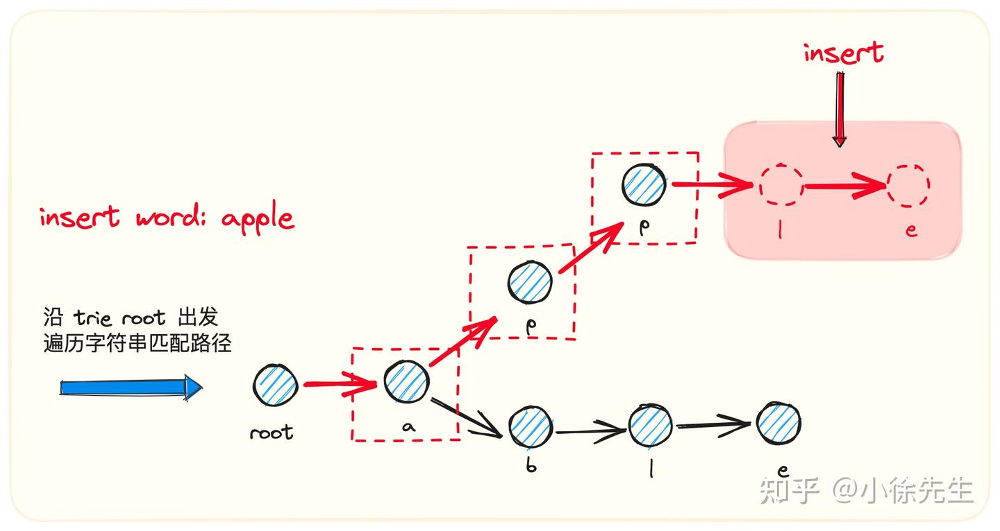
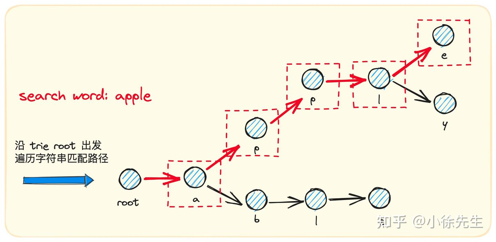
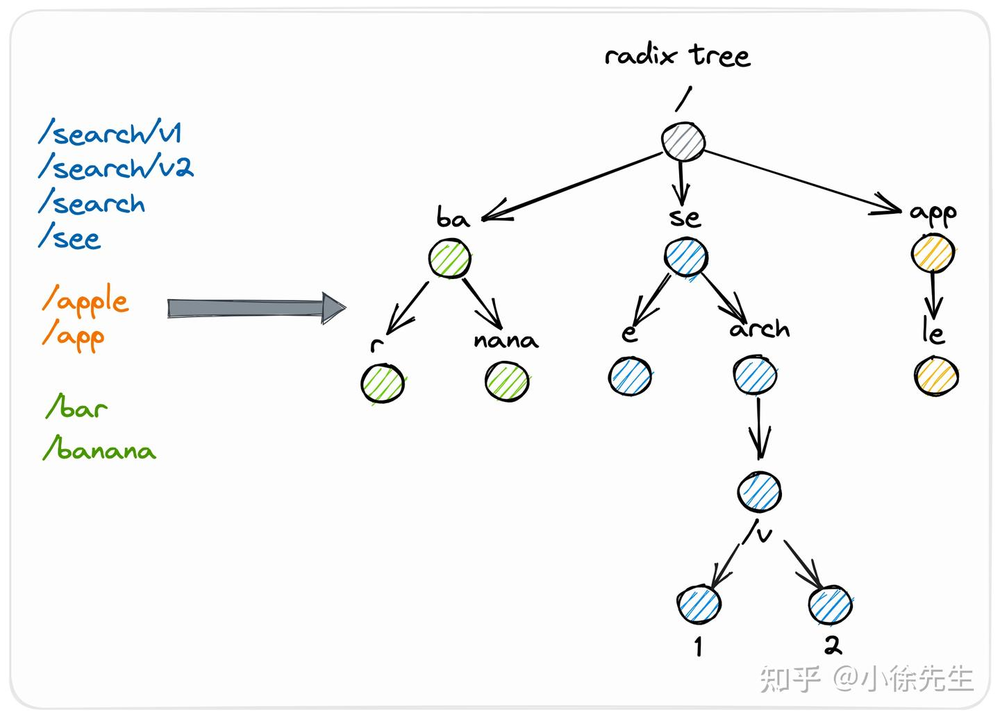
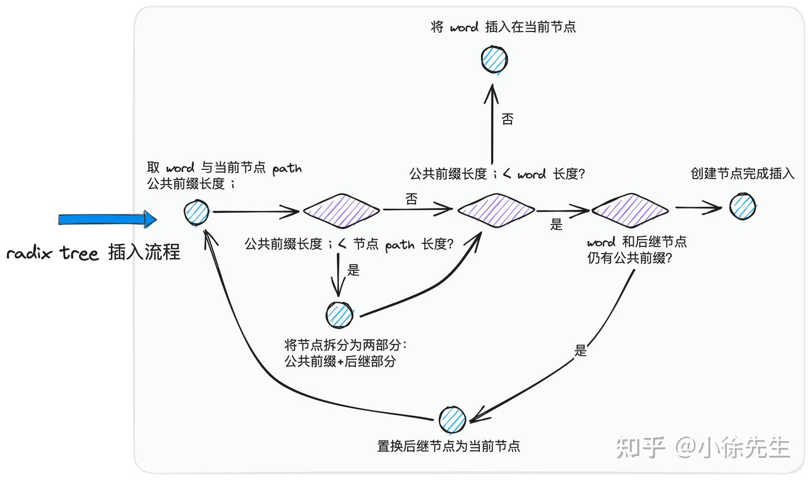
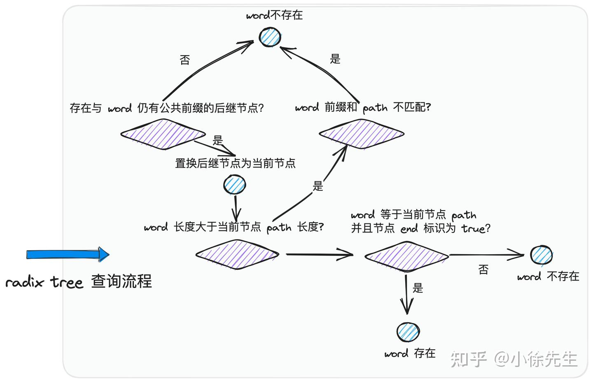

# [压缩前缀树实现_哔哩哔哩_bilibili](https://b23.tv/s0LrzbR)

 

# 前缀树 trie
前缀树 trie ，又称为<font color="red">字典树或者单词查找树</font>，是一种广泛应用于本文词频统计场景的树状存储结构.

<font color="red">多叉树结构</font>，树中的每个节点存储一个字符，它与普通树状数据结构最大的差异在于，**存储数据的 key 不存放于单个节点中，而是由从根节点 root 出发直到来到目标节点 target node 之间的沿途路径组成**

- 比如：插入 search、see、seat 三个单词的流程：


## 复杂度分析
- 时间复杂度：初始化为 O(1)，其余操作为 O(∣S∣)，其中 ∣S∣ 是每次插入或查询的字符串的长度。
- 空间复杂度：O(∣T∣⋅Σ)，其中 ∣T∣ 为所有插入字符串的长度之和，Σ 为字符集的大小，本题 Σ=26。

## 应用场景
- 基于 trie 的特性，有一类很常用的应用场景就是<font color="red">搜索提示</font>

比如当输入一个网址时，可以通过 trie 识别出用户可能的存在；当没有完全匹配的搜索结果时，也可以基于前缀返回最相似的可能

- geohash 是一种地址编码方式，通过将经纬度二维坐标通过递归二分的方式压缩成一个一维字符串，并能够在很大程度上保证拥有越长公共前缀的两个字符串之间的相对距离就越小

由于 geohash 这种基于公共前缀圈定距离的实现方式，因此我们在存储基于 geohash 生成的大量位置信息时，通常会优先考虑使用 trie 树作为实现的数据结构.


【有道云笔记】GeoHash核心原理解析 https://note.youdao.com/s/MHKENkgG

Redis三种特殊数据类型——Geospatial地理空间 https://blog.csdn.net/w15558056319/article/details/121329348

## 代码解析
- 插入

- 查找

``` go
type trieNode struct {
	nexts   [26]*trieNode
	passCnt int // 保证在后续处理单词插入的 Insert 流程以及单词删除的 Erase 流程中，对每个节点维护好一个 passCnt 计数器，用于记录通过该节点的单词数量.
	end     bool
}

type Trie struct {
	root *trieNode
}

func NewTrie() *Trie {
	return &Trie{
		root: &trieNode{},
	}
}

// Search 查找是否含有整个单词
func (t *Trie) Search(word string) bool {
	// 查找目标节点，使得从根节点开始抵达目标节点沿路字符形成的字符串恰好等于 word
	node := t.search(word)
    // tag: 如果节点存在，并且节点的 end 标识为 true，代表 word 存在
	return node != nil && node.end
}

// 查找字符串的节点的底层 后续跟进end标识判断
func (t *Trie) search(target string) *trieNode {
	// 移动指针从根节点出发
	move := t.root
	// 依次遍历 target 中的每个字符
	for _, ch := range target {
		// 倘若 nexts 中不存在对应于这个字符的节点，说明该单词没插入过，返回 nil
		if move.nexts[ch-'a'] == nil {
			return nil
		}
		// 指针向着子节点移动
		move = move.nexts[ch-'a']
	}

	// 来到末尾，说明已经完全匹配好单词，直接返回这个节点
	// 需要注意，找到目标节点不一定代表单词存在，因为该节点的 end 标识未必为 true
	// 比如我们之前往 trie 中插入了 apple 这个单词，但是查找 app 这个单词时，预期的返回结果应该是不存在，此时就需要使用到 end 标识 进行区分
	return move
}

// StartWith 查找是否含有单词前缀
func (t *Trie) StartWith(prefix string) bool {
    // StartWith 无需对节点的 end 标识进行判断
	return t.search(prefix) != nil
}

// PassCnt 给定一个 prefix，要求统计出以 prefix 作为前缀的单词数量
func (t *Trie) PassCnt(prefix string) int {
	node := t.search(prefix)
	if node == nil {
		return 0
	}
    
	return node.passCnt
}

// Erase 从前缀树 trie 中插入某个单词
func (t *Trie) Insert(word string) {
	if t.Search(word) {
		return
	}
    // 从根节点开始
	move := t.root
    // 依次遍历 word 的每个字符，每轮判断当前节点的子节点列表 nexts 中，对应于字符的子节点是否已存在了
	for _, ch := range word {
		if move.nexts[ch-'a'] == nil {
			move.nexts[ch-'a'] = &trieNode{}
		}
		move.nexts[ch-'a'].passCnt++ // 存在新单词的插入，我们需要对这个子节点的 passCnt 计数器累加 1
		move = move.nexts[ch-'a']
	}
    // 此时 move 所在位置一定对应的是单词结尾的字符. 我们需要把 move 指向节点的 end 标识置为 true，代表存在单词以此节点作为结尾
	move.end = true
}

// Erase 从前缀树 trie 中删除某个单词
func (t *Trie) Erase(word string) bool {
	if !t.Search(word) {
		return false
	}

	move := t.root
    // 依次遍历 word 中的每个字符，每次从当前节点子节点列表 nexts 中找到对应于字符的子节点
	for _, ch := range word {
		move.nexts[ch-'a'].passCnt--
        // 倘若发现子节点的 passCnt 被减为 0，则直接舍弃这个子节点，结束流程
		if move.nexts[ch-'a'].passCnt == 0 {
			move.nexts[ch-'a'] = nil
			return true
		}
		move = move.nexts[ch-'a']
	}
    // 遍历来到单词末尾位置，则需要把对应节点的 end 标识置为 false
	move.end = false
	return true
}

func TestPreTree(t *testing.T) {
	// 测试二叉排序树
	trie := NewTrie()
	trie.Insert("apple")
	fmt.Println(trie.Search("apple")) // 返回 True
	fmt.Println(trie.Search("app"))   // 返回 False

	trie.Insert("app")
	fmt.Println(trie.Search("app")) // 返回 True

	trie.Insert("boss")
	fmt.Println(trie.StartWith("bo")) // 返回 True
	fmt.Println(trie.StartWith("ab")) // 返回 false
}
```

# 压缩前缀树 Radix Tree
1. 压缩前缀树 Compressed Prefix Tree，也称为 Radix Tree 或 Patricia Tree
2. 在多叉树中，每个节点对应一段相对路径，最终从根节点到某个节点之间沿路途径的所有相对路径拼接在一起后形成的绝对路径，即为<font color="red">该节点对应的标识键 key</font>
- 与前缀树的区别: <font color="red">倘若某个父节点有且仅有一个子节点，并且不存在单词以这个父节点作为结尾，则此时 radix tree 会将这个父节点与子节点进行合并，并把父、子节点的相对路径组装在一起生成一段复合的相对路径，以此作为这个“新生节点”的相对路径</font> 存在的优势就是能够起到节省空间的效果

- 例子

其中如 "ba"、"se"、"nana"、"arch" "/v" "app" "le" 几个部分都基于 radix tree 的新规则实现了父子节点之间的压缩合并.arch 没有和唯一的子节点 /v 进行压缩合并，原因是在于存在于 arch 作为结尾的单词——/search，因此 arch 需要单独拆出一个节点.

## 代码解析
- 插入

- 查找

radix tree 和 trie 所不同的是，root 节点是能够存储实际的相对路径 path 的
``` go
package pre_tree_test

import (
	"fmt"
	"strings"
	"testing"
)

type radixNode struct {
	path     string       // 当前节点的相对路径
	fullPath string       // 完整路径
	indices  string       // 每个 indice 字符对应一个孩子节点的 path 首字母
	children []*radixNode // 后继节点切片
	end      bool         // 是否有路径以当前节点为终点
	passCnt  int          // 记录有多少路径途径当前节点
}

//radix tree 和 trie 所不同的是，root 节点是能够存储实际的相对路径 path 的.

type Radix struct {
	root *radixNode
}

func NewRadix() *Radix {
	return &Radix{
		root: &radixNode{},
	}
}

func (r *Radix) Insert(word string) {
	// 不重复插入
	if r.Search(word) {
		return
	}
	r.root.insert(word)
}

// 插入节点流程
func (rn *radixNode) insert(word string) {
	fullWord := word

	// 如果当前节点为 root，此之前没有注册过子节点，则直接插入并返回
	if rn.path == "" && len(rn.children) == 0 {
		rn.insertWord(word, word)
		return
	}

walk:
	for {
		// 获取到 word 和当前节点 path 的公共前缀长度 i 进行分类处理
		i := commonPrefixLen(word, rn.path)
		// 1. 只要公共前缀大于 0
		if i > 0 {
			rn.passCnt++ // 说明 word 必然经过当前节点，需要对 passCnt 计数器加 1
		}

		// 2. 公共前缀小于当前节点的相对路径，要将当前节点拆分为公共前缀部分 + 后继剩余部分两个节点
		if i < len(rn.path) {
			// 需要进行节点切割
			child := radixNode{
				// 进行相对路径切分
				path: rn.path[i:],
				// 继承完整路径
				fullPath: rn.fullPath,
				// 当前节点的后继节点进行委托
				children: rn.children,
				indices:  rn.indices,
				end:      rn.end,
				// 传承给孩子节点时，需要把之前累加上的 passCnt 计数扣除
				passCnt: rn.passCnt - 1,
			}

			// 续接上孩子节点
			rn.indices = string(rn.path[i])
			rn.children = []*radixNode{&child}
			// 调整原节点的 full path
			rn.fullPath = rn.fullPath[:len(rn.fullPath)-(len(rn.path)-i)]
			// 调整原节点的 path
			rn.path = rn.path[:i]
			// 原节点是新拆分出来的，目前不可能有单词以该节点结尾
			rn.end = false
		}

		// 3. 公共前缀小于插入 word 的长度，则需要继续检查，word 和后继节点是否还有公共前缀，如果有的话，则递归对后继节点执行相同流程
		if i < len(word) {
			// 对 word 扣除公共前缀部分
			word = word[i:]
			// 获取 word 剩余部分的首字母
			c := word[0]
			for i := 0; i < len(rn.indices); i++ {
				// 如果与后继节点还有公共前缀，则将 rn 指向子节点，然后递归执行流程
				if rn.indices[i] == c {
					rn = rn.children[i]
					continue walk
				}
			}

			// 到了这里，意味着 word 剩余部分与后继节点没有公共前缀了
			// 则直接将 word 包装成一个新的节点，插入到当前节点的子节点列表 children 当中
			rn.indices += string(c)
			child := radixNode{}
			child.insertWord(word, fullWord) // 传入相对路径和完整路径，补充一个新生成的节点信息
			rn.children = append(rn.children, &child)
			return
		}

		// 倘若公共前缀恰好是 path，需要将 end 置为 true
		rn.end = true
		return
	}
}

// 求取两个单词的公共前缀
func commonPrefixLen(wordA, wordB string) int {
	var move int
	for move < len(wordA) && move < len(wordB) && wordA[move] == wordB[move] {
		move++
	}
	return move
}

// 传入相对路径和完整路径，补充一个新生成的节点信息
func (rn *radixNode) insertWord(path, fullPath string) {
	rn.path, rn.fullPath = path, fullPath
	rn.passCnt = 1
	rn.end = true
}

// 查看一个单词在 radix 当中是否存在
func (r *Radix) Search(word string) bool {
	node := r.root.search(word)
	return node != nil && node.fullPath == word && node.end
}

// 查找单词流程
func (rn *radixNode) search(word string) *radixNode {
walk:
	for {
		prefix := rn.path
		// word 长于 path

		if len(word) > len(prefix) {
			// 没匹配上，直接返回 nil  word 以节点 path 作为前缀
			if word[:len(prefix)] != prefix {
				return nil
			}
			// word 扣除公共前缀后的剩余部分
			word = word[len(prefix):]
			c := word[0]
			for i := 0; i < len(rn.indices); i++ {
				// 后继节点还有公共前缀，继续匹配 递归开启后续流程
				if c == rn.indices[i] {
					rn = rn.children[i]
					continue walk
				}
			}
			// word 还有剩余部分，但是 prefix 不存在后继节点和 word 剩余部分有公共前缀了
			// 必然不存在
			return nil
		}

		// 和当前节点精准匹配上了
		if word == prefix {
			return rn
		}

		// 走到这里意味着 len(word) <= len(prefix) && word != prefix
		return rn
	}
}

// 前缀匹配流程
func (r *Radix) StartWith(prefix string) bool {
	node := r.root.search(prefix) // 检索出可能包含 prefix 为前缀的节点 node
	// 对应节点存在，并且其全路径 fullPath 确实以 prefix 为前缀，则前缀匹配成功
	return node != nil && strings.HasPrefix(node.fullPath, prefix)
}

// 前缀统计流程
func (r *Radix) PassCnt(prefix string) int {
	node := r.root.search(prefix)
	if node == nil || !strings.HasPrefix(node.fullPath, prefix) {
		return 0
	}
	return node.passCnt // 返回该节点 passCnt 计数器的值
}

// 删除一个单词的流程
func (r *Radix) Erase(word string) bool {
	if !r.Search(word) {
		return false // 判断拟删除单词是否存在，如果不存在直接 return
	}

	// root 直接精准命中了 需要对根节点的所有子节点进行路径 path 调整，同时需要对 radix tree 的根节点指针进行调整
	if r.root.fullPath == word {
		// 如果一个孩子都没有
		if len(r.root.indices) == 0 {
			r.root.path = ""
			r.root.fullPath = ""
			r.root.end = false
			r.root.passCnt = 0
			return true
		}

		// 如果只有一个孩子
		if len(r.root.indices) == 1 {
			r.root.children[0].path = r.root.path + r.root.children[0].path
			r.root = r.root.children[0]
			return true
		}

		// 如果有多个孩子
		for i := 0; i < len(r.root.indices); i++ {
			r.root.children[i].path = r.root.path + r.root.children[0].path
		}

		newRoot := radixNode{
			indices:  r.root.indices,
			children: r.root.children,
			passCnt:  r.root.passCnt - 1,
		}
		r.root = &newRoot
		return true
	}

	// 确定 word 存在的情况下
	move := r.root // 从根节点出发
	// root 单独作为一个分支处理
	// 其他情况下，需要对孩子进行处理
walk:
	for {
		move.passCnt-- // 沿路将途径到的子节点的 passCnt 计数器数值减 1
		prefix := move.path
		word = word[len(prefix):]
		c := word[0]
		// 发现某个子节点的 passCnt 被减为 0，则直接删除该节点. 删除某个子节点后，需要判断，当前节点是否满足和下一个子节点进行压缩合并的条件，如果的是话，需要执行合并操作
		for i := 0; i < len(move.indices); i++ {
			if move.indices[i] != c {
				continue
			}

			// 精准命中但是他仍有后继节点
			if move.children[i].path == word && move.children[i].passCnt > 1 {
				move.children[i].end = false
				move.children[i].passCnt--
				return true
			}

			// 找到对应的 child 了
			// 如果说后继节点的 passCnt = 1，直接干掉
			if move.children[i].passCnt > 1 {
				move = move.children[i]
				continue walk
			}

			move.children = append(move.children[:i], move.children[i+1:]...)
			move.indices = move.indices[:i] + move.indices[i+1:]
			// 如果干掉一个孩子后，发现只有一个孩子了，并且自身 end 为 false 则需要进行合并
			if !move.end && len(move.indices) == 1 {
				// 合并自己与唯一的孩子
				move.path += move.children[0].path
				move.fullPath = move.children[0].fullPath
				move.end = move.children[0].end
				move.indices = move.children[0].indices
				move.children = move.children[0].children
			}

			return true
		}
	}
}

func TestRadixTree(t *testing.T) {
	// 测试压缩前缀树
	trie := NewRadix()
	trie.Insert("/search/v1")
	trie.Insert("/search/v2")
	trie.Insert("/apple")
	trie.Insert("/app")
	fmt.Println(trie.Search("apple"))  // false
	fmt.Println(trie.Search("app"))    // false
	fmt.Println(trie.StartWith("app")) // false
	fmt.Println(trie.Search("/app"))   // true

	trie.Insert("boss")
	fmt.Println(trie.StartWith("bo")) // true
}

```
## 应用场景
Gin 的路由实现确实使用了，这种数据结构在性能和内存占用上都有优势，特别适合处理 HTTP 路由的场景

- Gin 框架的路由实现使用了压缩前缀树。
  1. 高效的路由匹配：压缩前缀树通过共享公共前缀来减少存储空间，并提高路由匹配的效率。
  2. 支持动态路由：Gin 的路由支持动态参数（如 /user/:id），压缩前缀树能够高效处理这种动态路由的匹配。
  3. <font color="red">减少内存占用：通过压缩公共前缀，减少了树的深度和节点数量，从而降低了内存占用。</font>

## Gin 路由的实现特点
- 路径分段：Gin 将路由路径按 / 分段，每个段对应树的一个节点。
- 动态参数支持：动态参数（如 :id 或 *action）会被特殊处理，存储在树的节点中。
- 优先级：静态路由的优先级高于动态路由，确保精确匹配优先。

- 示例假设有以下路由：

``` go
r := gin.Default()
r.GET("/user/:id", handler1)
r.GET("/user/profile", handler2)
r.GET("/post/:id/comments", handler3)
Gin 会将这些路由组织成一棵压缩前缀树：

复制
/
├── user/
│   ├── :id       (handler1)
│   └── profile   (handler2)
└── post/
    └── :id/
        └── comments (handler3)
```