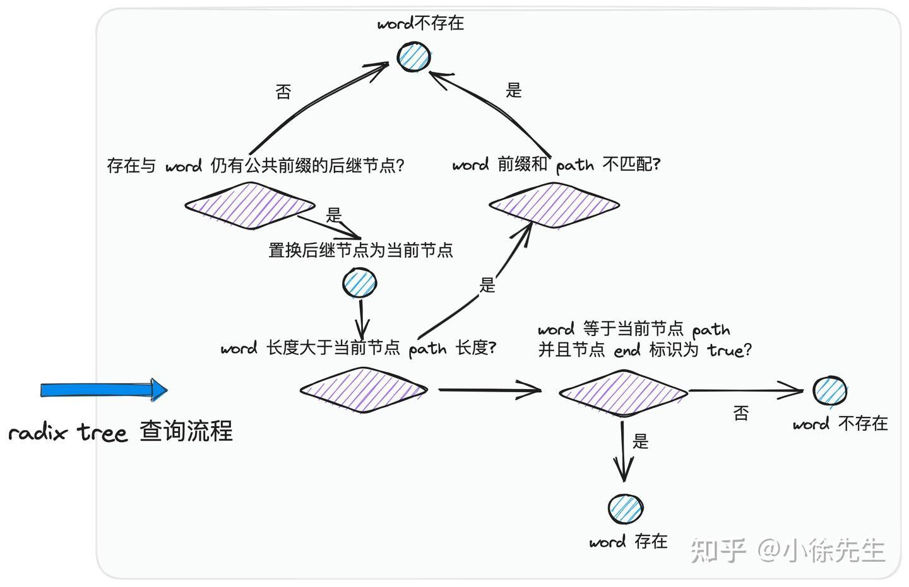

# 概念

- QPS（Queries Per Second）,也就是“每秒查询数”，它表示服务器每秒能够处理的请求数量，是一个衡量服务器性能的重要指标。
  - 你的这个项目（API）的读写性能怎么样，单个实例能支持多少 QPS？
- <font color="red">合理范围：</font>带了数据库的服务一般写性能在 5k 以下，读性能一般在 10k 以下，能到 10k 以上的话，那很可能是在数据库前面加了层缓存。


[QPS、TPS、并发用户数、吞吐量概念](https://blog.csdn.net/weixin_44275820/article/details/107155668)

[服务端性能优化--最大QPS推算及验证](https://www.cnblogs.com/huangyingsheng/p/13744422.html)

# QPS和并发数的关系
- <font color="red">QPS: 请求进入的速度, 并发数: 系统中同时存在的请求数. 并发数 = QPS * 耗时</font>

QPS和并发数的概念容易混淆，比如：1秒内并发地来了100个请求，这个100是QPS还是并发数？ 来看看它们的含义：
``` html
以大学招生为例：大一新生的招收速度是5000人/年，每个学生在大学停留4年，整个大学的人数是20000，于是(下面的QPS改为以年为单位)：
QPS            耗时    并发数
5000人/年    4年    20000人
以某公司为例：180000员工，必须早上8:30-9:00之间在考勤系统签到，每次签到在系统需要停留0.1秒，于是：
QPS        耗时        并发数
100人/秒    0.1秒    10人
以动物园为例：每秒有1个人进入动物园，每个人在动物园中停留2小时，于是：
QPS        耗时            并发数
1人/秒    2*3600秒    7200人
假设在理想情况下，某系统的请求进入速度是1亿次/秒，系统处理的时间趋近为0，那么这个系统的并发量是多少呢？很显然：
QPS    耗时    并发数
1亿次/秒    趋近0    趋近0次
可见，虽然每秒有1亿次请求，但在某一随机时刻观察系统，会发现系统中不存在请求堆积的问题，系统的并发数趋近0.（此时并发数很低，但这不表明系统实际能够承受的并发数很低，它实际上可能承受很高的并发数。）
这是一个高QPS、低延时系统，是一个很好的系统，轻轻松松地快速处理各种请求，来一个灭一个。
```

# 实时性要求较低的监控场景。Prometheus（监控）
1. 接入 Prometheus 的代码库，然后在每个需要计算 QPS 的地方，加入类似Counter.Inc() 函数执行次数加1(打点) 
2. grafana调取时序数据库里的打点数据，在监控面板上通过特殊的表达式(PromQL)，对某段时间里的打点进行求导计算速率，这样就能看到这个函数的调用 QPS 啦。

3. 单纯的限流：漏桶、令牌桶等，他们的缺点是单一限流和无差别限流。此外，系统需要先做压测，拿到一个初始的限流参考值，超过这个值才启动限流机制

# 实时性要求较高的服务治理场景
- sentinel-golang, 阿里开源的go包, 盖流量路由/调度、流量染色、流控降级、过载保护/实例摘除[文档](https://sentinelguard.io/zh-cn/docs/golang/flow-control.html)
- <font color="red">实时计算服务 api 当前的 QPS，当它大于某个阈值时，可以做一些自定义逻辑，比如是直接拒绝掉一些请求，还是将请求排队等一段时间后再处理等等，也就是所谓的限流。</font> （相比令牌桶优点：自适应）

## 方案1 单独变量cnt

- cnt(t) 表示在时间 t 的请求数，Δt表示时间间隔。比如在第 9 秒的时候, cnt 是 80， 到第 10 秒的时候，cnt 是 100，那这一秒内就执行了 (100-80)/(10-9) = 20 次, 也就是 20QPS。
- 缺点：光一个变量的话，数据老早被覆盖了，根本不够用。
## 方案2 bucket
- 将临时变量 cnt，改成了一个数组，数组里每个元素都用来<font color="red">存放(cnt(t) - cnt(t - Δt)) 的值(增量数量).</font> 数组里的每个元素，都叫 bucket.

- 可调整 bucket 范围粒度, 1s变200ms，计算 QPS 的组件越灵敏
- 缺点：随着时间变长，数组的长度就越长，需要的内存就越多，最终导致进程申请的内存过多

## 方案3 引入环形数组与滑动窗口
- <font color="red">为数组加入最大长度的限制，超过最大长度的部分，就从头开始写，覆盖掉老的数据</font>
- 一个用%取模来确定写入位置的定长数组
### <font color="red">计算qps</font>
将当前时间跟 bucket 的粒度做取模操作，可以大概知道 end 落在哪个 bucket 上，确定了 end 之后，将 end 的时间戳减个 1s (Δt)就能大概得到 start 在哪个 bucket 上，有了这两个值，再将 start 到 end 范围内的 bucket 取出。对范围内的 bucket 里的 cnt 求和，得到这段时间内的总和，再除以1s (Δt)。就可以得到 qps。


### 平均耗时
1. bucket 有个用来统计调用次数的变量 cnt，现在再加个用来统计延时的变量 Latency 。每次执行完函数，就给 bucket 里的 Latency 变量 加上耗时
2. 计算 Latency 的总和，再除以这些 bucket 里的调用次数 cnt 总和

<font color="red">函数的平均耗时 = Latency总和/cnt总和</font>

# 动态限流
## sentinel-golang相关源码
- 基于 sliding_window_metric.go 里的 GetQPS 开始看起，它是实时计算 QPS 的入口函数
- 环形数组里存放的 bucket 在代码里就是 MetricBucket
  - <font color="red">MetricBucket 里的 count 并不是一个数字类型，而是一个 map 类型，它将上面提到的 cnt 和 Latency 等都作为一种 key-value 来存放。</font>以后想要新增字段就不需要改代码了，提高了代码扩展性。
- bucket环形数组，在 sentinel-golang 中叫 AtomicBucketWrapArray,
- 滑动窗口，它在 sentinel-golang 中叫 LeapArray

## kratos的限流
https://pandaychen.github.io/2020/07/12/KRATOS-LIMITER/
- 自适应限流算法原理 BBR 实现
- [限流包](https://github.com/go-kratos/aegis/ratelimit/bbr)

熔断，用于提供客户端熔断功能，默认实现了sre breaker 算法。
限流，用于服务端流量控制，默认使用bbr limiter算法。

# 案例
- cpu和内存被打满（限流导致的）
 <font color="red">**ab实验平台崩了(下游系统限流)，但是ab平台未直接熔断，http连接池被打满**</font>
1. AB系统间的接口约定qps问题
2. 本来b系统qps 1000 预留了1000 结果暴涨到3000就扛不住 （或者a请求b系统的一个接口，缓存穿透，导致请求时长增加，qps抗压下降）
3. b系统崩前直接限流（保护自己），正常进出会很快<font color="red">(这里应该不应该降低告警等级)</font>
4. 然后请求a系统-》b系统，a的请求就要等待了（系统设置超时soa 3秒 重试3次）量直接翻倍了。
5. <font color="red">等待链接（b线程池数量才设置10 远远不够）</font>，等待的请求数 因为报异常（限流code xxx）所以没有警觉，而继续等待, 越堆越多把cpu和内存打满

A是j91系统-ab实验平台 B是eff系统画像平台



- j91系统
  - 2023-10-16 11:14:10 本轮第一波被限流。
    - 2023-10-16 11:14:10 j91-75fbbc9d99-t5xfn | online | 10.66.18.9 | cn-zhangjiakou.10.63.99.201 | 调用user-profile, assertGroupWithLabel，失败原因请求过载，已被限流！<font color="red"> (这里调用的是eff系统的服务接口)</font>
  -  2023-10-16 11:16:09 开始出现http连接池被打满
    - j91-75fbbc9d99-t5xfn | online | 10.66.18.9 | cn-zhangjiakou.10.63.99.201 | soa请求失败 org.apache.http.conn.ConnectionPoolTimeoutException: Timeout waiting for connection from pool at org.apache.http.impl.conn.PoolingHttpClientConnectionManager.leaseConnection(PoolingHttpClientConnectionManager.java:316)


- 限流阈值早就出现了，但是在画像平台和AB试验平台**全部为warn异常**,导致没有及时发现
  - 限流是有损的，不同的业务针对限流的error基于是否是强依赖敏感度不同
  - <font color="red">但是对于画像平台限流是强感知的。(画像平台应该报error)</font>
  


画像 hbase+es 后续优化成hologress