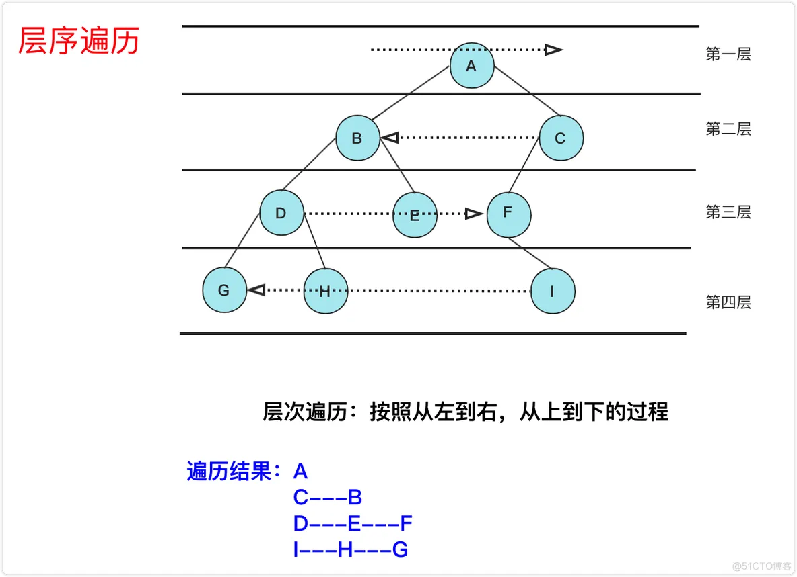
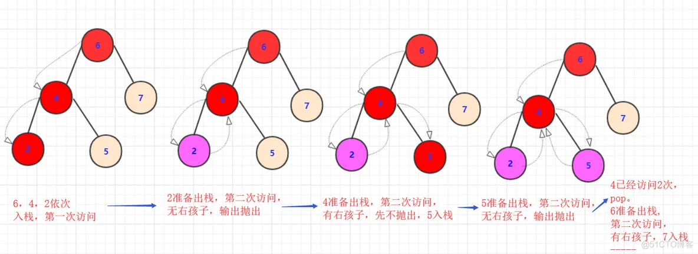
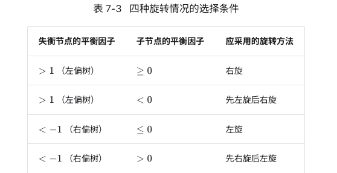
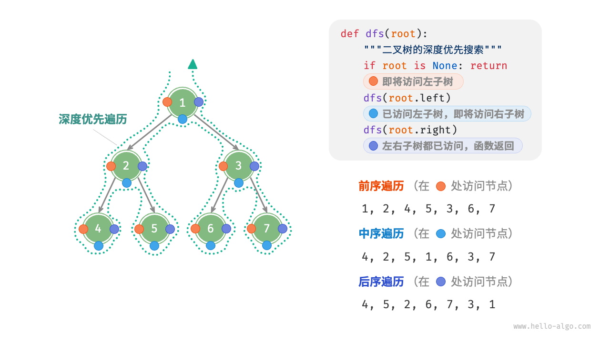

[文章解读](https://blog.csdn.net/weixin_36894490/article/details/118733380)

通过实验的对比指标来衡量这些修改对用户的影响程度，以此来提高用户体验，提高公司收益等等。
参考google经典论文《Overlapping Experiment Infrastructure:More, Better, Faster Experimentation》第4部分，阐述谷歌等大厂都是如何高效地做ab实验的

# 神策AB平台
  - [分流逻辑详细介绍](https://manual.sensorsdata.cn/abtesting/docs/abtesting_diversiondetails/v0102) 
  - [分流模型介绍](https://manual.sensorsdata.cn/abtesting/docs/abtesting_diversionintroduction/v0102) 
  - [抽样统计理论](https://manual.sensorsdata.cn/abtesting/docs/abtesting_SamplingStatistics/v0102)
    - [假设检验与置信区间](https://manual.sensorsdata.cn/abtesting/docs/abtesting_ConfidenceInterval/v0102)
  - [指标配置](https://manual.sensorsdata.cn/abtesting/docs/abtesting_IndexConfig/v0102)

# 想到的实验方案
1. 方案1）将用户分成两半，一半做对照组，一半做实验组

- 缺点：一次只能做一个实验，假如想要同时做两个实验，将无法满足

2. 方案2）将用户分桶，例如通过用户ID取模分成1000个桶，一些桶做基线，一些桶做实验

- 缺点：如果桶分的太少，同一时间可以做的实验还是受到限制。如果桶分的太多，每个实验桶的流量将会变少，置信度将会降低，需要更长的实验时间。

假如我们的<font color="red">实验涉及到多个系统服务，这些系统服务之间是有关联的。</font>以一个新闻推荐系统为例，我们知道，当系统接受到一个用户请求的时候，首先会去召回系统里面取出候选的新闻，然后再将这些候选的新闻发送到精排系统进行排序，假如召回系统和精排系统同时在做ab实验，**怎么消除这两个系统的相互影响？**

- 缺点是一个用户请求只能进行一个实验，那假如一个用户请求我们同时进行N个实验呢？如果一个用户请求同时进行N个实验，我们怎么排除这些实验之间相互干扰？答案就是使用正交实验

# 正交实验

假如我们要做一个关于UI界面的实验。实验1为将按钮的颜色设置为红色（20%流量）和蓝色（80%流量），实验2将页面背景设置为白色（50%流量）或黑色（50%流量），正交实验如下图所示

我们只要将实验1的用户像洗牌一样重新打散，均匀地分布在实验2里面，就可以消除实验1对实验2的影响。同时，每个用户请求是同时进行进行2个实验的（按钮为红/蓝，背景白色/黑色）。利用正交实验，我们的每个实验都可以利用到全部的流量。

## 怎么将实验1的用户均匀地分布到实验2呢？
答案就是在hash的时候加一个前缀。例如通过使用函数 hash(实验ID+用户ID)%1000，将（实验1的ID+用户ID）取模1000后小于200的用户的按钮颜色设置为红色，大于等于200的设置为蓝色，同时，将（实验2的ID+用户ID）取模1000后小于500的用户背景设置为白色，大于等于500的用户背景设置为黑色即可

- <font color="red">为了确保不同层的实验独立转移，谷歌使用 mod = f(cookie, layer) % 1000 代替。</font>
- AB实验+hash分流+大数定律 应该是天然的正交

# 谷歌分层重叠实验框架
在正交实验的基础上，通过对流量的切割，以及分层重叠嵌套，便可设计出更为灵活的AB实验框架。


## 概念(得物)
1) domain：域，是流量的分段。全部流量被切割之后的一段流量  

2）layer：层， 在layer里面包含一系列可以改变的参数。例如上面的实验可以分成2个layer，layer1对应实验1，layer2对应实验2。

3）experiment：<font color="red">实验， 在layer里面可以添加桶</font>，例如通过 hash(layerId + userId)%1000 , 然后把实验放入桶中。

- 1个domain可以有多个重叠的layer，1个layer反过来也可以嵌套多个domain，实验最终落入到layer里面的bucket里面。
- <font color="red">各个layer之间的实验是要独立的。</font>例如layer1中的实验是设置按钮为白色和黑色，layer3的实验是设置按钮为白色和红色，这样的两个layer之间就不是独立的了，那么正交性就会遭到破坏。需要特别注意这一点。
  - 如果layer之间相关，也该怎么办呢？合并成一个吗（比两个实验颜色对比，改成三个颜色同时对比）？答案：<font color="red">两个颜色或三个颜色对比 应该放在同一层 层里面有再分桶 桶里面放不同的颜色</font>

- 每一个实验要取用30%的流量才能够得出可信的实验结果。最小样本量计算

## 案例

在(a)中，只有1个domain，domain里面嵌套了3个layer。当用户请求过来的时候，会依次经过UI Layer，Search results layer和Ads result layer，在各个layer里面通过 hash(layerId + userId)%1000 映射到对应的桶取出相应的experiment。<font color="red">因此1个用户请求最多会同时进行3个实验</font>

在(b)中，流量被切割成2个domain，1个domain只有1个layer，另一个domain有3个layer。当用户请求被分配到domain1的时候，最多将会进行1个实验，当用户请求被分配到domain2的时候，用户最多将会进行3个实验。

比如复杂的


## 启动层
启动层始终包含在默认域中（即，它们在所有流量上运行）。启动层中的实验为参数提供了替代默认值。

# <font color="red">hash算法</font>

## DEK Hash 的缺陷
[DEK Hash 和 Murmur Hash](https://zhuanlan.zhihu.com/p/648347825) 

## Murmur Hash
- github.com/spaolacci/murmur3 现有的包
- cityhash进一步优化murmur3
``` go 
import (
    "fmt"
    "github.com/spaolacci/murmur3"
)

func main() {
    text := "Hello, World!"
    hashValue := murmur3.Sum32([]byte(text))
    fmt.Printf("Hash of '%s': 0x%x\n", text, hashValue)
}
``` 
## 离散性验证
``` go 
import (
	"math/rand"
	"github.com/spaolacci/murmur3"
)

func TestParse(t *testing.T) {
	scale := 50 //概率
	// 演示随机生成1w次hash的分布情况
	hit1 := 0
	hit2 := 0
	uhit1 := 0
	uhit2 := 0
	for i := 0; i < 100; i++ {
		text := randStr() // 生产的随机字符串
		hash := murmur3.Sum32([]byte(text))
		fmt.Printf("str: %s, Hash: %d\n", text, hash)
		// 模是1000的情况
		if hash%1000 < uint32(scale)*10 {
			hit1 += 1
		} else {
			uhit1 += 1
		}
		// 模是100的情况
		if hash%100 < uint32(scale) {
			hit2 += 1
		} else {
			uhit2 += 1
		}
	}
    // 不管模取多少 循环大于100后 概率都是接近scale
	fmt.Printf("hit1: %d, uhit1: %d \n hit2: %d, uhit2: %d\n", hit1, uhit1, hit2, uhit2)
}

func randStr() string {
	n := 32
	const charset = "abcdefghijklmnopqrstuvwxyz0123456789"
	rand.Seed(time.Now().UnixNano())

	b := make([]byte, n)
	for i := range b {
		b[i] = charset[rand.Intn(len(charset))]
	}
	return string(b)
}
```

- 实现MurmurHash算法在Go语言中通常涉及较复杂的位操作和数学计算
``` go 
package main
import (
    "encoding/binary"
    "fmt"
)
//  Go 语言中实现 MurmurHash3 算法（32-bit 版本） MurmurHash算法的不同变体（例如32位、64位、128位版本）需要不同的实现。
func murmur3_32(key []byte, seed uint32) uint32 {
    const (
        c1 uint32 = 0xcc9e2d51
        c2 uint32 = 0x1b873593
        r1 uint32 = 15
        r2 uint32 = 13
        m  uint32 = 5
        n  uint32 = 0xe6546b64
    )

    hash := seed
    length := len(key)
    roundedEnd := (length & 0xfffffffc) // round down to 4 byte block

    for i := 0; i < roundedEnd; i += 4 {
        k1 := binary.LittleEndian.Uint32(key[i : i+4])
        k1 *= c1
        k1 = (k1 << r1) | (k1 >> (32 - r1))
        k1 *= c2

        hash ^= k1
        hash = ((hash << r2) | (hash >> (32 - r2))) * m + n
    }

    if length > roundedEnd {
        tail := uint32(0)
        switch length & 3 {
        case 3:
            tail |= uint32(key[roundedEnd+2]) << 16
            fallthrough
        case 2:
            tail |= uint32(key[roundedEnd+1]) << 8
            fallthrough
        case 1:
            tail |= uint32(key[roundedEnd])
            tail *= c1
            tail = (tail << r1) | (tail >> (32 - r1))
            tail *= c2
            hash ^= tail
        }
    }

    hash ^= uint32(length)
    hash ^= hash >> 16
    hash *= 0x85ebca6b
    hash ^= hash >> 13
    hash *= 0xc2b2ae35
    hash ^= hash >> 16

    return hash
}

func main() {
    text := "Hello, World!"
    hashValue := murmur3_32([]byte(text), 0)
    fmt.Printf("Hash of '%s': 0x%x\n", text, hashValue)
}
```
## 他趣hash桶
- 不同hash算法, 获取指定字符串的桶编号
``` go
package hashbucket

// GetBucketNum 计算字符串的哈希值并返回桶编号（范围 1 到 bucketAccount）
func GetBucketNum(str string, bucketAccount int) int64 {
	buf := []byte(str) // Go 字符串直接转换为 UTF-8 字节切片

	// 使用 uint64 初始化，避免溢出问题
	seed := uint64(0xcbf29ce484222325)
	for i := 0; i < len(buf); i++ {
		// 使用 uint64 进行位运算
		seed += (seed << 1) + (seed << 4) + (seed << 5) +
			(seed << 7) + (seed << 8) + (seed << 40)
		seed ^= uint64(buf[i])
	}

	// 将 uint64 转换为 int64 并取绝对值
	result := int64(seed)
	if result < 0 {
		result = -result
	}

	// 计算桶编号（范围 1 ~ bucketAccount）
	bucket := int64(bucketAccount)
	return result%bucket + 1
}

// GetBucketNumByConsistentHash 使用一致性哈希算法返回桶编号（范围 0 到 bucketAccount-1）
func GetBucketNumByConsistentHash(str string, bucketAccount int) int {
	buf := []byte(str)

	// 直接使用 uint64 类型
	seed := uint64(0xcbf29ce484222325)
	for i := 0; i < len(buf); i++ {
		seed += (seed << 1) + (seed << 4) + (seed << 5) +
			(seed << 7) + (seed << 8) + (seed << 40)
		seed ^= uint64(buf[i])
	}

	return consistentHash(seed, bucketAccount)
}

// 实现 Guava 的一致性哈希算法 可以考虑Murmur3算法
func consistentHash(input uint64, buckets int) int {
	if buckets <= 0 {
		panic("buckets must be positive")
	}

	generator := newLinearCongruentialGenerator(input)
	candidate := 0

	for {
		// 计算下一个候选桶
		next := int(float64(candidate+1) / generator.nextDouble())
		if next >= 0 && next < buckets {
			candidate = next
		} else {
			return candidate
		}
	}
}

// 线性同余生成器
type linearCongruentialGenerator struct {
	state uint64
}

func newLinearCongruentialGenerator(seed uint64) *linearCongruentialGenerator {
	return &linearCongruentialGenerator{state: seed}
}

func (lcg *linearCongruentialGenerator) nextDouble() float64 {
	const multiplier = 2862933555777941757
	lcg.state = lcg.state*multiplier + 1

	// 无符号右移 33 位
	unsigned := lcg.state >> 33
	value := uint32(unsigned) // 取低 32 位

	// 转换为 [1, 0x80000000] 区间的浮点数
	return float64(value+1) / float64(0x80000000)
}


// seed 就是盐值，随实验层变 化，只是确实名字不叫 seed
// bucketNum 通过 getBucketNum(LEVEL_BUCKET_RREFIX + levelld + userinfo.getld(), 1000);
// 其中 userinfo.getid 是uuid或者token, levelid 就是实验层id，其他是固定的，levelid 才是seed的概念

func TestHashBucket(t *testing.T) {
	text := "taqu1username"
	bucket1 := hashbucket.GetBucketNum(text, 1000)
	fmt.Println(bucket1)
	// 使用一致性哈希算法返回桶编号
	bucket2 := hashbucket.GetBucketNumByConsistentHash(text, 1000)
	fmt.Println(bucket2)
}
```


## <font color="red">hash算法也用于布隆过滤器</font>
- [布隆过滤器如何实现? - 小徐先生的回答 - 知乎](https://www.zhihu.com/question/389604738/answer/3152180842)
  - b站视频有对应视频

- [布谷鸟过滤器-知乎](https://zhuanlan.zhihu.com/p/436642641)

# 案例用于投放广告系统的设计


# 得物
[得物技术浅谈AB实验设计实现与分流算法](https://segmentfault.com/a/1190000039180775)
<font color="red">得物系列技术文章</font>

# 他趣案例
ab实验基本概念（他趣分享）.pdf
## 架构

1. 实验平台 是公司内部员工使用的交互页面，用于创建、配置、查看实验。
2. 分流引擎 是实验平台的核心基础设置，其作用是根据用户特征将其划分到不同分组，并确定每个分组的值。为客户端、服务端不同流量来源提供服务。同时上报来自客户端和服务端的入组埋点信息。
3. 自助分析平台  基于事件模型+三种高级分析模型提供AB试验效果的查询能力。负责计算p值、显著性、涨跌幅和指标值等统计指标。最终，将统计结果进行数据可视化，以实验报告或Excel的形式展示出来。    
## AB平台的使用说明
- [AB平台的使用说明-飞书文档](https://o15vj1m4ie.feishu.cn/wiki/wikcnfStBTjDZVfmL7ddXGv3rVt)

## 分流流程

## 流量分桶

# 他趣实验组的分桶优化
AB中有一段逻辑，需要根据用户命中的分桶和实验配置去找对应的实验组 （这里还有实验层的概念），
- 优化前：遍历该层的所有分桶，如果相等，返回实验组
- 优化后：把实验配置信息加载到缓存（嵌套的map）里，然后通过用户命中的分桶和实验层直接get 实验组信息 。
<font color="red">本质上就是化行为表，可能最初AB也没想到会发展到这么多实验</font>

## 实际遇到问题
- 过度曝光
    表现情况：分组不均、入组人数大幅度震荡变化

    实际原因：在海豹业务后台中，存在着相当多一些可视化/未可视化的策略配置。实践中，运营同学通过流量平台亦或是低价策略平台等业务后台，配置了自动化实验。看起来是很“可配置、自动化”的操作，却不知道实验设计的入组时机和真实入组时机已经相隔甚远，其中的认知误差在于，运营同学设计实验时的认知是“活跃即入组”，然而在业务 方的代码中是，“活跃->有无城市实验？-＞有无低价投放？-＞按权重排序的流量策略，优先执行大权重策略-＞入组“。链条上的每一步流量截取都在让实验的入组人数在变化。

    <font color="red">实际原因：还是来源于信息差，运营同学和研发同学存在对入组时机的了解不一致</font>

- 用户入组又出组
表现情况：我昨天已经是进的B组/展示的B效果，但是今天是A组
  1. 人群包
    实际原因：在画像平台上配置人群包需要 选择入组不出组，当配置了人群包且出了人群包的用户，AB平台会返回空 结果，此时的呈现效果就依赖于请求方的逻辑呈现，一般是对照组的效果。 

    引申拓展：如果人群特征就在请求方的上下文中，比如 性别、城市等，更加建议是由请求方根据上下文信息来限制人群，会得到更好的效果。<font color="red">画像作为异步链条，链路上时延不可避免。通过更好的实验设计获得更加真实的实验效果！</font>

  2. 区分设备实验和服务端实验
   
    实际原因：埋点表中存在一个用户同时查到同一个实验的两个组信息 

    实际原因：因为该实验是设备实验 引申拓展：<font color="red">实验设计中一定要认真区分设备实验和用户实验的作用，混淆了概念就会判断错实验主体，最终得到的错 误实验结果</font>

## 分流引擎-实验埋点上报机制
hash算法分桶
- 客户端实验场景
 - app启动后,每5分钟调用一次AB分流服务,得到该用户有可能进入的所有AB实验组列表(预入组);
 - 当用户进到某个实验场景时(知道这个实验的code),这根据上一步获取到的AB实验组结果(通常根据下发的变量)做对应的逻辑处理,（真实入组）
 - 上报时通过在header中携带相关实验信息，走网关统一收集到日志平台，然后走kafka上报到数据存储引擎。
- 服务端实验场景
 - 调用AB分流服务获取该实验的入组信息（真实入组）
 - 有分流引擎同步走kafka上报到数据存储引擎

## 自助分析平台
- 指标管理体系基础知识及自助分析平台的使用.pdf



# AB实验平台中的数据科学（了解一下就行）
1. 假设检验
假设检验的基本思想是“小概率事件”。

假设检验是用来判断样本与样本，样本与总体之间的差异是由抽样误差引起还是本质差别造成的统计推断方法。显著性检验是假设检验中最常用的一种方法，也是一种最基本的统计推断形式，其基本原理是先对总体的特征做出某种假设，然后通过抽样研究的统计推理，对此假设应该被拒绝还是接受做出推断。常用的假设检验方法有Z检验、T检验、卡方检验、F检验等。

- 零假设：这项改动并不会对我们的指标有显著的影响 ---指的是实验组和对照组的指标是相同的
- 备择假设：这项改动会对我们的指标有显著的影响---指的是实验组和对照组的指标是不同的
  - 双边备择假设：两组之间存在显著差异
  - 单边备择假设：一组大于另一组或小于另一组


发生第一类错误的概率用α表示，也被称为显著水平（Significance Level）。“显著”是指错误发生的概率大，统计上把发生率小于 5% 的事件称为小概率事件，代表这类事件不容易发生。因此显著水平一般也为 5%。
发生第二类错误的概率用β表示，统计上一般定义为 20%。1 - β 表示的是统计功效（Power），即正确地拒绝原假设的概率。

2. p值
  p值是在假设检验中用来衡量证据反对原假设（通常是“没有差异”的假设）强度的一个概率值。在AB测试中，p值可以帮助我们判断观察到的差异是否足够大以至于不太可能是由于随机波动造成的。
  定义：p值是指在原假设成立的情况下，得到当前观测结果（或更极端的结果）的概率。
  解释：p值越小，说明观察到的数据与原假设之间的不一致性越大，因此拒绝原假设的理由就越充分。
  阈值：通常情况下，如果p值小于某个事先设定的阈值（如0.05或0.01），则认为差异是统计显著的，可以拒绝原假设。
3. 置信区间
  置信区间提供了一个范围估计，表明真实效果落在这个区间的可能性有多大。它可以帮助我们了解估计值的精确度以及不确定性的程度。
  定义：置信区间是在一定置信水平下，估计参数的真实值可能所在的区间。
  解释：例如，95%置信区间意味着如果我们重复实验很多次，大约95%的置信区间会包含真实的参数值。
  用途：置信区间可以告诉我们结果的可信度以及效应大小的估计范围。
4. 样本量
样本量计算，我们需要了解一下中心极限定理。中心极限定理的含义，就是只要样本量足够大，无论是什么指标，无论对应的指标分布是怎样的，样本的均值分布都会趋于正态分布。基于正态分布，我们才能计算出相应的样本量和做假设检验。
1. 样本量如何计算
  通过样本量计算工具可以直接得到，有很多的在线工具，
  a. 比值类计算：不需要方差
  例如对转化率可使用Evan's Awesome A/B Tools

  参数解释
  Baseline conversion rate：填入实验前估测到的转化率，可以通过旧数据统计作为估算。
  Minimum Detectable Effect：填入希望观测到的最小效果。填入实验的预期。
  Statistical power：1 - 假阴性概率。实验效果真实有效时，能被正确发现的概率。
  Significance level：假阳性概率。实验实际没有效果时，被错误发现的概率。
  b. 数值类计算：需要填写方差
  例如事件分析（非比率型）
  http://powerandsamplesize.com/Calculators/Compare-2-Means/2-Sample-Equality

# AB测试注意事项
下面，我们就来讲讲AB实验的注意事项。
1. 网络效应：
这种情况通常出现在社交网络，以及共享经济场景（如滴滴）。举个例子：如果微信改动了某一个功能，这个功能让实验组用户更加活跃。但是相应的，实验组的用户的好友没有分配到实验组，而是对照组。但是，实验组用户更活跃（比如更频繁的发朋友圈），作为对照组的我们也就会经常去刷朋友圈，那相应的，对照组用户也受到了实验组用户的影响。本质上，对照组用户也就收到了新的功能的影响，那么AB实验就不再能很好的检测出相应的效果。
解决办法：从地理上区隔用户，这种情况适合滴滴这种能够从地理上区隔的产品，比如北京是实验组，上海是对照组，只要两个城市样本量相近即可。或者从用户上直接区隔，比如我们刚刚举的例子，我们按照用户的亲密关系区分为不同的分层，按照用户分层来做实验即可。但是这种方案比较复杂，建议能够从地理上区隔，就从地理上区隔。
2. 学习效应：
这种情况就类似，产品做了一个醒目的改版，比如将某个按钮颜色从暗色调成亮色。那相应的，很多用户刚刚看到，会有个新奇心理，去点击该按钮，导致按钮点击率在一段时间内上涨，但是长时间来看，点击率可能又会恢复到原有水平。反之，如果我们将亮色调成暗色，也有可能短时间内点击率下降，长时间内又恢复到原有水平。这就是学习效应。
解决办法：一个是拉长周期来看，我们不要一开始就去观察该指标，而是在一段时间后再去观察指标。通过刚刚的描述大家也知道，新奇效应会随着时间推移而消失。另一种办法是只看新用户，因为新用户不会有学习效应这个问题，毕竟新用户并不知道老版本是什么样子的。
3. 多重检验问题：
这个很好理解，就是如果我们在实验中，不断的检验指标是否有差异，会造成我们的结果不可信。也就是说，多次检验同一实验导致第一类错误概率上涨；同时检验多个分组导致第一类错误概率上涨。
举个例子：
```
出现第一类错误概率：P(A)=5%
检验了20遍：P(至少出现一次第一类错误)
                      =1-P(20次完全没有第一类错误)
                      =1- (1−5%) ^20
                      =64%
```
也就是说，当我们不断的去检验实验效果时，第一类错误的概率会直线上涨。所以我们在实验结束前，不要多次去观察指标，更不要观察指标有差异后，直接停止实验并下结论说该实验有效。