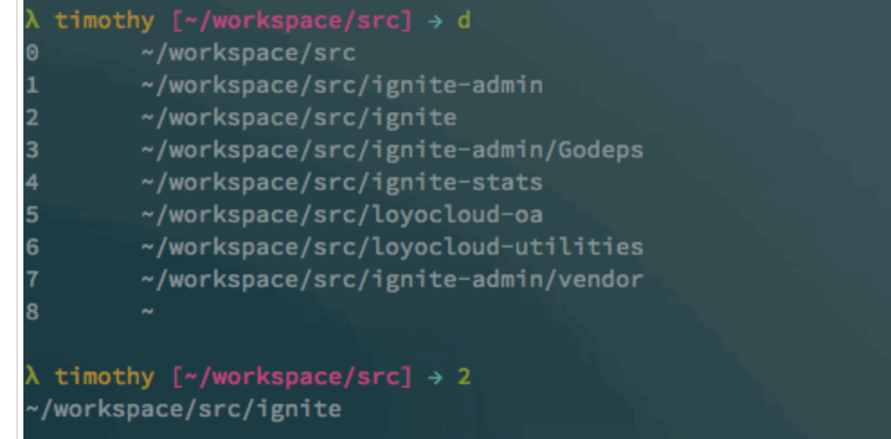

[go变量-有道笔记](https://note.youdao.com/s/Vl38JFd3)


# 变量
- 变量命名规则遵循驼峰命名法，即首个单词小写，每个新单词的首字母大写，如 userName，但如果你的全局变量希望能够被外部包所使用，则需要将首个单词的首字母也大写。
- 关键字 var 批量声明 var ()
- 只声明，不赋值，默认是零值。变量在声明之后，系统会自动将变量值<font color="red">初始化为对应类型的零值</font>
  - int 为 0，float 为 0.0，bool 为 false，string 为空字符串，切片、函数、指针变量的默认为 nil 等。所有的内存在 Go 中都是经过初始化的
- 先声明,再赋值 
- 声明的同时赋值, 声明赋值时，注意整型范围 超过的话会提示错误
- := 没声明类型 自动推断
  - 自动推断 **<font color="red">会默认更大范围的类型， uint8会推断成int</font>**
  - 短变量声明赋值 <font color="red">只能用在函数内部的写法</font> :=
  - <font color="red">多重赋值变量</font>的左值和右值按从左到右的顺序赋值, i, j = j, i , 配合<font color="red">匿名变量_</font>
  - 推导声明写法的**左值变量必须是没有定义过的变量。若定义过，将会发生编译错误**

## 生命周期和作用域
- <font color="red">作用域：局部变量与全局变量的优先级 全局跨包变量首字母要大写, 未声明局部的时候直接使用全局</font>
- 函数的参数变量和返回值都是局部变量，它们在函数每次被调用的时候创建
- 如果外部生明了变量， 后面内部分支同个变量名赋值时，**<font color="red">不使用 := ，不然会重新定义该变量（生命周期也只在这个内部分支）</font>**
``` go
// 变量的生命周期 作用域
func TestSM(t *testing.T) {
	var a int
	if c := 3; 1 > 0 {
		// a = 1 // 这样就是直接使用外部的了 未声明局部的时候直接使用全局

		a := 2         // 这a重新定义了 使用了自动推断
		fmt.Println(a) // 输出2 a是这if作用域里的 而不是外部的
	} else {
		fmt.Println(c) // 输出3 作用域是if里的
	}
	fmt.Println(a) // 输出0 因为没经过
}
```
- 反面案例
**go里 map的值为结构体指针 时，赋值时会出现的错误 重新定义了:=, 赋值了nil。外部遍历该map, 取结构体的成员时，就会panic**
runtime error: invalid memory address or nil pointer dereference


## 变量逃逸
 <font color="red">[【有道云笔记】Go语言变量逃逸分析](https://share.note.youdao.com/s/O3AX7pSm)</font>

# 常量
- 与变量大差不差
- 常量是指编译期间就已知且不可改变的值，常量只可以是数值类型（包括整型、 浮点型和复数类型）、布尔类型、字符串类型等<font color="red">标量类型</font>
- 关键字 const, 批量
- 无类型常量, 自动推断，确定类型后范围取最大
- 作用域，全局跨包常量首字母要大写
``` go
const Pi float64 = 3.14159265358979323846 
const zero = 0.0 // 无类型浮点常量 
const (          // 通过一个 const 关键字定义多个常量，和 var 类似
    size int64 = 1024
    eof = -1  // 无类型整型常量 
) 
const u, v float32 = 0, 3  // u = 0.0, v = 3.0，常量的多重赋值 
const a, b, c = 3, 4, "foo" // a = 3, b = 4, c = "foo", 无类型整型和字符串常量
``` 
## 预定义常量
- Go 语言**预定义了这些常量：true、false 和 iota**
- iota 比较特殊，可以被认为是一个可被编译器修改的常量，<font color="red">在每一个 const 关键字出现时被重置为 0，然后在下一个 const 出现之前，每出现一次 iota，其所代表的数字会自动增 1。</font>如果两个 const 的赋值语句的表达式是一样的，那么还可以省略后一个赋值表达式(相同的表达式)
- 通过const和iota实现枚举
``` go

const (
	Monday    = 1 + iota //+1 iota一开始默认0
	Tuesday   = 1 + iota // 1 + 1
	Wednesday            // 1 + 2
)


const (
	mutexLocked      = 1 << iota // 1左移0位（1） mutex is locked 上锁 1 state右侧的第一个 bit位标志是否上锁，0-未上锁，1-已上锁；
	mutexWoken                   // 1左移1位 2 state右侧的第二个bit位标 是否有唤醒的在抢占 是否有 goroutine 从阻塞中被唤醒，0-没有，1-有；
	mutexStarving                // 1左移2位 4 state右侧的第三个bit位标 饥渴状态
	mutexWaiterShift = iota      // iota=3 用来移位3位 出现第4次

	starvationThresholdNs = 1e6 // 1nm，自旋超过时间阀值就从正常模式切换到饥渴模式
)

func TestConstant(t *testing.T) {
	t.Log(mutexLocked, mutexWoken, mutexStarving, mutexWaiterShift) // 1 2 4 3
}
```

# 布尔型
- 类型关键字为 bool，可赋值且只可以赋值为预定义常量 true 和 false
- ! 运算符只作用于布尔类型值
- 布尔类型不能接受其他类型的赋值，也不支持自动或强制的类型转换。
- 无法参与数值运算
- <font color="red"> &&（AND）和 ||（OR）操作符结合，并且有短路行为</font>

## 比较
- 不同类型的值不能使用 == 或 != 运算符进行比较,<font color="red">比较的时候类型也要相等</font>，rune != int mismatched types rune and int  rune本质int32

- Go 是强类型语言，变量类型一旦确定，就不能将其他类型的值赋值给该变量。
  

# 整型
- 变量运算, 类型不一致 会提示int与uint8不匹配 不能运算，所以加强转 uint8(int x) / unit8
- 如果是大转小 会存在精度丢失（截断）的情况。强转时如果范围大于类型值会截取低8bit都是0 256就是0  比如 c = 256 uint8(c)值为0
- 位数相关, **int uint uintptr 跟平台相关 字节数 1byte = 8 bit**
- <font color="red">通过增加前缀 0 来表示八进制数（如：077），增加前缀 0x 来表示十六进制数（如：0xFF），以及使用 E 来表示 10 的连乘（如：1E3 = 1000）</font> 前缀0b二进制数

- 有符号整数 最高 bit 位用来表示符号位
- 无符号的整数类型 uintptr，它没有指定具体的 bit 大小但是足以容纳指针。uintptr 类型只有在底层编程时才需要，特别是Go语言和C语言函数库或操作系统接口相交互的地方。
- bit：比特位，二进制中的一位，信息的最小单。
- byte：字节，1byte=8bit，uint8的别名 所以byte<=>uint8; 字符串也就是字节数组，string <=> []byte  ASCII字符集(0 ~ 255 用于存储ASCII 码)
- rune int32的别名,  rune<=>int32 string <=> []rune 刚好表示4个字节的字符 Unicode字符集

``` go
func TestInt(t *testing.T) {
	var b uint8 = 0b00000001 // 注意整型范围 超过的话会提示错误
	fmt.Printf("%v, %T\n", b, b) // 1, uint8
	// 没声明类型 自动推断 会默认更大范围的类型
	var c = 0b00000001
	fmt.Printf("%v, %T\n", c, c) // 1, int
	// 变量运算, 类型不一致 会提示int与uint8不匹配 不能运算，所以加强转
	c = 256
	d := uint8(c) / b //c强转时如果范围大于类型值会截取低8bit都是0 256就是0
	// d := c / int(b) // 同类型才能运算
	fmt.Printf("%v, %T\n", d, d) // 0, uint8
}
```

## 运算
- 在 Go 语言中，也支持自增/自减运算符，即 ++/--，但是只能作为语句，不能作为表达式，**<font color="red">且只能用作后缀，不能放到变量前面</font>**, 支持快捷写法
- 位运算 &^ 按位置零,  &且， |或， ^(异或与取反)， << 左移， >> 右移
- 逻辑运算 && || ! (只放在bool)
- 比较运算符会考虑变量的类型，<font color="red">各种类型的整型变量都可以直接与字面常量进行比较</font>, >、<、==、>=、<= 和 != 运算结果是布尔值

# 浮点数和复数
- 浮点数 float32 和 float64 Printf 函数打印浮点数时可以使用“%f”来控制保留几位小数 
  - 精准计算使用 github.com/shopspring/decimal 处理浮点精度问题
  - math/big包：对整数的高精度计算

``` go
	money := new(big.Float).SetFloat64(3.136)
	bs := new(big.Float).SetFloat64(100)
	valbig := new(big.Float).Mul(money, bs)
	fmt.Println(valbig.String())
	tmp := valbig.Text('f', 0) // 3.136   314  四舍五入
	// tmp := valbig.Text('f', 1) //3.136  313.6
```

- 复数 complex128（64 位实数和虚数）和 complex64（32 位实数和虚数），其中 complex128 为复数的默认类型。

# 字符与字符串
- 双引号表示一个字符串，双引号内字符可以转义
- 单引号表示单字符 双引号标识字符串，单引号只能用来包裹<font color="red">一个字节的ASCII码字符byte</font>,也可以是多字节的字符 rune， 因为中文是多字节的所以必须用rune 4字节
- byte uint8的别名 1个字节的字符 int8范围不够 所以使用uint8
- rune int32的别名 4个字节的字符. <font color="red">为啥不是uint32?是因为int32的范围够表示4个字节的字符了</font>
- len函数 获取<font color="red">字节数</font>,**ASCII码一个字节 Unicode码比如中文3个字节**
- <font color="red">字符串也就是字节数组，string <=> []byte  ASCII字符集(0 ~ 255 用于存储ASCII码) string <=> []rune 刚好表示4个字节的字符Unicode字符集 Unicode码</font>


``` go

func TestString(t *testing.T) {
	//双引号表示一个字符串，双引号内字符可以转义
	fmt.Println("\"zifu\tchuan\"")
	// 单引号 单引号只能用来包裹一个字节的ASCII码字符byte 也可以是多字节的字符 rune
	str := 'z'
	fmt.Println(str)             // 输出122
	fmt.Println(`"zifu\tchuan"`) //反引号引起来的字符串就不支持转义
	fmt.Println("'zifuchuan'")

	// 字符串拼接和访问其他练习记录
	// len字符串 字节数 理解字符串Unicode（UTF-8），ASCII字符集
	theme := "中国\ta bc"
	l := len(theme) //\t和空格各算一个字节 中文3个字节 输出11
	fmt.Println(l)
	fmt.Println(theme[7]) //a 97
	for i := 0; i < l; i++ {
		fmt.Printf("ascii: %c  %d\n", theme[i], theme[i])
	}
	l = utf8.RuneCountInString(theme) //7个utf8字符
	fmt.Println(l)
	for _, s := range theme {
		fmt.Printf("Unicode: %c  %d\n", s, s)
	}
}

func TestStringByteRune(t *testing.T) {
	s0 := "中国\ta bc"
	fmt.Printf("值=%v, 类型是%T\n", s0, s0) // 值=中国 a bc, 类型是string
	s1 := []rune(s0) //字符串 中 转成 rune unicode码点
	fmt.Printf("值=%v, 类型是%T\n", s1, s1) // 值=[20013 22269 9 97 32 98 99], 类型是[]int32
	s2 := []byte(s0) //字符串 中 转成 byte字节切片
	fmt.Printf("值=%v, 类型是%T\n", s2, s2) // 值=[228 184 173 229 155 189 9 97 32 98 99], 类型是[]uint8
	// 遍历切片 s1
	for _, s := range s1 {
		fmt.Printf("rune: %c  %d\n", s, s)
	}
	for _, s := range s2 {
		fmt.Printf("uint8: %c  %d\n", s, s)
	}
}

// 如果是s1切片 []rune 4字节 
rune: 中  20013
rune: 国  22269
rune:     9
rune: a  97
rune:    32
rune: b  98
rune: c  99


// 如果是s2切片 1字节 []byte
uint8: ä  228
uint8: ¸  184
uint8:   173
uint8: å  229
uint8: 
int8: ½  189
uint8:    9
uint8: a  97
uint8:    32
uint8: b  98
uint8: c  99
``` 

## 字符串
- 初始化为默认零值“”
- <font color="red">字符串是byte字节的定长数组，且有序。</font> , **可以通过[]type(), []rune() 转成切片, 切片用range遍历, 数组与切片都可以用下标访问**, []rune()转成rune切片,是unicode码点，适合utf8编码, 访问下表正常打印
- 不可更改 cannot assign to str[0]
- 在方括号[]内写入索引，索引从 0 开始计数，**<font color="red">默认不强转成切片的情况下 （只对纯 ASCII 码 []byte()的字符串有效）</font>**
- 字符串可以包含任意的二进制数据
- unsafe.Sizeof返回变量在内存中占用的字节数, <font color="red">如果变量是slice，则返回这个slice在内存中的实际占用长度</font>
- 双引号""来定义字符串. **<font color="red">字符串字面量（string literal）,使用`反引号`， 在间的所有代码均不会被编译器识别</font>**
- <font color="red">获取字符串中某个字节的地址属于非法行为，例如 &str[i]</font>
- <font color="red">utf8.RuneCountInString(), utf8字符个数 字节数len</font>
``` go
func TestString(t *testing.T) {
	var s string
	t.Log(s) //初始化为默认零值“”
	s = "hello"
	t.Log(len(s)) // 5
	//s[1] = '3' //string是不可变的byte slice 只能访问
	//s = "\xE4\xB8\xA5" //可以存储任何二进制数据
	s = "\xE4\xBA\xBB\xFF"
	t.Log(s)      // 乱码
	t.Log(len(s)) // 4 4个字节

	s = "中国s"
	t.Log(s)
	t.Log(len(s)) //7 是byte数 如果算中文个数用utf8
	//访问字符串字符，字符串的内容（纯字节）可以通过标准索引法来获取，
	//在方括号[ ]内写入索引，索引从 0 开始计数（只对纯 ASCII 码的字符串有效）
	//注意：获取字符串中某个字节的地址属于非法行为，例如 &str[i]

	// 本身7个字节的字符串 转成 rune (int32 4个字节一个字符) 类型的切片
	c := []rune(s) //字符串 中 转成 rune unicode码点 utf8编码
	t.Log(c)       //[20013 22269 115]
	t.Log(len(c))  //这里也就是c的切片长度了 =>3

	// unsafe.Sizeof返回变量在内存中占用的字节数(切记，如果是slice，则不会返回这个slice在内存中的实际占用长度)
	t.Log("rune size:", unsafe.Sizeof(c[0])) // => c 24 c[0] 4
	// 不同编码下
	t.Logf("中 unicode %x %v %c", c[0], c[0], c[0]) // 中 unicode 4e2d 20013 中
	t.Logf("中 UTF8 %x %v", s, s)                   // 中 UTF8 e4b8ade59bbd73 中国s
}
```
## <font color="red">遍历和字符串本质</font>
  - 一种是**以字节数组的方式遍历,依据下标取字符串中的字符,类型为type**,<font color="red">**从 UTF-8 编码的角度切入的**, 此时是字节存储的utf8编码的值</font>
  - 一种是以 Unicode 字符遍历,因为**以 Unicode 字符方式遍历时，每个字符的类型是 rune，而不是 byte**。通过 range 关键字遍历字符串时</font>，<font color="red">**从 Unicode 字符集的角度切入**, Unicode 字符值就是数字id </font>

``` go
func TestStringToRune(t *testing.T) {
	str := "Hello, 世界"
	n := len(str)
	for i := 0; i < n; i++ {
		ch := str[i] // 依据下标取字符串中的字符，ch 类型为 byte
		fmt.Println(i, ch)
	}

	// 没有进行切片类型转换 默认便利的是每个字符 i为7 10
	for i, ch := range str {
		fmt.Println(i, ch, string(ch)) // ch 的类型为 rune string将 Unicode 字符编码转化为对应的字符
	}
	// 0 72 H
	// 1 101 e
	// 2 108 l
	// 3 108 l
	// 4 111 o
	// 5 44 ,
	// 6 32
	// 7 19990 世

}
```

# 字符串的各种扩展包

## strings 标准库 字符串的处理
- <font color="red">strings标准库，字符串比较、是否包含指定字符/子串、获取指定子串索引位置、字符串替换、大小写转换判读、trim 等操作</font>
- 拼接字符串对比（子字符串 通过字符串切片实现获取子串）
  1. 方法1：**通过‘+’号**，两个字符串 s1 和 s2 可以通过 s := s1 + s2 拼接在一起。将 s2 追加到 s1 尾部并生成一个新的字符串 s。（缺点不高效，字符串是不可变类型（值类型），内存拷贝 多次调用（旧的内存依旧存在）对GC产生压力）
  2. 方法2：
类型	|主要用途	|读写性质	|线程安全	|关键特性
-----|------------|----------|----------|----------
bytes.Buffer	|字节序列的读写(字节缓冲区)	|可读可写	|是	|通用缓冲，支持多种IO操作(处理字节的读写、转换、缓存)
strings.Builder	|构建字符串	|只写	|否	|高效构建字符串（避免拷贝）
strings.Reader	|从字符串读取(字符串读取器	)	|只读	|是（只读天生安全）	|提供读取、定位等功能，将字符串视为数据源(包装成文件流)

  3. **fmt.sprintf()** 各个占位符意义
	

``` go
package string_test

import (
	"bytes"
	"fmt"
	"strings"
	"testing"
)

// 是否含有前缀 后缀
func TestHas(t *testing.T) {
	s1 := "chihuo@golang"
	if strings.HasPrefix(s1, "chihuo") {
		fmt.Printf("%s has prefix chihuo\n", s1)
	}
	if strings.HasPrefix(s1, "@") {
		fmt.Printf("%s has prefix chihuo\n", s1)
	}
	// 后缀
	if strings.HasSuffix(s1, "golang") {
		fmt.Printf("%s has suffix golang\n", s1)
	}
}

// 字字符串查询
func Stripos(haystack string, needle string, offset ...int) int {
	off := 0
	if len(offset) > 0 {
		off = offset[0]
	}
	if off > len(haystack) || off < 0 {
		return -1
	}
	// 全转为小写
	haystack = strings.ToLower(haystack[off:])
	needle = strings.ToLower(needle)
	index := strings.Index(haystack, needle) // strings.Contains(info.Content, actionName)
	if index != -1 {
		return off + index
	}
	return index
}

// 大小写 IsUpper ToLower
func TestUp(t *testing.T) {
	s1 := "ChiHuo"

	fmt.Println(strings.ToLower(s1)) // 全小写

	s2 := "GOLANG_HHH"
	r := []rune(s2)
	// 判断首字母是否大写 如果是就转成小写
	if unicode.IsUpper(r[0]) {
		r[0] = unicode.ToLower(r[0])
	}

	fmt.Println(string(r)) // 首字母小写

}

// 替换 
// strings.ReplaceAll

// 拼接
func TestJoinFn(t *testing.T) {
	s := "A,B,C"
	parts := strings.Split(s, ",")
	for _, part := range parts {
		t.Log(part)
	}
	// 拼接
	t.Log(strings.Join(parts, "-"))
}

// 分割 tag:有缺陷 就算返回空数组 长度也是1 使用lancet模块的strutil.SplitEx代替
func TestSplitFn(t *testing.T) {
	// str := "1,"
	str := ""
	tmp := strings.Split(str, ",")                                             // tag:就算返回空数组 长度也是1
	fmt.Printf("tmp is:%+v str_len:%d arr_len:%d \n", tmp, len(str), len(tmp)) // tmp is:[] str_len:0 arr_len:1
	arr := []string{}
	// var arr = make([]string, 1)
	fmt.Printf("arr is:%+v  arr_len:%d \n", arr, len(arr)) // arr is:[]  arr_len:0

	arr1 := []string{}
	// arr1 := []string{"1", "v2", "", "4"}
	jnStr := strings.Join(arr1, ",")
	fmt.Printf("jnStr is:%+v  jnStr_len:%d \n", jnStr, len(jnStr)) // jnStr is:  jnStr_len:0
}
// 去掉2边空格
func TestTrimFn(t *testing.T) {
	s1 := " chihuo@golang \n"
	s2 := strings.TrimSpace(s1)
	fmt.Printf("trim space '%s'\n", s2)
}

// 子字符串 直接通过切片下表获取 因为字符船 是不可改变的值类型 又是 []types
func TestSubstr(t *testing.T) {
	s1 := "chihuo@golang"
	s2 := s1[6:len(s1)]
	fmt.Printf("sub string is %s\n", s2)
}

// + 号
func j1() {
	s1 := "chihuo"
	s2 := "golang"
	s3 := s1 + "@" + s2
	fmt.Printf("s1 + s2 = %s\n", s3) // s2的内存还在，需要gc掉
}

// fmt格式化Sprintf
func j2() {
	s1 := "chihuo"
	s2 := "golang"
	s3 := fmt.Sprintf("%s@%s", s1, s2) // 一般这样写
	fmt.Printf("s1 + s2 = %s\n", s3)
}

// strings.Join
func j3() {
	s1 := "chihuo"
	s2 := "golang"
	s3 := strings.Join([]string{s1, s2}, "@")

	fmt.Printf("s1 + s2 = %s\n", s3)
}

// bytes.Buffer
func j4() {
	var bt bytes.Buffer
	s1 := "chihuo"
	s2 := "golang"
	bt.WriteString(s1)
	bt.WriteString("@")
	bt.WriteString(s2)

	s3 := bt.String() //把Buffer缓存里的转成字符串 不增加内存开销
	fmt.Printf("s1 + s2 = %s\n", s3)
}

// 在 Go 1.10 引入 strings.Builder 之前，bytes.Buffer 是构建字符串的主要选择。现在对于纯字符串构建，通常首选 strings.Builder
// strings.Builder (一般使用这个)
func j5() {
	var builder strings.Builder
	s1 := "chihuo"
	s2 := "golang"
	builder.WriteString(s1)
	builder.WriteString("@")
	builder.WriteString(s2)
	s3 := builder.String()
	fmt.Printf("s1 + s2 = %s\n", s3)
}

// 字符串转文件流
func TestIo(t *testing.T) {
	s1 := "chihuo@golang"
	fmt.Printf("s1 is %v\n", s1)
	stream1 := strings.NewReader(s1)
	fmt.Printf("stream1 is %v\n", stream1)
}

func TestXxx(t *testing.T) {
	// 一次性执行完毕的流程 用+ fmt都无所谓，循环脚本，后台挂起的还是用效率高的
	j1()
	j2()
	j3()
	j4()
	j5() // 效率上 5 > 4 >321
}

// fmt.Sprintf 
type Value struct {
	Name  string
	Value int32
}
// 打印格式化 字符的意义
func TestFmt(t *testing.T) {
	v1 := Value{
		Name:  "val",
		Value: 10,
	}
  //结果 format is 10 {val 10} {Name:val Value:10} string_test.Value{Name:"val", Value:10} string_test.Value 0x1400000c0a8 10.000000
	s1 := fmt.Sprintf("%d %v %+v %#v %T %p %f", v1.Value, v1, v1, v1, v1, &v1, float64(v1.Value))
	// 浮点数保留2位小数 %.2f
	fmt.Printf("format is %s\n", s1)
}


```
## strconv 标准库 类型转换

## 标准库 regexp 正则
``` go
func TestRegex3(t *testing.T) {
	text := "xxx-广点通-达人一口价-[非荷尔蒙]-口播-[一手]-玉莹-xxxx"

	// 正则表达式模式说明：
	// ()捕获组  反斜杠\  ?贪婪模式
	// [^-]只要中间不包含短横线的任意字符
	re := regexp.MustCompile(`([^-]+)-`)
	// [^-]+匹配1个或多个非短横线字符，比固定长度{3}更灵活

	// 查找所有匹配项（返回[][]string结构）
	matches := re.FindAllStringSubmatch(text, -1) // 使用FindAllStringSubmatch获取完整匹配上下文，避免边界问题
	fmt.Println(len(matches))
	for pos, match := range matches {
		// 确保捕获组有效性，避免空匹配
		if len(match) > 1 { // match[0]是完整匹配，match[1]是捕获组
			// fmt.Println(match[0]) // 达人一口价-
			fmt.Println(pos, match[1]) // 达人一口价
		}
	}

}
```
-  条件比较 github.com/Knetic/govaluate
``` go
// 数学运算 "(price * quantity) + tax"
// 逻辑运算 "score >= 80 && attendance > 0.75"
// 三元表达式 "status == 200 ? 'OK' : 'ERROR'"
// 函数调用

func TestValuate(t *testing.T) {
	// 1. 创建表达式
	exprStr := "10 > 0 && (response_time <= 100 || retries < 5)"
	expression, err := govaluate.NewEvaluableExpression(exprStr)
	if err != nil {
		panic(err)
	}

	// 2. 准备参数
	params := map[string]interface{}{
		"response_time": 85.0,
		"retries":       3,
	}

	// 3. 计算表达式
	result, err := expression.Evaluate(params)
	if err != nil {
		panic(err)
	}

	// 4. 处理结果 (布尔值)
	fmt.Printf("结果: %v\n", result) // 输出: 结果: true

	// 函数调用
	functions := map[string]govaluate.ExpressionFunction{
		"strlen": func(args ...interface{}) (interface{}, error) {
			length := len(args[0].(string))
			return float64(length), nil
		},
	}
	expression2, _ := govaluate.NewEvaluableExpressionWithFunctions(
		"strlen('heo') > 3", // 比较符2边都必须是数值类型
		functions,
	)
	params2 := map[string]interface{}{} // 本身不需要参数的函数
	result2, err := expression2.Evaluate(params2)
	if err != nil {
		panic(err)
	}
	fmt.Printf("结果: %v\n", result2)

	// exprStr := `
	// 	(employee_salary > 50000 &&
	// 	years_experience >= 5) ||
	// 	has_advanced_degree == true
	// `

	// params := map[string]interface{}{
	// 	"employee_salary":     65000.0,
	// 	"years_experience":    4,
	// 	"has_advanced_degree": true,
	// }

}

func TestValuate2(t *testing.T) {
	// 注册自定义函数
	functions := map[string]govaluate.ExpressionFunction{
		"max": func(args ...interface{}) (interface{}, error) {
			a := args[0].(float64)
			b := args[1].(float64)
			return math.Max(a, b), nil
		},
	}

	// 创建带函数的表达式
	expr, _ := govaluate.NewEvaluableExpressionWithFunctions(
		"max(temperature, 30) > 25",
		functions,
	)

	params := map[string]interface{}{"temperature": 28.5}
	result, _ := expr.Evaluate(params)
	fmt.Printf("结果: %v\n", result)
}
```

## 拼音包
- github.com/mozillazg/go-pinyin
``` go
func TestParse(t *testing.T) {
	// 调用函数进行转换
	customFallback := func(r rune, a pinyin.Args) []string {
		return []string{string(r)} // 对于非中文字符串的的处理
	}

	str := "abc你好 啊!-世1界(测试)"
	config := pinyin.Args{
		Style:     pinyin.Normal,
		Heteronym: false,
		Separator: "-",
		Fallback:  customFallback, // 如果为nil 非中文字符串就直接过滤
	}
	pinyinSlice := pinyin.LazyPinyin(str, config)
	for _, item := range pinyinSlice {
		fmt.Println(item)
	}

	// tag: 可以直接拼接 将拼音数组合并为一个字符串, 可以根据特殊符号的字节位置，遇到中文字符再拼接对应的链接符号（字节写）
	pinyinStr := strings.Join(pinyinSlice, "")

	// 将拼音字符串转换为小写并
	pinyinStr = strings.ToLower(pinyinStr)
	pinyinStr = strings.ReplaceAll(pinyinStr, " ", "_")
	fmt.Println(pinyinStr) // abcnihao_a!-shi1jie(ceshi)
}
```

# 字符串底层（理论）
## 字符集与编码规则
- 字符集为每个字符分配一个唯一的 ID，我们使用到的<font color="red">所有字符在 Unicode 字符集中都有一个唯一的 ID</font>，例如上面例子中的 a 在 Unicode 与 ASCII 中的编码都是 97。汉字“你”在 Unicode 中的编码为 20320，在不同国家的字符集中，字符所对应的 ID 也会不同。<font color="red">**而无论任何情况下，Unicode 中的字符的 ID 都是不会变化的。**</font>

- <font color="red">**UTF-8 是编码规则，将 Unicode 中字符的 ID 以某种方式(4个字节动态表示)进行编码**</font>

## Go 语言中支持两种<font color="red">字符类型</font> byte和rune
1. 从 Unicode 字符集的视角看，字符串的每个字符都是一个字符的独立单元，但如果从 UTF-8 编码的视角看，一个字符可能是由多个字节编码而来的。(遍历字符串时，位移体现)
2. <font color="red">Go语言中字符串的实现**基于 UTF-8 编码(编码规则)**，通过 rune 类型（int32），可以方便地对每个 UTF-8 字符进行访问。当字符为 ASCII 码时则占用 1 个字节，其它字符根据需要占用 2-4 个字节，比如中文编码通常需要 3 个字节。**如果单纯只有ASCII码那转成byte类型**</font>
3. Go 代码需要包含非 ANSI 字符，保存源文件时请注意编码格式必须选择 UTF-8
4. Go 语言默认仅支持 UTF-8编码规则 和 Unicode字符集，对于其他编码，Go 语言标准库并没有内置的编码转换支持 [iconv 库](https://github.com/qiniu/iconv)
- 出于简化语言的考虑，Go 语言的多数 API 都假设字符串为 UTF-8 编码。

- 将 Unicode 字符编码转化为对应的字符，<font color="red">可以使用 string 函数进行转化</font>, 但是如果是UTF-8 编码不能这样转化，英文字符没问题，因为一个英文字符就是一个字节，中文字符则会乱码，因为一个中文字符编码需要三个字节，转化单个字节会出现乱码。
  - 在 Go 语言中可以<font color="red">通过 unicode/utf8 包</font>进行 UTF-8 和 Unicode 之间的转换。

