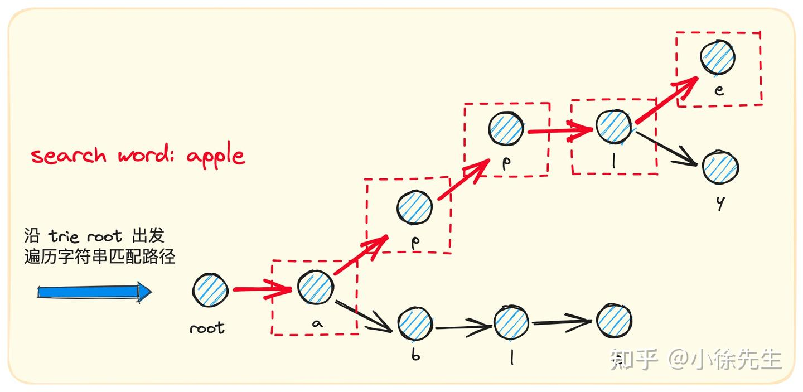

- https://git.internal.taqu.cn/code-camp/go-notes/-/tree/master/error-handling
# 多返回值
其他语言中，函数通常通过返回特殊值如-1、null、""等来表示错误或缺失的结果。这被称为“带内错误”（in-band errors）。使用 in-band 错误的主要问题是，需要调用者记住每次都要检查返回的特殊值。但这是...非常容易出错的。

- go支持多返回值，可以明确处理返回的错误
# Go 标准错误包error接口
- Go 语言为错误处理定义了一个标准模式，即 <font color="red">error 接口</font>
- 通过<font color="red">**Go 标准错误包 errors**</font> 提供的 New() 方法快速创建一个<font color="red"> error 类型的错误实例</font>
- fmt.Println(err), 打印错误信息时，直接传入了 err 对象实例，因为 Go 底层会<font color="red">自动调用 err 实例上的 Error() 方法返回错误信息并将其打印出来，就像普通类的 String() 方法一样。</font>

``` go
type error interface {
  Error() string
}
// Go 提供了一个默认实现
type errorString struct {
  s string
}

func (e *errorString) Error() string {
  return e.s
}
```
底层就是一个字符串结构体 errorString

``` go
// 一般这样返回错误 返回error类型
func Foo(param int) (n int, err error) { 
    // ...
    // err = errors.New("只支持非负整数相加")
}
n, err := Foo(0)

if err != nil { 
    // 错误处理 
} else {
    // 使用返回值 n 
}
```

# 更复杂的错误类型

1. 系统内置错误类型
Go 语言内置的很多包还封装了更复杂的错误类型。扩展了特定的信息,具体某个错误只要实现 Error()接口

- 以 os 包为例，这个包主要负责与操作系统打交道，所以提供了 LinkError、PathError、SyscallError 这些<font color="red">实现了 error 接口</font>的错误类型，以 PathError 为例
``` go
type PathError struct {
    Op   string
    Path string
    Err  error
}

// 错误类型除了组合 error 接口实现 Error() 方法外，
// 还提供了额外的操作类型字段 Op 和文件路径字段 Path 以丰富错误信息
func (e *PathError) Error() string { 
    return e.Op + " " + e.Path + ": " + e.Err.Error() 
}

// 获取指定路径文件信息，对应类型是 FileInfo
fi, err := os.Stat("test.txt") 
if err != nil {
    switch err.(type) {
    // 如果文件不存在，则返回 PathError 类型错误    
    case *os.PathError:
        // do something
    case *os.LinkError:
        // dome something
    case *os.SyscallError:
        // dome something
    case *exec.Error:
        // dome something
    }
} else {
    // ...
}
```

2. 自定义错误类型
仿照 PathError 的实现自定义一些复杂的错误类型，**只需要<font color="red">组合 error 接口并实现 Error() 方法</font>即可，然后按照自己的需要为自定义类型添加一些属性字段**

# wrapError 官方库
- wrapError本质也是一个 error ，并声明了一个 Unwrap 方法用于拆包装。 可以嵌套构建错误链
``` go
type wrapError struct {
  msg string
  err error
}

func (e *wrapError) Error() string {
  return e.msg
}

func (e *wrapError) Unwrap() error {
  return e.err
}
```
## fmt.Errorf与wrapError类型
0. 官方没有这样的函数，而是 fmt.Errorf 格式化时使用 %w
1. fmt.Errorf 用了占位符 %w 之后创建的就是 wrapError 类型
2.  %s 创建的就是 errorString 类型
``` go
var BaseErr = errors.New("the underlying base error")

func TestErrWrap(t *testing.T) {
	err1 := fmt.Errorf("wrap base: %w", BaseErr)
	fmt.Println(err1)
	err2 := fmt.Errorf("wrap err1: %w", err1) // %w 返回 wrapError类型
	fmt.Println(err2)
}

// 打印结果：
// wrap base: the underlying base error
// wrap err1: wrap base: the underlying base error
```
- fmt.Errorf 方法的源码
``` go
func Errorf(format string, a ...any) error {
  p := newPrinter()
  p.wrapErrs = true
  p.doPrintf(format, a) //  调用后，如果包含 %w 占位符则会先创建内层的 error ，赋值给 p.wrappedErr ，从而触发 wrapError 的创建逻辑
  s := string(p.buf)
  var err error
  if p.wrappedErr == nil {
   err = errors.New(s)
  } else {
   err = &wrapError{s, p.wrappedErr}
  }
  p.free()
  return err
}

func (p *pp) handleMethods(verb rune) (handled bool) {
	if p.erroring {
		return
	}
    // handleMethods 时特殊处理 w, 使用 wrapError 封装
	if verb == 'w' {
		err, ok := p.arg.(error)
		if !ok || !p.wrapErrs || p.wrappedErr != nil {
			p.wrappedErr = nil
			p.wrapErrs = false
			p.badVerb(verb)
			return true
		}
		p.wrappedErr = err
		verb = 'v'
	}
  ......
}
```
### 使用wrapError构建错误链
要么返回错误值，要么输出日志。每个函数中使用fmt.Errorf+%w将错误包装为一个wrapped error，并将前一层的错误作为参数传递。通过这种方式，我们构建了一个错误链，其中每个错误都包含了之前发生的错误上下文。
``` go
func main() {
 if err := topFunction(); err != nil {
  log.Printf("Error: %v", err)
 }
}

func topFunction() error {
 err := level1Function()
 if err != nil {
  log.Printf("topFunction: %v", err)
  return err
 }
 return nil
}

func level1Function() error {
 err := level2Function()
 if err != nil {
  log.Printf("level1Function: %v", err)
  return err
 }
 return nil
}

func level2Function() error {
 err := level3Function()
 if err != nil {
  log.Printf("level2Function: %v", err)
  return err
 }
 return nil
}

func level3Function() error {
 err := level4Function()
 if err != nil {
  log.Printf("level3Function: %v", err)
  return err
 }
 return nil
}

func level4Function() error {
 err := fmt.Errorf("something went wrong")
 log.Printf("level4Function: %v", err)
 return err
}

// $go run main.go 
// 2024/04/14 23:10:05 level4Function: something went wrong
// 2024/04/14 23:10:05 level3Function: something went wrong
// 2024/04/14 23:10:05 level2Function: something went wrong
// 2024/04/14 23:10:05 level1Function: something went wrong
// 2024/04/14 23:10:05 topFunction: something went wrong
// 2024/04/14 23:10:05 Error: something went wrong
``` 
- 通过 fmt.Errorf 方法配合 %w 占位符创建嵌套类型的 wrapError
``` go
func main() {
 if err := topFunction(); err != nil {
  log.Printf("Error: %v", err)
 }
}

func topFunction() error {
 err := level1Function()
 if err != nil {
  return fmt.Errorf("topFunction: %w", err)
 }
 return nil
}

func level1Function() error {
 err := level2Function()
 if err != nil {
  return fmt.Errorf("level1Function: %w", err)
 }
 return nil
}

func level2Function() error {
 err := level3Function()
 if err != nil {
  return fmt.Errorf("level2Function: %w", err)
 }
 return nil
}

func level3Function() error {
 err := level4Function()
 if err != nil {
  return fmt.Errorf("level3Function: %w", err)
 }
 return nil
}

func level4Function() error {
 err := fmt.Errorf("something went wrong")
 return fmt.Errorf("level4Function: %w", err)
}

// 2024/04/14 23:12:16 Error: topFunction: level1Function: level2Function: level3Function: level4Function: something went wrong
```

## errors.Is和errors.As
- 官方不推荐使用 error == xxx
- **<font color="red">总的来说，errors.Is函数用于判断错误是否与给定类型匹配，而errors.As函数则用于将错误转换为指定类型的变量。</font>**
  - 例如，假设有一个错误链，其中包含多个错误对象，可以使用errors.Is函数来判断错误链中是否存在某个特定类型的错误，而使用errors.As函数来将错误链中的某个错误转换为指定类型的变量，以便进一步处理该错误。
- 对包装过的error依然生效, 都是递归循环，拆包获取下一层error
- Is 是做的指针地址判断，如果错误 Error() 内容一样，但是根 error 是不同实例，那么 Is 判断也是 false

- 源码解析
``` go
// err 自己实现了 interface{ Is(error) bool } 接口，
func Is(err, target error) bool {
	if target == nil {
		return err == target
	}

	isComparable := reflectlite.TypeOf(target).Comparable()
	//for循环，把err一层层剥开，一个个比较，找到就返回true
	for {
		if isComparable && err == target {
			return true
		}
		// 通过接口断言，可以调用 Is 方法判断 err 是否与 target 相等。
		// 这里意味着你可以自定义error的Is方法，实现自己的比较代码
		if x, ok := err.(interface{ Is(error) bool }); ok && x.Is(target) {
			return true
		}
		// 否则递归调用 Unwrap 方法拆包装，返回下一层的 error 去判断是否与 target 相等。
		if err = Unwrap(err); err == nil {
			return false
		}
	}
}

// 递归调用，否则接口断言失败，返回 nil
func Unwrap(err error) error {
	u, ok := err.(interface {
		Unwrap() error
	})
	if !ok {
		return nil
	}
	return u.Unwrap()
}

var errorType = reflectlite.TypeOf((*error)(nil)).Elem()

// 提取指定类型的错误，判断包装的 error 链中，某一个 error 的类型是否与 target 相同，并提取第一个符合目标类型的错误的值，将其赋值给 target
func As(err error, target any) bool {
	// 一些判断，保证target，这里是不能为nil
	if target == nil {
		panic("errors: target cannot be nil")
	}
	val := reflectlite.ValueOf(target)
	typ := val.Type()
	// 这里确保target必须是一个非nil指针
	if typ.Kind() != reflectlite.Ptr || val.IsNil() {
		panic("errors: target must be a non-nil pointer")
	}
	targetType := typ.Elem()

	// 这里确保target是一个接口或者实现了error接口
	if targetType.Kind() != reflectlite.Interface && !targetType.Implements(errorType) {
		panic("errors: *target must be interface or implement error") // 要求 *target 是一个接口或者实现了 error 接口
	}
	// 上面代码部分是用来约束 target 参数的类型，要求其是一个非空的指针类型。
	for err != nil {
		// err 是否可以赋值给 target 所属类型，如果可以则赋值返回 true
		// 本质上，就是类型断言，这是反射的写法
		if reflectlite.TypeOf(err).AssignableTo(targetType) {
			val.Elem().Set(reflectlite.ValueOf(err))
			return true
		}
		// 通过接口断言，可以调用 As 方法判断
		//这里意味着你可以自定义error的As方法，实现自己的类型断言代码
		if x, ok := err.(interface{ As(any) bool }); ok && x.As(target) {
			return true
		}
		// 否则也是走递归拆包的逻辑。这里是遍历error链的关键，不停的Unwrap，一层层的获取err
		err = Unwrap(err)
	}
	return false
}
```
- 例子 errors.Is
``` go
var BaseErr = errors.New("the underlying base error")

func TestErrIs(t *testing.T) {
	err1 := fmt.Errorf("wrap base: %w", BaseErr)
	err2 := fmt.Errorf("wrap err1: %w", err1)
	println(err2 == BaseErr) // false
	if !errors.Is(err2, BaseErr) {
		panic("err2 is not BaseErr")
	}
	println("err2 is BaseErr")
}

// 打印结果：
// false
// err2 is BaseErr

```

- 例子 errors.As
``` go
type TypicalErr struct {
	e string
}

func (t TypicalErr) Error() string {
	return t.e
}

func TestErrAs(t *testing.T) {
	err := TypicalErr{"typical error"}
	err1 := fmt.Errorf("wrap err: %w", err)
	err2 := fmt.Errorf("wrap err1: %w", err1)
	var e TypicalErr
	if !errors.As(err2, &e) {
		panic("TypicalErr is not on the chain of err2")
	}
	println("TypicalErr is on the chain of err2")
	println(err == e)
}

// 打印结果：
// TypicalErr is on the chain of err2
// true

```
这两个函数的主要区别在于它们的返回值和用途。errors.Is函数返回一个布尔值，用于判断错误是否与给定类型匹配，而errors.As函数返回一个布尔值，同时会将错误的值赋给指定类型的变量。

- 容易踩坑的案例
``` go
type CustomError struct {
}
func (c *CustomError) Error() string {
	return "自定义错误"
}
func main() {
	var e error = nil
	var c *CustomError = nil
	e = c
	spew.Dump(
		e,
		e == nil, // 1 false
		c,
		c == nil, // 2 true
	)
}

// e == nil（1）：
//     e 是一个 error 接口变量，它的动态类型是 *CustomError，动态值是 nil。
//     由于动态类型不为 nil，因此 e == nil 的结果是 false。
// c == nil（2）：
//     c 是一个 *CustomError 类型的指针变量，它的值是 nil。
//     因此，c == nil 的结果是 true。

```
- 案例
``` go
type CustomError struct {
	Code int
	Msg  string
}
func (c *CustomError) Error() string {
	return fmt.Sprintf("自定义错误, code: %d, msg: %s", c.Code, c.Msg)
}
func Handle(content string) error {
	var e *CustomError
	if content != "" {
		return e // 容易踩坑的点
	}
	e = &CustomError{
		Code: 1,
		Msg:  "内容为空",
	}
	return e
}
func main() {
	c1 := "xx"
	err := Handle(c1)
	if err != nil {
		fmt.Printf("处理c1失败, err=%v\n", err)
	}
	c2 := ""
	err = Handle(c2)
	if err != nil {
		fmt.Printf("处理c2失败, err=%v\n", err)
	}
}
```

# errors.Join 多个错误
- 用于将多个错误组合成一个单一的错误值。这是 Go 错误处理机制在支持多错误（multi-error）方面的重要扩展。
- <font color="red">1.20引入 代替fmt.Errorf</font>
  
- https://github.com/uber-go/multierr 社区库(知道下就行)
``` go
// 把Func1和Func2的error一起输出
err := errors.New( "error from Func1") 
return fmt.Errorf("error from Func2: %W" err)

func Func2() error { 
    err := Func1() 
    if err != nil { 
        return errors.Join(err, errors.New("error from Func2" )) 
    } 
    return nil
}
```

# wrapError 第三方库
- 当前 error 的问题有两点：
   - <font color="red">当 go1.13 后，标准库 errors 增加了 Wrap, Is 和 As 等功能,但是没有提供增加调用栈的方法.</font>
   - 无法 wrap 更多的信息，比如调用栈，比如层层封装的 error 消息 
   - 无法很好的处理类型信息，比如我想知道错误是 io 类型的，还是 net 类型的
- https://github.com/pkg/errors 第三方库 (错误要有调用栈信息时用) 
   - 目前此项目已归档，除非非常早期的项目，不再推荐使用。
   - Wrap 封装底层 error, 增加更多消息，提供调用栈信息，这是原生 error 缺少的
   - WithMessage 封装底层 error, 增加更多消息，但不提供调用栈信息
   - Cause 返回最底层的 error, 剥去层层的 wrap
``` go
import (
   "database/sql"
   "fmt"

   "github.com/pkg/errors"
)

func foo() error {
   return errors.Wrap(sql.ErrNoRows, "foo failed")
}

func bar() error {
   return errors.WithMessage(foo(), "bar failed")
}

func main() {
   err := bar()
   if errors.Cause(err) == sql.ErrNoRows {
      fmt.Printf("data not found, %v\n", err)
      fmt.Printf("%+v\n", err)
      return
   }
   if err != nil {
      // unknown error
   }
}
// 打印输出
// data not found, bar failed: foo failed: sql: no rows in result set
// sql: no rows in result set
// foo failed
// main.foo
//     /usr/three/main.go:11
// main.bar
//     /usr/three/main.go:15
// main.main
//     /usr/three/main.go:19
// runtime.main
//     ...

```
- 源码分析
``` go
type withStack struct {
	error
	*stack
}

// 生成 warapper error
func Wrap(err error, message string) error {
	if err == nil {
		return nil
	}
	err = &withMessage{
		cause: err,
		msg:   message,
	}
	return &withStack{
		err,
		callers(),
	}
}

func (w *withStack) Cause() error { return w.error }

func Cause(err error) error {
	type causer interface {
		Cause() error
	}

	for err != nil {
		cause, ok := err.(causer)
		if !ok {
			break
		}
		err = cause.Cause()
	}
	return err
}
```


# defer语句
Go 语言中的类没有构造函数和析构函数的概念，处理错误和异常时也没有提供 try...catch...finally 之类的语法，那当我们想要在某个资源使用完毕后将其释放（网络连接、文件句柄等），或者在代码运行过程中抛出错误时执行一段兜底逻辑

- 通过 defer 关键字<font color="red">声明兜底执行或者释放资源的语句</font>, 相当于php的析构和finally
- 一个函数/方法中可以存在多个 defer 语句, defer 语句的<font color="red">调用顺序入栈出栈</font>，执行顺序是从后往前执行
- defer执行的时机, 禁止在循环中使用 defer。实在想使用：将循环里的逻辑使用匿名函数封装，这样就可以在每次匿名函数结束后调用一次)

``` go
// 不要这样使用
func filterSomething(values []string) {
    for _, v := range values {
        fields, err := db.Query(v) // 示例，实际不要这么查询，防止sql注入
        if err != nil {
            // xxx
        }
        defer fields.Close() // 1. 预期是每次循环都调用一次，但实际是在循环结束后才会被调用一次
        // 继续使用fields
    }
}

// 应当使用如下的方式：
func filterSomething(values []string) {
    for _, v := range values {
        func() {
            fields, err := db.Query(v) // 示例，实际不要这么查询，防止sql注入
            if err != nil {
            ...
            }
            defer fields.Close() // 2. 将 循环里的逻辑使用匿名函数封装，这样就可以在每次匿名函数结束后调用一次 defer db.Close()
            // 继续使用fields
        }()
    }
}
```
- 运行时抛出错误会中断后面代码的执行，也就**感知不到后面的 defer 语句。**
- <font color="red">调用时匿名函数时，有闭包，引用外部变量时，以当时值为准</font>, defer后面的函数在入栈的时候保存的是入栈那一刻的值，而当时x的值是10,后期对传入参数修改，并不会影响栈内函数的值


``` go
// 延迟执行函数defer 通常用于清理某些资源和处理某些异常
// return之后的语句先执⾏，defer后的语句后执⾏
// 在一个函数中,如果有多个 defer 那它的执行顺序是从后往前执行 入栈出栈，后期对传入参数修改，并不会影响栈内函数的值
var tmpStr string = "hello world"

// panic 程序异常中断,在go里面代表了不可修复的错误,在go中defer在panic之后也是会执行的, 但是注册在panic代码前面的财执行，且值为当时的传入值
func TestDefer(t *testing.T) {
	defer func() {
		fmt.Println("clear resources.", tmpStr)
	}()

	x := 10
	defer func(x int) {
		x++
		jbStr := "city"
		tmpStr = tmpStr + " 修改全局变量tmpStr" //
		fmt.Println(tmpStr, jbStr)

		fmt.Println("defer ", x) // 11
	}(x) //这里调用了x变量 defer后面的函数在入栈的时候保存的是入栈那一刻的值，而当时x的值是10，所以后期对x修改，并不会影响栈内函数的值

	x += 5
	fmt.Println("cur", x) // cur 15
	// x = x/0
	//panic("err") // panic后面的代码不会跑，包括后面才注册的defer
	// returnAndDeferFunc()

	fmt.Println(tmpStr) // hello world 正常执行下来的

}
```
- return之后的语句先执⾏(返回值已经赋值了,如果返回的是引用就会受到影响)，defer后的语句后执⾏
``` go
var testInt int

func TestOrder(t *testing.T) {
	testInt := returnAndDeferFunc()
	fmt.Println(testInt) // 输出2
}

func deferFunc() {
	fmt.Println("defer func called...")
	testInt = 1
	fmt.Printf("defer func called...testInt:%d\n", testInt)
}

func returnFunc() int {
	fmt.Println("return func called...")
	testInt = 2
	fmt.Printf("return func called...testInt:%d\n", testInt)
	return testInt
}

// return之后的语句先执⾏（返回值变量已经赋值，后续defer里再更改不会影响，除非返回值变量是指针），defer后的语句后执⾏
func returnAndDeferFunc() int {
	defer deferFunc()

	return returnFunc()
}

// return func called...
// return func called...testInt:2    return先接收返回值2 保存下来了
// defer func called...
// defer func called...testInt:1
// 2 return后续的defer 影响不到已保存的返回值
```
## 使用小技巧
- 打印执行耗时

- 实现在另一个函数的开头和结尾处执行一个函数


# panic函数
- 对于某些运行时错误，比如数组越界、除数为0、空指针引用

当代码运行时出错，而又没有在编码时显式返回错误时，Go 语言会抛出 panic，中文译作「运行时恐慌」，我们也可以将其看作 Go 语言版的异常
- 在代码中显式抛出 panic
- <font color="red">panic 函数支持的参数类型是 interface{} , func panic(v interface{})</font>

- 不可恢复的错误：如逻辑断言失败、程序状态异常等。
- 标准库中的panic：例如regexp.MustCompile在正则表达式无效时会触发panic。
  
## panic信息
当遇到 panic 时，Go 语言会<font color="red">中断当前协程（即 main 函数）后续代码的执行</font>，然后执行在<font color="red">中断代码之前定义的 defer 语句</font>（按照先入后出的顺序），最后**程序退出并输出 panic 错误信息**，以及出现错误的堆栈跟踪信息
  - 第一行表示出问题的协程，
  - 第二行是问题代码所在的包和函数，
  - <font color="red">第三行是问题代码的具体位置</font>
  - 最后一行则是程序的退出状态
``` go
package main

import "fmt"

func main() {
    defer func() {
        fmt.Println("代码清理逻辑")
    }()

    var i = 1
    var j = 0
    if j == 0 {
        panic("除数不能为0！")
    }
    k := i / j
    fmt.Printf("%d / %d = %d\n", i, j, k)
}
```


- 例子1
``` go
goroutine 554286 [running]: // 第一行
runtime.throw({0x133cbd3?, 0x12171a0?})
    /usr/local/go/src/runtime/panic.go:992 +0x71 fp=0xc0007f87e0 sp=0xc0007f87b0 pc=0x4382f1
runtime.mapassign_faststr(0x1141520, 0xc000bac0f0, {0x1351d36, 0x1}) // 第二行
    /usr/local/go/src/runtime/map_faststr.go:295 +0x38b fp=0xc0007f8848 sp=0xc0007f87e0 pc=0x41342b
smart-admp/internal/biz.(*DailyCostUseCase).checkTask(0xc000a13630, {0x156d478, 0xc000c6a8a0}, 0xc000efa4f0, 0xc00066ab60, 0x5?, 0xc000c6a930?, 0xc000c6b350?, 0xc000bac000?, 0xc000bac030, ...) // // 第三行 问题代码的具体位置，如果在调用栈上没有找到任何 recover() 语句,panic 会继续向外传播,直到到达该 Goroutine 的入口点。
    /builds/tuiguang/smart-admp/internal/biz/daily_cost.go:336 +0xe46 fp=0xc0007f8f70 sp=0xc0007f8848 pc=0xf83ce6
smart-admp/internal/biz.(*DailyCostUseCase).BatchCheck.func2()
    /builds/tuiguang/smart-admp/internal/biz/daily_cost.go:159 +0x65 fp=0xc0007f8fe0 sp=0xc0007f8f70 pc=0xf82805
runtime.goexit() // 第四行程序的退出状态
    /usr/local/go/src/runtime/asm_amd64.s:1571 +0x1 fp=0xc0007f8fe8 sp=0xc0007f8fe0 pc=0x4684e1
created by smart-admp/internal/biz.(*DailyCostUseCase).BatchCheck
    /builds/tuiguang/smart-admp/internal/biz/daily_cost.go:159 +0xd7f
    
```
- 例子二


## panic 的传播:
  - 当一个 Goroutine 执行 panic 时,panic 会向上冒泡,传递到该 Goroutine 的调用栈顶。
  - 如果在调用栈上没有找到任何 recover() 语句,panic 会继续向外传播,直到到达该 Goroutine 的入口点。
  - <font color="red">如果该 Goroutine 是主 Goroutine,panic 会导致整个程序崩溃。</font>
  - 如果该 Goroutine 是一个非主 Goroutine,panic 会导致该 Goroutine 终止,但不会影响其他 Goroutine。

# recover() 函数
通过 recover() 函数对 panic 进行捕获和处理，<font color="red">从而避免程序崩溃然后直接退出，而是继续可以执行后续代码，实现类似PHP 中 try...catch 语句的功能。</font>
- 这个 panic 的捕获应该<font color="red">放到 defer 语句中</font>完成，才可以在抛出 panic 时通过 recover 函数将其捕获，**defer 语句执行完毕后，会退出抛出 panic 的当前函数**
``` go
defer func() {
    if err := recover(); err != nil {
        fmt.Printf("Runtime panic caught: %v, stacktrace#%s\n", err, string(debug.Stack())
    }
}()
```
- 通过 recover() 函数<font color="red">捕获了 panic，并打印捕获到的错误信息，这个时候，**程序会退出函数而不是整个应用**</font>
- 调用 defer 语句声明的匿名函数，如果没有panic发生，那么recover() 函数返回值为 nil，不会执行 if 分支代码
**类比为 panic、recover、defer 组合起来实现了传统面向对象编程异常处理的 try…catch…finally 功能。**

## 使用场景
- *<font color="red">只有在希望在某个 Goroutine 出现 panic 时,能够优雅地恢复或处理它,而不是让整个程序崩溃时,才需要使用 recover()。</font>
- 常见的使用场景包括:
  - 在 HTTP 服务器的处理程序中使用 recover(),以防止单个请求导致整个服务器崩溃。
  - 在长期运行的 Goroutine 中使用 recover(),以确保它们不会因为 panic 而退出。
  - 在某些关键的业务逻辑中使用 recover(),以防止局部错误导致整个系统失败。
``` go
func myHandler(w http.ResponseWriter, r *http.Request) {
    defer func() {
        if r := recover(); r != nil {
            log.Printf("Recovered from panic: %v\n%s", r, debug.Stack())
            http.Error(w, "Internal Server Error", http.StatusInternalServerError)
        }
    }()

    // 处理请求的逻辑
}
```

## 开新协程就要捕捉

- 在协程里，没有 recover 的话，空指针异常就直接导致 程序退出了（也是 panic 的一种，只是为了和上面直接 panic 做区别）
  - 协程里的 recover 只能处理本协程的 panic，协程里再开协程，子协程实际上也是从属于 main 协程的
  - **<font color="red">协程必须自己 recover panic，不然没有 recover 的 panic 会 pop 到 main 协程（main 协程是 go 直接管控的，它不会进行 recover 处理（程序就会退出），导致程序退出</font>**

# Fatal等价os.Exit(1) 来退出程序
- fatal 是 log 包中的一个函数,它会打印出错误信息并立即终止程序的执行。
- fatal 函数内部实际上是调用了 os.Exit(1) 来退出程序。
- 使用 fatal 函数,程序会以非零的退出码退出,表示程序运行失败
``` go
func main() {
        host := flag.String("host", "127.0.0.1", "监听地址")
        port := flag.Int("port", 8080, "监听端口")
        appName := flag.String("name", "", "服务名")
        flag.Parse()

        if *appName == "" {
                log.Fatalln("服务名未定义") // 内部调用os.Exit(1) 来退出程序。
        }

        fmt.Println(*host, *port, *appName)
}
```
## 使用场景
- fatal: 当遇到无法继续执行的严重错误时使用,比如无法连接数据库、无法打开文件等。这种情况下,程序无法继续运行,需要立即终止并反馈给调用方。
- panic: 当遇到无法预料的、程序无法继续运行的错误时使用,比如数组越界、除以零等。这种情况下,可以使用 panic 中断程序的执行,并由上层的 recover 来处理


# 多协程的错误处理，标准库errgroup
- <font color="red">并发场景下，如果一个 goroutine 有错误，那么就要提前返回，并取消其它并行的请求</font>
- 底层使用 context 来 cancel 其它请求，同步使用 WaitGroup, 原理非常简单

errgroup包提供了一种方便的方式来跟踪和处理多个goroutine中的错误。它可以让你启动多个goroutine，并等待它们全部完成，或者在任何一个goroutine返回错误时立即取消所有其他goroutine。


## 使用注意
1. context 是谁传进来的？其它代码会不会用到，cancel 只能执行一次，瞎比用会出问题
2. g.Go 不带 recover 的，为了程序的健壮，一定要自行 recover
3. 并行的 goroutine 有一个错误就返回，而不是普通的 fan-out 请求后收集结果

# 实际处理
1. error 与 panic
理论上 panic 只存在于 server 启动阶段，比如 config 文件解析失败，端口监听失败等等，所有业务逻辑禁止主动 panic
所有异步的 goroutine 都要用 recover 去兜底处理
2. 错误处理与资源释放
``` go
// 一般异步组装数据，都要分别启动 goroutine, 然后把结果通过 channel 返回，result 结构体拥有 err 字段表示错误
func worker(done chan error) {
    err := doSomething()
    result := &result{}
    if err != nil {
        result.Err = err
    }
    done <- result
}
```
要注意，main 函数中 done channel 千万不能 close, 因为你不知道 doSomething 会超时多久返回，写 closed channel 直接 panic
- **<font color="red">准则：数据传输和退出控制，需要用单独的 channel 不能混, 我们一般用 context 取消异步 goroutine, 而不是直接 close channels</font>**

3. error 级联使用问题(重复使用)
``` go
type myError struct {
	string
}

func (i *myError) Error() string {
	return i.string
}

func Call1() error {
	return nil
}

func Call2() *myError {
	return nil
}

func main() {
	err := Call1()
	if err != nil {
		fmt.Printf("call1 is not nil: %v\n", err)
	}

	err = Call2() // 复用 err 变量的情况下， Call2 返回的 error 是自定义类型
    // 导致经典的 error is not nil, but value is nil
	if err != nil {
		fmt.Printf("call2 err is not nil: %v\n", err)
	}
}
```
-  解决方法就是 Call2 err 重新定义一个变量 err2 = Call2()

4. 不要并发对 error 赋值
go 内置类型除了 channel 大部分都是非线程安全的，error 也不例外
``` go
package main
import (
   "fmt"
   "github.com/myteksi/hystrix-go/hystrix"
   "time"
)
var FIRST error = hystrix.CircuitError{Message:"timeout"}
var SECOND error = nil
func main() {
   var err error
   // 并发对 error 赋值 error非线程安全
   go func() {
      i := 1
      for {
         i = 1 - i
         if i == 0 {
            err = FIRST
         } else {
            err = SECOND
         }
         time.Sleep(10)
      }
   }()
   for {
      if err != nil {
        // 进来后 err又被并发赋值成nil了
         fmt.Println(err.Error())
      }
      time.Sleep(10)
   }
}
//  一开始安全 但是执行一会还是会报panic 空指针

// hystrix: timeout
// panic: value method github.com/myteksi/hystrix-go/hystrix.CircuitError.Error called using nil *CircuitError pointer

// goroutine 1 [running]:
// github.com/myteksi/hystrix-go/hystrix.(*CircuitError).Error(0x0, 0xc0000f4008, 0xc000088f40)
//  <autogenerated>:1 +0x86
// main.main()
//  /Users/zerun.dong/code/gotest/panic.go:25 +0x82
// exit status 2
```
- 只要跑一会，就一定发生 panic, 本质就是 error 接口类型不是并发安全的
``` go
// 没有方法的interface
type eface struct {
    _type *_type
    data  unsafe.Pointer
}
// 有方法的interface
type iface struct {
    tab  *itab
    data unsafe.Pointer
}
```
5. 打印调用栈
官方库无法 wrap 调用栈，所以 fmt.Errorf %w 不如 pkg/errors 库实用，但是 errors.Wrap 最好保证只调用一次，否则全是重复调用栈

6. pipeline 处理
``` go
_, err = fd.Write(p0[a:b])
if err != nil {
    return err
}
_, err = fd.Write(p1[c:d])
if err != nil {
    return err
}
_, err = fd.Write(p2[e:f])
if err != nil {
    return err
}
// and so on
// 上面是原始例子，需要一直做 if err != nil 的判断

// 优化后
type errWriter struct {
    w   io.Writer
    err error
}

func (ew *errWriter) write(buf []byte) {
    if ew.err != nil {
        return
    }
    _, ew.err = ew.w.Write(buf)
}

// 使用时
ew := &errWriter{w: fd}
ew.write(p0[a:b])
ew.write(p1[c:d])
ew.write(p2[e:f])
// and so on
if ew.err != nil {
    return ew.err
}
```

# 日志的处理经验
todo: b站视频总结下

一个错误应该只被处理一次。记录日志本身就是一种处理行为。所以，一个错误要么被记录（log），要么被向上传递（propagate），不要同时做两者。