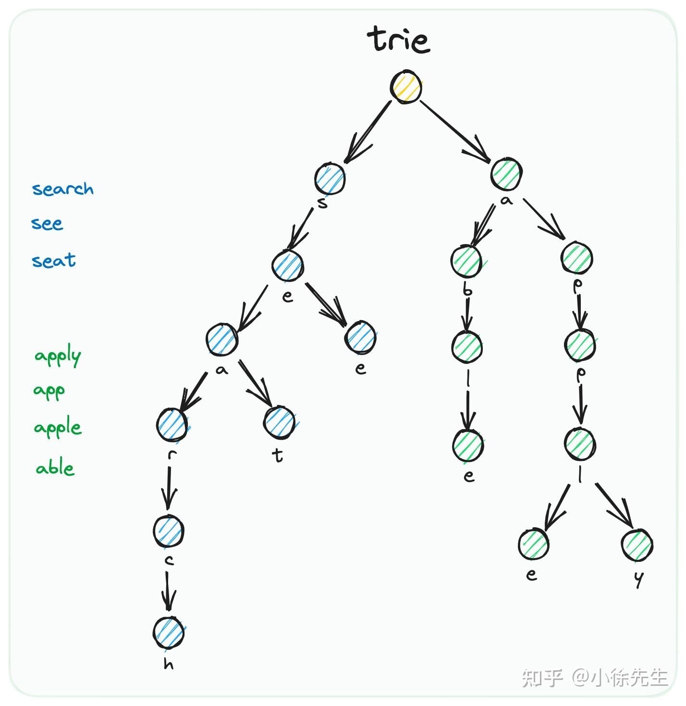

# 概括
- [源码解析](https://github.com/zmk-c/GolangGuide/blob/master/golang/deep/channel.md)

- **通道：协程通信方式, goroutine 间架起了一条管道，在管道里传输数据 <font color="red">chan是一种数据类型(引用类型)，并发安全的</font>，我们可以使用它在多个 goroutine 之间传递消息，而不必担心通道中的值被污染还能影响 goroutine 的阻塞和唤醒。**
- 跨进程通信，建议通过分布式系统的方法来解决，比如使用 Socket 或者 HTTP 等通信协议
- Goroutine 和 channel 是 Go 语言并发编程的两大基石。Goroutine 用于执行并发任务，channel 用于 goroutine 之间的同步、通信。

## **<font color="red">不要通过共享内存来通信，而要通过通信来实现内存共享</font>**

<font color="red">前面半句说的是通过 sync 包里的一些组件进行并发编程；而后面半句则是说 Go 推荐使用 channel 进行并发编程。</font>两者其实都是必要且有效的。实际上看完本文后面对 channel 的源码分析，你会发现，<font color="red">channel 的底层就是通过 sync.Mutex 来控制并发的。只是 channel 是更高一层次的并发编程原语，封装了更多的功能。</font> context是通过channel实现

channel能替代sync.Mutex，而sync.Mutex不能替代channel

channel在golang中的关键字为chan，对 chan 的发送和接收操作都会在编译期间转换成为底层的发送接收函数。

# 声明
- 声明通道类型本身外，还要声明通道中传递数据的类型
- 关键字chan, 一个通道只能传递一种类型的值
- make 关键字声明,分配内存了, 第二个参数，表示通道的容量
- 先进先出（FIFO）的队列
- 通道元素的发送和接收都可以通过 <- 操作符来实现
- **<font color="red">往通道写入数据和从通道接收数据都是原子操作，或者说是同步阻塞的。 可以实现和「共享内存+锁」一样的效果</font>**
  - 通道的发送和接收操作是互斥的，同一时间同一个进程内的所有协程对某个通道只能执行发送或接收操作，两者不可能同时进行，这样就保证了并发的安全性，数据不可能被污染。
``` go
//  src/runtime/chan.go
type hchan struct {
	qcount   uint           // chan队列中的元素个数
	dataqsiz uint           // 底层循环队列的长度
	buf      unsafe.Pointer //※ 指向底层循环队列的长度  只针对有缓存的chan
	elemsize uint16 // chan中元素大小
	closed   uint32 // chan是否被关闭
	elemtype *_type // chan中元素类型
	sendx    uint   //※ 已发送在循环队列中的索引，指向底层循环队列
	recvx    uint   //※ 已接收在循环队列中的索引，指向底层循环队列
	recvq    waitq  //※等待接收的goroutine队列，阻塞的goroutine
	sendq    waitq  //※等待发送的goroutine队列，阻塞的goroutine

	// 保护chan中所有字段  保证每个读 channel 或写 channel 的操作都是原子的
	lock mutex
}
```

``` go
// var chs []chan int
// var chs chan string

ch := make(chan int)
ch <- 1  // 表示把元素 1 发送到通道 ch
element := <-ch // 指定变量接收元素值
<-ch  // 留空表示忽略
```

# 通道类型
ch := make(chan int, 10)
- 用于指定通道最多可以缓存多少个元素，默认值是 0，此时通道可以被称作<font color="red">非缓冲通道</font>，表示往通道中发送一个元素后，只有该元素被接收后才能存入下一个元素

- 当缓存值大于 0 时，通道可以称作<font color="red">缓冲通道</font>，即使通道元素没有被接收，也可以继续往里面发送元素，<font color="red">直到超过缓冲值</font>，才会阻塞当前协程，直到通道被其他协程读取,显然设置这个缓冲值可以提高通道的操作效率。尤其是在需要持续传输大量数据的场景。


**demo 消息的传递和有缓冲的为啥要关闭以及range**
``` go
// 同步阻塞channel make(chan Type)
// 带缓冲的阻塞  make(chan Type, int)
// channel <- val 输入数据
// <- channel 接收数据并丢弃
// x := <- channel 接收数据, 并赋值给x
// x, ok := <- channel 接收数据, 并赋值给x，同时检测通道是否为空或者已关闭

// range 通道 相当于替换for的简洁写法

// 无缓冲的同步阻塞
func TestX(t *testing.T) {
	c := make(chan int)
	go func() {
		defer fmt.Println("goroutine stop")
		fmt.Println("goroutine running")
		c <- 66 // 如果外部没有接收 就会同步阻塞 stop是在num赋值后继续执行的
	}()
	fmt.Println("main receive before")
	num := <-c // 同时也同步阻塞在等chan输入数据
	fmt.Println("num = ", num)
}

// 有缓冲的
func TestB(t *testing.T) {
	c := make(chan int, 3)

	go func() {
		defer fmt.Println("goroutine stop")
		fmt.Println("goroutine running")
		for i := 1; i <= 6; i++ {
			fmt.Println("goroutine input=", i)
			c <- i // （容量满3个）开始阻塞 到i=4的时候阻塞，等
		}
		// 关闭后 还能从chan c读取数据 直到读到关闭
        // 而且如果是容量刚好是6 一下子子协程就结束了，不close的话，main也会一直等待，不知道子协程结束了,从nil chan读取会panic
		close(c) // 必须关闭 ok==false , 不然就是 零值, true 一直死循环
	}()

	fmt.Println("main receive before")
	// 死循环 一直获取
	for {
		// 加上超时可以看出缓冲容量的作用
		time.Sleep(2 * time.Second)
		if num, ok := <-c; ok {
			fmt.Println("num = ", num)
		} else {
			break
		}
	}
	// 简化成
	// for num := range c {
	// 	fmt.Println("num = ", num)
	// 	time.Sleep(2 * time.Second)
	// }
	fmt.Println("main receive stop")
}
```

# 关闭通道 close
- channel不像⽂文件⼀一样需要经常去关闭，只有当你确实没有任何发送数据了了，或者你想显式的结 束range循环之类的，才去关闭channel;
  - 必须输入数据方（单独一个，不能多个同时），进行关闭， <font color="red">读取方ok==false , 不然就是 零值, true 一直死循环</font>, 如果容量刚好读取者也会一直等待，不知道输入者协程结束了。
  - 如果在接收一方关闭，因为接收方不知道发送方什么时候执行完毕。发送方再往关闭的通道发消息会panic
  - **重点：<font color="red">发送方结束一定要提前关通道（通知接收方）</font>**
- 关闭channel后，无法向channel 再发送数据(引发 panic 错误后导致接收⽴立即返回零值)
  - <font color="red">从一个空的通道接收数据会报如下运行时错误（死锁）</font> fatal error: all goroutines are asleep - deadlock!
  - 关闭通道的操作只能执行一次，试图关闭已关闭的通道会引发 panic
- 关闭的有缓冲的channel，还能从chan按顺序读取数据
- 对于nil channel，⽆无论收发都会被阻塞。

``` go
package main

import (
    "fmt"
    "time"
)

func test(ch chan int)  {
    for i := 0; i < 100; i++ {
        ch <- i
    }
    close(ch) // 显式关闭通道 只能在发送数据的一方关闭
}

func main()  {
    start := time.Now()
    ch := make(chan int, 20)
    go test(ch)
    // 接收数据 发送方结束一定要提前关通道（通知接收方）
    for i := range ch {
        fmt.Println("接收到的数据:", i)
    }

    end := time.Now()
    consume := end.Sub(start).Seconds()
    fmt.Println("程序执行耗时(s)：", consume)
}
```
- <font color="red">channel是并发安全的，且close时都能接收到，如果只是输入数据，就只有一个抢到,channel 只能一个输入方关闭, 但是能有多个读取</font>
``` go
func isCancelled(cancelChan chan struct{}) bool {
	//多路选择
	select {
	case v, ok := <-cancelChan: //关闭时 也有数据 {},false
		// 发消息时 因为返回true 然后跳出循环
		fmt.Println(v, ok, "msg")
		return true
	default:
		return false
	}
}

func cancel_1(cancelChan chan struct{}) {
	cancelChan <- struct{}{} //发消息{}
}

func cancel_2(cancelChan chan struct{}) {
	close(cancelChan) //关闭广播 {}
}

func TestCancel(t *testing.T) {
	// 有缓冲的chan
	cancelChan := make(chan struct{}, 1) //等待chan接收

	for i := 0; i < 4; i++ {
		//5个协程 channel等待中
		go func(i int, cancelCh chan struct{}) {
			//循环中 死循环呢
			for {
				if isCancelled(cancelCh) { //等到有数据就跳出循环
					break
				}
				time.Sleep(time.Millisecond * 5)
			}
			fmt.Println(i, "Cancelled") // 打印出哪个子协程抢到的
		}(i, cancelChan)
	}
	// cancel_1(cancelChan) //发消息 只有一个chan收到 其他都走select了default
	cancel_2(cancelChan) //close 所有chann都收到

	time.Sleep(time.Second * 1)
}

```


# 单向通道
- <font color="red">一般在使用层面对通道进行限制</font>,单向通道的作用是约束在生产协程中只能发送数据到通道，而在消费协程中只能从通道接收数据
- 避免误操作和通道使用的混乱，让代码更加稳健。
- 可以像声明正常通道类型那样声明单向通道，但我们一般不这么做，因为这样一来，就是<font color="red">从语法上限定通道的操作类型</font> 所以在传参的时候进行类型定义 chan Type  只写chan<- Type 和只读 <-chan Type
- 双向通道可以转化为任意类型的单向通道，但单向通道不能转化为双向通道，读写通道之间也不能相互转化。
``` go
ch1 := make(chan int) 
ch2 := <-chan int(ch1)
ch3 := chan<- int(ch1)
```
- 定义一个返回值类型为单向只读通道的函数，以便得到该返回值的代码只能从通道中接收数据
- 关闭通道只是不能写入了 值是可以返回的
``` go
func test() <-chan int {
    ch := make(chan int, 20)
    for i := 0; i < 100; i++ {
        ch <- i // 写入
    }
    close(ch) // close 不执行的话 从空通道接收数据 会fatal
    // 关闭通道只是不能写入了 值是可以返回的
    return ch
}
// 不过test函数的循环不能太大(为啥？) 否则爆错:fatal error: all goroutines are asleep - deadlock!
// 并且只能接收第一个存入的值
ch := <- test() 
```

# select 等待通道就绪
- 单流程下⼀个go只能监控⼀个channel的状态，select可以完成监控多个channel的状态<font color="red">作用：具备监听多路channel状态的功能</font>
- 通过 select 分支语句选择指定分支代码执行,每个 case 语句必须是一个通道操作，要么是发送数据到通道，要么是从通道接收数据，此外 select 语句也支持 default 分支
- select 语句的特点是<font color="red">只要其中一个 case 对应的通道操作已经完成，程序就会继续往下执行，而不会考虑其他 case 的情况</font>
- 没写default就阻塞到上面条件有一个符合
- 经常配合for select循环使用
- <font color="red">用来进行超时控制，额外监听一个定时器的chan case <-time.After(time.Millisecond * 1000): </font>

``` go
select { 
    case <-chan1:
        // 如果从 chan1 通道成功接收数据，则执行该分支代码
    case chan2 <- 1:
        // 如果成功向 chan2 通道成功发送数据，则执行该分支代码 
    default:
        // 如果上面都没有成功，则进入 default 分支处理流程 没写default就阻塞到上面条件有一个符合
}
```
借鉴自 Unix 的 select() 函数，在 Unix 中，可以通过调用 select() 函数来监控一系列的文件句柄，一旦其中一个文件句柄发生了 IO 动作，该 select() 调用就会被返回

两个 case 的执行不是 if...else... 那种先后关系，而是会并发执行，然后 <font color="red">select 会选择先操作成功返回的那个 case 分支去执行</font>，如果两者同时返回，则随机选择一个执行，**如果这两者都没有返回，则进入 default 分支**，这里也不会出现阻塞，如果 chan1 通道为空，或者 chan2 通道已满，就会立即进入 default 分支，<font color="red">但是如果没有 default 语句，则会**阻塞直到某个通道操作成功**</font>。

- 配合for 循环
  - select 语句只能对其中的每一个 case 表达式各求值一次，如果我们想连续操作其中的通道的话，需要 <font color="red">通过在 for 语句中嵌入 select 语句的方式来实现</font>
  - <font color="red">**在 select 语句的分支中使用 break 语句，只能结束当前的 select 语句的执行**，而并不会对外层的 for 语句产生作用，如果 for 循环本身没有退出机制的话会无休止地运行下去</font>


``` go
func main()  {
    chs := [3]chan int{
        make(chan int, 3),
        make(chan int, 3),
        make(chan int, 3),
    }

    index1 := rand.Intn(3)  // 随机生成0-2之间的数字
    fmt.Printf("随机索引/数值: %d\n", index1)
    chs[index1] <- rand.Int()   // 向通道发送随机数字

    index2 := rand.Intn(3)
    fmt.Printf("随机索引/数值: %d\n", index2)
    chs[index2] <- rand.Int()

    index3 := rand.Intn(3)
    fmt.Printf("随机索引/数值: %d\n", index3)
    chs[index3] <- rand.Int()

    // 哪一个通道中有值，哪个对应的分支就会被执行
    for i := 0; i < 3; i++ {
        select {
        case num, ok := <- chs[0]:
            if !ok {
                break // 只能结束当前的 select 语句的执行
            }
            fmt.Println("第一个条件分支被选中: chs[0]=>", num)
        case num, ok := <- chs[1]:
            if !ok {
                break
            }
            fmt.Println("第二个条件分支被选中: chs[1]=>", num)
        case num, ok := <- chs[2]:
            if !ok {
                break
            }
            fmt.Println("第三个条件分支被选中: chs[2]=>", num)
        default:
            fmt.Println("没有分支被选中")
        }
    }
}
```

## 实现管道的非阻塞操作
- select + default的组合还可以实现管道的非阻塞操作
``` go
// 编译器实现
// select + default语法如下：
//    select {
//    case c <- v:
//        ... foo
//    default:
//        ... bar
//    }
// 编译器转化后的代码如下
//    if selectnbsend(c, v) {
//        ... foo
//    } else {
//        ... bar
//    }
//
// 函数selectnbsend的实现如下：
func selectnbsend(c *hchan, elem unsafe.Pointer) (selected bool) {
    return chansend(c, elem, false, getcallerpc()) // 第三个输入参数是bool类型：true表示如果不可写，阻塞用户协程；false表示始终不阻塞用户协程。
}
```
- demo
``` go
func main() {
    queue := make(chan int, 0) // 变量queue是无缓冲管道
    for i := 0; i < 10; i ++ {
        select {
        case queue <- i:
            fmt.Println("insert: " + strconv.Itoa(i))
        default:
            fmt.Println("skip: " + strconv.Itoa(i))
        }
    }
}
```
  
## 超时处理机制实现
select实现会接受 超时信号写入的通道timeout, 然后无default分支，会阻塞等待下去，因为ch通道还没数据,<font color="red">避免通道通信超时的最有效方法。</font>

``` go
package main

import (
    "fmt"
    "time"
)

func main()  {
    // 初始化 ch 通道
    ch := make(chan int, 1)

    // 初始化 timeout 通道
    timeout := make(chan bool, 1)
    // 如果没有以下超时机制
    // <- ch 直接报错，从一个空的通道接收数据会报如下运行时错误（死锁）
    // fatal error: all goroutines are asleep - deadlock!

    // 实现一个匿名超时等待函数
    go func() {
        time.Sleep(1e9)  // 睡眠1秒钟
        timeout <- true
    }()

    // 借助 timeout 通道结合 select 语句实现 ch 通道读取超时效果
    select {
        case <- ch:
            fmt.Println("接收到 ch 通道数据")
        case <- timeout:
            fmt.Println("超时1秒，程序退出")
        // case <-time.After(time.Millisecond * 1000):
        //     fmt.Println("超时1秒，程序退出")
    }
}
```
# 通道使用过程中的错误和异常处理
通道panic和阻塞死锁
## 避免对已关闭通道进行操作
- 收到其他协程关闭通道的通知 num, ok := <-ch
- 约定只能在发送方关闭通道，而在接收方，我们则<font color="red">通过通道接收操作返回的第二个参数是否为 false 判定通道是否已经关闭</font>，如果已经关闭，则不再执行接收操作

# <font color="red">**如何提高并发能力**</font>
- 协程 跑在用户态的线程上，最终是线程来执行的 【GMP源码解析】 
1. sync.WaitGroup 控制并发数 本质计数器(cas+协程调度)
2. golang.org/x/sync/errgroup 控制并发数 多协程错误中断
3. golang.org/x/sync/semaphore信号量或channel模拟 控制最大并发数

1. 并发里对共享资源的保护  竞态条件
  - 单机锁保护 sync.Mutex：适合保护操作过程
  - 原子操作 不复杂的数据类型 atomic.Value：适合原子替换整个对象 
  - 使用共享内存时，优化为指针，把共享的拆为不共享的，就不用保护了
2. 建议传递数据使用channel

- 互斥锁，但是锁的范围仅限于append操作，所以每个goroutine在完成计算后，谁先抢到锁谁就先append
- 原子操作（如atomic.Value）适用于原子地替换整个值（比如替换整个切片或结构体），而不适合用于追加操作。sync.Mutex：适合保护操作过程 atomic.Value：适合原子替换整个对象
``` go
 Time | Goroutine A         | Goroutine B         | Goroutine C
-----|---------------------|---------------------|--------------------
 t1  | Load old=0          |                     | 
 t2  |                     | Load old=0          |
 t3  | CAS(0→1) 成功       |                     |
     | append(result)      |                     |
 t4  |                     | CAS(0→1) 失败!      |
 t5  |                     |                     | Load old=1
 t6  |                     |                     | CAS(1→2) 成功
     |                     |                     | append(result)
```

``` go
// 使用并发编程提高响应的案例
func processDeal(val int) int {
	time.Sleep(1 * time.Second) // 耗时久一点，协程执行时的并发才能体现
	return val * 2
}

func TestBingfa(t *testing.T) {
	start := time.Now()

	arrSlice := []int{1, 2, 3, 4, 5}
	var result []int
	for pos, v := range arrSlice {
		_ = pos
		newVal := processDeal(v)
		result = append(result, newVal)
	}
	spew.Printf("result:%+v \n", result)

	end := time.Now()
	consume := end.Sub(start).Seconds()
	fmt.Println("程序执行耗时(s):", consume)
}

// result:[2 4 6 8 10]
// 程序执行耗时(s): 5.006926209

func TestBingfa2(t *testing.T) {
	start := time.Now()
	arrSlice := []int{1, 2, 3, 4, 5}
	var result []int
	// 改为等待锁
	wg := sync.WaitGroup{}
	for pos, v := range arrSlice {
		wg.Add(1)
		_ = pos
		go func(val int) {
			defer wg.Done()
			newVal := processDeal(val)
			result = append(result, newVal)
		}(v)
	}
	wg.Wait()
	spew.Printf("result:%+v \n", result)

	end := time.Now()
	consume := end.Sub(start).Seconds()
	fmt.Println("程序执行耗时(s):", consume)
}

// 问题1 竞态条件 并发情况下保护共享资源result切片
// 所以需要 新值传给协程参数 不然就是result:[10 10 10 10 10]
// result:[4] result:[8] 随机了 result:[2 8] 等
// 程序执行耗时(s): 1.000624583

// 单机锁
func TestBingfa3(t *testing.T) {
	start := time.Now()

	arrSlice := []int{1, 2, 3, 4, 5}
	var result []int

	wg := sync.WaitGroup{}
	mu := sync.Mutex{}
	for pos, v := range arrSlice {
		wg.Add(1)
		_ = pos
		// 由于 goroutine 完成顺序不确定，结果顺序随机
		go func(val int) {
			defer wg.Done()
			// mu.Lock() 锁放前和放后的区别
			newVal := processDeal(val)
			mu.Lock() // 只保护共享资源 由于互斥锁保证了append操作的互斥性，所以每个处理结果都会被安全地添加到result切片中。
			result = append(result, newVal)
			mu.Unlock()
		}(v)
	}
	wg.Wait()
	spew.Printf("result:%+v \n", result)

	end := time.Now()
	consume := end.Sub(start).Seconds()
	fmt.Println("程序执行耗时(s):", consume)
}

// result:[4 10 6 2 8]
// 程序执行耗时(s): 1.001229875

// 原子 错误用法 正确的用法
func TestBingfa4(t *testing.T) {
	start := time.Now()

	arrSlice := []int{1, 2, 3, 4, 5}
	var result []int

	wg := sync.WaitGroup{}
	// var atomicVal atomic.Value // =》 any  整个对象存储
	// atomicVal.Store(make([]int, 0)) // 一开始就指定类型
	// if v := atomicVal.Load(); v != nil {
	// 	atomicVal.Store(result)
	// }

	var atomicVal int32
	for pos, v := range arrSlice {
		wg.Add(1)
		_ = pos
		go func(val int) {
			defer wg.Done()
			newVal := processDeal(val)
			// 使用cas保持原子性  错误用法
			old := atomic.LoadInt32(&atomicVal) // 如果多个goroutine读取到相同的old值，就会导致部分CAS失败
			// CAS 仅保护了计数器 atomicVal 的原子递增
			if atomic.CompareAndSwapInt32(&atomicVal, old, old+1) {
				// 即使CAS成功，多个goroutine同时append同一个切片也是不安全的。
				result = append(result, newVal)
			} else {
				fmt.Println("cas原子操作失败", old)
			}
		}(v)
	}
	wg.Wait()
	spew.Printf("result:%+v \n", result)
	spew.Printf("atomicVal:%+v \n", atomic.LoadInt32(&atomicVal))
	end := time.Now()
	consume := end.Sub(start).Seconds()
	fmt.Println("程序执行耗时(s):", consume)
}

// result:[6 4] // 错误情况
// atomicVal:5	// 值可能非5 4
// 程序执行耗时(s): 1.001535792

// 拆分成非共享内存
func TestBingfa5(t *testing.T) {
	start := time.Now()

	arrSlice := []int{1, 2, 3, 4, 5}
	result := make([]int, len(arrSlice))

	wg := sync.WaitGroup{}
	for pos, v := range arrSlice {
		wg.Add(1)

		// 由于 goroutine 完成顺序不确定，结果顺序随机
		go func(v int, val *int) {
			defer wg.Done()
			newVal := processDeal(v)
			// 直接把引用类型 result拆分为非共享的类型 指针
			*val = newVal

		}(v, &result[pos])

	}
	wg.Wait()
	spew.Printf("result:%+v \n", result)

	end := time.Now()
	consume := end.Sub(start).Seconds()
	fmt.Println("程序执行耗时(s):", consume)
}

// result:[2 4 6 8 10]
// 程序执行耗时(s): 1.001310292

// 使用chan 通过通道实现一把锁
func TestBingfa6(t *testing.T) {
	start := time.Now()

	arrSlice := []int{1, 2, 3, 4, 5}
	result := make([]int, 0)

	wg := sync.WaitGroup{}
	ch := make(chan struct{}, 1) // 默认0无缓冲通道，没有另外协程接收 一放入就会堵塞
	ch <- struct{}{}
	for pos, v := range arrSlice {
		wg.Add(1)
		_ = pos
		// 由于 goroutine 完成顺序不确定，结果顺序随机
		go func(v int) {
			defer wg.Done()
			newVal := processDeal(v)
			<-ch
			result = append(result, newVal)
			ch <- struct{}{}
		}(v)

	}
	wg.Wait()
	spew.Printf("result:%+v \n", result)

	end := time.Now()
	consume := end.Sub(start).Seconds()
	fmt.Println("程序执行耗时(s):", consume)
}

// result:[8 2 10 4 6]
// 程序执行耗时(s): 1.00154425
```

## channel实现锁机制 替代sync锁
- 本质channel 的底层就是通过 sync.Mutex 来控制并发的
- 缺点:<font color="red">相比直接用sync.RWMutex读写锁，牺牲了并发读的功能，因为channel使用的是sync.Mutex互斥锁</font>

# 不要通过共享内存来通信，而要通过通信来实现内存共享
<font color="red">前面半句说的是通过 sync 包里的一些组件进行并发编程；而后面半句则是说 Go 推荐使用 channel 进行并发编程。</font>两者其实都是必要且有效的。

1. 共享内存的情况，会有竞态条件（程序不是稳定的）
2. 使用锁 锁住共享变量 或者 使用原子操作共享变量 可能死锁问题

## <font color="red">线程安全的map</font>
1. 使用sync.Map （本质是通过sync.RWMutex读写锁实现）
2. atomic.Value 整个map进行存储 Load时候也是会有协程取到一样值，且原子操作只适合原子替换整个对象，不适合保护整个操作过程
3. 使用channel实现 （了解是通过通信来实现 其他协程里的变量内存共享）
todo: 待补充
- 为什么使用通道的通道 因为map方法存的是键值对，普通类型就不用定义这个通道了
- 协程泄露风险（通道永不关闭），所以要使用context 

### 漏洞版的代码，优化版的代码，map版的代码

# 工作池
[使用 Go Channel 构建可扩展的并发 worker pool](https://mp.weixin.qq.com/s/zmS5L-ZxHNYGo3SylibMWg)

# 实战：配合sync.WaitGroup 并发任务的控制

## 使用循环次数 与闭包 外置wg （一次性最大并发）
- 控制一次性并发15个(锁机制-信号量或者原子操作)，等都跑完才进行下一次
- 缺点：必须一次等待15协程都跑完


## 使用chan（实时并发）与 wg（一次性最大）
- **<font color="red">chan模拟的是信号量的效果，控制实时并发10个, 一个协程广告主跑完了立马下一个，不用等wg都跑完</font>**
- <font color="red">缺点：无法控制某个函数的频率（比如控制调用第三方的：qps）</font>
  - **比如在协程里，循环调用第三方接口。（接口分页的情况下）**


## 使用chan 与wg（外置）
``` go
// PromotionSuggestionLoad 同步头条广告诊断建议
func (t *TTPromotionSuggestionUseCase) PromotionSuggestionLoad(ctx context.Context) {
	bT := time.Now()
	log.Context(ctx).Infof("[PromotionSuggestionLoad]: Run start:  %+v", bT)
	advertiserCase := NewTTAdvertiserUseCase()
	advertisers, err := advertiserCase.GetAllAdvertiser(ctx) // 所有广告主
	if err != nil {
		log.Context(ctx).Warnf("[PromotionSuggestionLoad]#没有查询到广告主")
		return
	}
	// 每一个广告主都好多广告，接口参数 一个广告主下的多个广告
	// 给每个广告主安排一个协程跑 协程任务针对广告主分配
	t.initConcurrencyControl(5) // 最大并行
	defer t.closeConcurrencyControl()
	wg := sync.WaitGroup{}

	for _, advertiserInfo := range advertisers {
		log.Context(ctx).Infof("[PromotionSuggestionLoad]#start to sync advertiser: %+v, majordomo: %+v", advertiserInfo.AdvertiserId, advertiserInfo.MajordomoId)
		token, err := data.GetOEAccessToken(ctx, advertiserInfo.MajordomoId)
		if err != nil {
			log.Context(ctx).Errorf("[PromotionSuggestionLoad] MajordomoId:%v, GetOEAccessToken:oceanService error:%+v", advertiserInfo.MajordomoId, err)
			continue
		}

		wg.Add(1)
		go func(ctx context.Context, advertiserId string, token string) {
			<-t.concurrencyController

			t.SuggestionLoad(ctx, advertiserId, token) // 整个在广告主所有广告，channel控制并发

			wg.Done()
			t.concurrencyController <- struct{}{}
			log.Context(ctx).Infof("[PromotionSuggestionLoad]#end to sync advertiser: %+v", advertiserId)
		}(ctx, advertiserInfo.AdvertiserId, token)

	}

	wg.Wait()

	eT := time.Since(bT)
	log.Context(ctx).Infof("[PromotionSuggestionLoad]: Run time:  %+v", eT)
}
```

## 使用semaphore信号量和sync.WaitGroup并发工作组,以及令牌桶（控制qps）
- <font color="red">请求第三方api,拉取数据demo</font>
- sync.WaitGroup并发工作组
- semaphore控制最大并发数 golang.org/x/sync/semaphore
- 令牌桶锁 golang.org/x/time/rate
``` go
// AdvertiserFundLoad 同步广点通广告主资金明细
func (q *Qq3Case) AdvertiserFundLoad(ctx context.Context, starDt, endDt string, speed int, advertiserIdList []string) {
	bT := time.Now()
	log.Context(ctx).Infof("[AdvertiserFundLoad] Run starDt:%s, endDt:%s", starDt, endDt)

	// 查询advertisers
	searchParam := &models.QqAdvertiserListV3ListParam{}
	if advertiserIdList != nil {
		searchParam.AdvertiserIdList = advertiserIdList
	}
	advertiserList, _ := data.NewQqAdvertiserListV3Repo().RecordGetAll(ctx, searchParam, "advertiser_id,majordomo_id", "id asc")
	// advertiserList := []*models.QqAdvertiserListV3{{AdvertiserID: "33710528", MajordomoID: "33450643"}}

	if len(advertiserList) == 0 {
		log.Context(ctx).Warnf("[AdvertiserFundLoad]#没有查询到广告主")
		return
	}
	// 如果是分布式就要考虑redis的lua脚本，如果api是全局也要考虑 todo: 后续引入阿里限流包
	if speed == 0 {
		speed = 8
	}
	limit := rate.Limit(speed) // limit := rate.Every(time.Minute / time.Duration(minSpeed)) // 每分钟1000个
	burst := 300 // tag: 量（最大峰值）, 不能太大 初始化时就有这量
	limiter := rate.NewLimiter(limit, burst) // 限流器的频率和一次可以消费的最大令牌数

	wg := sync.WaitGroup{} // var wg sync.WaitGroup 工作组，等待所有goroutine都执行完毕
	// 1.通过信号量控制通知进行的最大并发
	concurrent := semaphore.NewWeighted(2)
	for _, advertiserInfo := range advertiserList {

		concurrent.Acquire(ctx, 1)
		wg.Add(1)
		log.Context(ctx).Infof("[AdvertiserFundLoad]#SyncAdvertiserFund#advertiserId:%s, majordomId:%s starDt:%s, endDt:%s", advertiserInfo.AdvertiserID, advertiserInfo.MajordomoID, starDt, endDt)

		go q.SyncAdvertiserFund(ctx, advertiserInfo.AdvertiserID, starDt, endDt, &wg, limiter, concurrent)
	}

	wg.Wait()

	eT := time.Since(bT)
	log.Context(ctx).Infof("[AdvertiserFundLoad] Run end time:%v starDt:%s, endDt:%s", eT, starDt, endDt)
}

func (q *Qq3Case) SyncAdvertiserFund(ctx context.Context, advertiserId string, startDate string, endDate string, wg *sync.WaitGroup, limiter *rate.Limiter, concurrent *semaphore.Weighted) {
	// 子协程加上panic捕捉，防止main协程panic
	defer func() {
		if err := recover(); err != nil {
			log.Context(ctx).Errorf("[SyncAdvertiserFund] Runtime panic caught#%v, stacktrace#%s", err, string(debug.Stack()))
		}
	}()

	defer concurrent.Release(1)
	defer wg.Done()

	bT := time.Now()
	log.Context(ctx).Infof("[SyncAdvertiserFund]: advertiserId:%s Run starDt:%s, endDt:%s", advertiserId, startDate, endDate)

	page := 1
	pageSize := 100
	retry := 0
	fundRepo := data.NewQqAdvertiserMergeFundRepo()
	for {
		// tag: 等待拿到令牌 发起请求
		err := limiter.WaitN(ctx, 1)
		if err != nil {
			log.Context(ctx).Warnf("[SyncAdvertiserFund]#advertiserId:%s, page:%d, err#%v", advertiserId, page, err)
			break
		}
		log.Context(ctx).Infof("[SyncAdvertiserFund]#advertiserId:%s, page:%d, time:%s", advertiserId, page, time.Now().Format("2006-01-02 15:04:05"))

		// 广点通获取指定广告主资金明细的接口
		apiRspData, curRetry, err := q.QueryAdvertiserFund(ctx, advertiserId, startDate, endDate, page, pageSize, retry)
		if err != nil {
			log.Context(ctx).Errorf("[SyncAdvertiserFund]#advertiserId:%s, page:%d, err#%v", advertiserId, page, err)
			break
		}
		if len(apiRspData.List) <= 0 {
			// tag: 非err情况下的重试。比code异常
			if curRetry > 0 && curRetry <= 2 && curRetry != retry {
				log.Context(ctx).Infof("[SyncAdvertiserFund]#advertiserId:%s, page:%d, 进行重试请求:%d", advertiserId, page, curRetry)
				retry = curRetry
				continue
			}

			log.Context(ctx).Infof("[SyncAdvertiserFund]#advertiserId:%s, page:%d, QueryAdvertiserFund#请求无数据", advertiserId, page)
			break
		}
		retry = 0
		// tag: 进行转换 建议所有三方接口返回的json 都用定义好的结构体进行解析接收，使用map时，因为类型断言会有问题（比如interger无法确认时int32还是int64， float32与float64）
		rspList := make([]*response.Qq3AdvertiserFundRspDataItem, 0)
		err = mapstructure.Decode(apiRspData.List, &rspList)
		if err != nil {
			log.Context(ctx).Warnf("[SyncAdvertiserFund]#advertiserId:%s, page:%d, list转换结构体异常#%+v", advertiserId, page, err)
			break
		}

		// tag: 未设置唯一 unq_remark 缺点每次都要取全部 先获取指定广告主范围日期内的数据
		// tag: 如果设置了直接批量获取数据 unq_remark为key
		advertiserStates, err := fundRepo.ListAdvertiserFundByDt(ctx, advertiserId, startDate, endDate)
		if err != nil {
			log.Context(ctx).Warnf("[SyncAdvertiserFund]#advertiserId:%s, page:%d, ListAdvertiserStatementByDt#%v", advertiserId, page, err)
			break
		}
		advertiserMaps := make(map[string]*models.QqAdvertiserMergeFund)
		for _, vv := range advertiserStates {
			advertiserMaps[fmt.Sprintf("%s-%s-%s", vv.AdvertiserID, vv.StatDate, vv.FundType)] = vv
		}

		updateData := make([]*models.QqAdvertiserMergeFund, 0)
		insertData := make([]*models.QqAdvertiserMergeFund, 0)

		// 根据结果进行对比
		for _, v := range rspList {
			statDt := time.Unix(int64(v.Time), 0).In(time.Local) // 设置对应时区
			statDate := statDt.Format("2006-01-02")

			m := &models.QqAdvertiserMergeFund{
				AdvertiserID:    advertiserId,
				StatDate:        statDate,
				FundType:        v.FundType,
				Balance:         v.Balance,
				AcctOutPay:      v.AcctOutPay,
				AcctOutPayShare: v.AcctOutPayShare,
				Deposit:         v.Deposit,
				CreditModify:    v.CreditModify,
				PreauthBalance:  v.PreauthBalance,
				PreauthInRefund: v.PreauthInRefund,
				PreauthOutPay:   v.PreauthOutPay,
				ShareOutPay:     v.ShareOutPay,
				TransIn:         v.TransIn,
				TransOut:        v.TransOut,
				Paid:            v.Paid,
				CreateTime:      int(time.Now().Unix()),
				UpdateTime:      int(time.Now().Unix()),
			}

			saveM, ok := advertiserMaps[fmt.Sprintf("%s-%s-%s", advertiserId, statDate, v.FundType)]
			if ok {
				m.ID = saveM.ID
				m.CreateTime = saveM.CreateTime
				updateData = append(updateData, m)
			} else {
				insertData = append(insertData, m)
			}
		}

		if len(insertData) > 0 {
			err = fundRepo.BatchCreate(ctx, insertData)
			if err != nil {
				log.Context(ctx).Warnf("[SyncAdvertiserFund] BatchCreate:%v, err:%v", insertData, err)
				break
			}
		}

		for _, v := range updateData {
			err := fundRepo.Update(ctx, v)
			if err != nil {
				log.Context(ctx).Warnf("[SyncAdvertiserFund] Update:%v, err:%v", v, err)
				break
			}
		}
		// 媒体侧有返回总数量或者总页数的话 直接判断
		totalPage := apiRspData.Qq3MapiPageInfo.TotalPage
		if int32(page) >= totalPage {
			log.Context(ctx).Infof("[SyncAdvertiserFund]#advertiserId:%s, page:%d, totalPage:%d, totalCount:%v, 拉取结束", advertiserId, page, totalPage, apiRspData.Qq3MapiPageInfo.TotalNumber)
			break
		}
		// 未返回页数的情况 根据页码判断
		// if len(rspList) < pageSize {
		// 	break
		// }
		page++
	}

	eT := time.Since(bT)
	log.Context(ctx).Infof("[SyncAdvertiserFund]: advertiserId:%s Run end time:%v starDt:%s, endDt:%s", advertiserId, eT, startDate, endDate)
}

func (q *Qq3Case) QueryAdvertiserFund(ctx context.Context, advertiserId string, startDate string, endDate string, page int, pageSize int, retry int) (response.Qq3MapiResData, int, error) {
	qqRes := response.Qq3MapiRes{
		Code: 66666666, // 为0时，广点通请求成功
	}

	marketingService := marketing.NewTqMarketingService(ctx,
		marketing.WithMediaCode(constant.MediaCodeQQ),
		marketing.WithVersion(string(marketing.QQ_API_VERSION_V3)),
	)
	// 非接口约束的方案，自己扩展的
	qqApi, ok := marketingService.(*marketing.TQMarketingQq3)
	if !ok {
		return qqRes.Data, retry, fmt.Errorf("[QueryAdvertiserFund] GetAdvertiserFund 非广点通接口类型")
	}
	// data字段内容基本是用 map[string]interface{} 接收
	body, err := qqApi.GetAdvertiserFund(advertiserId, startDate, endDate, page, pageSize)
	if err != nil {
		return qqRes.Data, retry, fmt.Errorf("[QueryAdvertiserFund] err:%v", err)
	}
	// err = json.Unmarshal([]byte(body), &qqRes)
	// tag: 会有精度问题 int64 float64 所以使用UseNumber
	decoder := json.NewDecoder(strings.NewReader(body))
	decoder.UseNumber()
	err = decoder.Decode(&qqRes)
	if err != nil {
		return qqRes.Data, retry, fmt.Errorf("[QueryAdvertiserFund] json err:%v", err)
	}
	if qqRes.Code != 0 {
		log.Context(ctx).Warnf("[QueryAdvertiserFund]#code invalid:%v#advertiserId:%s--page:%d", body, advertiserId, page)
		retry = retry + 1
	}
	// 返回的是map[string]interface{} 然后外部再用定义好的结构体转化
	return qqRes.Data, retry, nil
}

```

# 实战: 多协程的错误处理
- 库errgroup的演进 sync.WaitGroup
- 超时控制 select
- 子协程取消主协程 context 
- 任务最大并发的控制和任务分派 channel

https://note.youdao.com/s/dfE35pbH

