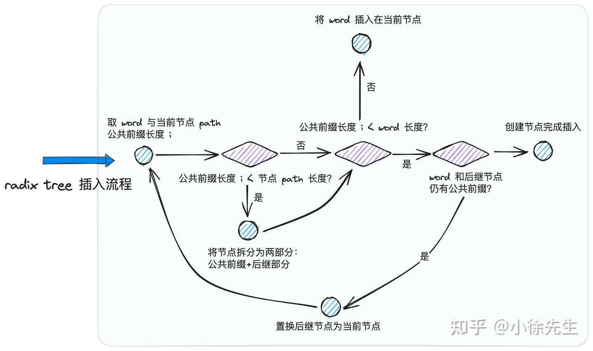
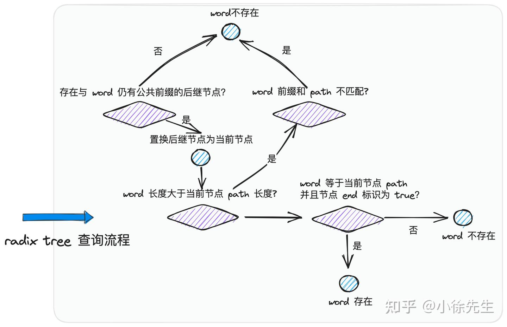
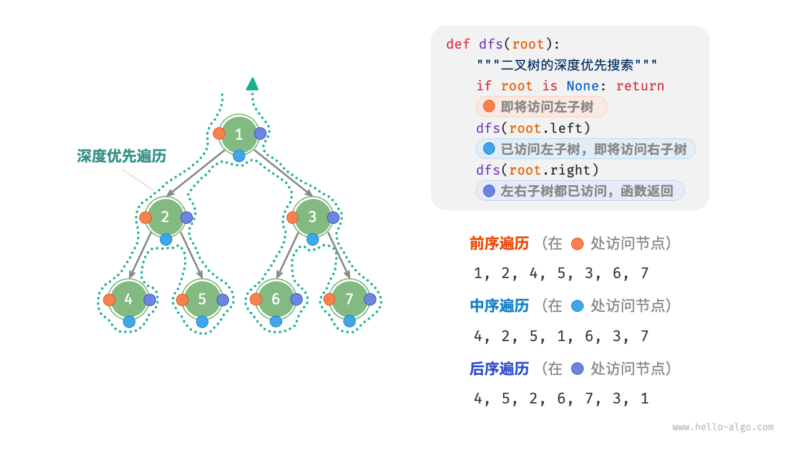
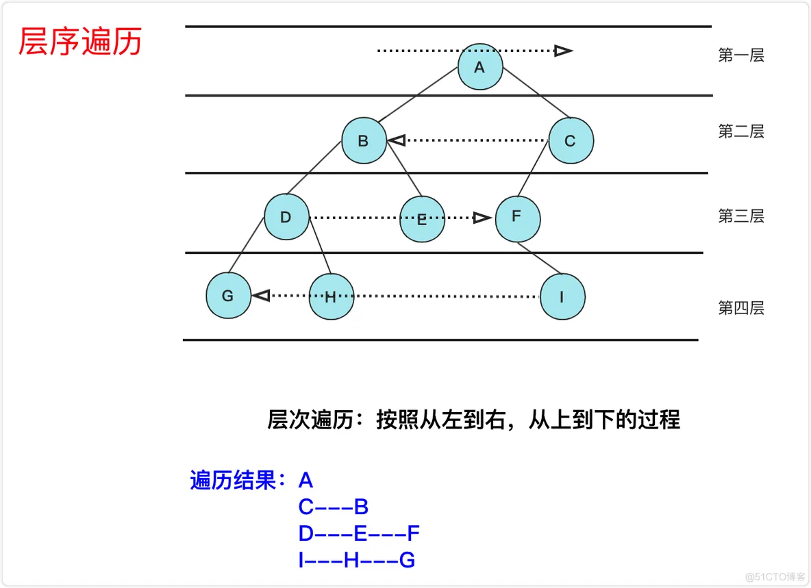
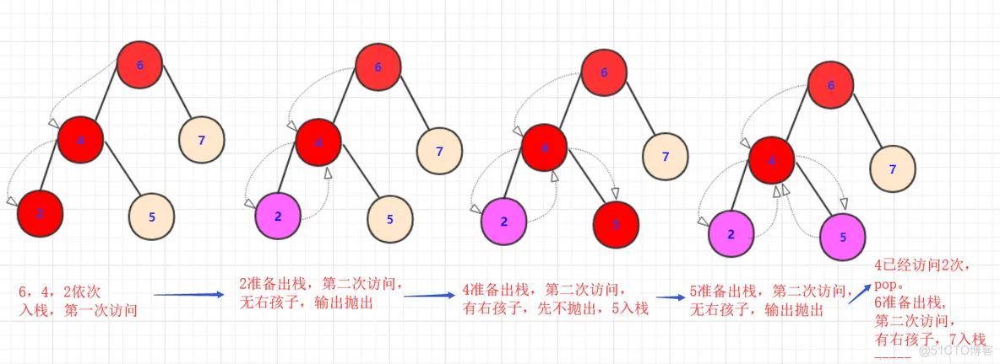
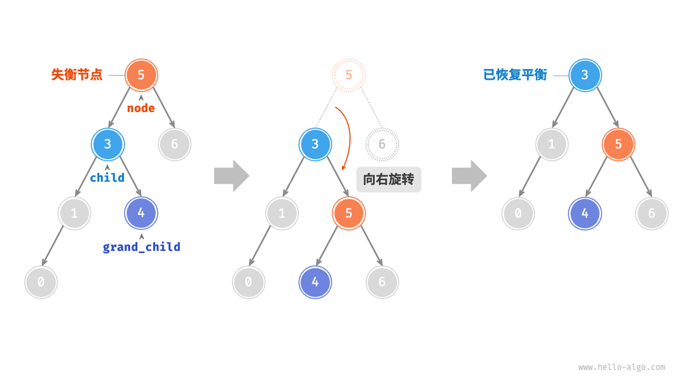
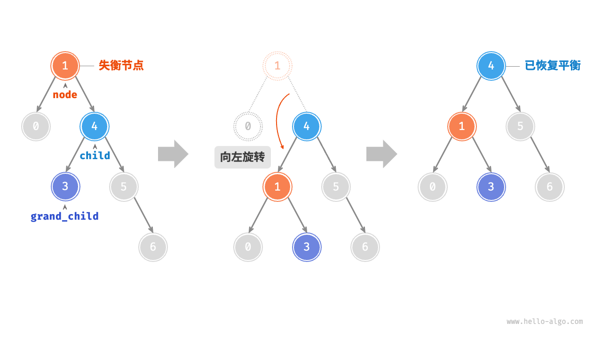
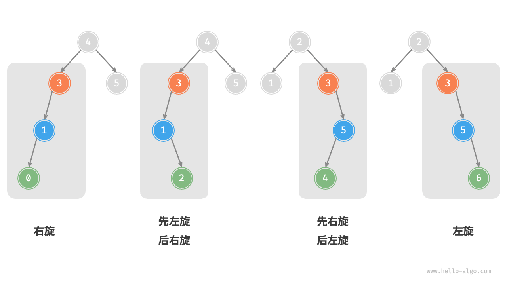

# 视频知识点GMP调度策略
**<font color="red">[视频知识点](https://www.bilibili.com/video/BV1gf4y1r79E?p=26)</font>**

# 涉及
  

## 早期G-M模型
- G 指 Goroutine，对应协程，M 指 Machine，一个 M 关联一个内核 OS 线程，由操作系统管理


内核线程 M 想要执行、放回 G 都必须访问全局 G 队列，并且 M 有多个，这就出现多线程访问同一资源的场景，<font color="red">要保证线程安全</font>就需要加锁保证互斥/同步(没锁不知道其他M访问了同一个G)，所以全局 G 队列是有互斥锁进行保护的，这也成为系统的主要性能瓶颈。

## G-M-P模型

- 为了解决 G-M 模型的问题，后面又引入了 <font color="red">P（Processor）,包含了运行 Goroutine 的资源</font>
- 全局队列（GRQ）：存放待运行 G
- P 的本地队列（LRQ）：和全局队列类似，存放的也是待运行的 G，存放数量上限 256 个。新建 G 时，G 优先加入到 P 的本地队列，如果队列满了，则会把本地队列中的一半 G 移动到全局队列
- P 列表：所有的 P 都在程序启动时创建，保存在数组中，最多有 GOMAXPROCS 个
  - Go 语言中通过调用 runtime.NumCPU() 方法获取 CPU 核心数, runtime.GOMAXPROCS(cpus)设置使用的最大核心数
- M：每个 M 代表一个内核线程，**操作系统调度器**负责把内核线程分配到 CPU 的核心上执行

- go程序初始化的时候 只有一个M和 cpu对应的数量P
### 对应的调度生命周期如下
- 线程 M 想运行任务就需得<font color="red">获取 P, 然后从 P 的本地队列（LRQ）获取 G；</font>
  - P 本地队列中没有可运行的 G，M 会尝试从全局队列（GRQ）拿一批 G 放到 P 的本地队列；若全局队列也未找到可运行的 G 时，M 会随机从其他 P 的本地队列偷一半放到自己 P 的本地队列
- M0 是启动程序后的编号为 0 的主线程，这个 M 对应的实例会在全局变量 runtime.m0 中，不需要在 heap 上分配，<font color="red">M0 负责执行初始化操作和启动第一个 G</font>， 在之后 M0 就和其他的 M 一样了。
- <font color="red">G0 是每次启动一个 M 都会第一个创建的 Goroutine，G0 仅用于负责调度 G </font> (每个 M 都会有一个自己的 G0。)
  - G0 不指向任何可执行的函数
  - 普通 G 的栈在堆上分配不同，G0 的栈是 M 对应线程的栈，所有调度相关的代码，会先切换到 G0 栈中再执行，也就是说内核线程的栈也是用 G 实现，而不是使用 OS 的
  


# 概念
## 线程
通常语义中的线程，指的是内核级线程，核心点如下：

1. 是操作系统最小调度单元；
2. **创建、销毁、调度交由内核完成，cpu 需完成用户态与内核态间的切换；**
3. 可充分利用多核，实现并行.

## 协程


协程，又称为用户级线程，核心点如下：

1. 与线程存在映射关系，为 M：1；
2. 创建、销毁、调度在用户态完成，对内核透明，所以更轻；
3. 从属同一个内核级线程，无法并行；一个协程阻塞会导致从属同一线程的所有协程无法执行
   -  c++ 标准库中的并发工具（如 lock、semaphore 等）对应的阻塞粒度都是 thread 级别的，这就导致一个协程（coroutine）的阻塞会上升到线程（thread）级别，并导致其他 coroutine 也丧失被执行的机会.
   -  php扩展swoole
  
## Goroutine

- <font color="red">Goroutine，经 Golang 优化后的特殊“协程”，对协程的抽象</font>核心点如下：
1. 与线程存在映射关系，<font color="red">为 M：N；</font>
2. 创建、销毁、调度在用户态完成，对内核透明，足够轻便；
3. **可利用多个线程，实现并行；**
4. 通过调度器的斡旋，<font color="red">实现和线程间的动态绑定和灵活调度；</font>
5. 栈空间大小可动态扩缩，因地制宜.

Golang 在调度 goroutine 时，针对“如何减少加锁行为”，“如何避免资源不均”等问题都给出了精彩的解决方案，这一切都得益于经典的 “gmp” 模型

## 区别
|模型|弱依赖内核|可并行|可应对阻塞|栈可动态扩缩|
|:--|:--:|:--:|:--:|:--:|
|线程|	❎|	✅|	✅|	❎|
|协程|	✅|	❎|	❎|	❎|
|goroutine|	✅|	✅|	✅|	✅|

# GMP模型架构
- gmp = goroutine + machine + processor 

## g
1. g 即goroutine，是 golang 中对协程的抽象；
2. <font color="red">g 有自己的运行栈、状态、以及执行的任务函数（用户通过 go func 指定）</font>
3. **g 需要绑定在m上执行**，在 g 的视角中，可以将 m 理解为它的 cpu

## m
1. m 即 machine，是 golang 中对线程的抽象；
2. m 需要和 p 进行结合，从而进入到 gmp 调度体系之中，m 的运行目标始终在 g0 和 g 之间进行切换
   - 当运行 g0 时执行的是 m 的调度流程，负责寻找合适的“任务”，也就是 g；当运行 g 时，执行的是 m 获取到的”任务“，也就是用户通过 go func 启动的 goroutine
   - g0不由用户创建
   - 寻找任务（执行g0）；执行任务（执行g）
3. <font color="red">借由 p 的存在，m 无需和 g 绑死，也无需记录 g 的状态信息，**因此g 在全生命周期中可以实现跨 m 执行** </font>

## p
1. p 即 processor，P 是逻辑处理器/调度上下文（执行 Go 代码所需的资源上下文），真正的调度器是 schedule() 函数所在的调度循环
2. p 可以理解为 m 的执行代理(p为m其提供必要信息,如可执行的 g、内存分配情况等）
3. m 需要与 p 绑定后，才会进入到 gmp 调度模式当中；因此 p 的数量决定了 g 最大并行数量（在超过 CPU 核数时无意义）
   - Go 语言中通过调用 runtime.NumCPU() 方法获取 CPU 核心数, runtime.GOMAXPROCS(cpus)设置使用的最大核心数
4. <font color="red">同时p 是 g 的存储容器，其自带一个本地 g 队列（local run queue，简称 lrq），承载着一系列等待被调度的 g </font>
   
# g 的存储容器（队列）
1. p 的本地队列 lrq（local run queue）：这是每个 p 私有的 g 队列，通常由 p 自行访问，并发竞争情况较少，因此设计为无锁化结构，通过 CAS（compare-and-swap）操作访问
 - 当 m 与 p 结合后，不论是创建 g 还是获取 g，都优先从私有的 lrq 中获取，从而尽可能减少并发竞争行为；并发情况较少，但并非完全没有，可能存在来自其他 p 的窃取行为（stealwork）
2. 全局队列 grq（global run queue）：是全局调度模块 schedt 中的全局共享 g 队列，作为当某个 lrq 不满足条件时的备用容器，因为不同的 m 都可能访问 grq，因此并发竞争比较激烈，访问前需要加全局锁
3. wait队列（图中未展示，为io阻塞就绪态goroutine队列）

## put g
- 当某个 g 中通过 go func(){...} 操作创建子 g 时，采取最近原则会先尝试将子 g 添加到当前所在 p 的 lrq 中（无锁化）；如果 lrq 满了，则会将 g 追加到 grq 中（全局锁）
## get g
- m 和 p 结合后，运行的 g0 会不断寻找合适的 g 用于执行 (采取均负载衡)
1. 优先从当前 p 的 lrq 中获取 g（无锁化-CAS）
   - 取本地队列时，可以接近于无锁化，减少全局锁竞争
2. 从全局的 grq 中获取 g（全局锁）
3. wait队列, 取 io 就绪的 g（netpoll 机制）
4. 从其他 p 的 lrq 中窃取 g（无锁化-CAS）
   - M 会随机从其他 P 的本地队列偷一半放到自己 P 的本地队列

- g0 每经过 61 次调度循环后，下一次会在处理 lrq 前优先处理一次 grq，避免因 lrq 过于忙碌而致使 grq 陷入饥荒状态(先放到全局队列的g一直被本地抢占了)

# GMP生态
## 内存管理

golang 的内存管理模块主要继承自 TCMalloc（Thread-Caching-Malloc）的设计思路，其中由契合 gmp 模型做了因地制宜的适配改造，为每个 p 准备了一份私有的高速缓存——mcache，能够无锁化地完成一部分 p 本地的内存分配操作.

## 并发工具


<font color="red">g在 golang 中的并发工具（例如锁 mutex、通道 channel 等）均契合 gmp 作了适配改造，**保证在执行阻塞操作时，会将阻塞粒度限制在 g（goroutine）而非 m（thread）的粒度，使得阻塞与唤醒操作都属于用户态行为，无需内核的介入，同时一个 g 的阻塞也完全不会影响 m 下其他 g 的运行**</font>

## io 多路复用


在设计 io 模型时，golang 采用了 linux 系统提供的 epoll 多路复用技术，然而为了避免因为 epoll_wait 操作而引起 m（thread）粒度的阻塞，golang 专门设计一套 netpoll 机制，使用用户态的 gopark 指令实现阻塞操作，使用非阻塞 epoll_wait 结合用户态的 goready 指令实现唤醒操作，从而将 io 行为也控制在 g 粒度，很好地契合了 gmp 调度体系.

# 源码
- [源码解析](https://zhuanlan.zhihu.com/p/869632834)

# 数据结构
runtime/runtime2.go

## g

- 系统调用 就会发生抢占和让渡
``` go
type g struct {
    
    stack       stack   // g 的执行栈空间
    /*
        栈空间保护区边界，用于探测是否执行栈扩容
        在 g 超时抢占过程中，用于传递抢占标识
    */
    stackguard0 uintptr 
    // ...
    _panic    *_panic // 记录 g 执行过程中遇到的异常    
    
    _defer    *_defer // g 中挂载的 defer 函数，是一个 LIFO 的链表结构

    // g 从属的 m 在 p 的代理，负责执行当前 g 的 m 若 g 不为 running 状态，则此字段为空
    m         *m

    atomicstatus uint32 // 生命周期状态
    
    schedlink    guintptr // 进入全局队列 grq 时指向相邻 g 的 next 指针
    // ...
    sched     gobuf // 环境
}

type gobuf struct {
    sp   uintptr  // 保存 CPU 的 rsp 寄存器的值，指向函数调用栈栈顶；
    pc   uintptr // 保存 CPU 的 rip 寄存器的值，指向程序下一条执行指令的地址；
    ret  uintptr // 保存系统调用的返回值；
    bp   uintptr // for framepointer-enabled architectures 保存 CPU 的 rbp 寄存器的值，存储函数栈帧的起始位置.
}

const(
  _Gidle = itoa // 0 为协程开始创建时的状态，此时尚未初始化完成；
  _Grunnable // 1 协程在待执行队列中，等待被执行； 处于就绪态.  可以被调度 
  _Grunning // 2 正在被调度运行过程中，同一时刻一个 p 中只有一个 g 处于此状态；
  _Gsyscall // 3 协程正在执行系统调用；
  _Gwaiting // 4 处于阻塞态，需要等待其他外部条件达成后(被唤醒)，才能重新恢复成就绪态 gc、channel 通信或者锁操作时经常会进入这种状态； 
  _Gdead // 6 协程刚初始化完成或者已经被销毁，会处于此状态； 暂不可以被调度
  
  _Gcopystack // 8 协程正在栈扩容流程中；
  _Gpreempted // 9 协程被抢占后的状态.
)
```

## m

``` go
type m struct {
    g0      *g    // 执行调度流程的特殊 g（不由用户创建，是与 m 一对一伴生的特殊 g，为 m 寻找合适的普通 g 用于执行）

    gsignal         *g  // 执行信号处理的特殊 g（不由用户创建，是与 m 一对一伴生的特殊 g，处理分配给 m 的 signal）

    curg            *g  // m 上正在执行的普通 g（由用户通过 go func(){...} 操作创建）

    p               puintptr  // 当前与 m 结合的 p

    schedlink     muintptr // 进入 schedt midle 链表时指向相邻 m 的 next 指针 

    tls           [tlsSlots]uintptr // tls：thread-local storage，线程本地存储，存储内容只对当前线程可见. 线程本地存储的是 m.tls 的地址，m.tls[0] 存储的是当前运行的 g，因此线程可以通过 g 找到当前的 m、p、g0 等信息.
}
```
- 线程本地存储的是 m.tls 的地址，m.tls[0] 存储的是当前运行的 g，因此线程可以通过 g 找到当前的 m、p、g0 等信息

## p

``` go
type p struct {
	id          int32

	status      uint32 // p 生命周期状态
  	
	link        puintptr  // 进入 schedt pidle 链表时指向相邻 p 的 next 指针       
	// ...
	m           muintptr   	// p 所关联的 m. 若 p 为 idle 状态，可能为 nil
  	// runq p 私有的 g 队列——local run queue，简称 lrq
	runqhead uint32 // lrq 的队首
	runqtail uint32  // lrq 的队尾

	runq     [256]guintptr // q 的本地 g 队列——lrq 最大长度为 256.
	
	runnext guintptr // 下一个调度的 g. 可以理解为 lrq 中的特等席
	// ...
}


const(
    // p 因缺少 g 而进入空闲模式，此时会被添加到全局的 idle p 队列中
    _Pidle = iota // 0

    // p 正在运行中，被 m 所持有，可能在运行普通 g，也可能在运行 g0
    _Prunning // 1

    // p 所关联的 m 正在执行系统调用. 此时 p 可能被窃取并与其他 m 关联
    _Psyscall // 2

    // p 已被终止
    _Pdead // 4
)
```

## schedt 全局共享的资源模块

``` go
// 全局调度模块
type schedt struct {
	// ...
   
	lock mutex // 互斥锁

	midle  muintptr // 空闲 m 队列
	// ...
  	
	pidle  puintptr // 空闲 p 队列
	// ...
	runq     gQueue // 全局 g 队列——global run queue，简称 grq
	runqsize int32   	// grq 中存量 g 的个数
	// ...
}
```
- <font color="red">存在 midle 和 pidle 的设计，就是为了避免 p 和 m 因缺少 g 而导致 cpu 空转. 对于空闲的 p 和 m，会被集成到空闲队列中，并且会暂停 m 的运行</font>

# g生命周期


# g0 与 g的执行权


在 m 运行中，能够通过几个方法实现 g0 与 g 之间执行权的切换
-  runtime/stubs.go
``` go
func gogo(buf *gobuf) // 从 g0 切换至 g 执行 g0执行  gobuf 包含 g 运行上下文信息

func mcall(fn func(*g)) // 从 g 切换至 g0 执行. 只允许在 g 中调用

// 在普通 g 中调用时，会切换至 g0 压栈执行 fn，执行完成后切回到 g
func systemstack(fn func())

```

- runtime/proc.go 调度函数 (让渡设计)
``` go
// runtime/proc.go 主动调度
func Gosched() {
    checkTimeouts()
    mcall(gosched_m)
}

// runtime/proc.go 被动调度
func gopark(unlockf func(*g, unsafe.Pointer) bool, lock unsafe.Pointer, reason waitReason, traceEv byte, traceskip int) {
    // ...
    mcall(park_m)
}
// runtime/proc.go 被动唤醒
func goready(gp *g, traceskip int) {
    systemstack(func() {
        ready(gp, traceskip, true)
    })
}
```

# 调度类型


1. 主动调度, 用户在执行代码中<font color="red">调用了 runtime.Gosched 方法</font>, 当前 g 会当让出执行权，主动进行队列等待直到下次被调度执行
2. 被动调度, 常见的被动调度触发方式为<font color="red">因 channel 操作或互斥锁操作陷入阻塞等操作</font>，底层会走进 gopark 方法.直到外部的条件达成后，g才从阻塞中被唤醒，<font color="red">重新进入可执行队列等待被调度. goready 方法通常与 gopark 方法成对出现，能够将 g 从阻塞态中恢复，重新进入等待执行的状态.</font>
   - 被动阻塞型，这个g会被保存在应用层面结构的队列中，比如mutex的阻塞队列，比如channel的读写阻塞g队列，引起这一次被动调度的工具本身负责维护存储. 比如锁，channel，waitgroup，cond。 后续唤醒操作本身也是上层作为起点，所以会取出g进行唤醒。 
 
3. 正常调度, g 中的执行任务已完成，g0 会将当前 g 置为dead状态(不可被调度)，发起新一轮调度.

4. 抢占调度, 倘若 g 执行系统调用超过指定的时长，且全局的 p 资源比较紧缺，此时将 p 和 g 解绑，<font color="red">抢占出来用于其他 g 的调度, 等 g 完成系统调用后，会重新进入可执行队列中等待被调度.</font>
   - 区别：前 3 种调度方式都由 m 下的 g0 完成，唯独抢占调度不同. 是由全局监控sysmon thread
     - 因为发起系统调用时需要打破用户态的边界进入内核态，此时 m 也会因系统调用而陷入僵直，无法主动完成抢占调度的行为.
     - 因此，<font color="red">在 Golang 进程会有一个全局监控线程 sysmon thread 的存在</font>，sysmon 确实是一个不需要 P 就能运行的特殊 M，但它并不是一个"monitor g"，它是直接在 M 上运行的 sysmon 函数，不走 GMP 调度。他不断轮询对所有 p 的执行状况进行监控. 倘若发现满足抢占调度的条件，则会从第三方的角度出手干预，主动发起该动作.

   - 抢占调度时，syscall会线程阻塞，只能交给sysmon thread进行handoff。（正常超时调用mcall交给g0就行了）, g执行超时会在sysmon流程中被标记，后续在g可被抢占的时间点会被替换(主动协助式)， 通过信号量的是（非主动协助式）


# 宏观调度流程

- 以 g0 -> g -> g0 的一轮循环为例进行串联
  1. <font color="red">g0 执行 schedule() 函数，调用 findRunnable 方法 ，寻找到用于执行的 g；</font>
  2. g0 执行 execute() 方法，**更新当前 g、p 的状态信息，并调用 gogo() 方法**，将执行权交给 g；
  3. g 因主动让渡( gosche_m() )、被动调度( park_m() )、正常结束( goexit0() )等原因，调用 m_call 函数，执行权重新回到 g0 手中；
  4. g0 执行 schedule() 函数，开启新一轮循环.
``` go
// runtime/proc.go 中的 schedule 函数
func schedule() {

    gp, inheritTime, tryWakeP := findRunnable() //  为 m 寻找到下一个执行的 g  (核心方法)
    // runtime/proc.go 的 findRunnable 方法 为 m 寻找到下一个执行的 g  (核心方法)

    // 执行该 goroutine.
    execute(gp, inheritTime)
}
```
- goroutine 的类型可分为两类：
  1. 负责调度普通 g 的 g0，执行固定的调度流程，与 m 的关系为一对一；
  2. 负责执行用户函数的普通 g.

**m 通过 p 调度执行的 goroutine 永远在普通 g 和 g0 之间进行切换，<font color="red">当 g0 找到可执行的 g 时，会调用 gogo 方法，执行权给g, 调度 g 执行用户定义的任务；当 g 需要主动让渡或被动调度时，会触发 mcall 方法，将执行权重新交还给 g0</font>**

- 执行 systemstack 时，会临时切换至 g0，并在完成其中闭包函数调用后，切换回到原本的普通 g

# g整个流程

- 一个由用户通过 go func(){...} 操作创建的 g，是如何被 m 上的 g0 获取并执行的 由 g0 -> g 的流转过程

main 函数作为整个 go 程序的入口是比较特殊的存在，它是由 go 程序全局唯一的 m0（main thread）执行的, 
- runtime.proc.go
``` go
//go:linkname main_main main.main
func main_main()

// The main goroutine.
func main() {
	// ...
        // 获取用户声明的 main 函数
	fn := main_main 
        // 执行用户声明的 main 函数
	fn()
	// ...
}
```


除了 main 函数这个特例之外，所有用户通过 go func(){...} 操作启动的 goroutine，都会以 g 的形式进入到 gmp 架构当中.
``` go
func handle() {
        // 异步启动 goroutine
	go func(){
		// do something ...
	}()
}
```

- 对应代码为 runtime/proc.go 的 newproc 方法
  - 将 g 添加到就绪队列的方法为 runqput
``` go
// 创建一个新的 g，本将其投递入队列. 入参 fn 为用户指定的函数.
// 当前执行方还是某个普通 g
func newproc(fn *funcval) {
	// 获取当前正在执行的普通 g 及其程序计数器（program counter）
	gp := getg()
	pc := getcallerpc()
	// 执行 systemstack 时，会临时切换至 g0，并在完成其中闭包函数调用后，切换回到原本的普通 g 
	systemstack(func() {
		// 此时执行方为 g0
		// 构造一个新的 g 实例
		newg := newproc1(fn, gp, pc)
		// 获取当前 p 
		_p_ := getg().m.p.ptr()
		/*
			将 newg 添加到队列中：
			1）优先添加到 p 的本地队列 lrq 
			2）若 lrq 满了，则添加到全局队列 grq
		*/
		runqput(_p_, newg, true)
		// 如果存在因过度空闲而被 block 的 p 和 m，则需要对其进行唤醒
		if mainStarted {
			wakep()
		}
	})

  // 切换回到原本的普通 g 继续执行
}

// 尝试将 g 添加到指定 p 的 lrq 中. 若 lrq 满了，则将 g 添加到 grqrq 中
func runqput(_p_ *p, gp *g, next bool) {
// ...

  // 当 next 为 true 时，会优先将 gp 以 cas 操作放置到 p 的 runnext 位置
  // 如果原因 runnext 位置还有 g，则再尝试将它追加到 lrq 的尾部
	if next {
	retryNext:
		oldnext := _p_.runnext
		if !_p_.runnext.cas(oldnext, guintptr(unsafe.Pointer(gp))) {
			goto retryNext
		}
    // 如果 runnext 位置原本不存在 g 直接返回
		if oldnext == 0 {
			return
		}
		// gp 指向 runnext 中被置换出来的 g 
		gp = oldnext.ptr()
	}

retry:
	// 获取 lrq 头节点的索引
	h := atomic.LoadAcq(&_p_.runqhead) // load-acquire, synchronize with consumers
	// 获取 lrq 尾节点的索引
	t := _p_.runqtail
	// 如果 lrq 没有满，则将 g 追加到尾节点的位置，并且递增尾节点的索引
	if t-h < uint32(len(_p_.runq)) {
		_p_.runq[t%uint32(len(_p_.runq))].set(gp)
		atomic.StoreRel(&_p_.runqtail, t+1) // store-release, makes the item available for consumption
		return
	}
	// runqputslow 方法中会将 g 以及 lrq 中半数的 g 放置到全局队列 grq 中
	if runqputslow(_p_, gp, h, t) {
		return
	}
	goto retry
}

```


## g0 -> g g0执行schedule 查找findRunnable并执行execute->gogo
- schedule：调用 findRunnable 方法，获取到可执行的 g
- execute：更新 g 的上下文信息，调用 gogo 方法，将 m 的执行权由 g0 切换到 g
``` go
// 执行方为 g0
func schedule() {
  // 获取当前 g0 
	_g_ := getg()
	// ...

top:
  // 获取当前 p
	pp := _g_.m.p.ptr()
	// ...
  /*
  核心方法：获取需要调度的 g 
    - 按照优先级，依次取本地队列 lrq、取全局队列 grq、执行 netpoll、窃取其他 p lrq
    - 若没有合适 g，则将 p 和 m block 住并添加到空闲队列中
  */
	gp, inheritTime, tryWakeP := findRunnable() // blocks until work is available

	// ...
  // 执行 g，该方法中会将执行权由 g0 -> g
	execute(gp, inheritTime)
}

// 执行给定的 g. 当前执行方还是 g0，但会通过 gogo 方法切换至 gp
func execute(gp *g, inheritTime bool) {
	// 获取 g0
  _g_ := getg()
	// ...
  /*
      建立 m 和 gp 的关系
      1）将 m 中的 curg 字段指向 gp
      2）将 gp 的 m 字段指向当前 m
  */
	_g_.m.curg = gp
	gp.m = _g_.m

  // 更新 gp 状态 runnable -> running
	casgstatus(gp, _Grunnable, _Grunning)
	// ...
  // 设置 gp 的栈空间保护区边界
	gp.stackguard0 = gp.stack.lo + _StackGuard
	// ...
  // 执行 gogo 方法，m 执行权会切换至 gp
	gogo(&gp.sched)
}
```

### <font color="red"> findRunnable 方法中如何按照指定的策略获取到可执行的g </font>

``` 
每经历 61 次调度后，需要先处理一次全局队列 grq（globrunqget——加锁），避免产生饥饿；
	globrunqget 在 max=0 时确实会取多个 g 放到本地队列
尝试从本地队列 lrq 中获取 g（runqget——CAS 无锁）
尝试从全局队列 grq 获取 g（globrunqget——加锁）
尝试获取 io 就绪的 g（netpoll——非阻塞模式）
尝试从其他 p 的 lrq 窃取 g（stealwork）
double check 一次 grq（globrunqget——加锁）
若没找到 g，将 p 置为 idle 状态，添加到 schedt pidle 队列（动态缩容）
确保留守一个 m，监听处理 io 就绪的 g（netpoll——阻塞模式）
若 m 仍无事可做，则将其添加到 schedt midle 队列（动态缩容）
```

``` go
// 获取可用于执行的 g. 如果该方法返回了，则一定已经找到了目标 g. 
func findRunnable() (gp *g, inheritTime, tryWakeP bool) {
  	// 获取当前执行 p 下的 g0
	_g_ := getg()
	// ...

top:
  // 获取 p
	_p_ := _g_.m.p.ptr()
	// ...
	// 每 61 次调度，需要尝试处理一次全局队列 (防止饥饿)
	if _p_.schedtick%61 == 0 && sched.runqsize > 0 {
		lock(&sched.lock)
		gp = globrunqget(_p_, 1)
		unlock(&sched.lock)
		if gp != nil {
			return gp, false, false
		}
	}

	// ...
	// 尝试从本地队列 lrq 中获取 g
	if gp, inheritTime := runqget(_p_); gp != nil {
		return gp, inheritTime, false
	}

	// 尝试从全局队列 grq 中获取 g
	if sched.runqsize != 0 {
		lock(&sched.lock)
		gp := globrunqget(_p_, 0)
		unlock(&sched.lock)
		if gp != nil {
			return gp, false, false
		}
	}

	// 执行 netpoll 流程，尝试批量唤醒 io 就绪的 g 并获取首个用以调度
	if netpollinited() && atomic.Load(&netpollWaiters) > 0 && atomic.Load64(&sched.lastpoll) != 0 {
		if list := netpoll(0); !list.empty() { // non-blocking
			gp := list.pop()
			injectglist(&list)
			casgstatus(gp, _Gwaiting, _Grunnable)
			// ...
			return gp, false, false
		}
	}

	// ...
	// 从其他 p 的 lrq 中窃取 g
	gp, inheritTime, tnow, w, newWork := stealWork(now)
	if gp != nil {
		return gp, inheritTime, false
	}

	// 若存在 gc 并发标记任务，则以 idle 模式参与协作，好过直接回收 p
	// ...

	// 加全局锁，并 double check 全局队列是否有 g
	lock(&sched.lock)
	// ...
	if sched.runqsize != 0 {
		gp := globrunqget(_p_, 0)
		unlock(&sched.lock)
		return gp, false, false
	}
	// ... 
	// 确认当前 p 无事可做，则将 p 和 m 解绑，并将其添加到全局调度模块 schedt 中的空闲 p 队列 pidle 中 
	// 解除 m 和 p 的关系
	releasep()
	// 将 p 添加到 schedt.pidle 中
	now = pidleput(_p_, now)
	unlock(&sched.lock)

	// ...
	// 在 block 当前 m 之前，保证全局存在一个 m 留守下来，以阻塞模式执行 netpoll，保证有 io 就绪事件发生时，能被第一时间处理
	if netpollinited() && (atomic.Load(&netpollWaiters) > 0 || pollUntil != 0) && atomic.Xchg64(&sched.lastpoll, 0) != 0 {
		atomic.Store64(&sched.pollUntil, uint64(pollUntil))
		// ...
    // 以阻塞模式执行 netpoll 流程
		delay := int64(-1)
		// ...
		list := netpoll(delay) // block until new work is available
               
		// 恢复 lastpoll 标识
		atomic.Store64(&sched.lastpoll, uint64(now))
		// ...
		lock(&sched.lock)

    	// 从 schedt 的空闲 p 队列 pidle 中获取一个空闲 p
		_p_, _ = pidleget(now)
		unlock(&sched.lock)
    	// 若没有获取到 p，则将就绪的 g 都添加到全局队列 grq 中
		if _p_ == nil {
			injectglist(&list)
		} else {
      		// m 与 p 结合
			acquirep(_p_)
      		// 将首个 g 直接用于调度，其余的添加到全局队列 grq
			if !list.empty() {
				gp := list.pop()
				injectglist(&list)
				casgstatus(gp, _Gwaiting, _Grunnable)
				// ...
				return gp, false, false
			}
			// ...
			goto top
		}
	}
  // ...
  // 走到此处仍然未找到合适的 g 用于调度，则需要将 m block 住，添加到 schedt 的 midle 中
	stopm()
	goto top
}
```
#### 1. 从 lrq获取 g
runqget 方法用于从某个 p 的 lrq 中获取 g：
  - 以 CAS 操作取 runnext 位置的 g，获取成功则返回
  - 以 CAS 操作移动 lrq 的头节点索引，然后返回头节点对应 g
``` go
// [无锁化]从某个 p 的本地队列 lrq 中获取 g
func runqget(_p_ *p) (gp *g, inheritTime bool) {
	// 首先尝试获取特定席位 runnext 中的 g，使用 cas 操作
	next := _p_.runnext
	if next != 0 && _p_.runnext.cas(next, 0) {
		return next.ptr(), true
	}

	// 尝试基于 cas 操作，获取本地队列头节点中的 g
	for {
	// 获取头节点索引
		h := atomic.LoadAcq(&_p_.runqhead) // load-acquire, synchronize with other consumers
		// 获取尾节点索引
		t := _p_.runqtail
		// 头尾节点重合，说明 lrq 为空
		if t == h {
			return nil, false
		}
		// 根据索引从 lrq 中取出头节点对应的 g
		gp := _p_.runq[h%uint32(len(_p_.runq))].ptr()
		// 通过 cas 操作更新头节点索引
		if atomic.CasRel(&_p_.runqhead, h, h+1) { // cas-release, commits consume
			return gp, false
		}
	}
}
```
#### 2. globrunqget 从全局的 grq 中获取 g. 调用时需要确保持有 schedt 的全局锁
``` go
// 从全局队列 grq 中获取 g. 调用此方法前必须持有 schedt 中的互斥锁 lock
func globrunqget(_p_ *p, max int32) *g {
	// 断言确保持有锁
	assertLockHeld(&sched.lock)
	// 队列为空，直接返回
	if sched.runqsize == 0 {
		return nil
	}

	// ...
	// 此外还有一些逻辑是根据传入的 max 值尝试获取 grq 中的半数 g 填充到 p 的 lrq 中. 此处不展开
	// ...

	// 从全局队列的队首弹出一个 g
	gp := sched.runq.pop()
	// ...
	return gp
}
```
#### 3. 获取 io 就绪的 g

lrq 和 grq 都为空，则会执行 netpoll 流程，尝试以非阻塞模式下的 epoll_wait 操作获取 io 就绪的 g. 该方法位于 runtime/netpoll_epoll.go：
``` go
func netpoll(delay int64) gList {
	// ...
  // 调用 epoll_wait 获取就绪的 io event
	var events [128]epollevent
	n := epollwait(epfd, &events[0], int32(len(events)), waitms)
	// ...
	var toRun gList
	for i := int32(0); i < n; i++ {
		ev := &events[i]
    // 将就绪 event 对应 g 追加到的 glist 中
		netpollready(...)
	}
	return toRun
}
```
#### 4. 从其他 p 窃取 g

如果执行完 netpoll 流程后仍未获得 g，则会尝试从其他 p 的 lrq 中窃取半数 g 补充到当前 p 的 lrq 中：
``` go
func stealWork(now int64) (gp *g, inheritTime bool, rnow, pollUntil int64, newWork bool) {
	// 获取当前 p
  pp := getg().m.p.ptr()
  // ...
  // 外层循环 4 次
	const stealTries = 4
	for i := 0; i < stealTries; i++ {
		// ...
                // 通过随机数以随机起点随机步长选取目标 p 进行窃取
		for enum := stealOrder.start(fastrand()); !enum.done(); enum.next() {
			// ...
                        // 获取拟窃取的目标 p
			p2 := allp[enum.position()]
                        // 如果目标 p 是当前 p，则跳过
			if pp == p2 {
				continue
			}

			// ...
			// 只要目标 p 不为 idle 状态，则进行窃取
			if !idlepMask.read(enum.position()) {
                                // 窃取目标 p，其中会尝试将目标 p lrq 中半数 g 窃取到当前 p 的 lrq 中
				if gp := runqsteal(pp, p2, stealTimersOrRunNextG); gp != nil {
					return gp, false, now, pollUntil, ranTimer
				}
			}
		}
	}

	// 窃取失败 未找到合适的目标
	return nil, false, now, pollUntil, ranTimer
}
```
#### 5. 回收空闲的 p 和 m

如果直到最后都没有找到合适的 g 用于执行，则需要将 p 和 m 添加到 schedt 的 pidle 和 midle 队列中并停止 m 的运行，避免产生资源浪费：
``` go
// 将 p 追加到 schedt pidle 队列中
func pidleput(_p_ *p, now int64) int64 {
	assertLockHeld(&sched.lock)
	// ...
	// p 指针指向原本 pidle 队首
	_p_.link = sched.pidle
	// 将 p 设置为 pidle 队首
	sched.pidle.set(_p_)
	atomic.Xadd(&sched.npidle, 1)
	// ...
}

// 将当前 m 添加到 schedt midle 队列并停止 m
func stopm() {
	_g_ := getg()

	// ...
	lock(&sched.lock)
	// 将 m 添加到 schedt.mdile 
	mput(_g_.m)
	unlock(&sched.lock)
	// 停止 m
	mPark()
	// ...
}
```

# 让渡设计 g -> g0 (g主动mcall) 

- 本质: <font color="red">当 g 在 m 上运行时，主动让出执行权，使得 m 的运行对象重新回到 g0，即由 g -> g0 的流转过程, 流转过程是由 m 上运行的 g 主动发起的</font>

## 结束让渡 goexit1 状态running => dead

- g执行goexit1 mcall 执行权给g0，由 g0 调用 goexit0 方法
``` go
// 将 g 状态由 running 更新为 dead
// 清空 g 中的数据
// 解除 g 和 m 的关系
// 将 g 添加到 p 的 gfree 队列以供复用
// 调用 schedule 方法发起新一轮调度

// goroutine 运行结束. 此时执行方是普通 g
func goexit1() {
	// 通过 mcall，将执行方转为 g0，调用 goexit0 方法
	mcall(goexit0)
}

// 此时执行方为 g0，入参 gp 为已经运行结束的 g
func goexit0(gp *g) {
	// 获取 g0
	_g_ := getg()
	// 获取对应的 p
	_p_ := _g_.m.p.ptr()

	// 将 gp 的状态由 running 更新为 dead
	casgstatus(gp, _Grunning, _Gdead)
	// ...

	// 将 gp 中的内容清空
	gp.m = nil
	// ...
	gp._defer = nil // should be true already but just in case.
	gp._panic = nil // non-nil for Goexit during panic. points at stack-allocated data.
	// ...
	// 将 g 和 p 解除关系
	dropg()
	// ...
	// 将 g 添加到 p 的 gfree 队列中
	gfput(_p_, gp)
	// ...
	// 发起新一轮调度流程
	schedule()
}
```

## 主动让渡 Gosched 状态running => runnable

- g执行runtime.Gosched => mcall 将执行权g给g0, 再由g0 执行 gosched_m 方法
``` go

// 将 g 由 running 改为 runnable 状态
// 解除 g 和 m 的关系
// 将 g 直接添加到全局队列 grq 中
// 调用 schedule 方法发起新一轮调度

// 主动让渡出执行权，此时执行方还是普通 g
func Gosched() {
	// ...
        // 通过 mcall，将执行方转为 g0，调用 gosched_m 方法
	mcall(gosched_m)
}

// 将 gp 切换回就绪态后添加到全局队列 grq，并发起新一轮调度
// 此时执行方为 g0
func gosched_m(gp *g) {
	// ...
	goschedImpl(gp)
}

func goschedImpl(gp *g) {
	// ...
  // 将 g 状态由 running 改为 runnable 就绪态
	casgstatus(gp, _Grunning, _Grunnable)
  // 解除 g 和 m 的关系
	dropg()
  // 将 g 添加到全局队列 grq
	lock(&sched.lock)
	globrunqput(gp)
	unlock(&sched.lock)
  // 发起新一轮调度
	schedule()
}
```

##  <font color="red">阻塞让渡</font> gopark goready 状态running => waiting => runnable


- 比如：mutex、channel 等并发工具的设计，在底层都是采用了阻塞让渡的设计模式
- 在阻塞让渡后，g 不会进入到 lrq 或 grq 中，因为 lrq/grq 属于就绪队列. 在执行 gopark 时，使用方有义务自行维护 g 的引用，并在外部条件就绪时，通过 goready 操作将waiting其更新为 runnable 状态并重新添加到就绪队列中.
### gopark running => waiting
- g在执行过程中所依赖的外部条件没有达成, g执行gopark => mcall 将执行权g给g0, 再由g0 执行 park_m 方法(g0 将 g 由 running 更新为 waiting 状态，然后发起新一轮调度)

``` go
// 此时执行方为普通 g
func gopark(unlockf func(*g, unsafe.Pointer) bool, lock unsafe.Pointer, reason waitReason, traceEv byte, traceskip int) {
  // 获取 m 正在执行的 g，也就是要阻塞让渡的 g
	gp := mp.curg
	// ...
  // 通过 mcall，将执行方由普通 g -> g0
	mcall(park_m)
}

// 此时执行方为 g0. 入参 gp 为需要执行 park 的普通 g
func park_m(gp *g) {
  // 获取 g0 
	_g_ := getg()

	// 将 gp 状态由 running 变更为 waiting
	casgstatus(gp, _Grunning, _Gwaiting)
  // 解绑 g 与 m 的关系
	dropg()

	// g0 发起新一轮调度流程
	schedule()
}

```
### goready  waiting => runnable
- 用于唤醒 g 的 goready 方法，其中会通过 systemstack 压栈切换至 g0 执行 ready 方法
``` go
// 此时执行方为普通 g. 入参 gp 为需要唤醒的另一个普通 g
func goready(gp *g, traceskip int) {
  // 调用 systemstack 后，会切换至 g0 亚展调用传入的 ready 方法. 调用结束后则会直接切换回到当前普通 g 继续执行. 
	systemstack(func() {
		ready(gp, traceskip, true)
	})

  // 恢复成普通 g 继续执行 ...
}

// 此时执行方为 g0. 入参 gp 为拟唤醒的普通 g
func ready(gp *g, traceskip int, next bool) {
	// ...

	// 获取当前 g0
	_g_ := getg()
  // ...
  // 将目标 g 状态由 waiting 更新为 runnable
	casgstatus(gp, _Gwaiting, _Grunnable)
  /*
      1) 优先将目标 g 添加到当前 p 的本地队列 lrq
      2）若 lrq 满了，则将 g 追加到全局队列 grq
  */
	runqput(_g_.m.p.ptr(), gp, next)
        // 如果有 m 或 p 处于 idle 状态，将其唤醒
	wakep()
	// ...
}
```

# 抢占设计  g->g0 (sysmon thread主动发起)


- 抢占和让渡有相同之处，都表示由 g->g0 的流转过程，但区别在于，让渡是由 g 主动发起的（第一人称），而抢占则是由外力干预（sysmon thread）发起的（第三人称）

## 监控线程

go 程序运行时，会启动一个全局唯一的监控线程——sysmon thread，其负责定时执行监控工作

1. 执行 netpoll 操作，唤醒 io 就绪的 g
2. 执行 retake 操作，对运行时间过长的 g 执行抢占操作
3. 执行 gcTrigger 操作，探测是否需要发起新的 gc 轮次
``` go
// The main goroutine.
func main() {
	systemstack(func() {
		newm(sysmon, nil, -1)
	})
	// ...
}

func sysmon() {
	// ..

	for {
		// 根据闲忙情况调整轮询间隔，在空闲情况下 10 ms 轮询一次
		usleep(delay)

		// ...
		// 执行 netpoll 
		lastpoll := int64(atomic.Load64(&sched.lastpoll))
		if netpollinited() && lastpoll != 0 && lastpoll+10*1000*1000 < now {
			// ...
			list := netpoll(0) // non-blocking - returns list of goroutines
			// ...
		}
		
		// 执行抢占工作
		retake(now)

		// ...

		// 定时检查是否需要发起 gc
		if t := (gcTrigger{kind: gcTriggerTime, now: now}); t.test() && atomic.Load(&forcegc.idle) != 0 {
			// ...
		}
		// ...
	}
}
```
-  <font color="red">retake根据抢占目标和状态的不同，又可以分为**系统调用抢占和运行超时抢占**</font>
  
## 系统调用 状态running => syscall => runnable
- 系统调用是 m（thread）粒度的，在执行期间会导致整个 m 暂时不可用

抢占处理思路是将发起 syscall 的 g 和 m 绑定，但是解除 p 与 m 的绑定关系，使得此期间 p 存在和其他 m 结合的机会.

### 进行系统调用 状态running => syscall


``` go

// 将 g 和 p 的状态更新为 syscall
// 解除 p 和 m 的绑定
// 将 p 设置为 m.oldp，保留 p 与 m 之间的弱联系（使得 m syscall 结束后，还有一次尝试复用 p 的机会

func entersyscall() {
	fp := getcallerfp()
	reentersyscall(getcallerpc(), getcallersp(), fp)
}

func reentersyscall(pc, sp uintptr) {
	// 获取 g
	_g_ := getg()

	// ...
	// 保存寄存器信息
	save(pc, sp)
	// ...
	// 将 g 状态更新为 syscall
	casgstatus(_g_, _Grunning, _Gsyscall)
	// ...
	// 解除 p 与 m 绑定关系
	pp := _g_.m.p.ptr()
	pp.m = 0
	// 将 p 设置为 m 的 oldp
	_g_.m.oldp.set(pp)
	_g_.m.p = 0
        // 将 p 状态更新为 syscall
	atomic.Store(&pp.status, _Psyscall)
	// ...
}
``` 
### 系统系统调用完成 状态syscall => runnable

- 当系统系统调用完成时，会执行位于 runtime/proc.go 的 exitsyscall 方法（此时执行方还是 m 上的 g）  
- g调用mcall g0执行exitsyscall0  状态syscall => runnable
``` go
// 检查 syscall 期间，p 是否未和其他 m 结合，如果是的话，直接复用 p，继续执行 g
// 通过 mcall 操作切换至 g0 执行 exitsyscall0 方法——尝试为当前 m 结合一个新的 p，如果结合成功，则继续执行 g，否则将 g 添加到 grq 后暂停 m

func exitsyscall() {
        // 获取 g
	_g_ := getg()

	// ...

	// 如果 oldp 没有和其他 m 结合，则直接复用 oldp
	oldp := _g_.m.oldp.ptr()
	_g_.m.oldp = 0
	if exitsyscallfast(oldp) {
		// ...
                // 将 g 状态由 syscall 更新回 running
		casgstatus(_g_, _Gsyscall, _Grunning)
	        // ...

		return
	}

	// 切换至 g0 调用 exitsyscall0 方法
	mcall(exitsyscall0)
        // ...
}

// 此时执行方为 m 下的 g0
func exitsyscall0(gp *g) {
	// 将 g 的状态修改为 runnable 就绪态
	casgstatus(gp, _Gsyscall, _Grunnable)
	// 解除 g 和 m 的绑定关系
	dropg()
	lock(&sched.lock)
        // 尝试寻找一个空闲的 p 与当前 m 结合
	var _p_ *p
	_p_, _ = pidleget(0)
	var locked bool
        // 如果与 p 结合失败，则将 g 添加到全局队列中
	if _p_ == nil {
		globrunqput(gp)
		// ...
	} 
        // ...
	unlock(&sched.lock)
        // 如果与 p 结合成功，则继续调度 g 
	if _p_ != nil {
		acquirep(_p_)
		execute(gp, false) // Never returns.
	}
	// ...
	// 与 p 结合失败的话，需要将当前 m 添加到 schedt 的 midle 队列并停止 m
	stopm()
	// 如果 m 被重新启用，则发起新一轮调度
	schedule() // Never returns.
}
```

### retake 下一轮

- retake会遍历每个 p，并针对正在发起系统调用的 p 执行如下检查逻辑
  1. 检查 p 的 lrq 中是否存在等待执行的 g
  2. 检查 p 的 syscall 时长是否 >= 10ms
- 条件满足其一，就会执行对 p 执行抢占操作（handoffp）——分配一个新的 m 与 p 结合，完成后续任务的调度处理.

``` go
func retake(now int64) uint32 {
	n := 0
	// 加锁
	lock(&allpLock)
	// 遍历所有 p
	for i := 0; i < len(allp); i++ {
		_p_ := allp[i]
		// ...
		s := _p_.status
		// ...
                // 对于正在执行 syscall 的 p
		if s == _Psyscall {
			// 如果 p 本地队列为空且发起系统调用时间 < 10ms，则不进行抢占
			if runqempty(_p_) && atomic.Load(&sched.nmspinning)+atomic.Load(&sched.npidle) > 0 && pd.syscallwhen+10*1000*1000 > now {
				continue
			}
			unlock(&allpLock)
			// 将 p 的状态由 syscall 更新为 idle
			if atomic.Cas(&_p_.status, s, _Pidle) {
				// ...
                // 让 p 拥有和其他 m 结合的机会
				handoffp(_p_)
			}
			// ...
			lock(&allpLock)
		}
	}
	unlock(&allpLock)
	return uint32(n)
}

func handoffp(_p_ *p) {
	// 如果 p lrq 中还有 g 或者全局队列 grq 中还有 g，则立即分配一个新 m 与该 p 结合
	if !runqempty(_p_) || sched.runqsize != 0 {
                // 分配一个 m 与 p 结合
		startm(_p_, false)
		return
	}
	// ...
        // 若系统空闲没有 g 需要调度，则将 p 添加到 schedt 中的空闲 p 队列 pidle 中
	pidleput(_p_, 0)
	// ...
}
```

## 运行超时
- 当 sysmon thread 发现某个 g 执行时间过长时，也会对其发起抢占


``` go
func retake(now int64) uint32 {
	// ...
	for i := 0; i < len(allp); i++ {
		_p_ := allp[i]
		// ...
		if s == _Prunning {
			// ... 
			// 如果某个 p 下存在运行超过 10 ms 的 g ，需要对 g 进行抢占
			if pd.schedwhen+forcePreemptNS <= now{
					preemptone(_p_)
			}
		}
		// ...
	}
	// ...
}
```
### preemtone 发起抢占 (sysmon thread发起)

1. （协作式）会对目标 g 设置抢占标识（将 stackguard0 标识设置为 stackPreempt），这样当 g 运行到检查点时，就会配合抢占意图，自觉完成让渡操作
2. (非协作式)会对目标 g 所在的 m 发送抢占信号 sigPreempt，通过改写 g 程序计数器（pc，program counter）的方式将 g 逼停

``` go
// 抢占指定 p 上正在执行的 g
func preemptone(_p_ *p) bool {
    // 获取 p 对应 m
	mp := _p_.m.ptr()
	// 获取 p 上正在执行的 g（抢占目标）
	gp := mp.curg
	// ...
	/*
		启动协作式抢占标识
		1) 将抢占标识 preempt 置为 true
		2）将 g 中的 stackguard0 标识置为 stackPreempt
		3）g 查看到抢占标识后，会配合主动让渡 p 调度权
	*/
	gp.preempt = true
	gp.stackguard0 = stackPreempt

	// 基于信号机制实现非协作式抢占
	if preemptMSupported && debug.asyncpreemptoff == 0 {
		_p_.preempt = true
		preemptM(mp)
	}
        // ...
}
```
- runtime/signal_unix.go

``` go
func preemptM(mp *m) {
	// ...
	if atomic.Cas(&mp.signalPending, 0, 1) {
		if GOOS == "darwin" || GOOS == "ios" {
			atomic.Xadd(&pendingPreemptSignals, 1)
		}

		// 向指定的 m 发送抢占信号
		// const sigPreempt untyped int = 16
		signalM(mp, sigPreempt)
	}
	// ...
}

func signalM(mp *m, sig int) {
	pthread_kill(pthread(mp.procid), uint32(sig))
}
```

#### 1.协作式抢占 （go主动配合）

对于运行中的 g，在栈空间不足时，会切换至 g0 调用 newstack 方法执行栈空间扩张操作，在该流程中预留了一个检查桩点，当其中发现 g 已经被打上抢占标记时，就会主动配合执行让渡操作

- 由 g 主动配合抢占意图完成让渡操作的流程被称作协作式抢占，其存在的局限就在于，<font color="red">当 g 未发生栈扩张行为时，则没有触碰到检查点的机会，也就无法响应抢占意图.</font>
- preemptone打了标记
``` go
// 栈扩张. 执行方为 g0
func newstack() {
	// ...
        // 获取当前 m 正在执行的 g
	gp := thisg.m.curg
        // ...
        // 读取 g 中的 stackguard0 标识位
	stackguard0 := atomic.Loaduintptr(&gp.stackguard0)
        // 若 stackguard0 标识位被置为 stackPreempt，则代表需要对 g 进行抢占
	preempt := stackguard0 == stackPreempt
	// ...
        if preempt{
                // 若当前 g 不具备抢占条件，则继续调度，不进行抢占
                // 当持有锁、在进行内存分配或者显式禁用抢占模式时，则不允许对 g 执行抢占操作
		if !canPreemptM(thisg.m) {
			// ...
			gogo(&gp.sched) // never return
		}
        }

     
	if preempt {
		// ...

		// 响应抢占意图，完成让渡操作
		gopreempt_m(gp) // never return
	}

	// ...
}

// gopreempt_m 方法会走到 goschedImpl 方法中，后续流程与主动让渡类似
func gopreempt_m(gp *g) {
	// ...
	goschedImpl(gp)
}

func goschedImpl(gp *g) {
  	// 将 g 状态由 running 改为 runnable 就绪态
	casgstatus(gp, _Grunning, _Grunnable)
  	// 解除 g 和 m 的关系
	dropg()
 	// 将 g 添加到全局队列 grq
	lock(&sched.lock)
	globrunqput(gp)
	unlock(&sched.lock)
  	// 发起新一轮调度
	schedule()
}
``` 


#### 2.非协作式抢占 （收到信号量 抢占的目标g执行mcall, g0 执行 gopreempt_m, goschedImpl主动让渡）

- 为了弥补协作式抢占的不足，go 1.14 中引入了基于信号量实现的非协作式抢占机制
- main thread 会完成对各类信号量的监听注册，其中也包含了抢占信号 sigPreempt（index = 16）,runtime/signal_unix.go 的注册信号量
``` go
func initsig(preinit bool) {
	// ...

	for i := uint32(0); i < _NSIG; i++ {
		/*
			var sigtable = [...]sigTabT{
			// ...
			// 16 {_SigNotify + _SigIgn, "SIGURG: urgent condition on socket"},
			// ...
			}
		*/
		t := &sigtable[i]
		// ...
		// const _NSIG untyped int = 32
		handlingSig[i] = 1
		setsig(i, abi.FuncPCABIInternal(sighandler))
	}
}
```
- 收到信号量

当某个 m 接收到抢占信号后，会由 gsignal 通过 sighandler 方法完成信号处理工作，此时针对抢占信号会进一步调用 doSigPreempt 方法：在判断 g 具备可抢占条件后，则会保存 g 的寄存器信息，然后修改 g 的栈程序计数器 pc 和栈顶指针 sp，往其中插入一段函数 asyncPreempt

``` go
// 此时执行该方法的是抢占目标 g 所在 m 下的 gsignal
func sighandler(sig uint32, info *siginfo, ctxt unsafe.Pointer, gp *g) {
	// 获取拟抢占 g 从属 p 对应的 g0
        _g_ := getg()
	c := &sigctxt{info, ctxt}
        // 获取拟抢占 g 从属的 m
	mp := _g_.m

	// ...
        // 倘若接收到抢占信号 
	if sig == sigPreempt && debug.asyncpreemptoff == 0 && !delayedSignal {
		// 对目标 g 进行抢占
		doSigPreempt(gp, c)		
	}
        // ...
}

// 此时执行该方法的是抢占目标 g 所在 m 下的 gsignal
func doSigPreempt(gp *g, ctxt *sigctxt) {
        // 判断 g 是否需要被抢占
	if wantAsyncPreempt(gp) {
                // 判断 g 是否满足抢占条件
		if ok, newpc := isAsyncSafePoint(gp, ctxt.sigpc(), ctxt.sigsp(), ctxt.siglr()); ok {
			// 通过修改 g 寄存器的方式，往 g 的执行指令中插入 asyncPreempt 函数
			ctxt.pushCall(abi.FuncPCABI0(asyncPreempt), newpc)
		}
	}

	// ...
}
```
- sigctxt.pushCall 方法中，通过移动栈顶指针（sp，stack pointer）、修改程序计数器（pc，program counter）的方式，强行在 g 的执行指令中插入了一段新的指令asyncPreempt2函数(抢占的目标 g执行mcall, g0 执行 gopreempt_m)
``` go
// 此时执行该方法的是抢占目标 g 所在 m 下的 gsignal
func (c *sigctxt) pushCall(targetPC, resumePC uintptr) {
	// 获取栈顶指针 sp
	sp := uintptr(c.rsp())
        // sp 偏移一个指针地址
	sp -= goarch.PtrSize
        // 将原本下一条执行指令 pc 存放在栈顶位置
	*(*uintptr)(unsafe.Pointer(sp)) = resumePC
        // 更新栈顶指针 sp
	c.set_rsp(uint64(sp))
        // 将传入的指令（asyncPreemt）作为下一跳执行执行 pc
	c.set_rip(uint64(targetPC))
}

// 此时执行方是即将要被抢占的 g，这段代码是被临时插入的逻辑
func asyncPreempt2() {
	gp := getg()
	gp.asyncSafePoint = true
	mcall(gopreempt_m)
	gp.asyncSafePoint = false
}
```

# g创建后是如何被分配到某一个p的队列中去的呢，是monitor协程辅助吗?
- monitor 不负责做这个，由创建这个 g 的角色本身执行, 负责抢占调度
- runtime/proc.go  newproc  方法作为入口. 创建一个 g 优先投递到当前 p 的本地队列，满了则进入全局队列
一个G（称为G1）只能依附在一个M上才能执行创建协程的函数，即 go func函数，那么这个新建的func会通过创建它的G（G1）找到运行这个G（G1）的M再找到和M绑定的P队列，此时将新创建的这个协程放在这个P队列就行，如果P满了，则考虑全局队列


<!-- ### schedule 

<font color="red">findRunnable => globrunqget => runqput 或者 runqputslow (globrunqputbatch) => runqget或者globrunqget</font>
- p 每执行 61 次调度，会从全局队列中获取一个 goroutine 进行执行,（如果全局队列有g）并执行
  
  - 将一个 g 由全局队列转移到 p 本地队列的执行逻辑位于 <font color="red">runqput 方法中</font>
    
    取得 p 本地队列队首的索引，同时对本地队列加锁, 倘若 p 的局部队列未满，则成功转移 g，将 p 的对尾索引 runqtail 值加 1 并解锁队列,  倘若发现本地队列 runq 已经满了，则会返回来将本地队列中一半的 g 放回全局队列中，帮助当前 p 缓解执行压力，这部分内容<font color="red">位于 runqputslow 方法中</font>
    
- 从本地队列获取g
  1. 尝试从 p 本地队列中获取一个可执行的 goroutine，核心逻辑位于 runqget 方法中
    - <font color="red">runqput 方法</font>
    - 虽然本地队列是属于 p 独有的，但是由于 work-stealing 机制的存在，其他 p 可能会前来执行窃取动作，因此操作仍需加锁
  2. 倘若本地队列没有可执行的 g，会从全局队列中获取, globrunqget
  3. 倘若本地队列和全局队列都没有 g，则会获取准备就绪的网络协程 (netpollinited)
    - 刚获取网络协程时，g 的状态是处于 waiting 的，因此需要先更新为 runnable 状态.
  4. work-stealing: 从其他 p 中偷取 g (stealWork)   runqgrab 方法
    - 偷取操作至多会遍历全局的 p 队列 4 次，过程中只要找到可窃取的 p 则会立即返回.

### execute
- runtime/proc.go 的 execute 方法, 执行找到的g
1. 更新 g 的状态信息，建立 g 与 m 之间的绑定关系；
2. 更新 p 的总调度次数；
3. 调用 gogo 方法，执行 goroutine 中的任务.

### 调度

#### 主动调度 Gosched  mcall(gosched_m)

1. casgstatus() 方法，将当前 g 的状态由执行中切换为待执行 _Grunnable：
2. 调用 dropg() 方法，将当前的 m 和 g 解绑
3. globrunqput() 将 g 添加到全局队列当中
4. schedule() 开启新一轮调度

#### 被动调度 gopark  mcall(park_m)与goready

- gopark mcall(park_m)

（1）将当前 g 的状态由 running 改为 waiting；

（2）将 g 与 m 解绑；

（3）执行新一轮的调度 schedule.

- goready systemstack => ready
被动调度如果需要唤醒，则会其他 g 负责将 g 的状态由 waiting 改为 runnable，然后会将其添加到唤醒者的 p 的本地队列
1. 先将 g 的状态从阻塞态改为可执行的状态；casgstatus
2. 调用 runqput 将当前 g 添加到唤醒者 p 的本地队列中，如果队列满了，会连带 g 一起将一半的元素转移到全局队列.runqput

#### 正常调度 goexit0 

goexit1() => mcall(goexit0)
（1）将 g 状态置为 dead；

（2）解绑 g 和 m；

（3）开启新一轮的调度.

#### 抢占调度 retake

<font color="red">抢占调度的执行者不是 g0，而是一个全局的 monitor g，代码位于 runtime/proc.go 的 retake 方法 </font>
（1）加锁后，遍历全局的 p 队列，寻找需要被抢占的目标：

（2）倘若某个 p 同时满足下述条件，则会进行抢占调度：

    I 执行系统调用超过 10 ms；

    II p 本地队列有等待执行的 g；

    III 或者当前没有空闲的 p 和 m.

（3）抢占调度的步骤是，先将当前 p 的状态更新为 idle，然后步入 handoffp 方法中，判断是否需要为 p 寻找接管的 m（因为其原本绑定的 m 正在执行系统调用）

（4）handoffp 当以下四个条件满足其一时，则需要为 p 获取新的 m：

    I 当前 p 本地队列还有待执行的 g；

    II 全局繁忙（没有空闲的 p 和 m，全局 g 队列为空）

    III 需要处理网络 socket 读写请求
（5）startm 获取 m 时，会先尝试获取已有的空闲的 m，若不存在，则会创建一个新的 m.

### 系统调用前和内核态系统调用后
- 发生系统调用前，与 g 绑定的原 m 当中.在 m 需要执行系统调用前，会先执行位于 runtime/proc.go 的 reentersyscall 的方法
  
（1）此时执行权同样位于 m 的 g0 手中；

（2）保存当前 g 的执行环境；

（3）将 g 和 p 的状态更新为 syscall；

（4）解除 p 和 当前 m 之间的绑定，因为 m 即将进入系统调用而导致短暂不可用；

（5）将 p 添加到 当前 m 的 oldP 容器当中，后续 m 恢复后，会优先寻找旧的 p 重新建立绑定关系.

- 当 m 完成了内核态的系统调用之后，此时会步入位于 runtime/proc.go 的 exitsyscall 函数中，尝试寻找 p 重新开始运作

（1）方法执行之初，此时的执行权是普通 g.倘若此前设置的 oldp 仍然可用，则重新和 oldP 绑定，将当前 g 重新置为 running 状态，然后开始执行后续的用户函数；

（2）old 绑定失败，则调用 mcall 方法切换到 m 的 g0，并执行 exitsyscall0 方法： mcall(exitsyscall0)

（3）将 g 由系统调用状态切换为可运行态，并解绑 g 和 m 的关系：

（4）从全局 p 队列获取可用的 p，如果获取到了，则执行 g：

（5）如若无 p 可用，则将 g 添加到全局队列，当前 m 陷入沉睡. 直到被唤醒后才会继续发起调度. -->