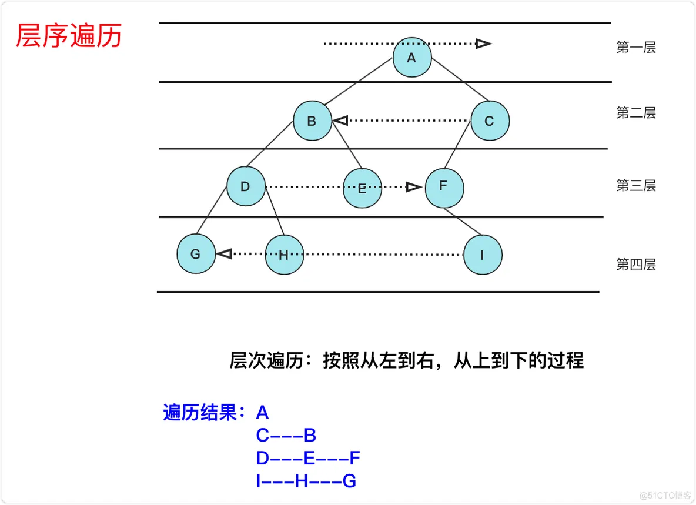

# 前置知识点
- [socket到底是什么](https://www.bilibili.com/video/BV12A411X7gY)
- [既然有HTTP为什么还要有RPC](https://www.bilibili.com/video/BV1Qv4y127B4)
- [既然有HTTP为什么还要有websocket](https://www.bilibili.com/video/BV1684y1k7VP)

# 什么是 RPC
像调用本地方法一样，调用远程服务

全称 Remote Procedure Call，远程过程调用，与之相对的是本地调用。
## 本地调用
运行在同一个程序（进程）里，A 方法调用 B 方法，不涉及网络传输。

## 远程调用
常规 HTTP 调用

RPC
order 模块注册一个 payment 的 client，client.pay() 建立一个请求 RPC 连接，实现远程调用。在 order 的代码块里，看上去就像是在调用本地方法。

目的：使开发者感受不到远程调用和本地调用的区别，感觉就像在调用同一个项目里的方法。

## 类比 HTTP，要解决的问题

- 函数映射,HTTP 不存在这个问题

- 网络传输,HTTP 的框架库会用成熟的网络库基于 TCP/UDP 传输

# 一个完整的 RPC 总共分几步
- 桩文件 → 序列化 → TCP

1. 定义 IDL 文件，编译工具生成 stub 桩文件，相当于生成了静态库，实现函数映射.IDL定义了服务接口的方法、输入参数和返回类型等信息，以及消息的结构和字段。
2. 网络里传输的数据都是二进制数据，需要把请求参数、返回结果进行 encode 和 decode
3. 根据 RPC 协议 约定数据头、元数据、消息体等，保证有 ID 能使请求和返回结果做到一一映射。
4. 基于成熟的网络库进行 TCP / UDP 传输

- 函数映射：静态代理，生成 stub 文件

对比建立 HTTP 请求连接，RPC 在编写代码时，降低了复杂度

stub 文件让远程调用看上去像是本地调用

- 序列化：为了生成二进制数据

HTTP/1 直接发送 JSON，明文传输

gRPC 以 protobuf 作为序列化协议

- 网络传输

自定义 RPC 协议实现通信，大厂几乎都用自定义 RPC 框架去自定义 RPC 协议。

使用成熟的网络库，实现多路复用、可靠传输。

# RPC 和 HTTP (以HTTP/1.1)对比
## HTTP2
- HTTP/2相比于HTTP/1.1具有更低的延迟和更高的吞吐量，支持多路复用、头部压缩、流量控制等特性，提供更高效的数据传输。

## 概念
HTTP 是应用层协议。

RPC 是远程过程调用，它是调用方式，对应的是本地调用。
- 所谓的 RPC 协议，实际上是基于 TCP、UDP、甚至 HTTP2 改造后的自定义协议。

## 编（解）码层
- 网络传输前，需要结构体转为二进制数据 → 序列化

### HTTP/1.1

额外空间开销大，没有类型，开发时需要通过反射统一解决。

序列化协议：JSON

### RPC

- 序列化后的体积比 JSON 小 ⇒ 传输效率高
- 序列化、反序列化速度快，开发时不需要通过反射 ⇒ 性能消耗低
- IDL 描述语义比较清晰。
- 序列化协议：以 gRPC 为代表的 Protobuf，其他也类似
  - Protocol Buffers是一种轻量级、高效的二进制序列化格式，具有良好的跨语言和跨平台支持,作为接口定义语言和序列化机制
  

## 通信协议约定
- 基于 TCP 传输，都会有消息头和消息体，区别在于消息头

### HTTP/1.1

优点是灵活，可以自定义很多字段。

缺点是包含许多为了适应浏览器的冗余字段，这些是内部服务用不到的。

### RPC

可定制化，自定义必要字段即可。

可摒弃很多 HTTP Header 中的字段，比如各种浏览器行为。

## 网络传输层
- 本质都是基于 Socket 通信

### HTTP/1.1

建立一个 TCP 长连接，设置 keep-alive 长时间复用这个连接。

框架中会引入成熟的网络库，给 HTTP 加连接池，保证不只有一个 TCP 连接可用。

### RPC

建立 TCP 连接池，框架也会引入成熟网络库来提高传输性能。

**比如：gRPC 基于 HTTP/2，拥有多路复用、优先级控制、头部压缩等优势。**

## RPC 的优势和不足
### 优势
相较于 HTTP/1.1，数据包更小、序列化更快，所以传输效率很高。

基于 TCP 或 HTTP/2 的自定义 RPC 协议，网络传输性能比 HTTP/1.1 更快。

适用于微服务架构，微服务集群下，每个微服务职责单一，有利于多团队的分工协作。

### 不足(所以rpc框架用来补足)
RPC 协议本身无法解决微服务集群的问题，例如：服务发现、服务治理等，需要工具来保障服务的稳定性。

调用方对服务端的 RPC 接口有强依赖关系，需要有自动化工具、版本管理工具来保证代码级别的强依赖关系。例如，stub 桩文件需要频繁更新，否则接口调用方式可能出错。

## RPC 和 HTTP 的使用场景
微服务架构下，多个内部服务调用频繁，适合用 RPC。

对外服务、单体服务、为前端提供的服务，适合用 HTTP，特别是 HTTP/2 性能也很好。

# RPC 框架职责
实现rpc一次完整的rpc流程，补足rpc的不足

## 编解码层
- 生成代码：代码生成工具将 IDL 文件转换成不同语言可以依赖的 lib 代码（类似于库函数）
- 序列化 & 反序列化：对象 ↔ 二进制字节流

### 选型
1. 安全性
   - 通用性：跨语言、跨平台
   - 兼容性：序列化协议升级后，保证原服务的稳定性 (比如Protobuf2升到3)

2. 性能
   - 时间：序列化反序列化的速度
   - 空间：序列化后的数据体积大小，体积越小，网络传输耗时越短

## 协议层
- 支持解析多种协议，包含 HTTP、HTTP2、自定义 RPC 协议、私有协议等。

### RPC 通信协议的设计
大厂内部大部分用自定义的 RPC 协议，灵活 + 安全

作用：TCP 通道中的二进制数据包，会被拆分、合并，需要应用层协议确定消息的边界（说人话：得知道哪几个二进制包是这一条请求）

- 协议构成

协议头 - 固定部分：整体长度、协议头长度、消息类型、序列化方式、消息 ID 等

协议头 - 扩展部分：不固定的扩展字段，各种协议 DIY 的字段

协议体：业务数据

## 网络传输层
一般使用成熟的网络通信框架（例如：Netty），会和 RPC 框架解耦

- IO 多路复用实现高并发，可靠传输

### 选型指标
易用：封装原生 socket API

性能：零拷贝、建立连接池、减少 GC 等

# RPC 热门框架
软件框架（远程过程调用框架）
## 跨语言调用型
- 典型代表：gRpc(google)，thrift(facebook,apache)
### gRpc
- gRpc主要面向移动应用开发且基于HTTP/2协议标准而设计，同时支持大多数流行的编程语言。
- gRPC使用Protocol Buffers作为接口定义语言（IDL），用于定义服务接口和消息结构。
- gRPC使用Protocol Buffers作为默认的序列化和反序列化机制。
- gRPC使用HTTP/2作为通信协议，基于二进制流传输数据。

### 特点：
- 提供最基础的 RPC 通信能力。
- 专注于跨语言调用，适合不同语言提供服务的场景。
- 没有服务治理等相关机制，需要借助其他开源工具去实现服务发现、负载均衡、熔断限流等功能。

## 服务治理型
- 典型代表：rpcx(国内个人)，kitex(字节)，dubbo（阿里）,Kratos (b站)

### 特点：
- 服务定义（函数映射）
- 多消息传输协议（序列化协议）
- 多网络通信协议（TCP、UDP、HTTP/2、QUIC 等）
- 提供最基础的 RPC 通信能力。
- 提供服务治理能力：服务发现、负载均衡、熔断限流等。

**go-zero是web和rpc框架， gin是web框架不是微服务框架**

# kitex例子
## 分层设计
调用层：封装服务，提供RPC调用接口

服务治理层：服务发现、负载均衡、熔断限流等

通信层：多网络通信协议、多消息传输协议（编解码、序列化、压缩）

## 服务治理层

### 服务端

服务注册：上报服务名和服务的 IP、端口

健康检测：第一时间让调用方知道服务出现问题

限流：过载保护，访问量过大，抛出限流异常

### 客户端

服务发现：根据服务名发现服务的 IP、端口

路由策略：实现流量隔离，应用于灰度发布、隔离联调环境

负载均衡：把请求分发到服务集群的每个服务节点

重试机制：捕获异常，根据负载均衡再次选择节点重发请求

故障熔断：确定下游异常，请求直接被截断，快速执行失败

## 其他基础功能
日志 Log

监控 Metric

链路追踪 Tracing

丰富的插件机制

https://go-kratos.dev/docs/ b站的kratos框架

# 服务注册与服务发现｜CAP｜心跳｜kitex 源码
**[服务发现b站-kitex源码解析](https://www.bilibili.com/video/BV1eN411U7UD)**

## 为什么需要服务注册与发现
- 定位：服务名 → 服务地址（服务节点）

**在 RPC 框架下发起 RPC 调用时，就像调用本地方法一样，意味着，Client 代码里写的是 Server 的服务名和方法名，需要一个机制，让 Client 根据服务名，查询到 Server 的 IP 和端口**

### DNS：域名 → IP
- DNS 多级缓存机制，导致 Client 不能及时感知到 Server 节点的变化
- DNS 不能注册端口，所以只能用来注册 HTTP 服务

## 三角模型：调用方 - 注册中心 - 被调服务

### 服务上线
- Server 启动后，向 Registry 注册自身信息
  - Registry 保存着所有服务的节点信息
  - Server 与 Registry 保持心跳，Registry 需要感知 Server 是否可用
- Client 第一次发起 RPC 调用前，向 Registry 请求服务节点列表，并把这个列表缓存在本地
  - Client 与 Registry 保持数据同步，服务节点有变化时，Registry 通知 Client，Client 更新本地缓存
- Client 发起 RPC 请求，Server 返回响应

### 服务下线
- Server 通知 Registry 当前节点（A）即将下线
- Registry 通知 Client，Server 的 A 节点下线
- Client 收到通知后，更新本地缓存的节点列表，选择 Server 的其他节点发请求
- Server 等待一段时间后（防止网络延迟，有一些存量请求需要处理），暂停服务并下线

### CAP理论
- 含义

C：一致性，所有节点同时看到的数据相同

A：可用性，任何时候都能被读写，至少有一个服务节点可用

P：分区容错性，部分节点出现网络故障时，整个系统对外还是能正常提供服务

**在分布式系统中，由于节点之间的网络通信会存在故障，可能存在服务节点的宕机，所以 P 是必须项**

在保证 P 的前提下， CA 难以同时满足，只能说在 CP 下尽量保证 A，在 AP 下尽量保证 C

- CP or AP
  - 选型：体量小，集群规模不大的时候，CP 可以满足需要,体量大，有大批量服务节点需要同时上下线，选择 AP
  - 注册中心可能会负载过高：有大量的节点变更的请求、服务节点列表下发不及时
  - 强一致性，就需要同步大量节点之间的数据，服务可能长时间不可用
  - CP：牺牲一定的可用性，保证强一致性，典型代表有 ZooKeeper、**etcd**
  - AP：牺牲一定的一致性，保证高可用性，典型代表有 Eureka、**Nacos,(比如redis集群)**

## 如何识别服务节点是否可用：心跳机制
- Client 实时感知 Server 节点变化，避免给不可用节点发请求
- 正常流程
  - Server 每隔几秒向 Registry 发送心跳包，收到响应则表示服务节点正常，在指定时间内没收到响应，则判定为失败
  - 注册中心发现某个节点不可用时，会通知 Client，Client 更新本地缓存的服务节点列表
- 特殊情况
  - 心跳断了不代表服务宕机，也许是网络抖动，不能判断出服务节点不可用
  - 发现心跳断了，Registry 立即通知 Client 某节点不可用，避免服务真的宕机时，仍然有请求发来
  - Registry 继续向 Server 发心跳，如果发几次心跳都是失败的，才认为服务节点不可用。如果心跳恢复，再告知 Client 服务节点可用
    - 重试策略：先连续发几次心跳，过一定时间间隔后再发心跳，需要考虑重试次数和重试间隔

# 负载均衡算法｜轮询｜一致性哈希
**[负载均衡b站-kitex源码解析](https://www.bilibili.com/video/BV1Ns4y1r7nR)**

## 负载均衡在解决什么问题
为了保证服务的可用性，一个应用会部署到多个节点上，这些节点构成服务集群，这也是分布式架构/微服务架构的显著特点之一。

- 如何把请求分发给集群下的每个节点，是负载均衡要解决的问题。这里的分发至少包含 2 个方面：
  - 请求尽量均匀地打在各个节点上，每个节点都能接收请求
  - 提高请求的性能，哪个节点响应最快，就优先调用哪个节点

## 有哪些负载均衡算法
### 随机、加权随机
  - 通过随机算法，生成随机数，节点足够多、访问量足够大时，每个节点被访问的概率基本相同
  - 适用场景：请求量大，各个节点的性能差异不大

### 轮询、加权轮询
- 按照固定顺序，挨个访问可用的服务节点
- 给节点赋权重，权重越大，被访问的概率越高
  - 如何调整节点的权重？成功+ 失败-
- 场景：存在新老机器，节点性能不同，发挥新节点的优势

### 哈希、一致性哈希

- 通过哈希函数把服务节点放到哈希环上
- 与本地缓存相结合，同一来源的请求计算出的哈希值相同，同一来源的请求都映射到同一节点，提高缓存的命中率
- 场景：不同客户端请求差异大，需要用到本地缓存

### 指标类
- 最少连接法
  - 用 Client - Server 间的连接数代表节点的负载
  - 场景：节点性能差异大，但不好提前做好权重定义
- 最少活跃数
  - 用活跃请求数（已经接收但没有返回的请求），代表负载
  - 缺陷：每个请求耗时不同，请求数不能代表实际负载
- 最快响应时间
  - 指标：平均耗时、TP99、TP999，选响应时间最短的