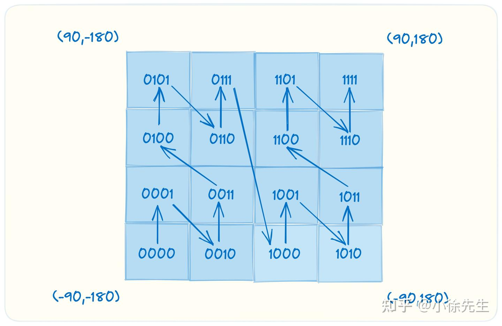

# struct tag
- 用途可以归纳为标记和扩展

在StructTag的应用中，使用最多的就是json的序列化了，序列化的包会读取tag内容，对json结果进行重命名输出
1. 了解这个Tag在整个语言段落处于什么层次

2. 利用反射读取并处理Tag的内容
   - reflect.StructTag(`json:"foo,omitempty" xml:"foo"`)
   - reflectType.Field(i).Tag.Get("json")

``` go
    // 使用reflect.StructTag解析这段文本的tag内容
	tag := reflect.StructTag(`json:"foo,omitempty" xml:"foo"`)
    // 直接使用Get获取json定义
	value := tag.Get("json")
	fmt.Printf("value: %q\n", value) // value: "foo,omitempty"
```

``` go
type Vehicle struct {
	ID             int    `json:"id"`
	CityName       string `json:"city_name"`
	Provider       string `json:"provider"`
	PlateNumber    string `json:"plate_number"`
	MaxPeople      int64  `json:"max_people"`
	PowerType      string `json:"power_type"`
}

reflectType := reflect.ValueOf(Vehicle{}).Type()
fmt.Printf("fields number: %v\n", reflectType.NumField())

for i := 0; i < reflectType.NumField(); i++ {
	fmt.Printf("%v", reflectType.Field(i).Name)
	fmt.Printf("  tag:%v\n", reflectType.Field(i).Tag.Get("json"))
}

// fields number: 6
// ID  tag:id
// CityName  tag:city_name
// Provider  tag:provider
// PlateNumber  tag:plate_number
// MaxPeople  tag:max_people
// PowerType  tag:power_type
```

## 开源项目gorm 来做事例，因为ORM最重要的部分映射和定义就是靠Tag来完成的
model_struct.go文件，在GetModelStruct方法
``` go
    //通过反射获取类型定义
  reflectType := reflect.ValueOf(scope.Value).Type()
	for reflectType.Kind() == reflect.Slice || reflectType.Kind() == reflect.Ptr {
		reflectType = reflectType.Elem()
	}
	
	.......

    // 对每一项进行tag的获取和逻辑
    // Get all fields
	for i := 0; i < reflectType.NumField(); i++ {
		if fieldStruct := reflectType.Field(i); ast.IsExported(fieldStruct.Name) {

		......

		field.TagSettingsGet("PRIMARY_KEY")
		......
		if value, ok := field.TagSettingsGet("COLUMN"); ok {
			field.DBName = value
		} else {
			field.DBName = ToColumnName(fieldStruct.Name)
		}
		......
```

## json标准库的struct tag的value不区分大小写

``` go
// josn标签里的大小写 不影响json字符串里字段的解析（这里大小写不影响）
type Student1 struct {
	Name string `json:"name"`
	Age  int    `json:"AgE"` // 不区分大小写aGe一样能解析到
}

func TestXxx(t *testing.T) {
	stu := "{\"Name\":\"zhangsan\",\"aGe\":18}"
	var s Student1
	err := json.Unmarshal([]byte(stu), &s)
	if err != nil {
		fmt.Println(err)
		return
	}
	fmt.Println(s.Name, s.Age)
}
```

https://blog.51cto.com/u_16701217/10752683

# json的坑
[深入理解 Go Json.Unmarshal 精度丢失之谜](https://www.51cto.com/article/697019.html)
## int64序列化后变成string
- protobuf定义字段类型int64，go接口返回变成字符串问题
``` go
message TestReply{
	int32 tInt = 1;
	int64 tInt64 = 2;
	string tString = 3;
}

func (s *CustomService) Test(ctx context.Context, req *pb.TestRequest) (*pb.TestReply, error) {
	return &pb.TestReply{
		TInt:    req.TInt,
		TInt64:  int64(req.TInt),
		TString: strconv.Itoa(int(req.TInt)),
	}, nil
}
```
当使用Kratos框架返回int64字段时，Kratos默认会将整型字段输出为字符串。这是因为在HTTP传输中，整型数据会被序列化为JSON格式，而JSON中只支持字符串、数字、布尔值、数组和对象等数据类型。所以为了保持数据的类型完整性，Kratos会将整型字段以字符串形式输出。如果需要将整型字段作为数字类型输出，可以通过类型转换等方式进行处理。这是为了避免在前端处理过程中丢失精度。如果希望将int64字段直接以数字类型输出，可以将其转换为int类型，或者在序列化过程中使用特定的库或选项来实现。例如，使用jsoniter库可以将int64字段直接序列化为数字类型

## float64精度丢失
json反序列化时是没有整型和浮点型的区别，数字都使用同一种类型，在go语言的类型中这种共同类型就是float64。但是float64存在精度缺失的问题，因此go单独对此给出了一个解决方案：
- 使用 json.Decoder 来代替 json.Unmarshal 方法
该方案首先创建了一个 jsonDecoder，然后调用了 UseNumber 方法
使用 UseNumber 方法后，json 包会将数字转换成一个内置的 Number 类型(本质是string)，Number类型提供了转换为 int64、float64 等多个方法
  - <font color="red">json.NewDecoder是从一个流里面直接进行解码，代码更少，可以用于http连接与socket连接的读取与写入，或者文件读取</font>
  - json.Unmarshal是从已存在内存中的json字符串进行解码
  
``` go
// A Number represents a JSON number literal. 
type Number string 
 
// String returns the literal text of the number. 
func (n Number) String() string { return string(n) } 
 
// Float64 returns the number as a float64. 
func (n Number) Float64() (float64, error) { 
    return strconv.ParseFloat(string(n), 64) 
} 
 
// Int64 returns the number as an int64. 
func (n Number) Int64() (int64, error) { 
    return strconv.ParseInt(string(n), 10, 64) 
} 
```
## 场景
- 下游服务收到的json字符串中的唯一ID是没问题的，和上游一致
- 下游服务经过json.unmarshal反序列化之后唯一ID发生了变化，和上游不一致
  - id从7044144249855934983变成了7044144249855935000，从有效数字16位之后变为000了 (精度丢失了)
## 原因
1. 上游的json字符串格式不确定无法使用struct来做反序列化，<font color="red">只能借助于interface{}来接收数据</font>
2. 上游的json所传的id是数值类型，换成字符串类型则没有这种问题（类型变更）
3. 上游的json所传的id数值比较大，<font color="red">超过了float64的安全整数范围 （精度丢失）</font>
## 解决方案有两种：
1. 上游将id改为string传给下游
2. 下游使用json.number类型来避免对float64的使用, 本质也是string
``` go
func main() { 
 var request = `{"id":7044144249855934983}` 
 
 var test interface{} 
 
 decoder := json.NewDecoder(strings.NewReader(request)) // 从一个流里进行解码
 decoder.UseNumber() 
 err := decoder.Decode(&test) 
 if err != nil { 
  fmt.Println("error:", err) 
 } 
 
 objStr, err := json.Marshal(test) // 进行编码
 if err != nil { 
  fmt.Println("error:", err) 
 } 
 
 fmt.Println(string(objStr)) 
} 
```
## json字符串里的字段大小写和json数组（对象数组）
- josn标签里的大小写 不影响json字符串里字段的解析（这里大小写不影响）
- 如果是数组map[string]any就变成[]map[string]any
``` go
type Student1 struct {
	Name string `json:"name"`
	Age  int    `json:"AgE"`
}

func TestXxx(t *testing.T) {
	stu := "{\"Name\":\"zhangsan\",\"aGe\":18}"
	var s Student1
	err := json.Unmarshal([]byte(stu), &s)
	if err != nil {
		fmt.Println(err)
		return
	}
	fmt.Println(s.Name, s.Age)
}

// json字符串数组
func TestXxx2(t *testing.T) {
	stu := "[{\"Name\":\"zhangsan\",\"aGe\":18},{\"Name\":\"lisi\",\"aGe\":22}]"
	var s []Student1
	err := json.Unmarshal([]byte(stu), &s)
	if err != nil {
		fmt.Println(err)
		return
	}

	for _, v := range s {
		fmt.Println(v.Name, v.Age)
	}

	var unMap []map[string]interface{}
	err = json.Unmarshal([]byte(stu), &unMap)
	fmt.Println(unMap)
}
```

# mapstructure 转化map与struct

## 解码到对应的 Go 结构体

- <font color="red">**先用json.Unmarshal将字节流解码为map[string]interface{}类型。**</font>然后读取里面的type字段。根据type字段的值（类型断言），再使用mapstructure.Decode将该map分别解码为不同结构体类型的值
- `mapstructure.Decode(map[string]interface,*struct)` 函数
- Google Protobuf 通常也使用这种方式。在协议中添加消息 ID 或全限定消息名。接收方收到数据后，先读取协议 ID 或全限定消息名。然后调用 Protobuf 的解码方法将其解码为对应的Message结构。
  
1. map[string]interface的键值将对应字段赋值到结构体时忽略大小写<font color="red">(忽略的是json字符串key的大小写)；</font>
2. <font color="red">结构体中所有字段名必须以大写字母开头，否则将无法赋值</font>
3. 使用mapstructure.Decode()方法不能转化<font color="red">携带_特殊符号的结构体字段</font>的变量名
  - <font color="red">必须加标签 mapstructure:"deep_conversion_type" 才能转化</font>，才能找到DeepConversionType, 如果是结构体本身字段是携带_下划线，就算加了也没法识别

### 字段标签（实战常用）
- <font color="red">`mapstructure:"customname"`</font>
- 默认使用结构体中字段的名称做这个映射，且不区分大小写 (比如Name字段)
- mapstructure解码时会在map[string]interface{}中查找键名（name）
- 如果映射的字段名不一致比如 customname与name， JSON 串中我们需要设置customname才能正确解析

### 结构体内嵌 squash （内嵌的时候无该外层的字段名才使用）
- <font color="red">设置mapstructure:",squash"将该结构体的字段提到父结构中</font>
- 如果父结构体中有同名的字段，那么mapstructure会将JSON 中对应的值同时设置到这两个字段中，即这两个字段有相同的值

``` go

type Person struct {
  Name string
}
// 方式一
type Friend1 struct {
  Person
}

// 方式二
// type Friend struct {
//   Person Person
// }
// map[string]interface{} {
//   "person": map[string]interface{}{"name": "dj"},
// }

type Friend2 struct {
  Person `mapstructure:",squash"` // 将该结构体的字段提到父结构中
}

func main() {
	// 这里切片
  datas := []string{`
    { 
      "type": "friend1",
      "person": {
        "name":"dj"
      }
    }
  `,
    `
    {
      "type": "friend2",
      "name": "dj2"
    }
  `,
  }

  for _, data := range datas {
    var m map[string]interface{}
    err := json.Unmarshal([]byte(data), &m) // json字符串反序列化 使用了map[string]interface{}接收
    if err != nil {
      log.Fatal(err)
    }
	// 使用mapstructure 转化map与struct
    switch m["type"].(string) {
    case "friend1":
      var f1 Friend1
      mapstructure.Decode(m, &f1)
      fmt.Println("friend1", f1)

    case "friend2":
      var f2 Friend2
      mapstructure.Decode(m, &f2)
      fmt.Println("friend2", f2)
    }
  }
}
```

- 实战反序列化后map[string]any转结构体
``` go

type DeepConversionSpec struct {
	DeepConversionType string                      `mapstructure:"deep_conversion_type"`
	Behavior           *DeepConversionBehaviorSpec `mapstructure:"deep_conversion_behavior_spec"`
	Worth              *DeepConversionWorthSpec    `mapstructure:"deep_conversion_worth_spec"`
}

type DeepConversionBehaviorSpec struct {
	BidAmount int    `mapstructure:"bid_amount"`
	Goal      string `mapstructure:"goal"`
}

type DeepConversionWorthSpec struct {
	ExpectedRoi float64 `mapstructure:"expected_roi"`
	Goal        string  `mapstructure:"goal"`
}
// 如果反序列化后的 map 无最外层字段 才使用squash，且同名字段时，使用对应结构体类型再指定
xxx
// map[deep_conversion_behavior_spec:map[bid_amount:18000 goal:OPTIMIZATIONGOAL_FIRST_PURCHASE] deep_conversion_type:DEEP_CONVERSION_BEHAVIOR]

deepConversionSpec := DeepConversionSpec{}
// json.Unmarshal将字节流解码为map[string]interface{}类型（里面还可能继续内嵌）
mapstructure.Decode(xxx, &deepConversionSpec)
// 转为 deepConversionSpec#{DeepConversionType:DEEP_CONVERSION_BEHAVIOR Behavior:0x140009ab0b0 Worth:\u003cnil\u003e}

// 反序列化的时候 是否能这样判断
if deepConversionSpec.DeepConversionType != "" {
  // 类型
  info.DeepConversionType = deepConversionSpec.DeepConversionType
  if info.DeepConversionType == "DEEP_CONVERSION_BEHAVIOR" {
    info.DeepConversionBehaviorBid = deepConversionSpec.Behavior.BidAmount
    info.DeepConversionGoal = deepConversionSpec.Behavior.Goal
  }
  if info.DeepConversionType == "DEEP_CONVERSION_WORTH" {
    info.ExpectedRoi = deepConversionSpec.Worth.ExpectedRoi
    info.DeepConversionGoal = deepConversionSpec.Worth.Goal
  }
}

xxx
``` 

### 未映射的值
- 源数据中有未映射的值（即结构体中无对应的字段），mapstructure默认会忽略它。
- 设置mapstructure:",remain"标签。这样未映射的值就会添加到这个字段中。注意，这个字段的类型只能为map[string]interface{}或map[interface{}]interface{}
``` go
type Person struct {
  Name  string
  Age   int
  Job   string
  Other map[string]interface{} `mapstructure:",remain"` // 未映射的值就会添加到这个字段中
}

func main() {
  data := `
    { 
      "name": "dj",
      "age":18,
      "job":"programmer",
      "height":"1.8m",
      "handsome": true
    }
  `

  var m map[string]interface{}
  err := json.Unmarshal([]byte(data), &m) // json字符串反序列化成map
  if err != nil {
    log.Fatal(err)
  }

  var p Person
  mapstructure.Decode(m, &p) // map与struct转化
  fmt.Println("other", p.Other) // other map[handsome:true height:1.8m]
}
```

## 结构体反向解码为map[string]interface{}
- 将Go结构体反向解码为map[string]interface{}
- 反向解码 `mapstructure.Decode(*struct,*map[string]interface)` 函数
- 设置mapstructure:",omitempty"。这样当这些字段为默认值时，就不会出现在结构的map[string]interface{}中
``` go
type Person struct {
  Name string
  Age  int
  Job  string `mapstructure:",omitempty"`
}

func main() {
  p := &Person{
    Name: "dj",
    Age:  18,
  }

  var m map[string]interface{}
  mapstructure.Decode(p, &m)

  data, _ := json.Marshal(m) // map序列化成json字符串
  fmt.Println(string(data)) // {"Age":18,"Name":"dj"}
}
```

## Metadatas数据
- 需要使用DecodeMetadata来代替Decode方法, 收集解码时会产生的信息
- 数据结构
``` go
// mapstructure.go
type Metadata struct {
  Keys   []string // 解码成功的键名
  Unused []string // 在源数据中存在，但是目标结构中不存在的键名
}
```

``` go
type Person struct {
  Name string
  Age  int
}

func main() {
  m := map[string]interface{}{
    "name": "dj",
    "age":  18,
    "job":  "programmer", // 源数据中存在,标结构中不存在
  }

  var p Person
  var metadata mapstructure.Metadata
  mapstructure.DecodeMetadata(m, &p, &metadata) // 该方法代替Decode

  fmt.Printf("keys:%#v unused:%#v\n", metadata.Keys, metadata.Unused) 
  // keys:[]string{"Name", "Age"} unused:[]string{"job"}
}
```

## 错误处理
- JSON 中某个键的类型与对应 Go 结构体中的字段类型不一致。Decode/DecodeMetadata会返回这些错误. err.Error()
## 弱类型输入
- 使用WeakDecode/WeakDecodeMetadata方法，它们会尝试做类型转换。就不会报错
- 如果类型转换失败了，WeakDecode同样会返回错误
``` go
type Person struct {
  Name   string
  Age    int
  Emails []string
}

func main() {
  m := map[string]interface{}{
    "name":   123,
    "age":    "18", // 如果是 "abc", WeakDecode类型转换int失败, 同样会返回错误
    "emails": []int{1, 2, 3},
  }

  var p Person
  err := mapstructure.WeakDecode(m, &p)
  if err == nil {
    fmt.Println("person:", p)
  } else {
    fmt.Println(err.Error())
  }
}
```

## 解码器 Decoder对象
- <font color="red">**Decode/DecodeMetadata/WeakDecodeMetadata内部都是先设置DecoderConfig的对应字段，然后创建Decoder对象，最后调用其Decode方法实现的。**</font>
- 配置项数据结构
``` go
// mapstructure.go
type DecoderConfig struct {
  DecodeHook DecodeHookFunc // 钩子函数
	ErrorUnused       bool // 为true时，如果输入中的键值没有与之对应的字段就返回错误
  ErrorUnset bool
	ZeroFields        bool // 为true时，在Decode前清空目标map。为false时，则执行的是map的合并。用在struct到map的转换中；
	WeaklyTypedInput  bool // 实现WeakDecode/WeakDecodeMetadata的功能
	Metadata          *Metadata // 不为nil时，收集Metadata数据
	Result            interface{} // 结果对象，在map到struct的转换中，Result为struct类型。在struct到map的转换中，Result为map类型
	TagName           string // 作为结构体的标签名，可以通过该字段设置
  IgnoreUntaggedFields bool
  MatchName func(mapKey, fieldName string) bool
}

// mapstructure.go 本质都是创建Decoder对象，最后调用其Decode方法实现
func WeakDecode(input, output interface{}) error {
  config := &DecoderConfig{
    Metadata:         nil,
    Result:           output,
    WeaklyTypedInput: true,
  }

  decoder, err := NewDecoder(config)
  if err != nil {
    return err
  }

  return decoder.Decode(input)
}
```

``` go
type Person struct {
  Name string
  Age  int
}

func main() {
  m := map[string]interface{}{
    "name": 123,
    "age":  "18",
    "job":  "programmer",
  }

  var p Person
  var metadata mapstructure.Metadata

  decoder, err := mapstructure.NewDecoder(&mapstructure.DecoderConfig{
    WeaklyTypedInput: true,
    Result:           &p,
    Metadata:         &metadata,
  })

  if err != nil {
    log.Fatal(err)
  }

  err = decoder.Decode(m)
  if err == nil {
    fmt.Println("person:", p)
    fmt.Printf("keys:%#v, unused:%#v\n", metadata.Keys, metadata.Unused)
  } else {
    fmt.Println(err.Error())
  }
}
```

## hook
``` go
func hook(f reflect.Type, t reflect.Type, data interface{}) (interface{}, error) {
	switch f.Kind() {
	case reflect.Float32:
		return fmt.Sprintf("%.2f", data.(float32)), nil
	case reflect.Float64:
		return fmt.Sprintf("%.2f", data.(float64)), nil
	case reflect.Ptr:
		if f, ok := data.(*float32); ok {
			return fmt.Sprintf("%.2f", *f), nil
		}
		if f, ok := data.(*float64); ok {
			return fmt.Sprintf("%.2f", *f), nil
		}
	}
	return data, nil
}


	ckModel := &models.ClickhouseMetrics{}
	decoderConfig := mapstructure.DecoderConfig{Result: ckModel, WeaklyTypedInput: true, DecodeHook: hook, TagName: "json"}
	decoder, err := mapstructure.NewDecoder(&decoderConfig) // 使用了hook
	if err != nil {
		return nil, err
	}
	err = decoder.Decode(data)
	if err != nil {
		return nil, err
	}
```

# gjson解析
[gjson实际上是get + json的缩写，用于读取 JSON 串](https://darjun.github.io/2020/03/22/godailylib/gjson/)

- github.com/tidwall/gjson  读取 JSON 串中键值
- 参数为键的路径， 正则相关处理
  - 包含通配符*和?，*匹配任意多个字符，?匹配单个字符
  - 数组使用键名 + . + 索引（索引从 0 开始）的方式读取元素  
  - 数组长度使用**键名 + . + #**获取
  - 键名中出现.，那么需要使用\进行转义
- 修饰符@, 以|分隔键路径和修饰符。
  - 自定义修饰符，了解就行
- json行, 提供..语法可以将多行数据看成一个数组，每行数据是一个元素
- 遍历, gjson.Get()方法返回一个gjson.Result类型的对象，json.Result提供了ForEach()方法用于遍历
- 校验 JSON, gjson.Valid()。因为传入的 JSON 串是合法的。如果 JSON 非法gjson.Get()也不会panic
- 一次取多个值, gjson.Get()一次只能读取一个值, gjson提供了GetMany()可以一次读取多个值，返回一个数组[]gjson.Result。
``` go
func main() {
  json := `{"name":{"first":"li","last":"dj"},"age":18}`
  lastName := gjson.Get(json, "name.last")
  fmt.Println("last name:", lastName.String())

  age := gjson.Get(json, "age")
  fmt.Println("age:", age.Int())
}
```

# sjson
[同样的还有一个sjson（set + json）库用来设置 JSON 串](https://darjun.github.io/2020/03/24/godailylib/sjson/)
- github.com/tidwall/sjson, 设置 JSON 串中的值
- <font color="red">如果传入sjson不支持的类型，sjson会调用json.Marshal序列化，</font>然后将生成的字符串设置到对应的键路径
- 支持类型包括nil/bool/int/float/string
- 键路径，与gjson相比，sjson能使用的键路径语法比较有限，不能使用通配符和一些条件语法。 会返回错误error
- sjson.Set()会生成一个空对象，然后按照键路径依次设置值
- 修改数组,使用-1或数组长度为索引表示在数组后添加一个新元素,使用的索引超出数组的长度，会在数组中添加很多null值
- 删除数组元素, 需要调用sjson.Delete()方法，键路径语法相同。如果键路径对应的值不存在，则Delete()无效果
- 错误处理， 一种是传入的 JSON 串不是合法的串(同gjson一样，sjson同样不会检查传入的 JSON 串的合法性)，另一种是键路径语法错误

``` go

func main() {
  json := `{"name":{"first":"li","last":"dj"},"age":18}`
  value, _ := sjson.Set(json, "name.last", "dajun")
  fmt.Println(value) // {"name":{"first":"li","last":"dajun"},"age":18}
}
```

# mergo 合并结构体字段的
[mergo 合并结构体字段的](https://darjun.github.io/2020/03/11/godailylib/mergo/)

- github.com/imdario/mergo 可以在相同的结构体或map之间赋值，可以将结构体的字段赋值到map中，可以将map的值赋值给结构体的字段
- mergo提供了两组接口
  - Merge：合并两个相同类型的结构或map
  - Map：在结构和map之间赋值
  - 参数 1 是目标对象，参数 2 是源对象 <font color="red">将源对象中的字段复制到目标对象的对应字段上。</font>
    - 思考：如果仅仅只是复制结构体，为啥不直接写redisConfig = defaultConfig呢? （因为有高级选项模式）
- mergo不会赋值非导出字段；结构体字段要大写, 结构体字段名合并到map，map的key会是首字母小写
- mergo可嵌套赋值，我们演示的只有一层结构。
- mergo其实在很多知名项目中都有应用，如moby/kubernetes

``` go

type redisConfig struct {
  Address string
  Port    int
  DB      int
}

var defaultConfig = redisConfig{
  Address: "127.0.0.1",
  Port:    6381,
  DB:      1,
}

func main() {
  var config redisConfig
  // 合并到结构体 如果仅仅只是复制结构体，为啥不直接写redisConfig = defaultConfig呢
  if err := mergo.Merge(&config, defaultConfig); err != nil {
    log.Fatal(err)
  }

  fmt.Println("redis address: ", config.Address)
  fmt.Println("redis port: ", config.Port)
  fmt.Println("redis db: ", config.DB)

  // 结构体合并到map 赋值 字段名转成map的key会是首字母小写
  var m = make(map[string]interface{})
  if err := mergo.Map(&m, defaultConfig); err != nil {
    log.Fatal(err)
  }

  fmt.Println(m)
}

```

 
## 高级选项(选项模式)
- 覆盖选项：(WithOverride), 默认情况下，如果目标对象的字段已经设置了，那么Merge/Map不会用源对象中的字段替换它

``` go
if err := mergo.Merge(&config, defaultConfig, mergo.WithOverride); err != nil {
  log.Fatal(err)
}
```
- 切片：（WithAppendSlice）如果某个字段是一个切片，不覆盖就保留目标对象的值，或者用源对象的值覆盖都不合适。
``` go
type redisConfig struct {
  Address string
  Port    int
  DBs     []int
}

var defaultConfig = redisConfig{
  Address: "127.0.0.1",
  Port:    6381,
  DBs:     []int{1},
}

func main() {
  var config redisConfig
  config.DBs = []int{2, 3}

  if err := mergo.Merge(&config, defaultConfig, mergo.WithAppendSlice); err != nil {
    log.Fatal(err)
  }
  fmt.Println("redis dbs: ", config.DBs)
  // 将DB字段改为[]int类型的DBs，使用WithAppendSliec选项，最后输出的DBs为[2 3 1]
}
```

- 空值覆盖:(WithOverrideEmptySlice, WithOverwriteWithEmptyValue), 默认情况下，如果源对象中的字段为空值,使用了WithOverride选项也是不会覆盖的
  - 必须和WithOverride一起使用
  - WithOverwriteWithEmptyValue, 也可以处理切片类型的值
``` go
var defaultConfig = redisConfig{
  Address: "127.0.0.1",
  Port:    6381,
}

func main() {
  var config redisConfig
  config.DBs = []int{2, 3}

  if err := mergo.Merge(&config, defaultConfig, mergo.WithOverride, mergo.WithOverrideEmptySlice); err != nil {
    log.Fatal(err)
  }
  fmt.Println("redis dbs: ", config.DBs)  // []
}
```

- 类型检查, 主要用在map之间的切片字段的赋值
  - 因为map类型为map[string]interface{}，所以默认情况下，map切片类型不一致也是可以赋值的
  - 添加mergo.WithTypeCheck选项，则切片类型不一致会抛出错误

``` go
func main() {
  m1 := make(map[string]interface{})
  m1["dbs"] = []uint32{2, 3}

  m2 := make(map[string]interface{})
  m2["dbs"] = []int{1}

  // if err := mergo.Map(&m1, &m2, mergo.WithOverride); err != nil {
  //   log.Fatal(err)
  // }

  if err := mergo.Map(&m1, &m2, mergo.WithOverride, mergo.WithTypeCheck); err != nil {
      log.Fatal(err) // cannot override two slices with different type ([]int, []uint32)
  }

  fmt.Println(m1)
}

```