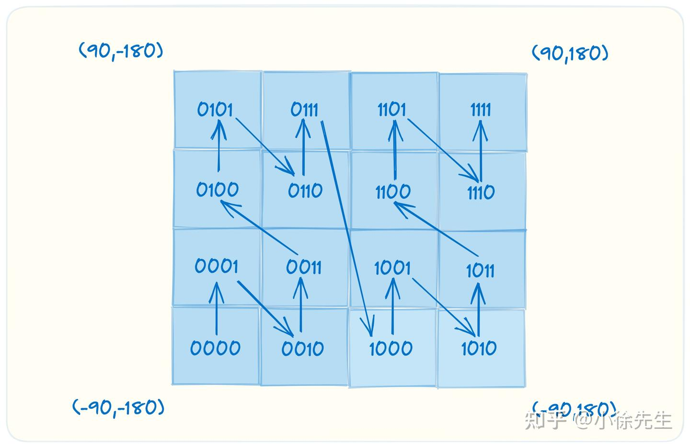

# 为什么是 2006-01-02 15:04:05 -0700

- 为什么没有像其他语言一样，yyyy-mm-dd 这样的形式

比如常规的 ymd 格式，**以 PHP 为例，一般这样 Y-m-d H:i:s**，输出类似：2021-08-03 09:30:00。虽然常用的形式，大部分人都记得，但遇到不怎么常用的，就得查手册了。如想输出：21-8-4 9:30:00

Go 语言，它直接使用一个具体的时间来当做格式化字符串，需要什么格式，改这个时间格式即可。比如上面的例子，常规方式：2006-01-02  15:04:05，而 21-8-4 9:30:00 这种格式，<font color="red">只需要对应的改变值即可：06-1-2 3:04:05。</font>而且，我查了下，**PHP 没法表示没有前导零的分钟数和秒数，而 Go 很容易实现**。很显然，Go 的方式是更合理、更易用的，对于各种变化，也能够更自如的应对。

# 设计
``` go
含有的数字分表对应的 日期格式话
1: month (January, Jan, 01, etc)
2: day
3: hour (15 is 3pm on a 24 hour clock)
4: minute
5: second
6: year (2006，06) 年
7: timezone (GMT-7 is MST) 时区

// 相关数字或英文 模板
年         06/2006
月         01/1/Jan/January
日         02/2/_2
星期       Mon/Monday
小时       03/3/15
分         04/4
秒         05/5
毫秒       .000/.999
微秒       .000000/.999999
纳秒       .000000000/.999999999
am/pm     PM/pm
时区       MST UTC CST
时区小时数差-0700/-07/-07:00/Z0700/Z07:00
```

- <font color="red">刚好是 1 2 3（15） 4 5 6 7，据此进行变化即可。</font>
- 比如官方定义的常量（layout模板便于使用的字符串常量）（英文也是一样）
``` go
Jan一月  Mon星期一 
const (
    ANSIC       = "Mon Jan _2 15:04:05 2006"
    UnixDate    = "Mon Jan _2 15:04:05 MST 2006"
    RubyDate    = "Mon Jan 02 15:04:05 -0700 2006"
    RFC822      = "02 Jan 06 15:04 MST"
    RFC822Z     = "02 Jan 06 15:04 -0700" // RFC822 with numeric zone
    RFC850      = "Monday, 02-Jan-06 15:04:05 MST"
    RFC1123     = "Mon, 02 Jan 2006 15:04:05 MST"
    RFC1123Z    = "Mon, 02 Jan 2006 15:04:05 -0700" // RFC1123 with numeric zone
    RFC3339     = "2006-01-02T15:04:05Z07:00"
    RFC3339Nano = "2006-01-02T15:04:05.999999999Z07:00"
    Kitchen     = "3:04PM"
)
```
- **按 ANSIC 标准的日期格式，月、日、时、分、秒、年，最后加 MST 时区。对应就是 1 2 3 4 5 6 7。<font color="red">同时还可以随意加星期几。</font>**

# 时区概念
- 时间戳是自 1970 年 1 月 1 日（08:00:00GMT）至当前时间的总毫秒数。它也被称为 Unix 时间戳（UnixTimestamp）
- GMT（Greenwich Mean Time），格林威治平时。GMT 根据地球的自转和公转来计算时间，它规定太阳每天经过位于英国伦敦郊区的皇家格林威治天文台的时间为中午12点。GMT 是前世界标准时。
- UTC（Coordinated Universal Time），协调世界时。<font color="red">UTC 比 GMT 更精准，它根据原子钟来计算时间。在不需要精确到秒的情况下，可以认为 UTC=GMT。UTC 是现世界标准时。0时区</font> 
## 常见8小时问题
- 从格林威治本初子午线起，往东为正，往西为负，全球共划分为 24 个标准时区，相邻时区相差一个小时。 标准时间
  - 中国大陆使用的是东八时区的标准时，即北京时间 CST，China Standard Time
  - 在美国洛杉矶时区下, 即 PDT（Pacific Daylight Time）太平洋夏季时间
  - 北美山区标准时间, MST是UTC-7时区的知名名称之一，比UTC（协调世界时）落后7个小时

``` go
func main() {
 fmt.Println(time.Now())
}
// 使用命令行允许
$ go run main.go 
2023-07-17 16:37:31.186043 +0800 CST m=+0.000066647 //CST 比UTC多八小时 +8
// 由于时区差异，两次执行的时间结果相差了 15 小时。
$ TZ="America/Los_Angeles" go run main.go
2023-07-17 01:39:12.391505 -0700 PDT m=+0.000069514

// 时区问题的应对策略，可以详细查看 src/time/zoneinfo_unix.go 中 initLocal() 函数的加载逻辑。例如，可以通过指定环境变量 TZ，修改/etc/localtime文件等方式来解决。
```
- 由于时区差异，两次执行的时间结果相差了 15 小时。
- <font color="red">在使用 Docker 容器时，系统默认的时区就是 UTC 时间（0 时区），和我们实际需要的北京时间相差八个小时，这是导致八小时时间差问题的经典场景。</font>

# time包

**<font color="red">Duration与Time的互转，获取和转化。以及字符串格式化</font>**

## 时间类型(重点)
- <font color="red">时间瞬间: time.Time</font>,表示时间的类型，常见的获取时间有两种方式：
  - time.Now()：获取当前的时间
  - time.Date(year int, month Month, day, hour, min, sec, nsec int, loc *Location)：根据指定的年、月、日、时、分、秒、纳秒等创建时间
  - wall 和 ext 字段就是用于记录墙上时钟和单调时钟，精度为纳秒。字段的对应位数上关联着用于确定时间的具体年、月、日、小时、分钟、秒等信息。
  - 因为 time.Time 用于表示具有纳秒精度的时间瞬间，在程序中通常应该将它作为值存储和传递，而不是指针。<font color="red">**即在时间变量或者结构体字段中，我们应该使用 time.Time，而非 *time.Time。**</font>
  - time.Unix(sec int64, nsec int64), 根据时间戳生成瞬时时间
  - <font color="red">本质都是直接Time{uint64(nsec), sec + unixToInternal, Local}, 时区设置是setLoc(loc) </font>
  
``` go
// 用以表示某个瞬间的时间。
type Time struct {
    wall uint64 // 墙上时钟（wall time），又称为钟表时间，用于表示具体的日期与时间
	ext  int64 // 单调时钟（monotonic clocks），总是保证时间是向前的，不会出现墙上时钟的回拨问题，因此它很适合用于测量持续时间段
    loc *Location // loc 字段记录时区位置，当 loc 为 nil 时，默认为 UTC 时间
}
// 当前瞬时时间
func Now() Time {...}
// 指定时间点的瞬时时间
func Date(year int, month Month, day, hour, min, sec, nsec int, loc *Location) Time {...}
// 指定时间戳的瞬时时间（秒数）
func Unix(sec int64, nsec int64) Time {...}

// 比如time.Date(2020, 1, 1, 0, 0, 0, 0, time.Local)
```

- 持续时间：time.Duration：表示两个时间点之间经过的时间，<font color="red">以纳秒为单位, 本质就是int64</font>,能表示的极限大约为 290 年。
``` go
type Duration int64

// 从过去瞬时t到当前瞬时的持续时间
func Since(t Time) Duration {...}
// 从未来瞬时t到当前瞬时的持续时间
func Until(t Time) Duration {...}

 t := time.Now()
 fmt.Println(time.Since(t))          // 5.004442316s
 // 1 年之后的时间
 t1 := t.AddDate(1, 0, 0)
 fmt.Println(time.Until(t1))         // 8759h59m59.999864s
```
- Since函数是 time.Now().Sub(t) 的快捷方法。 Until 函数是 t.Sub(time.Now()) 的快捷方法。

- 时间常量
``` go
const (
	Nanosecond  Duration = 1 // 纳秒
	Microsecond          = 1000 * Nanosecond
	Millisecond          = 1000 * Microsecond // 毫秒
	Second               = 1000 * Millisecond
	Minute               = 60 * Second
	Hour                 = 60 * Minute
)

// 获取各时间粒度数值的方法 Nanoseconds Microseconds
func (d Duration) Milliseconds() int64 { return int64(d) / 1e6 }
// Seconds Minutes Hours
func (d Duration) Seconds() float64 {
	sec := d / Second
	nsec := d % Second
	return float64(sec) + float64(nsec)/1e9
}
```

## 时间操作
### 瞬时时间与持续时间类型转换
``` go
func (t Time) UTC() Time {...} // 转为UTC时区的瞬时时间（默认）
func (t Time) Local() Time {...} // 转为当前设置时区的瞬时时间

// 转换秒、毫秒、纳秒…时间戳
func (t Time) Unix() int64 {...}// UnixMilli毫秒 UnixMicro微妙 UnixNano纳秒
// 获取基本字段  Date日期-2022 6 17 Year Month (January) Day Hour Minute Second Weekday (Sunday)  YearDay本年第几天
func (t Time) Date() int {...}
func (t Time) Year() int {...}
func (t Time) Month() Month {} // 定义了类型 重写了String方法, 所以打印时时字符串
func (t Time) Weekday() Weekday {}
// 时间计算
// 两个时间瞬间之间的持续时间。
func (t Time) Sub(u Time) Duration {...}

// 用于增加/减少（ d 的正值表示增加、负值表示减少） time.Time 的持续时间。我们可以对某瞬时时间，增加或减少指定纳秒级以上的时间。
func (t Time) Add(d Duration) Time {...}

// 基于年、月和日的维度增加/减少 time.Time 的值。
func (t Time) AddDate(years int, months int, days int) Time {...}
```
1. 疑问1:瞬时时间打印月份时是字符串月份英文 January 同理Weekday


### layout模板字符串，在time包有逐步一些常量模板字符串
- layout为go模板必须是 2006-01-02 15:04:05 相关数字或英文组成的字符串
``` go
const (
 Layout      = "01/02 03:04:05PM '06 -0700" // The reference time, in numerical order.
 ANSIC       = "Mon Jan _2 15:04:05 2006"
 UnixDate    = "Mon Jan _2 15:04:05 MST 2006"
 ...
)

```
### 字符串与瞬时时间的转换
#### 时间类型格式化字符串(Format方法)
- 瞬时时间格式化对应模板成字符串
``` go
func (t Time) Format(layout string) string {...}

func main() {
    now := time.Now() // 获取当前时间
    // 格式化的模板为Go的出生时间2006年1月2号15点04分 Mon Jan
    fmt.Println(now.Format("2006-01-02 15:04:05.000 Mon Jan"))
    fmt.Println(now.Format("15:04 2006/01/02"))
}

```
#### 字符串转换成瞬时时间类型(time.Parse，time.ParseInLocation函数)
- <font color="red">Parse默认UTC时区, ParseInLocation可指定时区, time.Local默认CST时区</font>
  - time.LoadLocation("Local"), time.LoadLocation("Asia/Shanghai")

- 第二参数为要转换的时间字符串，跟模板格式一样
- 使用time包的<font color="red">Parse函数来判断指定的日期字符串是否是一个正确的时间</font>  正确转为time.Time瞬时时间
  - 比如输入时间字符串，并要转为时间戳作为数据筛选条件
- <font color="red">存入数据库datetime时 如果go CST时区， 与UTC时区, 存的是本地时间 2023-11-23 08:00:00</font>
  - 指定时区
``` go
// 默认UTC时区
func Parse(layout, value string) (Time, error) {...}

func main() {
    // 加载UTC时区 设定其他时区
    loc, _ := time.LoadLocation("Asia/Shanghai")
    // time.LoadLocation("Local")
    // 按照指定时区和指定格式解析字符串时间 CST时区
    timeObj, err := time.ParseInLocation("2006/01/02 15:04:05", "2020/01/01 00:00:00", loc)
    if err != nil {
        fmt.Printf("parse time failed, err:%v\n", err)
        return
    }
    fmt.Println(timeObj)
}
// 输入时间字符串，并要转为时间戳作为数据筛选条件 默认时区time.Local
t, _ := time.ParseInLocation("2006-01-02", "2025-01-01", time.Local)
startTime = int(t.Unix())
```
 - 瞬逝时间 转 时间戳
``` go
// 函数默认UTC时区
func Test2(t *testing.T) {
	// 默认使用UTC
	endTimer, _ := time.Parse("2006-01-02", "2023-11-23")
	// 2023-11-23 00:00:00 +0000 UTC 但是数据库存放时会加入自己的时区
	// 存入数据库datetime时 存的是本地时间 2023-11-23 08:00:00
	fmt.Print(endTimer)       // 2023-11-23 00:00:00 +0000 UTC
	fmt.Print(endTimer.UTC()) // 2023-11-23 00:00:00 +0000 UTC

	// go指定使用当地时区 time.Local 是 CST时区
	endTimer2, _ := time.ParseInLocation("2006-01-02", "2023-11-23", time.Local)
	fmt.Print(endTimer2) // 2023-11-23 00:00:00 +0800 CST // CST时区
	// 当地时区时间转成UTC时间
	fmt.Print(endTimer2.UTC()) // 2023-11-22 16:00:00 +0000 UTC
}
// 时区差异 
func TestParse(t *testing.T) {

	t1, err := time.Parse("2006-01-02", "2024-05-24")
	fmt.Println(t1) // 2024-05-24 00:00:00 +0000 UTC // UTC时区

	fmt.Println(t1.Unix())         // 1716508800  2024-05-24 08:00:00
	fmt.Println(t1.Local().Unix()) // 1716508800  // 8点

	t2 := time.Now().Unix() // 当前本地时间
	fmt.Println(t2) // 1716625124

	t3, _ := time.ParseInLocation("2006-01-02", "2024-05-24", time.Local)
	fmt.Println(t3)        // 2024-05-24 00:00:00 +0800 CST
	fmt.Println(t3.Unix()) // 1716480000   // 0点
}
```
#### 时间字符串转字符串格式
``` go
func TestFormatTrans(t *testing.T) {

	// 先转瞬时时间再使用格式化
	str1 := "2024-06-07"                                                   // 默认是0点
	parsedTime1, _ := time.ParseInLocation("2006-01-02", str1, time.Local) // 2个参数都格式都要一一对上 0001-01-01 00:00:00 +0000 UTC
	transStr := parsedTime1.Format("20060102")
	fmt.Println(transStr)
}
```

### 扩展函数
``` go
// 两个瞬时时间的间隔天数
func timeSub(t1, t2 time.Time) int {
	t1 = time.Date(t1.Year(), t1.Month(), t1.Day(), 0, 0, 0, 0, time.Local)
	t2 = time.Date(t2.Year(), t2.Month(), t2.Day(), 0, 0, 0, 0, time.Local)

	return int(t1.Sub(t2).Hours() / 24)
}
// 获取前几天 后几天之类的 使用AddData方法

// 获取本月的第一天(返回当前月份的第一天0点时间)、最后一天(某月最后一天的0点)
func GetFirstDateOfMonth(d time.Time) time.Time {
	d = d.AddDate(0, 0, -d.Day() + 1) // 扣掉天数+1天
	return time.Date(d.Year(), d.Month(), d.Day(), 0, 0, 0, 0, d.Location()) // 获取某天0点
}
// 某月最后一天的0点
func GetLastDateOfMonth(d time.Time) time.Time {
	return GetFirstDateOfMonth(d).AddDate(0, 1, -1) // 当月第一天 +1月 -1天 就是本月最后一天
}

// 今天是本年第几周
func weekOfYear()(int){
	yearDay := time.Now().YearDay()
	week := yearDay / 7
	yu := yearDay % 7
	if yu == 0{
		return week
	}
	return week + 1
}

// 获取本周周一
func weekFirstDay()(Time){
	now := time.Now()
    // Sunday 0 Saturday 6
	offset := int(time.Monday - now.Weekday()) // 1 - 0~6
	if offset > 0 {
		offset = -6
	}

	weekStart := time.Date(now.Year(), now.Month(), now.Day(), 0, 0, 0, 0, time.Local).AddDate(0, 0, offset)
    return weekStart
}

```

## 时区设置与转换 time.LoadLocation()和In方法
- 设置，通过 LoadLocation()函数加载时区信息，它的参数是时区的名字, 返回一个 Location 对象 func LoadLocation(name string) (*Location, error)
- 时区转换 In方法  func (t Time) In(loc *Location) Time
- <font color="red">time.Local 的意义, 当前环境的时区, 东八区</font>
``` go
  var localLoc Location
  var Local *Location = &localLoc // 空对象 默认当前时区，东八区

  var UTC *Location = &utcLoc
  var utcLoc = Location{name: "UTC"} // 指定了时区UTC

  // 使用time包下的zerotime.go文件
  type Location struct {
	name string
	zone []zone
	tx   []zoneTrans
    ...
  }
```

``` go
func LoadLocation(name string) (*Location, error) {...}

func (t Time) In(loc *Location) Time {...}

func main() {
    // 加载时区 name为时区名字 再比如America/Los_Angeles
    loc, _ := time.LoadLocation("Asia/Shanghai")
    // 按照指定时区和指定格式解析字符串时间  loc如果使用time.Local 也是指东八区
    timeObj, err := time.ParseInLocation("2006/01/02 15:04:05", "2020/01/01 10:00:00", loc)
    if err != nil {
        fmt.Printf("parse time failed, err:%v\n", err)
        return
    }
    fmt.Println(timeObj) // 2020-01-01 10:00:00 +0800 CST

    // (默认UTC时区)
    timeObj, err = time.Parse("2006/01/02 15:04:05", "2020/01/01 00:00:00")
    if err != nil {
        fmt.Printf("parse time failed, err:%v\n", err)
        return
    }
    fmt.Println(timeObj) // 2020-01-01 00:00:00 +0000 UTC
    // 将timeObj转换到指定时区 UTC时区 转为东八区
    newTime := timeObj.In(loc) 
    fmt.Println(newTime) // 2020-01-01 08:00:00 +0800 CST
}

```

## 定时器time.Timer
- 标准库： time/tick.go文件
- **多次定时：time.Ticker 类型**代表一个间隔触发的时间事件，<font color="red">它会以一个间隔 Duration（例如，1 秒、1 分钟等）触发多次</font>，发送一个事件给一个通道C。使用time.NewTicker函数创建
``` go
type Ticker struct {
	C <-chan Time // The channel on which the ticks are delivered.
	r runtimeTimer
}
func NewTicker(d Duration) *Ticker {...}

// 使用例子
func main() {
	// 创建一个定时器，每隔1秒触发一次
	timer := time.NewTicker(1 * time.Second)

	// 在主goroutine中等待定时器触发
	for {
		select {
		case <-timer.C:
			// 定时器触发时执行的任务
			fmt.Println("定时器触发")

			// 停止定时器
			timer.Stop()
			return
		}
	}
}
```
- **一次性定时**：time.Timer 类型表示单次时间事件。<font color="red">当定时器到期时，当前时间会被发送给 C，</font>使用time.NewTimer函数创建
  - 定时器的到期时间是相对于当前时间的，而不是相对于定时器的创建时间。如果需要取消定时器，可以调用timer.Stop()函数。此外，如果定时器已经到期，再调用timer.Stop()函数是安全的，不会引发panic。
``` go

func NewTimer(d Duration) *Timer {...}

// 用例
func main() {
	// 创建一个定时器，设置定时时间为2秒
	timer := time.NewTimer(2 * time.Second)

	// 在主goroutine中等待定时器的到期
	<-timer.C

	// 定时器到期后执行的任务
	fmt.Println("定时器到期")
}
```

## <font color="red">高效使用计时器time.Timer，配合select</font>
- 与 select 语句结合使用的时候如何避免潜在的内存泄漏问题的方法
**<font color="red">每次调用 time.After 都会创建一个新的计时器, 底层的计时器在计时器被触发之前不会被垃圾收集器回收。</font>可能导致内存泄漏，特别是在经常使用计时器的长时间运行的程序中。**
``` go
func TestTimer(t *testing.T) {
	ch := make(chan int)
	// 起协程
	go func() {
		// 1. for + select 持续监听
		for {
			// 2. select可以完成监控多个channel的状态, 不同channel 收到消息执行顺序与case无关 如果都没收到 就默认走default
			select {
			case num := <-ch: // 外层是1秒就发一次 无缓冲区
				fmt.Println("get num is ", num)
			case <-time.After(2 * time.Second): // 每次都是新的2秒定时。
				// 3. 每次调用 time.After 都会创建一个新的计时器, 底层的计时器在计时器被触发之前不会被垃圾收集器回收。存在内存泄漏的可能
				fmt.Println("time's up!!!")
				// 如果都没收到 就默认走default 如果没有 default 子句,select 将阻塞,直到某个通道可以运行;
        // 还可以监听上下文超时通道
			}
		}
	}()

	for i := 0; i < 5; i++ {
		ch <- i
		time.Sleep(1 * time.Second)
	}
}

```
- 使用 time.NewTimer 和 timer.Reset。这种方法允许重用相同的计时器，减少资源消耗和潜在的内存泄漏风险。
``` go
//1. 5分钟的时长
idleDuration := 5 * time.Minute
//2. 创建一个计时器
idleDelay := time.NewTimer(idleDuration)
//3. 兜底的计时器stop
defer idleDelay.Stop()

for {
  //5. 重置一次性的计时时间
  idleDelay.Reset(idleDuration)
  
  select {
    // 监听in消息
    case s, ok := <-in:
      // 收到通道关闭
      if !ok {
        return
      }

    // 计时器触发
    case <-idleDelay.C:
      idleCounter.Inc()
      
    // 超时
    case <-ctx.Done():
      return
  }
}
```

# mysql表字段类型date,datetime的关系
- 在MySQL中，**datetime类型存储的是本地时间而不是UTC时间。**当你将一个UTC时间存储为datetime类型时，<font color="red">MySQL会将其转换为本地时间并添加当前时区的偏移量。</font>东八区时区偏移量为08:00:00，所以会在存储时添加这个偏移量。 **（还有date类型存储也一样， 而且gorm取出来会自动补000 ）**
- 表varchar字段存放时间格式 可以使用between闭包的
  - datetime字段， between（闭包的） 可以比较时间字符串  精准点 00:00:00 23:59:59
- 一般时创建时间，更新时间（会使用gorm自带的autoCreatetime，atuoUpdateTime标签） gorm会进行转换, time.Time 相当于 datetime，date类型字段存放
  - 相关ddl: create_time datetime NOT NULL DEFAULT CURRENT_TIMESTAMP COMMENT '创建时间'

``` go
func Test2(t *testing.T) {
    // 默认使用UTC时区
    endTimer, _ := time.Parse("2006-01-02", "2023-11-23")
    // 2023-11-23 00:00:00 +0000 UTC 但是数据库存放时会加入自己的时区
    // 存入数据库datetime时 存的是本地时间 2023-11-23 08:00:00
    fmt.Print(endTimer) // 2023-11-23 00:00:00 +0000 UTC
    fmt.Print(endTimer.UTC()) // 2023-11-23 00:00:00 +0000 UTC
    
    // go指定时区 time.Local当前时区-东八区
    endTimer2, _ := time.ParseInLocation("2006-01-02", "2023-11-23", time.Local)
    fmt.Print(endTimer2)       // 2023-11-23 00:00:00 +0800 CST +8小时
    // 当地时区时间转成UTC时间 CST就要-8h了
    fmt.Print(endTimer2.UTC()) // 2023-11-22 16:00:00 +0000 UTC
}
```