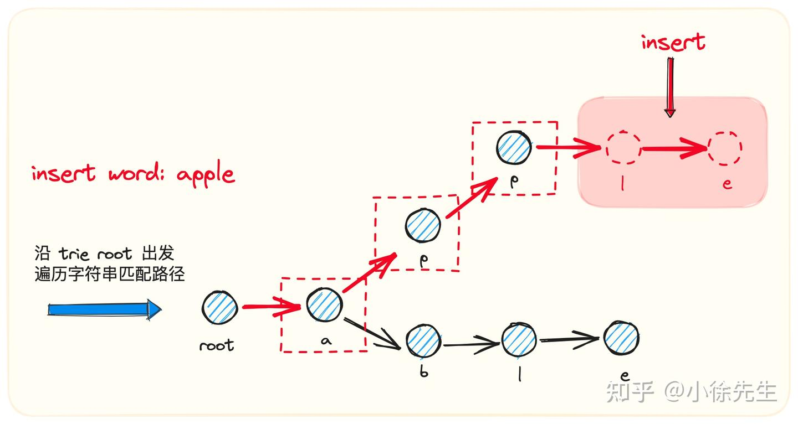
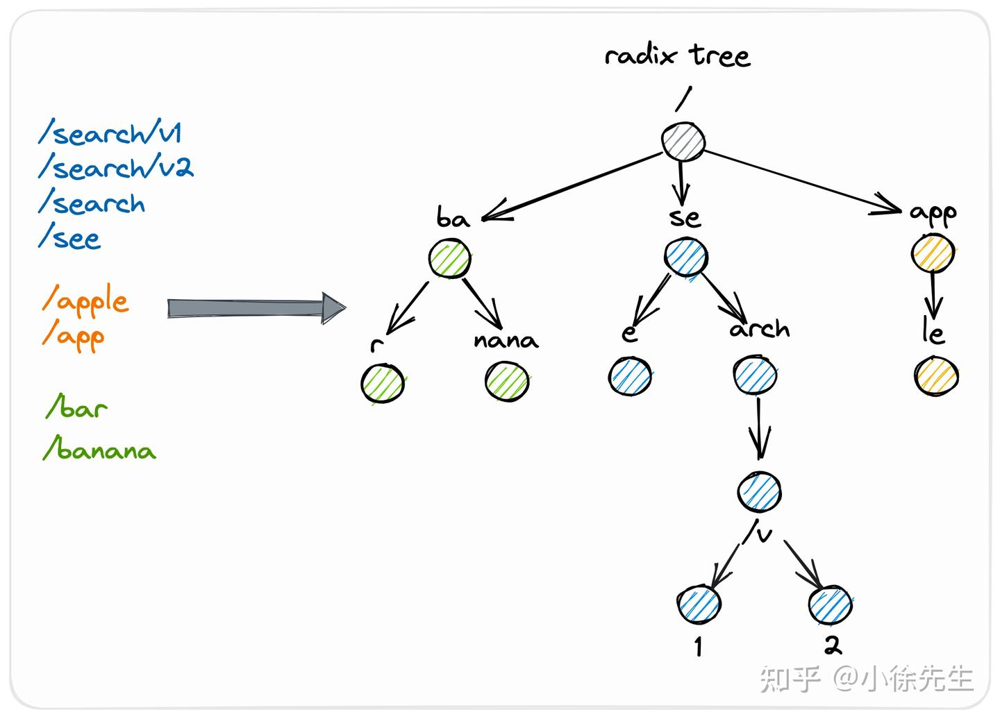
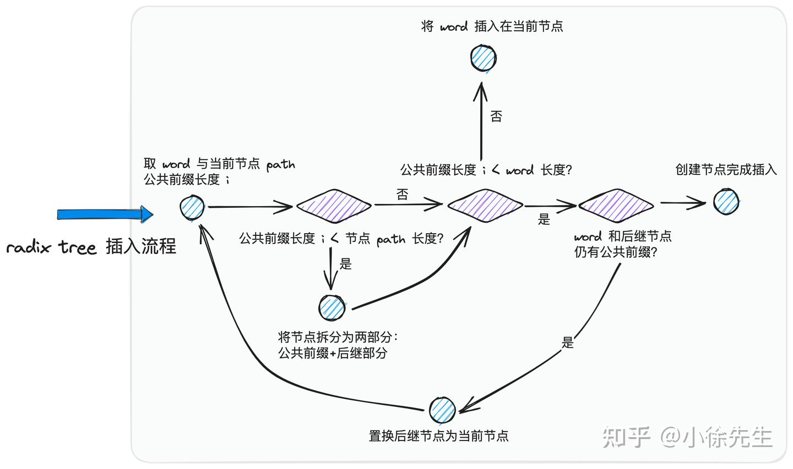
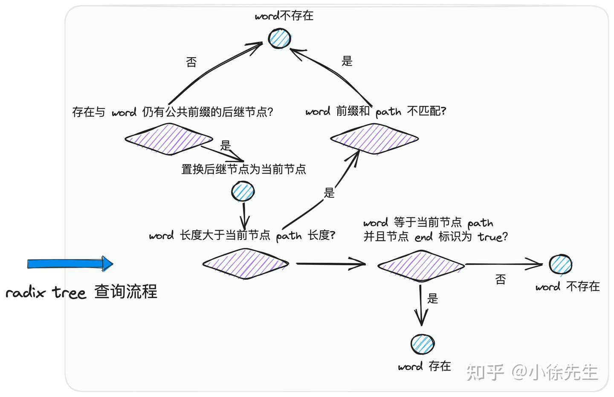

# 原理介绍
- 核心宗旨是实现“观察者”与“被观察对象”之间的解耦，并将其设计为通用的模块，便于后续的扩展和复用.
- <font color="red">观察者模式适用于多对一的订阅/发布场景.</font>

• ”多“：指的是有多名观察者

• ”一“：指的是有一个被观察事物

• ”订阅“：指的是观察者时刻关注着事物的动态

• ”发布“：指的是事物状态发生变化时是透明公开的，能够正常进入到观察者的视线

# 角色
- Observer：观察者. 指的是关注事物动态的角色
- Event：事物的变更事件. 其中 Topic 标识了事物的身份以及变更的类型，Val 是变更详情
- EventBus：事件总线. 位于观察者与事物之间承上启下的代理层. 负责维护管理观察者，并且在事物发生变更时，将情况同步给每个观察者.(实现了观察者与具体被观察事物之间的解耦), 遍历的时候是无序的


• 针对于观察者而言，需要向 EventBus 完成注册操作，注册时需要声明自己关心的变更事件类型<font color="red">（调用 EventBus 的 Subscribe 方法）</font>，不再需要直接和事物打交道

• 针对于事物而言，在其发生变更时，只需要将变更情况向 EventBus 统一汇报即可<font color="red">（调用 EventBus 的 Publish 方法）</font>，不再需要和每个观察者直接交互

• 对于 EventBus，需要提前维护好每个观察者和被关注事物之间的映射关系，保证在变更事件到达时，能找到所有的观察者逐一进行通知<font color="red">（调用 Observer 的 OnChange 方法）</font>
``` go
// 事物的变更事件
type Event struct {
    Topic string
    Val   interface{}
}

// tag: 观察者Observer 需要实现 OnChange 方法 用于向 EventBus 暴露出通知自己的“联系方式”，并且在方法内部实现好当关注对象发生变更时，自己需要采取的处理逻辑.
type Observer interface {
    OnChange(ctx context.Context, e *Event) error
}

// tag: 维护关系
type EventBus interface {
    Subscribe(topic string, o Observer) // 用于新增或删除订阅关系
    Unsubscribe(topic string, o Observer)
    Publish(ctx context.Context, e *Event) // 可以分为同步模式和异步模式
}
```
# 实现
``` go
// 实现Observer接口
type BaseObserver struct {
    name string
}

func NewBaseObserver(name string) *BaseObserver {
    return &BaseObserver{
        name: name,
    }
}

func (b *BaseObserver) OnChange(ctx context.Context, e *Event) error {
    fmt.Printf("observer: %s, event key: %s, event val: %v", b.name, e.Topic, e.Val)
    // ...
    return nil
}


// 实现EventBus接口
type BaseEventBus struct {
	mux       sync.RWMutex                     // 因为有map操作直接用读写锁 sync.Map不直接用
	observers map[string]map[Observer]struct{} // 订阅关系 参数类型Observer接口-观察者
	// topic为key 实现了Observer接口-观察者（同时多个） map[Observer]struct{}
}

func NewBaseEventBus() BaseEventBus {
	return BaseEventBus{
		observers: make(map[string]map[Observer]struct{}),
	}
}

func (b *BaseEventBus) Subscribe(topic string, o Observer) {
	b.mux.Lock()
	defer b.mux.Unlock()
	// 不需要直接和事物打交道
	_, ok := b.observers[topic]
	if !ok {
		b.observers[topic] = make(map[Observer]struct{}) // 首次初始化
	}
	b.observers[topic][o] = struct{}{} // 空结构体类型的实例
}

func (b *BaseEventBus) Unsubscribe(topic string, o Observer) {
	b.mux.Lock()
	defer b.mux.Unlock()
	delete(b.observers[topic], o)
}

// publish 将变更情况 不需要直接跟每个观察者交互
// 有不同类型  分为同步模式和异步模式
```

## 同步模式



``` go
type SyncEventBus struct {
	BaseEventBus // tag: 继承基础的订阅和解除订阅
}

func NewSyncEventBus() *SyncEventBus {
	return &SyncEventBus{
		BaseEventBus: NewBaseEventBus(),
	}
}

// 发布变更事件 Event
func (s *SyncEventBus) Publish(ctx context.Context, e *Event) {
	s.mux.RLock()
	subscribers := s.observers[e.Topic] // 根据事件类型Topic, 匹配到对应的观察者列表observers
	s.mux.RUnlock()

	errs := make(map[Observer]error)
	// 串行遍历的方式分别调用 Observer.OnChange 方法对每个观察者进行通知
	for subscriber := range subscribers {
		if err := subscriber.OnChange(ctx, e); err != nil {
			errs[subscriber] = err // 对处理流程中遇到的错误进行聚合，放到 handleErr 方法中进行统一的后处理.
		}
	}

	s.handleErr(ctx, errs) // tag: 处理所有的错误
}

// 真实的实践场景中，可以针对遇到的错误建立更完善的后处理流程，如采取重试或告知之类的操作.
func (s *SyncEventBus) handleErr(ctx context.Context, errs map[Observer]error) {
	for o, err := range errs {
		// 处理 publish 失败的 observer
		fmt.Printf("handleErr observer: %v, err: %v", o, err)
	}
}

func Test_syncEventBus(t *testing.T) {
	// 创建观察者
	observerA := NewBaseObserver("a")
	observerB := NewBaseObserver("b")
	observerC := NewBaseObserver("c")
	observerD := NewBaseObserver("d")

	sbus := NewSyncEventBus()
	topic := "topicX" // 事物标识
	// 观察者开始订阅事物
	sbus.Subscribe(topic, observerA)
	sbus.Subscribe(topic, observerB)
	sbus.Subscribe(topic, observerC)
	sbus.Subscribe(topic, observerD)

	// 事物变化
	sbus.Publish(context.Background(), &Event{
		Topic: topic,
		Val:   "topicV", // 变化事件 事物
	})

	// [OnChange] observer:name:a, topic: topicX, val: topicV
	// [OnChange] observer:name:b, topic: topicX, val: topicV
	// [OnChange] observer:name:c, topic: topicX, val: topicV
	// [OnChange] observer:name:d, topic: topicX, val: topicV
}
```

## 异步模式


- 在 EventBus 启动之初，异步启动一个守护协程，负责对接收到的错误进行后处理.
- 通知Publish时，起用协程异步处理OnChange
``` go
// 观察者相关的错误结构体
type observerWithErr struct {
	o   Observer
	err error
}

type AsyncEventBus struct {
	BaseEventBus // 继承基础
	// 异步模式需要 通道chan和context实现
	errC chan *observerWithErr // 错误通道
	ctx  context.Context       // 上下文
	stop context.CancelFunc    // 取消上下文的函数
}

// 异步的
func NewAsyncEventBus() *AsyncEventBus {
	aBus := AsyncEventBus{
		BaseEventBus: NewBaseEventBus(),
	}
	aBus.ctx, aBus.stop = context.WithCancel(context.Background())
	// 处理处理错误的异步守护协程
	go aBus.handleErr() // 启动之初，异步启动一个守护协程，负责对接收到的错误进行后处理.
	return &aBus
}

// 异步流程结束
func (a *AsyncEventBus) Stop() {
	a.stop()
}

// 事物通知
func (a *AsyncEventBus) Publish(ctx context.Context, e *Event) {
	a.mux.RLock()
	subscribers := a.observers[e.Topic] // 获取观察者列表
	defer a.mux.RUnlock()

	for subscriber := range subscribers {

		sub := subscriber // for循环里的变量共享 通过临时变量解决
		// 起协程异步处理OnChange
		go func() {
			if err := sub.OnChange(ctx, e); err != nil {
				// 多路复用
				select {
				case <-a.ctx.Done(): // 终止的情况
				case a.errC <- &observerWithErr{
					o:   sub,
					err: err,
				}:
					fmt.Println("[Publish] OnChange err chan push")
				}
			}
		}()
	}
}

func (a *AsyncEventBus) handleErr() {
	for {
		select {
		case <-a.ctx.Done():
			return
		case resp := <-a.errC:
			// 处理 publish 失败的 observer
			fmt.Printf("handleErr chan pop observer: %v, err: %v", resp.o, resp.err)
		}
	}
}

// 异步模式
func Test_asyncEventBus(t *testing.T) {
	// 创建观察者
	observerA := NewBaseObserver("a")
	observerB := NewBaseObserver("b")
	observerC := NewBaseObserver("c")
	observerD := NewBaseObserver("d")

	abus := NewAsyncEventBus()
	defer abus.Stop() // 保证上下文一定会被关闭

	topic := "topicX"
	// 观察者开始订阅事物
	abus.Subscribe(topic, observerA)
	abus.Subscribe(topic, observerB)
	abus.Subscribe(topic, observerC)
	abus.Subscribe(topic, observerD)

	abus.Publish(context.Background(), &Event{
		Topic: topic,
		Val:   "topicV",
	})

	<-time.After(time.Second)

	// [OnChange] observer:name:d, topic: topicX, val: topicV
	// [OnChange] observer:name:c, topic: topicX, val: topicV
	// [OnChange] observer:name:b, topic: topicX, val: topicV
	// [OnChange] observer:name:a, topic: topicX, val: topicV
}
```


# etcd的监听回调

- etcd 提供了作用于指定数据范围的监听回调功能，能在对应数据状态发生变更时，将变更通知传达到每个订阅者的手中

- EventBus：对应的是 etcd 服务端的 watchableStore 监听器存储模块，
  1. 该模块会负责存储用户创建的一系列监听器 watcher，并建立由监听数据 key 到监听器集合 watcherGroup 之间的映射关系. 
  2. 当任意存储数据发生变化时，etcd 的数据存储模块会在一个统一的切面中调用通知方法，将这一信息传达到 watchableStore 模块，watchableStore 则会将变更数据与监听数据 key 之间进行 join，最终得到一个需要执行回调操作的 watchers 组合，顺沿 watcher 中的路径，向订阅者发送通知消息

- Event：对应的是一条 etcd 状态机的数据变更事件，由 etcd 使用方在执行一条写数据操作时触发
  - 在写操作真正生效后，变更事件会被传送到 watchableStore 模块执行回调处理

- Observer：使用 etcd watch 功能对指定范围数据建立监听回调机制的使用方
  - 在 etcd 服务端 watchableStore 模块会建立监听器实体 watcher 作为自身的代理
  - 当变更事件真的发生后，watchableStore 会以 watcher 作为起点，沿着返回路径一路将变更事件发送到使用方手中