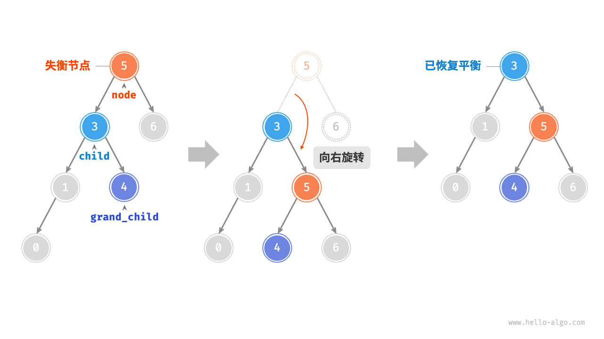

基于Prometheus构建Go服务监控系统。对Go服务而言，如何监控Go服务的核心指标呢？比如协程数、内存使用量、线程数等
# Prometheus与ELK区别

- Prometheus 就相当于一整个 ELK，但是它其实并不是适合存储大量日志，也不适合长期存储（默认存储 15 天）。<font color="red">它的优势是查看最近的趋势数据，以及告警机制。</font>

# 第一步 采集
当然是采集Go服务的运行时指标了，常用的运行时指标包括线程数、协程数、内存使用量、GC耗时等。go语言提供的sdk
``` go
// 获取线程数
runtime.ThreadCreateProfile(nil)
// 获取协程数
runtime.NumGoroutine()
// 获取GC统计指标，
debug.ReadGCStats(&stats)
// 该结构体定义了内存统计指标
type MemStats struct {
    Alloc uint64    // 已分配堆内存字节数
    ……
}
```

# 第二部 导出与查看
- 如何导出与查看这些运行时指标呢?
  - 借助Prometheus，这是一款开源的监控与报警系统，并且提供了多种语言的客户端库，其中就包括Go语言
  - github.com/prometheus/client_golang/prometheus , 引入Prometheus客户端库
## Prometheus客户端库使用方式
1. 对外暴露了一个接口，只需要调用该接口就能获取到Go服务的运行时指标
2. 使用其他框架的引入

``` go
package main
import (
    "net/http"
    "github.com/prometheus/client_golang/prometheus/promhttp"
)

func main() {
    // 注册路由 基础版
    http.Handle("/metrics", promhttp.Handler())
    http.ListenAndServe(":2112", nil)
}
```

## gin框架引入 prometheus
- github.com/prometheus/client_golang/prometheus , 引入Prometheus客户端库
``` go
// 注册路由
router.GET("/metrics", controller.Metrics)
// 请求处理方法
func Metrics(c *gin.Context) {
  handler := promhttp.Handler()
  handler.ServeHTTP(c.Writer, c.Request)
}

// 使用curl命令手动发起HTTP请求 查看监控参数
$ http://127.0.0.1:9090/metrics
go_goroutines 12
go_memstats_alloc_bytes 7.3335512e+08
…… 省略了很多Go服务运行时指标。
```
- 建议同时开启pprof，方便导出进程快照，分析程序性能瓶颈。
- 每次采集时，会调用runtime.ReadMemStats，触发stop the world，程序大概会暂停几百微妙

# 可视化展示指标,使用Prometheus
- 在使用Prometheus时，首先需要配置需要采集指标的目标服务地址与访问接口
- Prometheus下载地址 https://prometheus.io/download/
``` go
// 配置采集任务，配置文件是prometheus.yml
- job_name: "go-mall"
    scrape_interval: 10s
    metrics_path: "/metrics" // 采集接口
    static_configs:
      - targets: ["xxxx:9090"] // 对外暴露的端口
// Prometheus启动命令
./prometheus --config.file=prometheus.yml --web.listen-address=:9094 --web.enable-lifecycle --storage.tsdb.retention=7d --web.enable-admin-api

// 监听的端口号是9094，即我们可以通过该端口访问 Prometheus 提供的Web系统。
```

**打开系统之后，依次单击Status→Targets菜单项，可以查看目标服务状态，之后单击Graph菜单项，可以配置监控指标的可视化看板。Prometheus支持通过表达式配置可视化看板，我们不仅可以配置具体的指标，也可以配置复杂的表达式，表达式支持一些常用的运算符、聚合函数等**, 内置的数据查询语言PromQL


- 通过ab压测工具分别在9点26分30秒时刻、9点27分30秒时刻发起了一些请求，可以明显看到这时候的协程数、堆内存使用量都有明显变化

# 自定义监控
Prometheus支持4种类型的指标，分别为Counter、Gauge、Histograms与Summary，各类型指标含义如下。
1. Counter：计数器 计数器类型指标，可以用来统计请求数、错误数 http、rpc请求总量 消费队列消息总量等。 <font color="red">只增不减</font>
2. Gauge：仪表盘 计量器类型指标，可以用来统计内存使用量、CPU使用率 在线连接数等。<font color="red">可增可减</font>
3. Histograms：直方图，可以用来统计请求延迟落在哪一个区间，比如服务或者接口的访问时间P99。 <font color="red">耗时操作，直方图(Histogram)能够有效捕捉延迟能力及处理速率</font>
``` go
// 默认buckets定义的区间从5ms - 10s bucket数量对性能的影响，一般实际使用不会超过11个
var (
    DefBuckets = []float64{.005, .01, .025, .05, .1, .25, .5, 1, 2.5, 5, 10}
)
```
4. Summary：摘要 与Histograms类型指标比较类似，也可以用来统计服务或者接口的响应时间P50、P90、P99等，<font color="red">只是Summary是在Go服务侧计算的，Histograms是在Prometheus侧计算的</font>

# gin下的示例
## 采集QPS
``` go
// 定义Counter指标采集器
var counter = prometheus.NewCounterVec(
  prometheus.CounterOpts{
    Name: "http_request_total", // 该指标的名称为http_request_total，表示HTTP请求的总访问量
    Help: "The total number of HTTP request",
  },
  []string{"uri"}, // 名为uri的标签
)
// 注册Counter指标采集器
func init() {
  prometheus.MustRegister(counter)
}
// 声明gin框架中间件
func Qps(c *gin.Context) {
  counter.WithLabelValues(c.Request.RequestURI).Inc()
}
// 使用中间件
router.Use(middleware.Qps)

```
- 累加Counter指标时，我们还携带了标签的值，也就是请求地址uri。
  - 标签是什么呢？因为我们的需求不仅仅是统计整个服务的QPS，还需要统计每个接口的QPS，标签可以用来过滤监控指标，进而统计整个服务以及每个接口的访问QPS。

## 查看QPS Counter
- <font color="red">调用接口查看</font>
``` go
$ http://127.0.0.1:9090/metrics
http_request_total{uri="/api/goods/detail"} 10000   指标名称{标签=标签值}
http_request_total{uri="/metrics"} 3
```

- 看到每一个接口累计的访问量。但是，我们需要的监控指标不是QPS吗？那么，如何根据该访问量计算QPS呢？
  - Prometheus有一个内置函数irate，可以用来计算平均QPS。基于该函数与访问量指标配置的QPS监控看板


## 采集P99 Summary 统计服务或者接口的响应时间
- 以P99为例，这意味着99%的请求的响应时间都小于给定时间，只有1%的请求的响应时间大于该时间。
- 字段Objectives是一个散列表，键和值都是浮点数，键表示计算的分位数，如P50、P90、P99，值表示允许的误差（通过误差换取时间空间）。
``` go
// 定义Summary指标采集器
var summary = prometheus.NewSummaryVec(
  prometheus.SummaryOpts{
    Name:       "http_request_delay", // 指标的名称
    Objectives: map[float64]float64{0.5: 0.05, 0.9: 0.01, 0.99: 0.001},
  },
  []string{"uri"},
)
// 注册Summary指标采集器
func init() {
  prometheus.MustRegister(summary)
}
// 声明gin框架中间件
func Delay(c *gin.Context) {
  startTime := time.Now()
  // 执行下一个中间件
  c.Next()
  latency := time.Now().Sub(startTime)
  summary.WithLabelValues(c.Request.RequestURI).
    Observe(float64(latency.Milliseconds()))
}
// 使用中间件
router.Use(middleware.Delay)
```
## 查看

通过ab压测工具发起请求，可以看到99%请求的响应时间都小于350毫秒

# gorm的Prometheus 插件
https://learnku.com/docs/gorm/v2/prometheus/9768
- GORM 提供了 Prometheus 插件来收集 DBStats 和用户自定义指标 github.com/go-gorm/prometheus
``` go
import (
	"gorm.io/driver/mysql"
	"gorm.io/gorm"
	"gorm.io/gorm/logger"
	"gorm.io/plugin/prometheus" // Prometheus 插件
)
// NewGormDb 新建gorm客户端实例
func NewGormDb(name string, mysqlConf *conf.Mysql) (*gorm.DB, error) {
	if mysqlConf.ReadTimeout <= 0 || mysqlConf.WriteTimeout <= 0 || mysqlConf.MaxOpenConn <= 0 || mysqlConf.MaxIdleConn <= 0 || mysqlConf.MaxLifeTime <= 0 {
		return nil, fmt.Errorf("db配置异常,cfg:%v", mysqlConf)
	}

	logType := logger.Error
	switch conf.Conf.Server.Log.LogLevel {
	case "debug", "info":
		logType = logger.Info
	case "warn":
		logType = logger.Warn
	}

	dsn := fmt.Sprintf("%s?charset=utf8mb4&readTimeout=%ds&writeTimeout=%ds&parseTime=True&loc=Local", mysqlConf.Source, mysqlConf.ReadTimeout, mysqlConf.WriteTimeout)
	db, err := gorm.Open(mysql.Open(dsn), &gorm.Config{
		SkipDefaultTransaction: true,
		Logger: logger.New(
			logWriter{},
			logger.Config{
				SlowThreshold: 50 * time.Millisecond, // Slow SQL threshold
				LogLevel:      logType,               // Log level
				// IgnoreRecordNotFoundError: true,                  // Ignore ErrRecordNotFound error for logger
				// Colorful:                  false,                 // Disable color
			},
		),
	})
	if err != nil {
		return nil, err
	}

	// 连接池设置
	sqlDB, err := db.DB()
	if err != nil {
		return nil, err
	}
	sqlDB.SetMaxOpenConns(mysqlConf.MaxOpenConn)
	sqlDB.SetMaxIdleConns(mysqlConf.MaxIdleConn)
	sqlDB.SetConnMaxLifetime(time.Duration(mysqlConf.MaxLifeTime) * time.Second)

	refreshInterval := 15
	if !conf.IsOnline() {
		refreshInterval = 60 * 10
	}
	// metrics
	db.Use(prometheus.New(prometheus.Config{
		DBName:          name,
		RefreshInterval: uint32(refreshInterval),
		MetricsCollector: []prometheus.MetricsCollector{
			&prometheus.MySQL{VariableNames: []string{"Threads_running"}},
		},
	}))
	return db, nil
}
```
# 必看文档
- 聊一聊Prometheus
- <font color="red">[【有道云笔记】Prometheus图解原理](https://note.youdao.com/s/cyjfJusK)</font>


# Prometheus 与 Grafana 企业级监控 
- 滴滴开源 夜莺监控平台
- <font color="red">[有道云笔记】Prometheus 普罗米修斯](https://note.youdao.com/s/SKbv3CAb)</font>
- 消息提醒

# go-metrics包
go-metrics 是一款强大的Go语言库，用于收集并发布应用程序的性能指标和运行时统计。go-metrics的特色在于它不仅仅限于本地收集统计数据，还能将这些数据发送至多种远程系统中存储或分析。这其中包括Graphite、InfluxDB、Prometheus以及DataDog等诸多流行的时间序列数据库和监控平台
- github.com/rcrowley/go-metrics

``` go
package main
 
import (
	"log"
	"time"
	"github.com/rcrowley/go-metrics"
)
// Counter
func main() {
    counter := metrics.NewCounter()
    metrics.GetOrRegisterCounter("example.counter", nil) // 将其注册到默认Registry中
    
    // 更新计数器
    for i := 0; i < 10; i++ {
        counter.Inc(1)
    }
    
    // 定期记录计数器值 循环递增计数器10次，最后通过调用Log函数实现定时输出计数器的最新状态
	go metrics.Log(metrics.DefaultRegistry, time.Second, log.Default())
}

// 当前活跃的Go线程数量
func main() {
	g := metrics.NewGauge()
	metrics.GetOrRegisterGauge("goroutines.now", g)
	
	// 定时更新Gauge值
	tick := time.NewTicker(time.Second)
	for range tick.C {
		g.Update(int64(runtime.NumGoroutine()))
	}
	
	// 打印Gauge值的日志
	go metrics.Log(metrics.DefaultRegistry, time.Second, log.Default())
}

// 延迟和吞吐率的观测 耗时操作，直方图(Histogram)能够有效捕捉延迟能力及处理速率
func main() {
	h := metrics.NewHistogram(metrics.NewExpDecaySample(1028, 0.015))
	metrics.GetOrRegisterHistogram("request.latency", h)
	
	// 计算网络请求延迟时间并更新Histogram
	go func() {
		for {
			startTime := time.Now()
			resp, err := httpClient.Do(req)
			if err != nil {
				log.Println("Error:", err)
				continue
			}
			resp.Body.Close()
	
			duration := time.Since(startTime).Nanoseconds()
			h.Update(duration)
			time.Sleep(time.Millisecond * 100)
		}
	}()
}
```
选择合适的数据结构：合理选用Counter、Gauge、Histogram等不同的度量单位。
定期检查并清理无效测量点：长时间未更新的度量应该被及时清除以节省资源。
避免频繁采样引起的性能损耗：适度调整采样频率，找到监控粒度与系统负载之间的平衡点。

- go-metrics具备广泛的生态系统兼容性，以下列举了部分常见的集成环境：
	1. InfluxDB: 强大的时间序列数据库解决方案，支撑海量指标监控。
	2. Prometheus: 自动化且灵活的拉取模型，适用于容器化微服务架构。 
	3. DataDog: 全方位的SaaS监控平台，可无缝对接各类云服务及第三方系统。

<font color="red">通过go-metrics与以上组件的结合使用，可以构建高度定制化的监控体系，确保你的Go应用程序始终处于最佳状态</font>
- Prometheus - https://github.com/deathowl/go-metrics-prometheus

# client_golang/prometheus使用go-metrics作为辅助工具
- client_golang/prometheus 是Prometheus监控系统的官方Go语言客户端库，它提供了用于创建和操作Prometheus格式指标的工具，包括Counter、Gauge、Histogram和Summary等类型。
- 项目中使用Prometheus，并且想要使用go-metrics作为辅助工具，你需要做的是<font color="red">将go-metrics的指标转换为Prometheus指标。这通常通过go-metrics的Prometheus适配器来实现。</font>
``` go
import "github.com/deathowl/go-metrics-prometheus"  // 使用go-metrics
import "github.com/prometheus/client_golang/prometheus"

metricsRegistry := metrics.NewRegistry()
prometheusClient := prometheusmetrics.NewPrometheusProvider(metrics.DefaultRegistry, "whatever","something",prometheus.DefaultRegisterer, 1*time.Second)
go prometheusClient.UpdatePrometheusMetrics()
```

# <font color="red">Kratos使用 Prometheus</font>
1. Kratos 中对 Prometheus 接口的集成及封装
2. Warden 中使用 Metrics 做指标数据上报的拦截器封装
3. Metrics 的自定义使用
- [Kratos 源码分析：Metrics 与 Prometheus 的集成与使用](https://pandaychen.github.io/2020/07/21/KRATOS-PREMETHUES-WRAPPER/)

## 1.对prometheus包数据结构的封装和使用
- prom "github.com/go-kratos/kratos/contrib/metrics/prometheus/v2"


- <font color="red">prom包相关方法返回的是接口类型 github.com/go-kratos/kratos/v2/metrics</font>, metrics.Counter
``` go
package metrics

// Counter is metrics counter.
type Counter interface {
	With(lvs ...string) Counter
	Inc()
	Add(delta float64)
}

// Gauge is metrics gauge.
type Gauge interface {
	With(lvs ...string) Gauge
	Set(value float64)
	Add(delta float64)
	Sub(delta float64)
}

// Observer is metrics observer.
type Observer interface {
	With(lvs ...string) Observer
	Observe(float64)
}
```

## 2. 注册kratos中间件
- github.com/go-kratos/kratos/v2/middleware/metrics
- 封装拦截，该中间件也针对自定义的Meterics进行字段处理
``` go
package metrics

import (
	"context"
	"strconv"
	"time"

	"github.com/go-kratos/kratos/v2/errors"
	"github.com/go-kratos/kratos/v2/metrics"
	"github.com/go-kratos/kratos/v2/middleware"
	"github.com/go-kratos/kratos/v2/transport"
)

// Option is metrics option.
type Option func(*options)

// WithRequests with requests counter.
func WithRequests(c metrics.Counter) Option {
	return func(o *options) {
		o.requests = c
	}
}

// WithSeconds with seconds histogram.
func WithSeconds(c metrics.Observer) Option {
	return func(o *options) {
		o.seconds = c
	}
}

type options struct {
	// counter: <client/server>_requests_code_total{kind, operation, code, reason}
	requests metrics.Counter
	// histogram: <client/server>_requests_seconds_bucket{kind, operation}
	seconds metrics.Observer
}

// Server is middleware server-side metrics.
func Server(opts ...Option) middleware.Middleware {
	op := options{}
	for _, o := range opts {
		o(&op)
	}
	return func(handler middleware.Handler) middleware.Handler {
		return func(ctx context.Context, req interface{}) (interface{}, error) {
			var (
				code      int
				reason    string
				kind      string
				operation string
			)
			startTime := time.Now()
			if info, ok := transport.FromServerContext(ctx); ok {
				kind = info.Kind().String()
				operation = info.Operation()
			}
			reply, err := handler(ctx, req)
			if se := errors.FromError(err); se != nil {
				code = int(se.Code)
				reason = se.Reason
			}
			if op.requests != nil {
				op.requests.With(kind, operation, strconv.Itoa(code), reason).Inc()
			}
			if op.seconds != nil {
				op.seconds.With(kind, operation).Observe(time.Since(startTime).Seconds())
			}
			return reply, err
		}
	}
}

// Client is middleware client-side metrics.
func Client(opts ...Option) middleware.Middleware {
	op := options{}
	for _, o := range opts {
		o(&op)
	}
	return func(handler middleware.Handler) middleware.Handler {
		return func(ctx context.Context, req interface{}) (interface{}, error) {
			var (
				code      int
				reason    string
				kind      string
				operation string
			)
			startTime := time.Now()
			if info, ok := transport.FromClientContext(ctx); ok {
				kind = info.Kind().String()
				operation = info.Operation()
			}
			reply, err := handler(ctx, req)
			if se := errors.FromError(err); se != nil {
				code = int(se.Code)
				reason = se.Reason
			}
			if op.requests != nil {
				op.requests.With(kind, operation, strconv.Itoa(code), reason).Inc()
			}
			if op.seconds != nil {
				op.seconds.With(kind, operation).Observe(time.Since(startTime).Seconds())
			}
			return reply, err
		}
	}
}
``` 
## 3. Metrics 的自定义使用
-  http服务和grpc服务使用metrics中间件， 该中间件也针对自定义的Meterics进行字段处理
- metrics中间件 Server方法 生成/返回 middleware.Handler 
- prom.NewCounter 调用的是kratos封装的prometheus数据结构
- prometheus.MustRegister 官包注册的 一般写在init()方法里，多个map的可以统一写在一个文件里，参照job
``` go
package server

import (
	extLog "git.internal.taqu.cn/go-modules/kratos-extends/log"
	"github.com/go-kratos/kratos/v2/middleware/metrics" // kratos的指标中间件 
	"github.com/prometheus/client_golang/prometheus" // 官包的采集器
	"time"

	extEncoder "git.internal.taqu.cn/go-modules/kratos-extends/encoder"
	extFilter "git.internal.taqu.cn/go-modules/kratos-extends/filter"
	extAC "git.internal.taqu.cn/go-modules/kratos-extends/middleware/accesslog"
	extBp "git.internal.taqu.cn/go-modules/kratos-extends/middleware/baseparams"
	prom "github.com/go-kratos/kratos/contrib/metrics/prometheus/v2" // kratos对采集器进一步包装

	"github.com/go-kratos/kratos/v2/middleware/recovery"
	"github.com/go-kratos/kratos/v2/transport/http"

	"admp-data/internal/conf"
)

func newHTTPServer(appName string, c *conf.Server) *http.Server {
	// 直方图 请求接口耗时等指标
	_metricSeconds := prometheus.NewHistogramVec(prometheus.HistogramOpts{
		Namespace: "mp_admp_data",
		Subsystem: "requests",
		Name:      "duration_ms",
		Help:      "server requests duration(ms).",
		Buckets:   []float64{5, 10, 25, 50, 100, 250, 500, 1000},
	}, []string{"kind", "operation"})

	// 计数器 code类型数量 用来统计系统报错告警
	_metricRequests := prometheus.NewCounterVec(prometheus.CounterOpts{
		Namespace: "mp_admp_data",
		Subsystem: "requests",
		Name:      "code_total",
		Help:      "The total number of processed requests",
	}, []string{"kind", "operation", "code", "reason"})

	prometheus.MustRegister(_metricSeconds, _metricRequests) //采集器
	// 初始化业务日志
	var httpOpts = []http.ServerOption{
		http.Middleware(
			recovery.Recovery(),
			extBp.Server(), // 基础参数
			extAC.Server(extLog.WithAccessFields(extLog.New(appName, c.Log.AccessPath))), // 请求日志
			metrics.Server(
				metrics.WithSeconds(prom.NewHistogram(_metricSeconds)),
				metrics.WithRequests(prom.NewCounter(_metricRequests)),
			),
		),
		http.Filter(extFilter.HealthCheckFilter),
		http.Address(c.Http.Addr),
		http.RequestDecoder(extEncoder.RequestDecoder),
		http.ResponseEncoder(extEncoder.ResponseEncoder),
		http.Timeout(time.Duration(c.Http.Timeout) * time.Second),
	}
	return http.NewServer(httpOpts...)
}

```
- 中间件的处理


1. 启动服务
``` go
package server

func New(appName string, c *conf.Server) (*kratos.App, func(), error) {
	// 启动GRPC，HTTP Server服务端口
	grpcSrv := newGRPCServer(appName, c) // 可以看情况加Prometheus
	httpSrv := newHTTPServer(appName, c)
	// 启动普罗米修斯
	httpSrv.Handle("/metrics", promhttp.Handler())
	....
}
```

## job脚本使用
- 批量设定采集器
``` go
package monitor

import (
	"admp-data/internal/constant"
	"fmt"
	prom "github.com/go-kratos/kratos/contrib/metrics/prometheus/v2"
	"github.com/go-kratos/kratos/v2/metrics"
	"github.com/prometheus/client_golang/prometheus"
)

type PromClient struct {
	CounterMap map[string]metrics.Counter // 多个监控指标名称
}

var (
	// 该包全局的指标client配置
	promClient = &PromClient{
		CounterMap: map[string]metrics.Counter{},
	}
)

// 这里是大写 在服务启动时 先初始化这个全局变量
func Init() error {
	// PrometheusCountMetricsList 一批Counter配置
	for index, item := range constant.PrometheusCountMetricsList {
		name, ok := item[0].(string)
		if !ok {
			return fmt.Errorf("PrometheusCountMetricsList 第%d行第1个参数错误", index)
		}
		help, ok := item[1].(string)
		if !ok {
			return fmt.Errorf("PrometheusCountMetricsList 第%d行第2个参数错误", index)
		}
		labelList, ok := item[2].([]string)
		if !ok {
			return fmt.Errorf("PrometheusCountMetricsList 第%d行第3个参数错误", index)
		}
		counterVer := prometheus.NewCounterVec(prometheus.CounterOpts{
			Namespace: "mp_admp_data",
			Subsystem: "job", // 不允许 - 字符
			Name:      name,
			Help:      help,
		}, labelList)
		prometheus.MustRegister(counterVer)
		promClient.CounterMap[name] = prom.NewCounter(counterVer)
	}
	return nil
}

func GetCount(name string) metrics.Counter {
	if client, ok := promClient.CounterMap[name]; ok {
		return client
	}
	return nil
}

func GetKafkaSubscribeCount(cntName, timeName string) (metrics.Counter, metrics.Counter) {
	return GetCount(cntName), GetCount(timeName)
}

func GetSubscribeCount(cntName, timeName string) (metrics.Counter, metrics.Counter) {
	return GetCount(cntName), GetCount(timeName)
}
``` 
- 监控配置counter只增不减
``` go
PrometheusCountMetricsList = [][]any{
	[]any{"kafka_subscribe_message_count", "the kafka topic subscribe message count", []string{"topic", "status"}}, // kafka 消费消息总数量
	[]any{"kafka_subscribe_time_total", "the kafka topic handle message time total", []string{"topic", "status"}}, // kafka 处理消息总时间
	[]any{"tqmq_subscribe_message_count", "the tqmq topic subscribe message count", []string{"topic", "status"}},  // tqmq 消费消息总数量
	[]any{"tqmq_subscribe_time_total", "the tqmq topic handle message time total", []string{"topic", "status"}},  // tqmq 处理消息总时间
	[]any{"event_handle_count", "handle event count", []string{"event"}},                   // 处理事件总个数
	[]any{"event_handle_time_total", "handle event time total", []string{"event"}},         // 处理事件总时间
	[]any{"device_reg_attribution_count", "device reg attribution count", []string{"is_attribution", "attribution_type", "media_code", "device_delivery_type"}},  // 归因数量
	[]any{"callback_to_media_count", "callback to media count", []string{"media_code", "event", "target", "product_code", "success"}}, // 回传数量
	[]any{"callback_to_media_time_total", "callback to media count time total", []string{"media_code", "event", "target", "product_code", "success"}}, // 回传计时
	[]any{"callback_strategy_result_count", "callback strategy result count", []string{"media_code", "channel", "platform_id", "base_event", "event", "target", "app_code", "cloned", "result", "attribution_type"}}, // 策略数量
	[]any{"device_increment_attribution_count", "device increment attribution count", []string{"media_code"}}, // 增量归因数量 
}
```
- 使用采集器
  - 消费kafka消息以及tqmq， 计数器和耗时
``` go

	defer func() {
		t2 := time.Now().UnixMicro()
		counter, timeCounter := monitor.GetKafkaSubscribeCount("tqmq_subscribe_message_count", "tqmq_subscribe_time_total")
		if counter != nil {
			counter.With(p.Topic(), ret).Inc()
		}

		coastTime := float64(t2 - t1)
		if timeCounter != nil {
			timeCounter.With(p.Topic(), ret).Add(coastTime)
		}
	}()
``` 
 - 业务上的计数和耗时
``` go
// CallbackToMediaRequest 回调媒体
func (e EventCallbackHandleCase) CallbackToMediaRequest(ctx context.Context, callData *models.MediaCallbackRequest) (*models.MediaCallbackResponse, error) {
	reqCounter := monitor.GetCount("callback_to_media_count")
	timeCounter := monitor.GetCount("callback_to_media_time_total")
	t1 := time.Now().Unix()

	resp, err := data.NewMediaRepo().CallbackToMedia(ctx, callData) // 这里是去具体业务

	status := "ok"
	if err != nil || resp.IsCallback == false {
		status = "fail"
	}

	reqCounter.With(callData.DeviceAttribution.MediaCode, callData.Event, callData.TargetEvent, status, callData.Product.ProductCode).Inc()
	timeCounter.With(callData.DeviceAttribution.MediaCode, callData.Event, callData.TargetEvent, status, callData.Product.ProductCode).Add(float64(time.Now().Unix() - t1))
	return resp, err
}

// 注册归因相关
type DeviceRegAttributionCase struct {
	attributionCnt metrics.Counter // 归因数
}

func NewDeviceRegAttributionCase() *DeviceRegAttributionCase {
	return &DeviceRegAttributionCase{
		attributionCnt: monitor.GetCount("device_reg_attribution_count"),
	}
}

c.attributionCnt.With(isAttributionStr, fmt.Sprintf("%d", attributionInfo.AttributionPriorityType), attributionInfo.MediaCode, deviceInfo.DeviceDeliveryType).Inc()

```
## 零散使用 插件封装了
http_client_requests_duration_sec_count,http_client_requests_duration_sec_sum,http_client_requests_duration_sec_bucket

- mp-admp-material 单pod指标采集，15s，200M+ , 采集是放一起的，统一一个mp-admp，这个 mp-admp-material  量大，影响了整个采集
, 部分指标超过单pod采集最高时延，要么将现有的采集间隔时长调长（现在是15s），要么减少数据量。


# 监控告警
## grafana
- 业务服务

- 机器

## 夜莺告警 PromQL
### PromQL语法
- 查询指定 mertic_name,无标签 单标签 多标签的情况。
  - node_cpu_seconds_total{instance="172.16.0.8:9100",mode="system"}
- 运算乘：* 除：/ 加：+ 减：-
- 常用函数 
  - sum() 函数：求出找到所有 value 的值 
  - irate() 函数：统计平均速率 
  - by (标签名) 范围匹配
- 1小时 [1h], 5分钟之内 [5m], 1天[1d] <font color="red">1d是即时而非自然日,如果需要差值，自己打印时刻的值计算差值</font>
- 计算 CPU 使用率: 100 - (avg(irate(node_cpu_seconds_total{mode="idle"}[5m])) by (instance) * 100)
- 都是以当前时刻为准，也可以通过graph选取时间点
### 实战
``` go
// 比如pulsar kafka消费 等业务相关
mp_admp_material_job_material_crawl_count /// 对应各个pod统计到的数量，每日增量等
sum(increase(mp_admp_material_job_material_crawl_count{}[1d])) // 都是以当前时刻为准，也可以通过graph选取时间点
```

- 为什么需要sum? 因为k8s很多pod在收集指标


- 自己业务系统
``` go
//【回传服务】每分钟回传失败数量监控
sum(increase(mp_admp_data_job_callback_strategy_result_count{result=~"401|-99"} [1m])) > 20
// mp_admp_data_job服务 MediaCallbackToMediaError = 401 和 MediaCallbackUnknown = -99

// 增量回传数量 每小时大于50
sum(increase(mp_admp_data_job_callback_strategy_result_count{attribution_type="3", result='1'}[1h])) > 50
//【回传服务】回传归因事件积压大于5000告警
sum(kafka_consumergroup_lag{ topic="mp_admp_event_action", consumergroup="mp_admp_attribution_action_group"}) > 5000

// device_reg_attribution_count 计数器类型 business集群
// 每分钟归因数量同比昨天上涨50%
sum(increase(mp_admp_data_job_device_reg_attribution_count{is_attribution='true'}[1m]) ) / sum(increase(mp_admp_data_job_device_reg_attribution_count{is_attribution='true'}[1m]offset 1d) ) > 1.5

// 每分钟归因数量同比昨天下降50%
sum(increase(mp_admp_data_job_device_reg_attribution_count{is_attribution='true'}[1m]) ) / sum(increase(mp_admp_data_job_device_reg_attribution_count{is_attribution='true'}[1m]offset 1d) ) < 0.5

```
- 网关系统和运维等 
``` go
by的使用 相当于分组
// 推广相关项目错误日志量告警【每5分钟】 每5分钟系统错误量大于50触发 aliyun集群
sum(sum_over_time(ck_monitor_taqu_system_requests_error_count_for_5m_rules_admp{system=~"admp|ammp|admprta|agmp|mp-admp-data|mp-admp-data-job|mp-smart-admp|mp-smart-admp-job"}[5m])) by(system)  > 50
// 每分钟Nginx返回码非200大于50
sum by(system,retCode) (ck_monitor_taqu_system_nginx_requests_code_count{system=~".*admp.*|agmp|ammp", retCode!="200"})  > 50

// 推广服务pod发生了重启
ack:pod:restart{pod=~".*admp.*",pod!~".*drama.*"} >= 1
// 网关请求投放系统参数错误拦截 ADMP服务端
sum(increase(param_err_count{system=~".*admp.*|agmp|ammp"}[2m])) by (system)> 1000
// 投放系统api网关接口未找到告警
sum(increase(api_not_found_count{URL=~".*admp.*"}[2m])) by (URL) > 200
```


- 告警卡片


- 对外http请求数量统计 http_client_request_cnt和http_client_request_time
``` go
推广系统请求外部http状态码异常 每10分钟请求不成功数量大于5
// Namespace: "tuiguang",
// Subsystem: "sa", // 注意这个不能-这样的符号出现
sum(increase(tuiguang_sa_http_client_request_cnt{http_code!="200"}[10m])) > 5
```


- 阿里云内存占用
``` go
推广redis缓存节点内存大于80%
avg(cloudmonitor_acs_kvstore_ShardingCpuUsage{name="taqu-online-admp"})>=80 // taqu-online-admp节点命名
```

# Netdata
- 如果你需要实时监控、低资源占用和快速部署，Netdata 是更好的选择。(小项目企业)
- 如果你需要长期数据存储、复杂查询和大规模集群监控，Prometheus 更适合。
