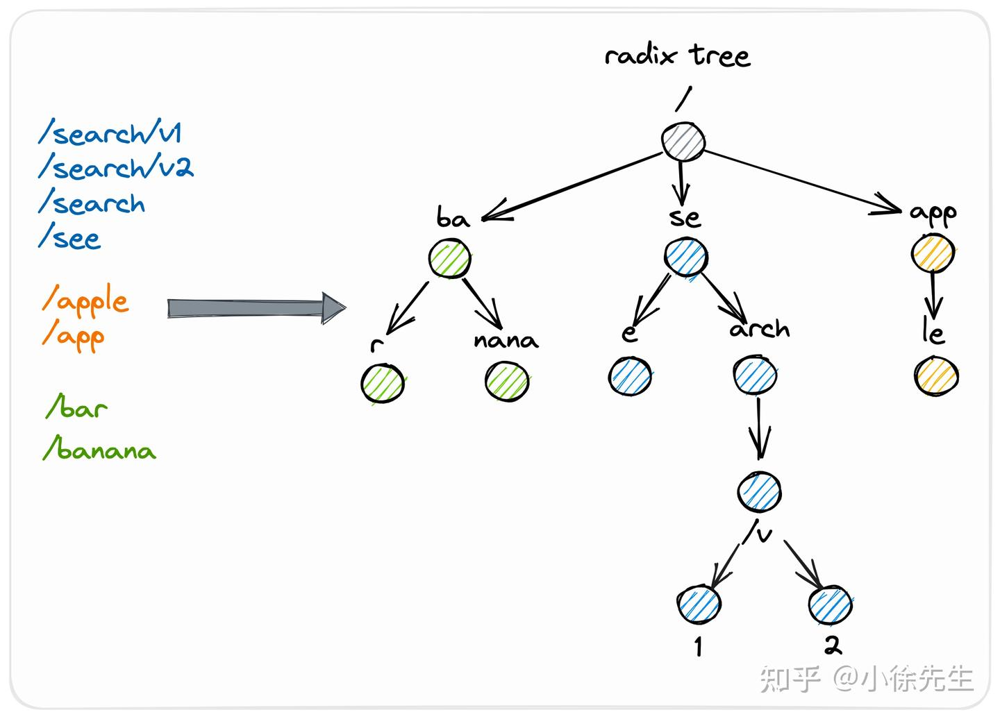

基于Prometheus构建Go服务监控系统。对Go服务而言，如何监控Go服务的核心指标呢？比如协程数、内存使用量、线程数等
# Prometheus与ELK区别

- Prometheus 就相当于一整个 ELK，但是它其实并不是适合存储大量日志，也不适合长期存储（默认存储 15 天）。<font color="red">它的优势是查看最近的趋势数据，以及告警机制。</font>

# 第一步 采集
当然是采集Go服务的运行时指标了，常用的运行时指标包括线程数、协程数、内存使用量、GC耗时等。go语言提供的sdk
``` go
// 获取线程数
runtime.ThreadCreateProfile(nil)
// 获取协程数
runtime.NumGoroutine()
// 获取GC统计指标，
debug.ReadGCStats(&stats)
// 该结构体定义了内存统计指标
type MemStats struct {
    Alloc uint64    // 已分配堆内存字节数
    ……
}
```

# 第二部 导出与查看
- 如何导出与查看这些运行时指标呢?
  - 借助Prometheus，这是一款开源的监控与报警系统，并且提供了多种语言的客户端库，其中就包括Go语言
  - github.com/prometheus/client_golang/prometheus , 引入Prometheus客户端库
## Prometheus客户端库使用方式
1. 对外暴露了一个接口，只需要调用该接口就能获取到Go服务的运行时指标
2. 使用其他框架的引入

``` go
package main
import (
    "net/http"
    "github.com/prometheus/client_golang/prometheus/promhttp"
)

func main() {
    // 注册路由 基础版
    http.Handle("/metrics", promhttp.Handler())
    http.ListenAndServe(":2112", nil)
}
```

## gin框架引入 prometheus
``` go
// 注册路由
router.GET("/metrics", controller.Metrics)
// 请求处理方法
func Metrics(c *gin.Context) {
  handler := promhttp.Handler()
  handler.ServeHTTP(c.Writer, c.Request)
}

// 使用curl命令手动发起HTTP请求 查看监控参数
$ http://127.0.0.1:9090/metrics
go_goroutines 12
go_memstats_alloc_bytes 7.3335512e+08
…… 省略了很多Go服务运行时指标。
```
- 建议同时开启pprof，方便导出进程快照，分析程序性能瓶颈。
- 每次采集时，会调用runtime.ReadMemStats，触发stop the world，程序大概会暂停几百微妙

# 可视化展示指标,使用Prometheus
- 在使用Prometheus时，首先需要配置需要采集指标的目标服务地址与访问接口
- Prometheus下载地址 https://prometheus.io/download/
``` go
// 配置采集任务，配置文件是prometheus.yml
- job_name: "go-mall"
    scrape_interval: 10s
    metrics_path: "/metrics" // 采集接口
    static_configs:
      - targets: ["xxxx:9090"] // 对外暴露的端口
// Prometheus启动命令
./prometheus --config.file=prometheus.yml --web.listen-address=:9094 --web.enable-lifecycle --storage.tsdb.retention=7d --web.enable-admin-api

// 监听的端口号是9094，即我们可以通过该端口访问 Prometheus 提供的Web系统。
```

**打开系统之后，依次单击Status→Targets菜单项，可以查看目标服务状态，之后单击Graph菜单项，可以配置监控指标的可视化看板。Prometheus支持通过表达式配置可视化看板，我们不仅可以配置具体的指标，也可以配置复杂的表达式，表达式支持一些常用的运算符、聚合函数等**, 内置的数据查询语言PromQL


- 通过ab压测工具分别在9点26分30秒时刻、9点27分30秒时刻发起了一些请求，可以明显看到这时候的协程数、堆内存使用量都有明显变化

# 自定义监控
Prometheus支持4种类型的指标，分别为Counter、Gauge、Histograms与Summary，各类型指标含义如下。
1. Counter：计数器 计数器类型指标，可以用来统计请求数、错误数 http、rpc请求总量 消费队列消息总量等。 <font color="red">只增不减</font>
2. Gauge：仪表盘 计量器类型指标，可以用来统计内存使用量、CPU使用率 在线连接数等。<font color="red">可增可减</font>
3. Histograms：直方图，可以用来统计请求延迟落在哪一个区间，比如服务或者接口的访问时间P99。 耗时操作，直方图(Histogram)能够有效捕捉延迟能力及处理速率：
``` go
// 默认buckets定义的区间从5ms - 10s bucket数量对性能的影响，一般实际使用不会超过11个
var (
    DefBuckets = []float64{.005, .01, .025, .05, .1, .25, .5, 1, 2.5, 5, 10}
)
```
4. Summary：摘要 与Histograms类型指标比较类似，也可以用来统计服务或者接口的响应时间P50、P90、P99等，<font color="red">只是Summary是在Go服务侧计算的，Histograms是在Prometheus侧计算的</font>

# gin下的示例
## 采集QPS
``` go
// 定义Counter指标采集器
var counter = prometheus.NewCounterVec(
  prometheus.CounterOpts{
    Name: "http_request_total", // 该指标的名称为http_request_total，表示HTTP请求的总访问量
    Help: "The total number of HTTP request",
  },
  []string{"uri"}, // 名为uri的标签
)
// 注册Counter指标采集器
func init() {
  prometheus.MustRegister(counter)
}
// 声明gin框架中间件
func Qps(c *gin.Context) {
  counter.WithLabelValues(c.Request.RequestURI).Inc()
}
// 使用中间件
router.Use(middleware.Qps)

```
- 累加Counter指标时，我们还携带了标签的值，也就是请求地址uri。
  - 标签是什么呢？因为我们的需求不仅仅是统计整个服务的QPS，还需要统计每个接口的QPS，标签可以用来过滤监控指标，进而统计整个服务以及每个接口的访问QPS。

## 查看QPS Counter
- 调用接口查看
``` go
$ http://127.0.0.1:9090/metrics
http_request_total{uri="/api/goods/detail"} 10000
http_request_total{uri="/metrics"} 3
```

- 看到每一个接口累计的访问量。但是，我们需要的监控指标不是QPS吗？那么，如何根据该访问量计算QPS呢？
  - Prometheus有一个内置函数irate，可以用来计算平均QPS。基于该函数与访问量指标配置的QPS监控看板


## 采集P99 Summary 统计服务或者接口的响应时间
- 以P99为例，这意味着99%的请求的响应时间都小于给定时间，只有1%的请求的响应时间大于该时间。
- 字段Objectives是一个散列表，键和值都是浮点数，键表示计算的分位数，如P50、P90、P99，值表示允许的误差（通过误差换取时间空间）。
``` go
// 定义Summary指标采集器
var summary = prometheus.NewSummaryVec(
  prometheus.SummaryOpts{
    Name:       "http_request_delay", // 指标的名称
    Objectives: map[float64]float64{0.5: 0.05, 0.9: 0.01, 0.99: 0.001},
  },
  []string{"uri"},
)
// 注册Summary指标采集器
func init() {
  prometheus.MustRegister(summary)
}
// 声明gin框架中间件
func Delay(c *gin.Context) {
  startTime := time.Now()
  // 执行下一个中间件
  c.Next()
  latency := time.Now().Sub(startTime)
  summary.WithLabelValues(c.Request.RequestURI).
    Observe(float64(latency.Milliseconds()))
}
// 使用中间件
router.Use(middleware.Delay)
```
## 查看

通过ab压测工具发起请求，可以看到99%请求的响应时间都小于350毫秒

# gorm的Prometheus 插件
https://learnku.com/docs/gorm/v2/prometheus/9768
- GORM 提供了 Prometheus 插件来收集 DBStats 和用户自定义指标 github.com/go-gorm/prometheus
``` go
import (
	"gorm.io/driver/mysql"
	"gorm.io/gorm"
	"gorm.io/gorm/logger"
	"gorm.io/plugin/prometheus" // Prometheus 插件
)
// NewGormDb 新建gorm客户端实例
func NewGormDb(name string, mysqlConf *conf.Mysql) (*gorm.DB, error) {
	if mysqlConf.ReadTimeout <= 0 || mysqlConf.WriteTimeout <= 0 || mysqlConf.MaxOpenConn <= 0 || mysqlConf.MaxIdleConn <= 0 || mysqlConf.MaxLifeTime <= 0 {
		return nil, fmt.Errorf("db配置异常,cfg:%v", mysqlConf)
	}

	logType := logger.Error
	switch conf.Conf.Server.Log.LogLevel {
	case "debug", "info":
		logType = logger.Info
	case "warn":
		logType = logger.Warn
	}

	dsn := fmt.Sprintf("%s?charset=utf8mb4&readTimeout=%ds&writeTimeout=%ds&parseTime=True&loc=Local", mysqlConf.Source, mysqlConf.ReadTimeout, mysqlConf.WriteTimeout)
	db, err := gorm.Open(mysql.Open(dsn), &gorm.Config{
		SkipDefaultTransaction: true,
		Logger: logger.New(
			logWriter{},
			logger.Config{
				SlowThreshold: 50 * time.Millisecond, // Slow SQL threshold
				LogLevel:      logType,               // Log level
				// IgnoreRecordNotFoundError: true,                  // Ignore ErrRecordNotFound error for logger
				// Colorful:                  false,                 // Disable color
			},
		),
	})
	if err != nil {
		return nil, err
	}

	// 连接池设置
	sqlDB, err := db.DB()
	if err != nil {
		return nil, err
	}
	sqlDB.SetMaxOpenConns(mysqlConf.MaxOpenConn)
	sqlDB.SetMaxIdleConns(mysqlConf.MaxIdleConn)
	sqlDB.SetConnMaxLifetime(time.Duration(mysqlConf.MaxLifeTime) * time.Second)

	refreshInterval := 15
	if !conf.IsOnline() {
		refreshInterval = 60 * 10
	}
	// metrics
	db.Use(prometheus.New(prometheus.Config{
		DBName:          name,
		RefreshInterval: uint32(refreshInterval),
		MetricsCollector: []prometheus.MetricsCollector{
			&prometheus.MySQL{VariableNames: []string{"Threads_running"}},
		},
	}))
	return db, nil
}
```
# 必看文档
- 聊一聊Prometheus
- <font color="red">[【有道云笔记】Prometheus图解原理](https://note.youdao.com/s/cyjfJusK)</font>


# Prometheus 与 Grafana 企业级监控 
- 滴滴开源 夜莺监控平台
- <font color="red">[有道云笔记】Prometheus 普罗米修斯](https://note.youdao.com/s/SKbv3CAb)</font>
- 消息提醒

# go-metrics包
go-metrics 是一款强大的Go语言库，用于收集并发布应用程序的性能指标和运行时统计。go-metrics的特色在于它不仅仅限于本地收集统计数据，还能将这些数据发送至多种远程系统中存储或分析。这其中包括Graphite、InfluxDB、Prometheus以及DataDog等诸多流行的时间序列数据库和监控平台
- github.com/rcrowley/go-metrics

``` go
package main
 
import (
	"log"
	"time"
	"github.com/rcrowley/go-metrics"
)
// Counter
func main() {
    counter := metrics.NewCounter()
    metrics.GetOrRegisterCounter("example.counter", nil) // 将其注册到默认Registry中
    
    // 更新计数器
    for i := 0; i < 10; i++ {
        counter.Inc(1)
    }
    
    // 定期记录计数器值 循环递增计数器10次，最后通过调用Log函数实现定时输出计数器的最新状态
	go metrics.Log(metrics.DefaultRegistry, time.Second, log.Default())
}

// 当前活跃的Go线程数量
func main() {
	g := metrics.NewGauge()
	metrics.GetOrRegisterGauge("goroutines.now", g)
	
	// 定时更新Gauge值
	tick := time.NewTicker(time.Second)
	for range tick.C {
		g.Update(int64(runtime.NumGoroutine()))
	}
	
	// 打印Gauge值的日志
	go metrics.Log(metrics.DefaultRegistry, time.Second, log.Default())
}

// 延迟和吞吐率的观测 耗时操作，直方图(Histogram)能够有效捕捉延迟能力及处理速率
func main() {
	h := metrics.NewHistogram(metrics.NewExpDecaySample(1028, 0.015))
	metrics.GetOrRegisterHistogram("request.latency", h)
	
	// 计算网络请求延迟时间并更新Histogram
	go func() {
		for {
			startTime := time.Now()
			resp, err := httpClient.Do(req)
			if err != nil {
				log.Println("Error:", err)
				continue
			}
			resp.Body.Close()
	
			duration := time.Since(startTime).Nanoseconds()
			h.Update(duration)
			time.Sleep(time.Millisecond * 100)
		}
	}()
}
```
选择合适的数据结构：合理选用Counter、Gauge、Histogram等不同的度量单位。
定期检查并清理无效测量点：长时间未更新的度量应该被及时清除以节省资源。
避免频繁采样引起的性能损耗：适度调整采样频率，找到监控粒度与系统负载之间的平衡点。

- go-metrics具备广泛的生态系统兼容性，以下列举了部分常见的集成环境：
	1. InfluxDB: 强大的时间序列数据库解决方案，支撑海量指标监控。
	2. Prometheus: 自动化且灵活的拉取模型，适用于容器化微服务架构。 
	3. DataDog: 全方位的SaaS监控平台，可无缝对接各类云服务及第三方系统。

<font color="red">通过go-metrics与以上组件的结合使用，可以构建高度定制化的监控体系，确保你的Go应用程序始终处于最佳状态</font>
- Prometheus - https://github.com/deathowl/go-metrics-prometheus

# client_golang/prometheus使用go-metrics作为辅助工具
- client_golang/prometheus 是Prometheus监控系统的官方Go语言客户端库，它提供了用于创建和操作Prometheus格式指标的工具，包括Counter、Gauge、Histogram和Summary等类型。
- 项目中使用Prometheus，并且想要使用go-metrics作为辅助工具，你需要做的是<font color="red">将go-metrics的指标转换为Prometheus指标。这通常通过go-metrics的Prometheus适配器来实现。</font>
``` go
import "github.com/deathowl/go-metrics-prometheus"  // 使用go-metrics
import "github.com/prometheus/client_golang/prometheus"

metricsRegistry := metrics.NewRegistry()
prometheusClient := prometheusmetrics.NewPrometheusProvider(metrics.DefaultRegistry, "whatever","something",prometheus.DefaultRegisterer, 1*time.Second)
go prometheusClient.UpdatePrometheusMetrics()
```

# <font color="red">Kratos使用 Prometheus</font>
1. Kratos 中对 Prometheus 接口的集成及封装
2. Warden 中使用 Metrics 做指标数据上报的拦截器封装
3. Metrics 的自定义使用

- https://pandaychen.github.io/2020/07/21/KRATOS-PREMETHUES-WRAPPER/



