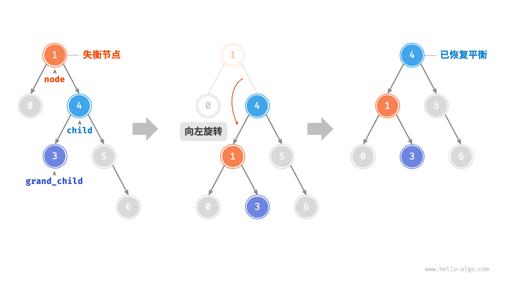

- https://segmentfault.com/a/1190000042653223 相关博客
- b站 小徐先生视频

# 采样方式
- net/http/pprof：基于 HTTP Server 运行，并且可以采集运行时数据进行分析。(重点)
- runtime/pprof：采集程序（非Server）的指定区块的运行数据进行分析。
- go test：通过运行测试用例，并指定所需标识来进行采集。

# 使用模式
1. Report generation：报告生成
  - http://127.0.0.1:8000/debug/pprof/ 能访问此页面代表 pprof 已成功开启
  - <font color="red">新增 ?debug=1 直接查看，不新增 debug 参数，那么将会直接下载对应的 profile 文件。 在正式环境中，出于网络安全的考量，我们一般不会将 pprof 的相关端口直接向外部网络开放。所以，通常会借助 curl、wget 等工具来实现对 profile 文件的间接拉取。</font>
  
2. Interactive terminal use：交互式终端使用。
``` go
❯ curl -o cpu_profile http://127.0.0.1:8000/debug/pprof/profile\?seconds\=30
❯ go tool pprof cpu_profile    // 自带的火焰图
```
执行该命令后，需等待 30 秒（可调整 seconds 的值），pprof 会进行 CPU Profiling，结束后将默认进入 pprof 的命令行交互式模式，可以对分析的结果进行查看或导出

3. Web interface：Web 界面。
  - go tool pprof -http=127.0.0.1:8080 cpu_profile  自动打开浏览器，进入可视化界面 -http启动web服务
  - 配合graphviz pprof 可以生成样本数据分析图（如 CPU 火焰图）
  - 自 Go 1.11 起，<font color="red">go tool pprof</font> 已支持直接生成火焰图，因此推荐优先使用 pprof (Go-Torch已归档)
# 使用 net/http/pprof
``` go
package main

import (
    "net/http"
    _ "net/http/pprof"
)

func main() {
    go func() {
        http.ListenAndServe("0.0.0.0:6060", nil)
    }()
}
```
- 引入引入net/http/pprof包的时候，init方法就默认注册好HTTP请求处理器了，所以我们才能通过这些接口获取这些数据指标
``` go
func init() {
    //前缀匹配，包含allocs、heap、goroutine等 /debug/pprof/goroutine
    http.HandleFunc("/debug/pprof/", Index)

    http.HandleFunc("/debug/pprof/cmdline", Cmdline)
    http.HandleFunc("/debug/pprof/profile", Profile)
    http.HandleFunc("/debug/pprof/symbol", Symbol)
    http.HandleFunc("/debug/pprof/trace", Trace) // 通过trace.Start开启trace追踪
}
```

# pprof采集的数据指标
1. allocs: 内存分配情况的采样数据 引入net/http/pprof包的时候才会采集
2. block: 采集因为同步原语而阻塞的协程调用栈，默认不开启；可通过`runtime.SetBlockProfileRate`开启
3. cmdline: 程序启动命令
4. goroutine: 采集所有协程的调用栈
5. heap: 同allocs指标，可用来采样存活对象的内存分配情况（可通过参数`gc=1`在采样前运行GC）
6. mutex: 采集持有互斥锁的协程调用栈，默认不开启；可通过`runtime.SetMutexProfileFraction`开启
7. profile: CPU采样，可以通过参数seconds设置采样时间，可用来分析程序热点 该指标需要使用pprof工具分析
8. threadcreate: 采样创建线程的调用栈
9. trace: 记录Go服务在做什么，采集包括协程调度，GC，系统调用等事件。可以通过参数seconds设置采样时间，该指标需要使用trace工具分析 
- 提供关于 CPU 耗时、内存分配、网络 IO、系统调用、阻塞等待等方面的详细信息。

# CPU
- 线上机器cpu利用率突然飙升且居高不下，简单定位发现是Go程序占用太多cpu
- 执行该命令后，需等待 30 秒，pprof 会进行 CPU 使用率的采集

"/debug/pprof/profile"接口也是通过 pprof.StartCPUProfile函数用来开启cpu指标的采集 定时底层其实也是通过定时器实现的（timer_create），定时器触发时（默认采集频率100hz，也就是1秒100次），会给创建定时器的线程发送SIGPROF信号，信号处理器（sighandler）记录当前程序执行点（pc寄存器）以及调用栈。

``` go
func (m *MineUseCase) GetMineInfo(ctx context.Context, accountUuid string, versionNumber int32) (*models.MineInfoForMinePannel, error) {
// 前面省去800行
    go m.busyLoop(ctx)
// 前面省去800行
}

// busyLoop 运行一个无限循环执行计算任务。
// 此函数通过在循环中计算数字的平方来演示 CPU 密集型操作。
func (m *MineUseCase) busyLoop(_ context.Context) {
    for {
        // 通过计算数字的平方来执行计算
        for i := 0; i < 1000000; i++ {
            _ = i * i
        }
        // 休眠一小段时间以减少 CPU 使用率
        time.Sleep(10 * time.Millisecond)
    }
}

// 命令
curl -o cpu_profile http://127.0.0.1:8000/debug/pprof/profile\?seconds\=30  // cpu_profile是文件名
go tool pprof -http=127.0.0.1:8080 cpu_profile 
```
## Top 查询耗费cpu top10的调用
- flat：函数自身的运行耗时。
- flat%：函数自身在 CPU 运行耗时总比例。
- sum%：函数自身累积使用 CPU 总比例。
- cum：函数自身及其调用函数的运行总耗时。 该函数以及调用栈所有函数耗费cpu时间
- cum%：函数自身及其调用函数的运行耗时总比例。
- Name：函数名。

### flat和cum的区别
假设一个函数 A 调用了两个子函数 B 和 C：
- A 自身执行耗时为 20ms。
- 子函数 B 的耗时为 50ms。
- 子函数 C 的耗时为 30ms。
则：
- Flat (A) = 20ms
- Cum (A) = 20ms + 50ms + 30ms = 100ms

- 总结:<font color="red">高 Flat：专注于优化函数内部逻辑，如减少循环、降低复杂度。高 Cum：分析调用栈，找出子函数中最耗时的部分，重点优化子函数。</font>

## Graph 链路每个节点的cpu耗时
- 图片包含函数调用链路<font color="red">每个节点的cpu耗时（线越粗说明该调用cpu耗时越多）</font>


## Flame Graph 火焰图
- Flame Graph（火焰图）它是可动态的，<font color="red">调用顺序由上到下（A -> B -> C -> D），每一块代表一个函数、颜色越鲜艳（红）、区块越大代表占用 CPU 的时间更长。</font>同时它也支持点击块深入进行分析


## Peek
- 与 Top 视图相比，<font color="red">增添了所属的上下文信息展示，即函数的输出调用者/被调用者</font>


## Source
- 主要是增加了面向源代码的追踪和分析，可以<font color="red">看到其开销主要消耗在哪里</font>
- 相当于list命令参数为匹配模式（函数调用模糊匹配） (pprof) list busyLoop 


# Heap 内存 
- 内存的指标可通过heap或者allocs查看，这两个指标采样的数据是一样，但是heap可以用来采样存活对象的内存分配（采样前可运行GC，这样剩下的都是存活对象了）
- 可以迅速拉取到结果，原因在于其无需像 CPU 那样进行采样等待。
- 选项可以针对多种内存概况进行分析
  - inuse_space：用于分析应用程序的常驻内存占用情况。
  - inuse_objects：查看每个函数所分别的对象数量
  - alloc_objects：用于分析应用程序的内存临时分配情况。
  - alloc_space：查看分配的内存空间大小

全局变量runtime.disableMemoryProfiling控制是否开启内存指标采集，默认为false，但是在Go编译阶段，连接器检测到代码中没有引入 runtime.MemProfile，则设置为true，也就是禁止内存指标采集；当我们引入net/http/pprof包时，代码中也就引入了runtime.MemProfile。

``` go
func (m *MineUseCase) GetMineInfo(ctx context.Context, accountUuid string, versionNumber int32) (*models.MineInfoForMinePannel, error) {
// 前面省去800行
    go m.memoryLeak(ctx)
// 前面省去800行
}

// memoryLeak 模拟内存泄漏。
// 它每10毫秒分配10MB的内存，但从不释放。
// 这可以用于测试程序的内存使用情况。
func (m *MineUseCase) memoryLeak(_ context.Context) {
    for {
        // 每次迭代分配10MB内存。
        data := make([]byte, 1024*1024*10)
        _ = data
        // 睡眠10毫秒以控制分配速度。
        time.Sleep(10 * time.Millisecond)
    }
}

curl -o heap http://127.0.0.1:8000/debug/pprof/heap
go tool pprof -http=127.0.0.1:8080 -inuse_space heap 
```

- 以当前函数为例,不会显著影响 inuse_space 和 inuse_objects，因为分配的内存会被及时释放。由于函数频繁分配 10MB 内存，每次调用都会增加 alloc_space 和 alloc_objects，可以帮助你定位这种频繁分配内存的行为。
 
|指标|	统计对象|	单位|	作用|	适用场景|
|:--|:--|:--|:--|:--|
inuse_space	|当前未释放的内存	|字节	|分析常驻内存的占用	|识别内存泄漏，优化长期内存占用
inuse_objects	|当前未释放的对象数量	|对象个数	|分析常驻对象的数量	|查找未释放的对象，排查泄漏问题
alloc_space	|总分配的内存量（含已释放）	|字节	|分析总内存分配量	|识别分配频繁的大块内存
alloc_objects	|总分配的对象数量（含已释放）	|对象个数	|分析分配密集的代码路径	|优化短生命周期对象分配

- 总结
1. 定位内存泄漏：
  - 查看 inuse_space 和 inuse_objects，如果持续增长且无法被回收，可能是内存泄漏。
2. 优化频繁分配：
  - 检查 alloc_space 和 alloc_objects，找出高分配频率的代码路径，优化分配逻辑以降低垃圾回收的开销。

## TOP

- 总结：<font color="red">高 flat% 函数 表示函数本身分配了较多内存  优化或避免不必要的内存分配。高 cum% 函数 表示该函数的调用链中整体分配的内存较多 看是否存在重复分配或不必要的操作</font>

## Graph Flame Graph Peek

## Source


# Goroutine
- 配合trace可跟踪Go程序多种类型事件，包括协程调度，系统调用，锁，垃圾回收等 "/debug/pprof/trace"接口就是基于该函数实现的。
``` go
func (m *MineUseCase) GetMineInfo(ctx context.Context, accountUuid string, versionNumber int32) (*models.MineInfoForMinePannel, error) {
// 前面省去800行
    go m.createGoroutines(ctx)
// 前面省去800行
}


// createGoroutines 演示了创建大量 Goroutine 的场景。
// 它创建了大量 goroutine，这些 goroutine 都只是简单地等待，什么也不做。
// 这可以用于测试程序的 Goroutine 使用情况。
func (m *MineUseCase) createGoroutines(_ context.Context) {
    // 创建大量 Goroutine。
    for i := 0; i < 10000; i++ {
        go func() {
            // 等待一段时间，以模拟一些工作。
            time.Sleep(1000 * time.Millisecond)
            //  select {}  // 什么也不做，只是等待。
        }()
    }
}

curl -o goroutine http://127.0.0.1:8000/debug/pprof/goroutine
go tool pprof -http=127.0.0.1:8080 goroutine 
```
查看 goroutine 时，使用Graph图表 我们可以很便捷的查看到整个调用链路有什么，分别在哪里使用了多少个 goroutine，并且能够通过分析查看到谁才是真正的调用方

## TOP

- 总结：<font color="red"> 高 flat% 函数： 表示该函数本身消耗了大量时间。应检查该函数是否包含性能瓶颈，如复杂计算或繁重的 I/O 操作。高 cum% 函数：表示该函数的调用链整体耗时长。 应分析函数路径，找到导致耗时的具体函数。</font>

## Graph Flame Graph
- 协程多的时候比较有用 整个调用链路有什么，分别在哪里使用了多少个 goroutine，并且能够通过分析查看到谁才是真正的调用方

## Peek

## Source

# Mutex 锁
阻塞呢，一般有如下方式：调用 chan（通道）、调用 sync.Mutex （同步锁）、调用 time.Sleep() 等等
``` go
func (m *MineUseCase) GetMineInfo(ctx context.Context, accountUuid string, versionNumber int32) (*models.MineInfoForMinePannel, error) {
// 前面省去800行
    go m.lockContention(ctx)
// 前面省去800行
}

var mu sync.Mutex
// lockContention 演示了锁竞争场景。
// 它创建了大量goroutine，这些goroutine竞争mutex，
// 导致程序的速度明显下降。
func (m *MineUseCase) lockContention(_ context.Context) {
    // 启用锁_profiling。 进行采集量的设置
    runtime.SetMutexProfileFraction(1)
    // 创建大量goroutine，这些goroutine竞争mutex。
    for i := 0; i < 100000; i++ {
        go func() {
            // 每个goroutine将无限循环，竞争mutex。
            for {
                // 锁定mutex。
                mu.Lock()
                // 休眠一段时间，以模拟一些工作。
                time.Sleep(1000 * time.Millisecond)
                // 解锁mutex。
                mu.Unlock()
            }
        }()
    }
}

curl -o mutex http://127.0.0.1:8000/debug/pprof/mutex
go tool pprof -http=127.0.0.1:8080 mutex
```
- runtime.SetMutexProfileFraction() 代码里进行互斥锁的采集，那么需要通过调用该方法来设置采集频率，若不设置或没有设置大于 0 的数值，默认是不进行采集的。

## Top

- 总结：<font color="red">高 flat% 函数：表示该函数本身锁使用频繁或持有时间较长。 应考虑减少锁的持有时间，或使用其他并发模式（如无锁设计）。高 cum% 函数：表示锁竞争主要集中在该函数的调用链中。应优化调用链中的锁使用方式，如减少嵌套锁，降低锁粒度，或减少锁争用。</font>
## Graph Flame Graph Peek Source

# Block 通道阻塞
block以及mutex输出的时间都是cputick，与时间有一个换算关系（cycles/second）。block含义是阻塞事件，协程抢锁或者管道的读写阻塞等，都会导致协程的阻塞，协程阻塞时会记录阻塞时间点cputick，解除阻塞时同样记录时间点cputick，以此计算出协程阻塞时间，同时在解除阻塞时记录调用栈。mutex含义是锁持有事件，在释放锁时记录时间以及调用栈。
``` go
func (m *MineUseCase) GetMineInfo(ctx context.Context, accountUuid string, versionNumber int32) (*models.MineInfoForMinePannel, error) {
// 前面省去800行
    go m.blockingOperation(ctx)
// 前面省去800行
}

// blockingOperation 演示了阻塞操作场景。
// 它创建了大量goroutine，这些goroutine都在执行阻塞操作，
// 导致程序的速度明显下降。
func (m *MineUseCase) blockingOperation(_ context.Context) {
    // 启用阻塞_profile。 进行采集量的设置
    runtime.SetBlockProfileRate(1)
    // 创建一个通道，用于模拟阻塞操作。
    ch := make(chan int, 1)
    // 创建大量goroutine，这些goroutine都在执行阻塞操作。
    for i := 0; i < 100000; i++ {
        go func() {
            // 通过通道发送数据，以模拟阻塞操作。
            ch <- 1
            // 休眠一段时间，以模拟一些工作。
            time.Sleep(5000 * time.Millisecond)
            // 通过通道接收数据，以模拟阻塞操作。
            <-ch
        }()
    }
}

curl -o block http://127.0.0.1:8000/debug/pprof/block
go tool pprof -http=127.0.0.1:8080 block
```
- runtime.SetBlockProfileRate() 代码里进行采集量的设置，否则默认关闭，若设置的值小于等于 0 也会认为是关闭。
- 如果是直接查看原文件的, 一般是用 go tool pprof 工具
``` go
//cycles取的是cputick，这里的值是平均每秒钟cputick递增多少；
cycles/second=1996821317

// 第一个值是协程阻塞的cputick数，第二个值是阻塞次数，根据cycles/second就可以计算平均阻塞时间了
161357271645546 364 @ 0x1048768 0x13a4014 0x1069921
#    0x1048767    runtime.selectgo+0x407                            /go1.18/src/runtime/select.go:509
#    0x13a4013    github.com/go-redis/redis/v8/internal/pool.(*ConnPool).reaper+0xd3    /xxx/vendor/github.com/go-redis/redis/v8/internal/pool/pool.go:485
```

## Top

总结

- 高 flat% 函数：重点分析该函数内的阻塞代码，例如：
  - I/O 操作。
  - Channel 的 send 或 receive。
  - 锁的获取操作。
- 高 cum% 函数： 表示阻塞主要集中在该函数及其调用链中。
  - 减少阻塞调用。
  - 调整代码的并发逻辑。
  - 引入异步机制或超时控制。
## Graph

## Source


# pprof排查死锁(服务假死)

- 非主进程的情况：一般死锁, 大概率会出现协程数上涨。可以pprof看看，锁的使用情况
- 协程、内存没上涨，那大概率是 主进程有死锁（比如全局锁）导致的。主进程卡住的时候，pprof 也进不去。因为pprof是和 api 同一个端口用不同端口 希望有 coredump
    - coredump 是系统行为，100%可靠。pprof 是程序行为，pprof 成功的前提是程序还能访问。coredump 强依赖宿主机系统限制，gcore可以直接调用生成dump文件

服务假死现象：Go服务看起来正在运行，但是大量HTTP请求却没有任何响应，甚至查不到任何业务日志. 一般此时接口请求会报 504 Gateway Time-out

造成Go服务假死的原因有很多种，比如死锁。也就是说，请求处理协程抢占了一把已被其他协程占有并且永远不会释放的锁时，这时候所有的请求处理协程都将被无限期阻塞，Go服务当然也就不会有任何响应了。

## go服务阻塞的情况
比如当大量协程阻塞在获取锁的代码时，那是不是有可能是因为锁没有被释放？
比如当大量协程阻塞在写管道的代码时，那是不是有可能是因为读管道的协程太慢或者异常退出了？
``` go
// goroutine指标地址
http://127.0.0.1:6060/debug/pprof/goroutine?debug=1 直接查看原文件

//第一个数字表示协程数
1 @ 0x10390d6 0x1032357 0x1063929 0x10d0372 0x10d16da 0x10d16c8 0x1126c29 0x1135d85 0x131dc9f 0x1069921
#    0x1063928    internal/poll.runtime_pollWait+0x88        /go1.18/src/runtime/netpoll.go:302
#    0x10d0371    internal/poll.(*pollDesc).wait+0x31        /go1.18/src/internal/poll/fd_poll_runtime.go:83
#    0x10d16d9    internal/poll.(*pollDesc).waitRead+0x259    /go1.18/src/internal/poll/fd_poll_runtime.go:88
#    0x10d16c7    internal/poll.(*FD).Read+0x247            /go1.18/src/internal/poll/fd_unix.go:167
#    0x1126c28    net.(*netFD).Read+0x28                /go1.18/src/net/fd_posix.go:55
#    0x1135d84    net.(*conn).Read+0x44                /go1.18/src/net/net.go:183
#    0x131dc9e    net/http.(*connReader).backgroundRead+0x3e    /go1.18/src/net/http/server.go:672

......
```
1. 第一个数字都表示协程数，即当前有多少个协程处于这样的协程调用栈。如果你发现这个数字非常大，说明当前有较多协程因为同一个原因而阻塞，并且很有可能这就是Go服务响应慢或者没有响应的原因
2. 协程调用栈包括整个调用链的函数或者方法名称以及文件行号

- 例子
``` go
curl http://127.0.0.1:xxxxx/debug/pprof/
<td>16391</td><td><a href=goroutine?debug&#61;1>goroutine</a></td>
……

// 发现协程数过多，进而排查协程
$ go tool pprof http://127.0.0.1:xxxxx/debug/pprof/goroutine
(pprof) traces
----------+-------------------------------------------------------
7978 runtime.gopark
     runtime.goparkunlock
     runtime.chansend
     runtime.chansend1
     xxxxx/log4go.(*FileLogTraceWriter).LogWrite
    ……
// 输出结果，总共有7978个协程都因为同一个原因被阻塞了。继续分析协程调用栈，发现是HTTP请求处理协程在记录日志时，由于写管道被阻塞了 (优化成select+default非阻塞写就好了)
```

# pprof排查内存泄露
- https://tech.dewu.com/article?id=11


# trace工具
trace可跟踪Go程序多种类型事件，包括协程调度，系统调用，锁，垃圾回收等等 通过trace.Start开启trace追踪，"/debug/pprof/trace"接口就是基于该函数实现的。
- 开启
``` go
//默认追踪1秒
go tool trace http://127.0.0.1:8888/debug/pprof/trace?seconds=1
Parsing trace...
Splitting trace...
Opening browser. Trace viewer is listening on http://127.0.0.1:64557
```
- trace工具自动启动web服务，方便我们通过web界面查看，主要包含这几个方面的分析：
``` go
//展示每个逻辑处理器P每时刻在做什么
View trace
//协程分析
Goroutine analysis
//网络阻塞
Network blocking profile (⬇)
//同步阻塞，如锁之类的
Synchronization blocking profile (⬇)
//系统调用阻塞
Syscall blocking profile (⬇)
//调度延迟
Scheduler latency profile (⬇)
```

## 协程分析
可以查看每一个协程的一些数据指标，包括执行时间，网络等待时间，同步阻塞时间，等待调度时间，GC暂停时间等等，列表如下（可以按照不通维度排序）

## 同步阻塞分析
