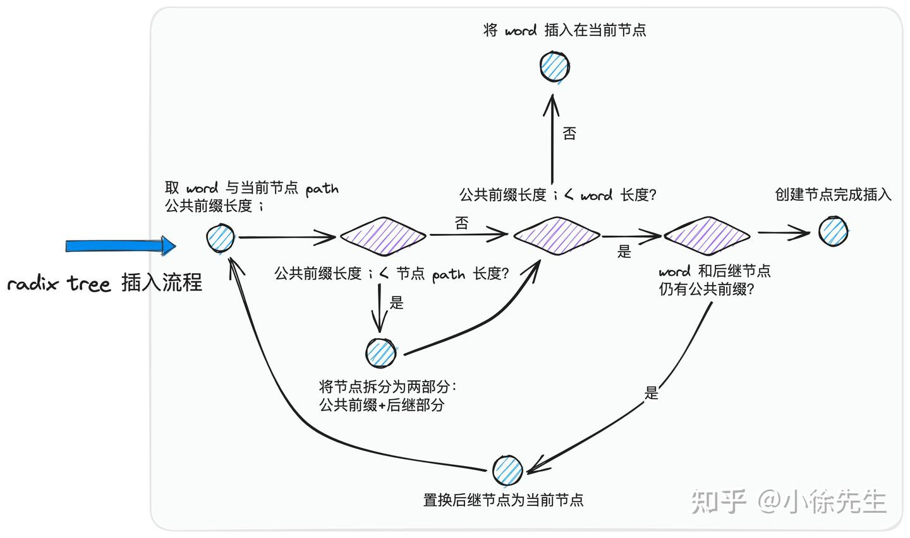

# [b站视频-实际工作解决方案](https://www.bilibili.com/video/BV1JZ4y1m792)
1. 讲的是数据一致问题，缓存击穿问题参考其他
2. 必须只能有1个线程能加锁，例如 set 带 nx 的命令，锁的设计必须保证同一时刻肯定只有1个线程能获取到锁
3. 监听数据库binlog日志, 可以监听主库。但是PloarDb就不需要管理主从问题. 更新mysql后，mysql会产生binlog（二进制日志），这样我们就知道哪些数据被更新，从而可以删除对应的缓存数据。
4. 监听到binlog之后直接更新缓存而是删除缓存?
   - 直接更新缓存也是一种方案，一般在使用缓存存储全量数据的场景会使用直接更新。
   - 两者的区别在于，直接更新缓存你需要每次更新都去查一次DB，而删除缓存是在下一次查询时才查询DB。

## MySQL的缓存淘汰方案
- 一、两种解决数据库缓存一致性问题的方案:同步删除和延迟双删，但这两种方案都存在一定的缺陷和问题，需要根据具体场景进行选择和调整。
   - 同步删除方案存在并发脏数据问题和难以收拢的问题
   - 延迟双删方案存在延迟时间难以确定（凭经验）和无法保证数据一致性的问题
- 二、方案三异步监听BINLOG删除加同时删除缓存是最常用的
  - 假如主从同步延迟五秒，可能导致脏数据时间窗口较大
  - 方案三加异步监听BINLOG删除缓存存在长时间脏数据问题
  - 数据库拆分流程包括增量数据同步和数据一致性验证（拆分时才存在）
- 三、在更新数据库期间可能出现的脏数据问题，并提出了相应的解决方案，包括禁用缓存、加强制度、延迟校验等。
  - 可能存在脏数据问题，需要保障数据库和缓存的一致性
  - 使用异步监听和同步删除来保证缓存的一致性
  - 使用过期时间和算法保证缓存数据的最终一致性
- 四、如何通过缓存、强制读主节点、异步数据一致性校验等方式优化Redis的性能，并解决了脏数据和数据一致性问题。

# [缓存一致性最佳实践-得物]
电商核心的域如商品、营销、库存、订单等实际上在缓存的选择上各有特色，那么在这些差异的业务背后，我们有没有一些最佳实践可供参考呢？
- [缓存一致性最佳实践](https://segmentfault.com/a/1190000041262528)
- [微服务架构中的数据一致性：解决方案与实践](https://segmentfault.com/a/1190000043882456)

# cpu的缓存结构无法做到强一致
1. 分布式场景下无法做到强一致：不同于CPU硬件缓存体系采用的MESI协议以及硬件的强时钟控制，分布式场景下我们无法做到缓存与底层数据库的强一致，即把缓存和数据库的数据变更做成一个原子操作。硬件工程师设计了内存屏障（Memory Barrier）的概念，提供给软件开发者不同的一致性选项在性能与一致性上进行权衡。
2. 就算是达到最终一致性也很难：分布式场景下，要做到最终一致性，就要求缓存中存储的是最新版本的数据（或者缓存为空），而且是在数据库更新后很迅速的就要达到这个一致性的状态，要做到是极其困难的。我们会面临硬件、软件、通信等等组件非常多的异常情况。

# 缓存一致性问题
一般化来说，我们面临的是这样的一个问题，如下图所示，数据库的数据会有5次更新，产生6个版本，V1~V6，图中每个方框的长度代表这个版本持续的时间。我们期望，在数据库中的数据变化后，缓存层需要尽快的感知到并作出反应，如下图所示，缓存层方框中的间隔代表这个时间段缓存数据不存在，V2、V3以及V5版本在缓存中不存在并不会破坏我们的最终一致性要求，只要数据库的最终版本和缓存的最终版本是相同的v6就可以了。

# 缓存是如何写入的
缓存写入的代码通常情况下都是和缓存使用的代码放在一起的，包含4个步骤，如下图所示：W1读取缓存，W2判断缓存是否存在，W3组装缓存数据（这通常需要向数据库进行查询），W4写入缓存。每一个步骤间可能会停顿多久是没有办法控制的，尤其是W3、W4之间的停顿最为要命，它很可能让我们将旧版本的数据写入到缓存中。

- 我们可能会想，W4步的写入，带上W2的假设，即使用WriteIfNotExists语义，会不会有所改善？
  - 考虑如下的情形，假设有3个缓存写入的并发执行，由于短时间数据库大量的更新，它们分别组装的是V1、V2、V3版本的数据。使用WriteIfNotExists语义，其中必然有2个执行会失败，哪一个会成功根本无法保证。
  - 无法简单的做决策，需要再次将缓存读取出来，然后判断是否我们即将写入的一样，如果一样那就很简单不更新；如果不一样的话，我们有两种选择：
    - 1）将缓存删除，让后续别的请求来处理写入。（仅删除）
    - 2）使用缓存提供的原子操作，仅在我们的数据是较新版本时写入。

# 如何感知数据库的变化

## 使用代码执行流 
- db更新后执行后置逻辑缓存更新

通常我们会在数据库操作完成后，执行一些缓存操作的代码。这种方式最大的问题是可靠性不高，应用重启、机器意外当机等情况都会导致后续的代码无法执行。

## 使用事务消息
- 代码流程 db使用事务包含了缓存更新流程
作为使用代码执行流的改进，在数据库操作完成后发出事务消息，然后在消息的消费逻辑里执行缓存的管理操作。可靠性的问题就解决了，只是业务侧要为此增加事务消息的逻辑，以及运行成本。

## 使用数据变更日志
- can中间件 binlog
数据库产品通常都支持在数据变更后产生变更日志，比如MySQL的binlog。在接收到变更后执行缓存的管理操作，比如阿里的精卫。可靠性有保证，同时还可以进行某个时间段变更日志的回放，功能就比较强大了。

# 最佳实践一：数据库变更后失效缓存
- 最常用和简单的方式，应该被作为首选的方案，整体的执行逻辑如下图所示

  - W4步使用最基本的put语义，这里的假设是写入较晚的请求往往也是携带的最新的数据，这在大多的情形下都是成立的。
  - D1步使用监听DB binlog的方式来删除缓存
## 缺点和解决方案
**在数据库数据存在高并发更新且缓存读取流量较大的情况下，会有小概率存在缓存中存储的是旧版本数据的情况。**

1. 限制缓存有效时间：设定缓存的过期时间，比如15分钟。即表示我们最多接受缓存在15分钟的时间范围内是旧的。（窗口期不要太大）
2. 小概率缓存重加载：根据流量比设定一定比例的缓存重加载，以保证大流量情况下的缓存数据的一致性。比如1%的比例，这同时还可以帮助数据库得到充分的预热。
3. 结合业务特点：根据业务的特点做一些设计，比如：
   - 针对营销的场景：在商品详情页/确认订单页的优惠计算时使用缓存，而在下单时不使用缓存。这可以让极端情况发生时，不产生过大的业务损失。
   - 针对库存的场景：读取到旧版本的数据只是会在商品已售罄的情况下让多余的流量进入到下单而已，下单时的库存扣减是操作数据库的，所以不会有业务上的损失。
4. 两次删除：D1步删除缓存的操作执行两次，且中间有一定的间隔，比如30秒。**(延长双删)** 这两次动作的触发都是由“缓存管理组件”发起的，所以可以由它支持。

# 最佳实践二：带版本写入 (实践一的进一步优化)
- 针对象商品信息缓存这种更新频率低、数据一致性要求较高且缓存读取流量很高的场景，通常会采用带版本更新的方式，整体的执行逻辑如下图如示：

  - 差异在W4步和D1步，需要缓存层提供带版本写入的API，即仅当写入数据版本较新时可以写入成功，否则写入失败。
  - D1使用的写入而不是删除
  - 要求我们在数据库增加数据版本的信息
## 优缺点
这个方案的最终一致性效果比较好

- 仅在极端情况下（新版本写入后数据丢失了，后续旧版本的写入就会成功）存在缓存中存储的是旧版本数据的可能。在D1步使用写入而不是使用删除可以极大程度的避免这个极端情况的出现
- D1不删而是直接更新，该方案适用于缓存读取流量很高的场景，还可以避免缓存被删除后W3步短时间大量请求穿透到DB。

除了缓存与数据库分离的方案，还有两个业界已经应用的方案也值得我们借鉴：阿里XKV,腾讯DCache

# 实战(go项目包)
- [一致性缓存理论分析与技术实战](https://zhuanlan.zhihu.com/p/697171272)
  - B站有对应的视频
- [git项目consistent_cache包](https://github.com/xiaoxuxiansheng/consistent_cache)
- 避开中间键binlog, 延时双删的进一步优化
## 背景
在一些请求量大、读多写少的场景中，一种性能优化方式是考虑在数据库之上添加一层缓存组件，这样一方面能减轻数据库的访问压力，一方面也能提升查询操作的性能.
然而由于缓存（如 redis）和数据库（如 mysql）是两个独立的存储组件，在操作过程中无法在跨组件的基础上保证“事务”的语义，因此不可避免地会面临缓存数据与数据库数据不一致的问题.

## 读写流程
|流程	|缓存 cache	|数据库 db|
|:----|:----:|:----:|
|写流程	|执行删除操作|	执行写入操作|
|读流程	|执行查询、写入操作	|执行查询操作|

1. 在写流程中：只负责写 db，不负责更新 cache；与之相对的，需要在写 db 前，先负责将 cache 中的脏数据删除，由后续到来的读操作负责将更新后的迁移到缓存中
2. 在读流程中：尝试读 cache；如果 cache 中数据 miss，则读取 db，并将读到的数据更新到 cache 中，以便后续的读操作复用

- question A：为什么写流程不在写完 db 后直接更新 cache 数据？
  - 原因I：cache 相比于 db 空间小、成本高，因此希望尽可能将访问频繁的热数据加载到 cache 中进行复用. 而 cache 的目标是面向读密集场景，数据的热度由读操作的频率来决定，因此将写 cache 的执行权交由读流程负责，而非写流程；
  - 原因II：在明确已经由读流程负责写 cache 的前提下，写流程就不再执行重复动作，以此实现流程简化，也能规避部分因并发场景而导致的 cache 数据一致性问题
- question B：为什么写流程需要删除 cache 数据？
  - 在读流程中，当 cache 中存在数据，会立即读取并返回结果. 因此倘若写操作不删除 cache 中的脏数据，那么后续到来的读操作都会因此读取到错误的结果.
  - 当写操作删除 cache 删除后，读流程访问 cache 时发现数据 miss，就会读取 db，并将此时正确的数据重新写入 cache 中
- question C：为什么写流程需要先删除 cache 再写 db？
  - 逆向思考：倘若先写 db 后删 cache，由于两个操作无法保证原子性，一旦前者成功后者失败，就会导致 cache 中永久存在错误的数据；反之，先删 cache 后写 db，哪怕前者成功后者失败，无非是额外增加一次将数据由 db 冗余到 cache 中的成本而已

- question D：上述流程是严谨的吗？是否还存在哪些环节可能存在 cache 数据不一致问题？
  - 读写流程并发，时序问题

## 缓存双删策略

在实际场景中，一系列读、写流程是并发执行的，两个流程下各执行步骤的相对次序可能因为机器、网络等不确定因素发生变化

1. 数据库中有一笔 kv 数据，key:a; value:b
2. 一笔读操作和一笔写操作并发启动，读操作读取 key:a 对应的数据：写操作执行指令，期望将 key:a 对应的 value 更新为 c
3. db 中 key:a 数据已经更新为 c，然而 cache 中 key:a 对应的还是脏数据 b.
- 本质原因就是，在并发场景下，步骤（1）写流程删除 cache 数据后，并无法阻止在（1）-（4）期间内，读流程再次读 db 并将脏数据迁移到 cache 中

- **缓存双删策略——即在写流程写 db 前后，分别执行一次删除 cache 操作** 就是写流程在 moment4 之后，额外增加一个 moment6，再一次将 cache 中 key:a 对应的数据删除.
 - 依然存在的问题：无法保证，写流程中，第二次删除 cache 的动作一定能执行在读流程写 cache 的操作之后，也就是 moment5 和 moment6 两个时刻的相对次序是不稳定的：

## 缓存延时双删策略
“延时”就体现在，写流程写完 db 后，会等待指定时长，保证此期间可能持有脏数据的读流程都完成写 cache 操作后，再执行第二次的删 cache 操作，以此来实现缓存数据的“最终一致性”语义.

## 写缓存禁用机制
- cache 数据弱一致：写 db 到延时执行二次删 cache 操作期间，cache 中都可能存在脏数据
- 延时二次删 cache 操作存在执行失败的可能性，如下图

- 进一步保证 cache 数据的强一致性语义，我们可以尝试引入“锁机制”.通过一把 key 维度的分布式读写锁，实现读流程和写流程的隔离.
  - 大缺点：对读操作性能的大幅度牺牲，针对某笔数据，一旦产生写操作，那么在此期间所有读操作都要陷入阻塞等待的状态
  - 发现导致 cache 数据不一致的罪魁祸首，本质上是读流程把脏数据写入 cache 的操作，而非宏观意义上的整个读流程.不是完全隔离读、写流程，也不需要使用分布式锁这么重的工具，而是退而求其次，针对一笔数据的维度启用一个“开关”机制，能够用于控制读流程是否启用写 cache 机制

- 写缓存禁用 写流程执行期间，该笔数据对应的读流程不会阻塞，只是相当于 cache 机制被暂时屏蔽，读流程需要统一从 db 中获取最精确的数据而已
  1. 每当有写流程到达时，先将该笔数据的“开关”关闭，然后正常执行后续流程，执行完成后再重新将“开关”打开
  2. 在“开关”关闭期间，所有到达的读流程正常执行步骤，唯独不会在读 db 后执行写 cache 操作
  
- 写流程完成写 db 操作后，通过需要延迟一段时间再重新开启该笔数据下的 “写缓存机制”，其本质思路和缓存延时双删策略中“延时”的用意是一致的，就是避免在并发场景下，读取到 db 脏数据的读流程写 cache 操作恰好发生在写流程“写缓存机制”启用之后.如下图：
  

## 缺点
双删依然无法解决删除失败的问题，个人感觉写流程 是先写db 再写cache 这个流程，这个流程下 在更新数据库的过程中，缓存层相当于一层屏障，读流程不会穿透到写数据库的这个流程中。最后如果删除失败 是有key 过期兜底的，或者采用最用一致性的方案保证最终数据的一致

比如：写缓存禁用这两种情况，如果读流程特别特别慢，在最后写cache的时候超过了设定的延时，依然会导致缓存不一致

## consistent_cache包源码
- https://github.com/xiaoxuxiansheng/consistent_cache